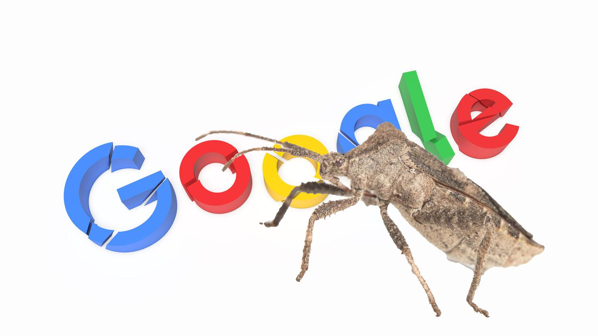

Bug in Google's Bug Tracker Lets Researcher Access List of Company's Vulnerabilities

More From[Internet Insecurity](https://motherboard.vice.com/en_us/topic/internet-insecurity)

- [   T-Mobile Alerted ‘A Few Hundred Customers’ Targeted By Hackers](https://motherboard.vice.com/en_us/article/a37epb/t-mobile-alert-victims-sim-card-hack)
- [   Equifax Was Warned](https://motherboard.vice.com/en_us/article/ne3bv7/equifax-breach-social-security-numbers-researcher-warning)
- [   Infrastructure for the ‘Bad Rabbit’ Ransomware Appears to Have Shut Down](https://motherboard.vice.com/en_us/article/d3dp5q/infrastructure-for-the-bad-rabbit-ransomware-appears-to-have-shut-down)
- [   New Ransomware ‘Bad Rabbit’ Spreading Quickly Through Russia and Ukraine](https://motherboard.vice.com/en_us/article/59yb4q/bad-rabbit-petya-ransomware-russia-ukraine)

# Bug in Google's Bug Tracker Lets Researcher Access List of Company's Vulnerabilities

## A series of bugs allowed hackers to snoop into one of Google’s most sensitive internal systems.

- [[motherboard-tombstone.svg](../_resources/74c22bbfce3a24986248169c8f7a1cbc.bin)SHARE]()
- [[facebook-square.svg](../_resources/05263608ee3395a946eca7b32b971334.bin)TWEET]()

 [Lorenzo Franceschi-Bicchierai](https://motherboard.vice.com/en_us/contributor/lorenzo-franceschi-bicchierai)

Oct 30 2017, 3:00pm

Image: Shutterstock. Composite: Jason Koebler/Motherboard

Google's platform to deal with bugs and unpatched vulnerabilities had a bug that allowed a security researcher to see a full list of known, unpatched vulnerabilities within Google, creating a kind of bug inception that could have led to more damaging hacks.

 [Alex Birsan](https://twitter.com/alxbrsn), a security researcher, found three vulnerabilities inside the Google Issue Tracker, the company's internal platform where employees keep track of requested features or unpatched bugs in Google's products. The largest one of these was one that allowed him to access the internal platform at all. The company has quickly patched the bugs found by Birsan, and there's no evidence anyone else found the bugs and exploited them.

Still, these were bad bugs, especially the one that gave him access to the bug-tracking platform, which could have provided hackers with a list of vulnerable targets at Google.

"Exploiting this bug gives you access to every vulnerability report anyone sends to Google until they catch on to the fact that you're spying on them," Birsan told Motherboard in an online chat. "Turning those vulnerability reports into working attacks also takes some time/skill. But the bigger the impact, the quicker it gets fixed by Google. So even if you get lucky and catch a good one as soon as it's reported, you still have to have a plan for what you do with it."

A Google spokesperson said in an email statement: "We appreciate Alex's report. We've patched the vulnerabilities that he reported, as well as their variants."

 ** Read more: **[** T-Mobile Website Allowed Hackers to Access Your Account Data With Just Your Phone Number**](https://motherboard.vice.com/en_us/article/wjx3e4/t-mobile-website-allowed-hackers-to-access-your-account-data-with-just-your-phone-number)

Access to the Google Issue Tracker—internally called Buganizer System—is normally limited to employees. External researchers can be granted access to specific threads, such as to the bugs they report. Birsan, however, found a way to circumvent the strict permissions and subscribe to any thread on the platform, allowing him to "see details about every issue in the database," [as he explained in a blog post](https://medium.com/@alex.birsan/messing-with-the-google-buganizer-system-for-15-600-in-bounties-58f86cc9f9a5).

Birsan found that Google had programmed a way for external researchers to remove themselves from email lists. This worked the way it was intended, removing the person from the thread, and sending the details of the bug as a final message. But this mechanism had a problem: it didn't actually check if the user requesting to be removed had permission to access the issue in question. So it was possible for anyone to "unsubscribe" from issue they were never subscribed to and thus learn the details of the vulnerability.

Advertisement

"You'd have a pretty good chance of compromising Google accounts if you had a few specific targets and threw every attack at them."

Still, there's a reason Google is generally known for its good corporate security: Birsan said that with the vulnerabilities he saw, it would have been very difficult or perhaps impossible to launch a widespread attack that affected even a fraction of Google's users.

"I believe you'd have a pretty good chance of compromising Google accounts if you had a few specific targets and threw every attack at them," Birsan told me. "But a large scale attack that puts hundreds/thousands of people at risk? Not so much."

There's no evidence anyone other than Birsan found this bug, and Google patched it within an hour of his report, according to Birsan. But such a platform is a juicy target for bad guys, especially sophisticated hackers and government spies. On Oct. 17, Reuters [revealed](https://www.reuters.com/article/us-microsoft-cyber-insight/exclusive-microsoft-responded-quietly-after-detecting-secret-database-hack-in-2013-idUSKBN1CM0D0) that hackers had breached Microsoft's internal database to track bugs into its own software in 2013.

Birsan found a total of three bugs in the platform. They are all patched now and he received rewards of $3,133.7, $5,000, and $7,500 for reporting them to Google.

 **  * Got a tip? You can contact this reporter securely on Signal at +1 917 257 1382, OTR chat at lorenzo@jabber.ccc.de, or email ***[**  * lorenzo@motherboard.tv***](https://motherboard.vice.com/en_us/article/evbvqj/bug-in-googles-bug-tracker-lets-researcher-access-list-of-companys-vulnerabilitiesmailto:lorenzo@motherboard.tv)

 **  * Get six of our favorite Motherboard stories every day *****[*by signing up for our newsletter.*](http://motherboard.club/)**

## Episode Info

##### Dear Future | S1 EP2

## Nuclear Fusion Energy: The Race to Create a Star on Earth

If the processes powering the fusion reactor at the Sun's core could be recreated on Earth, it would be one of the most important events in the history of our species. Nuclear fusion power plants could end our dependency on fossil fuels and provide a virtually limitless, highly efficient source of clean energy.

We went to two of the world's leading nuclear fusion research centers—Sandia National Labs in New Mexico and General Fusion outside Vancouver—to see how close we are to bringing the power of the stars down to Earth.

* * *

|     |     |
| --- | --- |
| Channel | Motherboard |
| Runtime | 11:05 |
| Host | Xavier Aaronson |
| Rating | TV-PG |

## Up Next

1

##### The 16 Project

### Meet the Lebron James of Weightlifting

06:13

2

##### Eatin' It

### Going Local with Table Farm

09:03

3

##### Weediquette

### Possessed by Marijuana: The Camille Browne Case

03:43

4

##### Waypoint Plays

### A Spooky 'Darkwood' Playthrough - Waypoint in the AM

1:02:09

5

##### American Conventions

### The Weird, Wild World of Skunk Owners

21:52

6

##### The Untitled Action Bronson Show

### Kevin Gillespie, Meyhem Lauren

22:33

7

##### Desus & Mero

### The Legendary Rosie Perez

25:02

8

##### Desus & Mero

### Cardi B and Offset Are Now Engaged

02:01

9

##### Desus & Mero

### George Papadopoulos Pleads Guilty in Mueller Russia Probe

02:04
10

##### Desus & Mero

### Paul Manafort Gets Indicted

04:26

### Dear Future

## Nuclear Fusion Energy: The Race to Create a Star on Earth

11:05

[twitter.svg](../_resources/0ddc9b9f6b172737987cd28e7283ba90.bin)

- [SHARE]()
- [TWEET]()
- [News](https://motherboard.vice.com/en_us/topic/news)
- [hacking](https://motherboard.vice.com/en_us/topic/hacking)
- [Google](https://motherboard.vice.com/en_us/topic/google)
- [cybersecurity](https://motherboard.vice.com/en_us/topic/cybersecurity)
- [hackers](https://motherboard.vice.com/en_us/topic/hackers)
- [bugs](https://motherboard.vice.com/en_us/topic/bugs)
- [Infosec](https://motherboard.vice.com/en_us/topic/infosec)
- [vulnerabilities](https://motherboard.vice.com/en_us/topic/vulnerabilities)
- [Tech news](https://motherboard.vice.com/en_us/topic/tech-news)
- [Bug Bounty](https://motherboard.vice.com/en_us/topic/bug-bounty)

Watch This Next

[    12:42     High Speed Off-Roading in the Mojave Desert]()