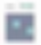
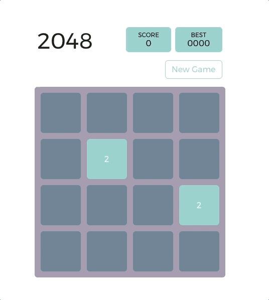
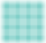

Build 2048 from scratch using Vue.js (part 1) – Babystep – Medium

# Build 2048 from scratch using Vue.js (part 1)

what we will build

2048 is a popular single-player game. The game has a 4 by 4 grid for **tiles**. Each **tile** can either be empty or has a **card** with value. As a player, you can move **left**, **right**, **up** and **down**. As cards get merged, the numbers on the cards change as well. The goal is to get number on the card as high as possible. The game ends when all the tiles are full and there are no next moves left.

You can find the demo project [here](http://babystep.io/2048/), and the Github repo [here](https://github.com/babystep-io/2048). In this blog post (part 1) and next blog post (part 2) we will walk through how we build the game step by step!

### Get started with project scaffold

First, we need to set up a project scaffold to build a Vue project. We are going to use plain javascript so that we can understand what is going on. Let’s start by cloning the [plain javascript Vue scaffold](https://github.com/babystep-io/PlainJS-Vue-scaffold). The scaffold provides several directories for us:

- •**assets**. All third party javascript library, stylesheets, and images.
- •**components**. All native Vue components.
- •**mixins**. All native Vue mixins.
- •**store**. Vuex store for state management.
- •**main.js**. The place where a new Vue instance is initiated.
- •**index.html**. The place where the whole app is displayed.

### Step 1. set up game board

In this step we will:
1. 1create `game` component with `board`
2. 2create shadow board
3. 3create seeding function

First we have a `game` component that is in charge of a **board**. A **Board** has many **tiles**, and each **tile** has a **value** that defaults to 0. We can start by registering the component `game`:

**src/components/game.js**
((() => {
const html = `

`
Vue.component("game", {
template: html,
data () {
return {
board: [],
}
},
})
}))()

On the Vue component `game`, we have a data property `board` that holds an array of **tiles**, each tile holds a default value of 0. Next we add a **shadow board** as the base layer of the board game inside our `html`.

**src/components/game.js**
((() => {
const html = `

`
...
}))()
Now when you open `index.html`, it should look like this:

shadow board

In order to begin the game and keep playing, we need to give some tiles a playable value (i.e. value > 0). For this we will create a **seedTwo()** method. At the start of each game we will use this to create the starting state, and after a valid move we will use this to keep the game moving forward

**src/components/game.js**
Vue.component("game", {
...
methods: {
 **seedTwo**() {
const self = this
let getRandomItem = function() {
let row =
self.board[Math.floor(Math.random()*self.board.length)]
return row[Math.floor(Math.random()*row.length)]
}
let initialRandomItem = getRandomItem()
while (initialRandomItem.value != 0) {
initialRandomItem = getRandomItem()
}
initialRandomItem.value = 2
}
}
})
...

### Step 2. define object models

In this step we will:
1. 1create `Tile()` component
2. 2modify `Tile()` CSS class based on wether the tile is empty or not
3. 3create `GameMenu()` component

A board can hold 16 tiles as a flat array, although we will present it on the board as a 2 dimensional array. We add another component `tile` under `src/components/tile.js`. The **tile** components take a tile object as [a required props](https://vuejs.org/v2/guide/components.html#Props), which needs to include `{value: X}` as part of the object.

**src/components/tile.js**
((() => {
const html = `

{{ value }}

`
Vue.component("tile", {
template: html,
props: {
tile: {
type: Object,
required: true
},
},
computed: {
value() {
return this.tile.value
},
}
})
}))()

Notice that in our final product, the style of each tile change as we change the a tile from being empty (value 0) to non-empty (value not 0). Inside the component, we construct computed properties based on the value, and later on we use the computed property to toggle the style by [class binding](https://vuejs.org/v2/guide/class-and-style.html):

**src/components/tile.js**
((() => {
const html = `

{{ displayingValue }}

`
Vue.component("tile", {
template: html,
props: {
tile: {
type: Object,
required: true
},
},
computed: {
value() {
return this.tile.value
},
** displayingValue() {
if (this.value > 0) {
return this.value
}**
** return null
},**
** emptyTile() {
return this.displayingValue === null
},**
}
})
}))()

Given we have a **tile** component, we plug the `tile` back in the **game** component:

**src/components/game.js**
((() => {
const html = `

 ** <tile v-for="tile in board" :tile="tile" :key="tile.id"></tile>**

`
...
}))()

Now that we have the computed property `emptyTile`, we can plug into our `html` and toggle class:

**src/components/tile.js**
((() => {
const html = `

{{ displayingValue }}

`
Vue.component("tile", {
...
})
}))()

Next we can define a `game-menu` to show current score, show the best score, and start a new game. Let's start with a plain scaffold:

**src/components/game-menu.js**
((() => {
const html = `

2048

SCORE

0000

BEST

0000

<a class="button space-right">New Game</a>

`
Vue.component("game-menu", {
template: html,
})
}))()

Let’s wire up the “New Game” button! Because `game-menu` component is nested inside `game` component. We can consider `game-menu` as the child component for the parent component `game`. Vue has a nice paradigm for child-parent communication where a child component can **emit** events up to parent component and let the parent handle the event. This paradigm is called "data down, event up". You can read more about Vue events handling [here](https://vuejs.org/v2/guide/events.html).

So let’s register the events on `game-menu.js`
**src/components/game-menu.js**
((() => {
const html = `

...
<a class="button space-right" **@click="newGame()"**>New Game</a>

`
Vue.component("game-menu", {
template: html,
methods: {
 **newGame() {
this.$emit("new-game")
}**
}
})
}))()

**this.$emit(“new-game”)** sends an event up to its parent `game`, and inside `game.js` we need to handle the event. When an event `new-game` is received, the `game` component will call **newGame()** method, which resets the board and seed two tiles by calling **seedTwo()** twice.

**src/components/game.js**
((() => {
const html = `

<game-menu **@new-game="newGame()"**></game-menu>
...

`
Vue.component("game", {
template: html,
...
methods: {
seedTwo() {
...
},
 ** newGame() {
this.resetBoard()
this.seedTwo()
this.seedTwo()
},**
resetBoard() {
this.board = Array.apply(null, { length: 16 })
.map(function (_, index) {
return { id: index, value: 0 }
})
}
}
})
}))()

### Step 3: Implment Merge and slide tiles

In this step we will:

1. 1Using `moveRight()` as an example, understand how to merge and slide tiles algorithmically

2. 2Using `moveRight()` as an example, implement the merge and slide

3. 3Register controls in the `game` component using [Vue mixin](https://vuejs.org/v2/guide/mixins.html)

We essentially have four different methods to implement `moveRight`, `moveLeft`, `moveUp` and `moveDown`. Once we implement one method, the rest of them follow the same pattern and thus easier to implement. Let's take `moveRight()` as an example to walk through.

`moveRight()` essentially includes two steps: **merge** and **slide**. In merge step, we figure out the two tiles that need to combine into one; in sldie step, we figure out the future position of each tile. Because we are moving horizontally for `moveRight()`, the algorithm scan through each row and trigger **mergeRight** then **slideRight**. The animation below demonstrates how the algorithm of `moveRight()` works on one row:

step 1: merge

step 2: slide
The below is the code that implements the algorithm for `moveRight()`:
**src/mixins/control.js**
**mergeRight(board, a)** {
let i = board.length - 2
let j = board.length - 1

while (i >= 0) {
if (board[a][i].value === 0 && board[a][j].value === 0) {
// if both elements are zero
j --
i --
} else if (board[a][i].value === board[a][j].value) {
// if two elements have same value
board[a][j].value = board[a][i].value + board[a][j].value
board[a][i].value = 0

j--
i--
} else if (board[a][j].value === 0) {
// if the right most has 0
j--
i--

} else if (board[a][i].value != 0 && board[a][j].value != 0 && (i + 1 == j)) { // if both are non zero and next from each other

j--
i--
} else if (board[a][i].value != 0 && board[a][j].value != 0) {
// if both are non zero and not next from each other
j--
} else if (board[a][i].value === 0) {
// if the left most element is zero
i--
}
}
},
**slideRight(board, a)** {
let k = board.length - 2
let l = board.length - 1
while (k >= 0) {
if (board[a][l].value !== 0) {
// if right most element is 0
l --
k --
} else if (board[a][l].value !== 0 && board[a][k].value !== 0) {
// if right most and left most elements are not 0
l --
k --
} else if (board[a][l].value === 0 && board[a][k].value === 0) {
// if right most and left most elements are 0
k --
} else if (board[a][l].value === 0 && board[a][k].value !== 0) {
// if right most element is 0 and left most element is not 0
board[a][l].value = board[a][k].value + board[a][l].value
board[a][k].value = 0
l --
k --
}
}
}

After we implement `moveRight`, `moveLeft`, `moveUp` and `moveDown`. We can isolate all those methods in `src/mixins/control.js`, and then we can include the **control** as an mixin for `game` component. Now when a `game` is mounted, we register the controls:

**src/components/game.js**
((() => {
const html = `
...
`
Vue.component("game", {
template: html,
** mixins: [window.app.mixins.control],
** ...
methods() {
setupBoard() {
this.newGame()
** this.registerControl()
** }
}
})
}))()

We have come pretty far in this blog post! In part 2 of this blog series, we will walk through how to:

1. 1Add FLIP animation to our tiles movement using Vue.js
2. 2Use Vuex to track scores and state of a game.