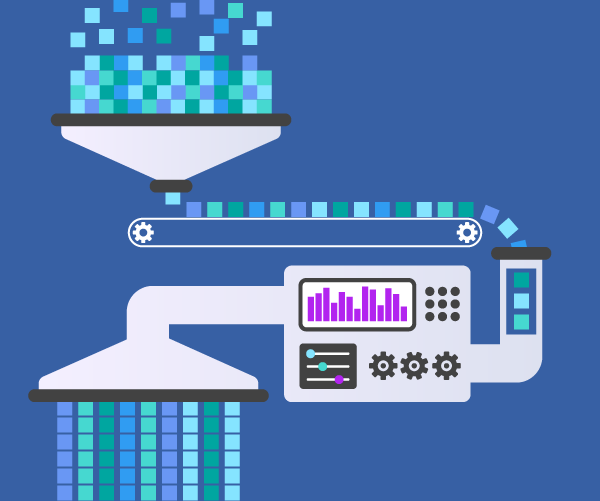

Build Data Pipelines with Apache Airflow - Towards Data Science

## [Data Engineering 101](https://towardsdatascience.com/tagged/data-engineering-101)

# Build Data Pipelines with Apache Airflow

## The beginner’s guide to Apache Airflow.

[Xinran Waibel](https://towardsdatascience.com/@xinran.waibel?source=post_page-----808a4de79047----------------------)

[Dec 2, 2019](https://towardsdatascience.com/https-medium-com-xinran-waibel-build-data-pipelines-with-apache-airflow-808a4de79047?source=post_page-----808a4de79047----------------------) · 4 min read

Source: [Alooma](https://www.alooma.com/blog/what-is-a-data-pipeline)

Originally created at Airbnb in 2014, [Airflow](https://airflow.apache.org/) is an open-source data orchestration framework that allows developers to programmatically author, schedule, and monitor data pipelines. Airflow experience is one of the most in-demand technical skills for Data Engineering (another one is [Oozie](https://oozie.apache.org/)) as it is listed as a skill requirement in many Data Engineer job postings.

In this blog post, I will explain core concepts and workflow creation in Airflow, with source code examples to help you create your first data pipeline using Airflow.

* * *

*...*

## Concepts

Here are the basic concepts and terms frequently used in Airflow:

**DAG: **In Airflow, a DAG (Directed Acyclic Graph) is a group of tasks that have some dependencies on each other and run on a schedule. Each DAG is equivalent to a logical workflow. A **DAG Run** is a specific run of the DAG.

**Operator: **An operator is a Python class that acts as a template for a certain type of job, for example:

- [BashOperator](https://airflow.apache.org/_api/airflow/operators/bash_operator/index.html?highlight=bashoperator#airflow.operators.bash_operator.BashOperator): execute a bash command
- [PythonOperator](https://airflow.apache.org/_api/airflow/operators/python_operator/index.html?highlight=pythonvirtualenvoperator#airflow.operators.python_operator.PythonOperator): run a Python function
- [PythonVirtualenvOperator](https://airflow.apache.org/_api/airflow/operators/python_operator/index.html?highlight=pythonvirtualenvoperator#airflow.operators.python_operator.PythonVirtualenvOperator): run a function in a virtual environment that is created and destroyed automatically
- [BigQueryOperator](https://airflow.apache.org/_api/airflow/contrib/operators/bigquery_operator/index.html#airflow.contrib.operators.bigquery_operator.BigQueryOperator): query and process data in BigQuery
- [PapermillOperator](https://airflow.apache.org/docs/stable/howto/operator/papermill.html): execute a Jupyter Notebook

**Task: **Once an operator is instantiated with specific arguments, it becomes a task.

**Task Instance: **A task instance represents a specific run of a task and it has a state, for example: “running”, “success”, “failed”, “skipped”, “up for retry”, etc.

## Workflow Creation

A DAG (aka a workflow) is defined in a Python file stored in Airflow’s DAG_FOLDER and contains 3 main components: the DAG definition, tasks, and task dependencies.

**Default Arguments**

When the `default_args`*  *dictionary*  *is passed to a DAG, it applies to all tasks belonging to the DAG:

default_args **=** {  'owner': 'xinran.waibel', 'start_date': datetime(2019, 12, 1), 'retries': 1, 'on_failure_callback': slack_failure_msg}

Some useful parameters:

- **start_date**: The execution_date for the first DAG run.
- **end_date**: The date the DAG should stop running (usually none).
- **execution_timeout**: The maximum times a task can run.
- **retries**: The number of retries that can be performed before the task fails.
- **retry_delay**: The delay time between retries.
- **depends_on_past**: When it is set to true, a task instance will only run if the previously scheduled task instance succeeds.
- **on_failure_callback**: The function to be called when a task instance fails.

**DAG Definition**

|     |     |
| --- | --- |
| 1   | # Create a DAG using context manager (with...as...) |
| 2   | # Benefits of context manager: all tasks within context manager is automatically assigned to the DAG so you don't have to explicitly set dag=dag for all tasks. |
| 3   | with  DAG('DAG_NAME', default_args=default_args, schedule_interval='@once') as  dag: |
| 4   |     |
| 5   |  # Create SQL task A using BigQueryOperator |
| 6   |  bq_sql_task_a  =  bigquery_operator.BigQueryOperator( |
| 7   |  task_id='demo_bq_sql_a', |
| 8   |  sql="INSERT INTO TABLE TABLE_B SELECT * FROM TABLE_A", |
| 9   |  use_legacy_sql=False) |
| 10  |     |
| 11  |  # Create SQL task B |
| 12  |  bq_sql_task_b  =  bigquery_operator.BigQueryOperator( |
| 13  |  task_id='demo_bq_sql_b', |
| 14  |  sql="INSERT INTO TABLE TABLE_C SELECT * FROM TABLE_B", |
| 15  |  use_legacy_sql=False) |
| 16  |     |
| 17  |  # Set dependency between A and B: B depends on A |
| 18  |  bq_sql_task_a  >>  bq_sql_task_b |
| 19  |     |
| 20  |  # Create Slack notification task using SlackAPIPostOperator |
| 21  |  slack_msg_task  =  SlackAPIPostOperator( |
| 22  |  task_id='slack_msg', |
| 23  |  channel='data_notifications', |
| 24  |  token=os.environ['SLACK_API_TOKEN'], |
| 25  |  text=""" |
| 26  | :white_check_mark: Workflow Succeeded |
| 27  | *Dag*: {dag} |
| 28  | *DAG Run ID*: {dag_run_id} |
| 29  | """.format(dag=dag.dag_id, dag_run_id='{{ run_id }}')) |
| 30  |     |
| 31  |  # Slack task depends on both A and B |
| 32  | [bq_sql_task_a, bq_sql_task_b] >>  slack_msg_task |

 [view raw](https://gist.github.com/xinran-waibel/a6d8b2d5217f498927a4a580dec24354/raw/6e577801e624ddba8928f4d89fdccdb2a47266f0/sample_dag.py)  [sample_dag.py](https://gist.github.com/xinran-waibel/a6d8b2d5217f498927a4a580dec24354#file-sample_dag-py) hosted with ❤ by [GitHub](https://github.com/)

Some useful parameters for DAG constructor:

- [schedule_interval](https://airflow.apache.org/scheduler.html#dag-runs): A [cron expression](https://en.wikipedia.org/wiki/Cron#CRON_expression) to specify how often the DAG should run.
- [catchup](https://airflow.apache.org/scheduler.html#backfill-and-catchup): Turning catchup off is recommended if your DAG performs backfill internally.

DAG files need to be evaluated quickly (in seconds) since the scheduler will execute them periodically (around every minute) to reflect the workflow changes, if any. Thus, **don’t perform actual data processing in DAG files**.

**Task Dependency**
Currently, there are two main ways to set dependencies between tasks:

- Python’s bitshift operators (`>>` and `<<`)
- `set_upstream()` and `set_downstream()` methods

# Task B depends on Task A and Task C depends on Task B

task_a >> task_b >> task_c# Task D depends on Task C
task_c.set_downstream(task_d)
You can also define dependencies among multiple tasks using Python’s list:

# Task C will run after both Task A and B complete

[task_a, task_b] >> task_c
Use `chain()` function to define a sequential dependency:
from airflow.utils.helpers import chain# Both Task B and C depend on Task A

# Task D depends on both Task B and C

chain(task_a, [task_b, task_c], task_d)# The statement above is equivalent to:
task_a >> [task_b, task_c] >> task_d
Use `cross_downstream()` to set dependencies between two groups of tasks:

from airflow.utils.helpers import cross_downstream# Task C and D will run after both Task A and B complete

cross_downstream([task_a, task_b], [task_c, task_d])# The statement above is equivalent to:

[task_a, task_b] >> task_c
[task_a, task_b] >> task_d

* * *

*...*
Congrats! You just learned how to create a data workflow using Airflow.

You can simply deploy your workflow by adding the DAG file and any dependency files to Airflow’s DAG_FOLDER and Airflow will automatically pick it up. Then, you can use Airflow’s built-in web UI to monitor and debug your workflow at any time (which is very straightforward so I won’t cover details here).

**Ready to learn more about Airflow? **Check out [*Airflow Tips and Best Practices*](https://towardsdatascience.com/apache-airflow-tips-and-best-practices-ff64ce92ef8)!

* * *

*...*

*Want to learn more about Data Engineering?* Check out my [Data Engineering 101](https://towardsdatascience.com/tagged/data-engineering-101) column on Towards Data Science:

[ ## Data Engineering 101 - Towards Data Science  ###  Read writing about Data Engineering 101 in Towards Data Science. A Medium publication sharing concepts, ideas, and…     ####  towardsdatascience.com](https://towardsdatascience.com/tagged/data-engineering-101)