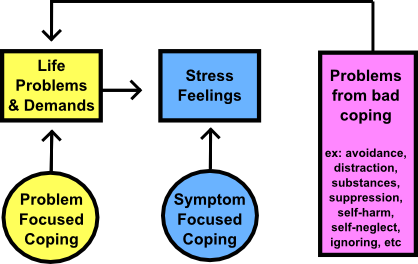

Build a Coping System - Will Meek PhD

# Build a Coping System

03/11/16: One of the most basic things that I help clients do is develop good approaches for coping with stress and difficult emotions. I often discuss building a “coping system” that covers the range of things you would need to deal with most life situations. The following is a way of building a complete, and functional coping system. It is also used in conjunction with my article [Processing Emotions](http://willmeekphd.com/processing-emotions), please read that one first.

**What is Stress**

Stress is a taxing mental and physiological load that our minds and bodies experience in response to demands from our environment. When we experience stress, there are a variety of physical, mental, and chemical changes in our bodies that are uncomfortable, which are designed to motivate us to do something to feel better.

The brains of most creatures on the Earth have very quick stress reactions that are related to escaping danger, finding food, and caring for offspring. Once these things are achieved, they return to a normal relaxed living (what we would call homeostasis or equilibrium). However, for humans, the part of our brain that does much of our complex problem solving is able to comprehend so many scenarios that our mental processes alone can cause us an enormous amount of stress that other creatures do not experience.

For example, if you have a pet cat, most of it’s life will be spent chilling out, eating, sleeping, playing, being cute, and purring against your face. If a vicious dog showed up one day and chased it, the cat would have a brief, intense stress reaction until it reached safety. After that, it would naturally relax after a short period of time, and then go back to the usual way of living (until the dog showed up again).

Cats do not have the mental capacity to think of all of the possible situations that they could be chased in the future, replay the memories of past near misses, or contemplate their own mortality (they only get 9 lives after all). In contrast, humans can imagine these things all day long, for years, even scenarios that are nearly impossible and unlikely to ever happen, and that can be immensely stressful.

The cost of long term stress is severe. Many major illness are related to and exacerbated by stress, including heart disease, hypertension, and stroke. All of this calls for us to build solid coping systems so we can live happy, healthy lives, even under pressures from the world. For more on stress response, the best book I have seen is [Why Zebras Don’t Get Ulcers](http://www.amazon.com/Zebras-Dont-Ulcers-Third-Edition/dp/0805073698) by Robert Sapolsky.

## Symptom-Focused v.

Problem-Focused Coping

An important aspect of being good at coping is to figure what you actually need to cope with. For example, imagine you have more work to do in a short period of time than you even have before, and that this is causing you to feel tense and stressed, and sleep poorly.

If you have a symptom-focused coping approach, you would read that situation and likely believe you need to cope with the tension, stress, and loss of sleep. This would mean we need to find ways to relax and sleep better.

If you have a problem-focused coping approach, you would read that situation and likely believe you need to cope with the demands of the actual work you have and the short about of time. This would mean you might search for ways to organize the work, start getting it done, and seeing if there are ways to reduce some of it.

Ultimately, it is good for us to be good at both, and in my experience, more people are symptom-focused than problem-focused. The differences are the symptom-focused copers suffer for longer period of time because they are spending more time on the results of the problems than the problem itself. Problem-focused copers usually have less stress because they are tackling the actual cases of the stress.

## Coping Skills

I like to think of stress level as the result of a basic equation:

*Stressors (Type + Intensity + Duration + Number) – Coping Resources (Skills + Energy)*

Basically if you have a lot of coping skills and energy to use them, then you can deal with larger amounts of stress. So this post is about the second half of that equation, primarily “healthy” or “constructive” ways of coping, rather than ways that may have a short term benefit but other negative consequences (e.g. drug use).

There is also a general process of coping that we follow, which will help structure the strategies below. This progression includes:

**Before the Situation**
1. How we are doing (e.g. mental/physical health)
2. Choosing a good situation for us (if possible)
3. Preparing for the situation (if possible)
**During the Situation**
4. Modifying the situation (if possible)
5. Paying attention in the situation
6. Cognitively processing the situation
7. Managing our reactions (emo/phys/beh, etc)
**After the Situation**
8. Reflecting on the situation

The key to building a good coping system is to choose some strategies for each area. This allows us to have a bunch of things to pick from when they are needed. Some of them may be things we automatically do under stress, or daily activities, whereas others are going to be used on an as-needed basis.

The following sections are going to give some ideas in various areas, and a suggested number of each. They are a blend of a variety of research supported coping models (problem focused, emotion focused, mindfulness, etc), and other practical strategies. If you have a deficit in an area, it can be a good idea to work on those skills during times of less stress, so you can be prepared when more stressful times emerge. To use this properly, think about a situation that causes you stress, or that is happening regularly in your life. This can be anything (fears about the future, having to give a speech, having a lot of work to do, having a conversation, etc). Once you have that in mind, go through each step here and try and take away from ideas to build up your coping system.

## Before the Situation

**1. Maintenance**

*These are things we can do to stay at our best at all times, and they help sustain us during periods of stress. Of all of the things that will be listed in this article, these are the most important.*

- 7+ hours of sleep per night
- A healthy and balanced diet
- Regular exercise (cardio and strength)
- Daily mindfulness or meditation practice
- Strong social connections
- Daily spiritual connection
- Regular yoga (or similar) practice
- Good organization and time management
- Weekly time for play and hobbies

**2. Choose the situation**
*These approaches are about foresight*

- Consider your options for the situation
- Pick a situation likely to lead to success or enjoyment
- Avoid the stressful situation

**3. Prepare for the situation**
*These approaches are about getting ready*

- Plan to cope well with the situation ahead of time
- Have a backup plan setup for the situation
- Get in a positive mindset before going into it

## During the Situation

**4. Modify the situation**
*These are for when you are in a stressful situation*

- Find a way to act positively
- Change something in the environment
- Speak your mind
- Leave the situation
- Make a plan of action
- Get more information
- Take action to solve a problem

**5. Shift your attention**
*These are ways to use your attention as a way to cope*

- Focus on something positive
- Focus on something unrelated to the situation
- Focus on something neutral in the situation
- Focus on something else within the situation
- Distract yourself with something meaningless
- Do a mindfulness exercise

**6. Change your perspective**
*These are ways to change your point of view*

- Take a positive perspective
- Reassure yourself that you can deal with it
- Think about how someone else might deal with it
- Remember that the stress is temporary
- Take a step back from it and look at the big picture
- Look for the meaning in what is happening
- Look for the facts of the situation instead of your feelings
- Organize your thoughts and feelings
- Make a deliberate choice to do something
- Act as if you were really capable
- Reduce any extreme or distorted thinking
- Accept what is happening rather than fighting it

**7. Manage your reaction**
*These are ways to deal with your reactions to stress*

- Learn how to relax
- Do Emotion Processing
- Use deep breathing
- Talk to someone you trust
- Write in a journal
- Do something creative
- Progressive muscle relaxation
- Cry (or scream) if you need to
- Allow your emotions to be there
- Focus on tolerating the experience
- Attune to the present moment
- Do something fun

## After the Situation

**8. Reflect on the situation**
*These are about looking back and learning*

- See what worked and what didn’t
- Create a plan for things to go well next time
- Figure out how to repair things that went wrong
- Determine what you can learn from the situation

**Control**

One of the keys across all of these is looking at what you have control over. There is no situation that a person doesn’t have control of some aspect of, even if it’s just your reaction to what is happening. A simple tool to use to find out how to cope would be to ask yourself “what can I control or change in this situation?” and then exercising your power to influence those things.

These lists are obviously not exhaustive, so add your own unique approaches to each category. Also, the categories are blurry, meaning that if you are using Mindfulness to cope with your reactions, you are also shifting you attention at the same time. A complete coping system will have at least 24 of those things (or others that work for you) mastered. Someone who has great coping skills will also be able to pick a few of the strategies out that match the type of situation and apply them appropriately.

*This is the fourth revision. The original article was posted on 12/24/11, the second was on 03/10/14, the third was on 12/13/15.

*