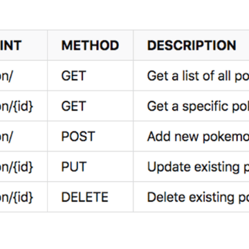

Build a RESTful API with the Serverless Framework

Build a RESTful API with the Serverless Framework

https://dev.to/sagar/build-a-restful-api-with-the-serverless-framework-ene

Today, we’re going to implement serverless RESTful API services by using “Serve...