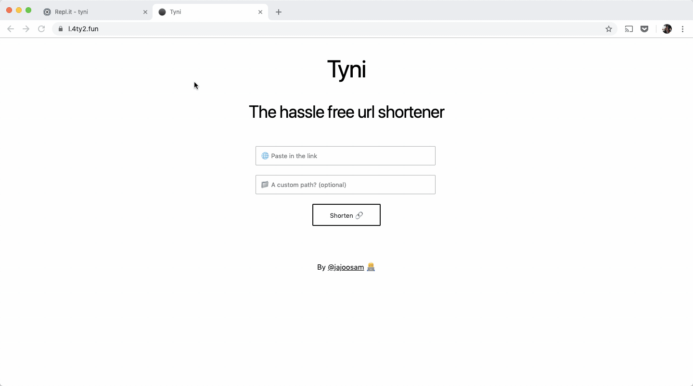
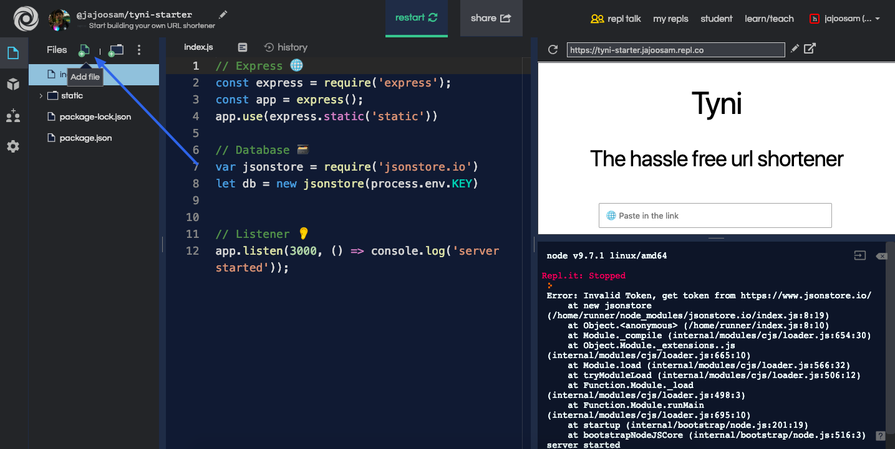
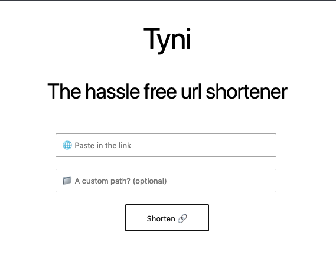

Build your very own URL shortener 🔗🚀

[← Back to all posts](https://repl.it/talk/learn)
▲
25
Build your very own URL shortener
[(L)](https://repl.it/@jajoosam)
[jajoosam (371)](https://repl.it/@jajoosam)

## Build a tiny URL shortener, using a remote database

[Demo](https://l.4ty2.fun/) ⏯️ [Code](https://repl.it/@jajoosam/tyni) ‍

Setting up a URL shortener is a lot of work - either you have to pay, or spend hours setting up your own server.

This is a guide to making your own URL shortener with [repl.it](http://repl.it/) - using `express`, and a remote database - all on `node.js`

## ️ Getting our environment running

First up, fork the https://repl.it/@jajoosam/tyni-starter repl, so that you have a running project. Next, create a new file - `.env`

A `.env` file can store secrets for you, that no one else will be able to see. This is where we want to store our token for accessing the remote database.

##  Making our database

We're going to be using [jsonstore.io](http://jsonstore.io/) for storing all our URLs.

Head over to [jsonstore.io/get-token](https://www.jsonstore.io/get-token) - and copy the token you see - this is the secret we want to store in our `.env` file.

Open up your `.env` file, and set `KEY` to your token, like this
`KEY=yourTokenGoesHere`

Remember to keep **no whitespace**, or your token might not be recognized right!

When you open `index.js` you'll see that I've already initialized the database, and a small web server for you. Now let's get to making our API so we can shorten them URLs

## ‍ The API

There are two parts to our URL shortener:
1. Storing the short link, corresponding to the long URL - in our database.
2. Redirecting visitors from the short link to the long link

Both of these are super simple to implement, thanks to the `express` server we're using - we'll just be collecting `get` requests for both of the tasks.

For adding links to our database, we have a special endpoint - requests to it have two parts: the long URL, and the short path.

	app.get('/shorten', (req, res) => {
		db.write(req.query.key, {"url": req.query.url});
		res.status(200);
	});

Adding this to our code lets us correspond the short path (`key`) to the long `url`, and then we finally send a successful response.

For the second task, we'll just be collecting the short path (`key`) from a request, finding the corresponding URL in our database, and then redirecting our visitor ⬇️

	app.get('/:key', (req, res) => {
		db.read(req.params.key + "/url").then( (url) => {
			res.redirect(url);
		});
	});

That's prety much it - we have a fully functional URL shortener - check it out for yourself, open a new URL which looks like this

`https://tyni.jajoosam.repl.co/shorten?key=yay&url=https://dsh.re/50854`

Now, going to [`http://tyni.jajoosam.repl.co/yay`](http://tyni.jajoosam.repl.co/yay) will be nice to see

Of course, you'll be replacing `tyni.jajoosam` in those URLs with your own repl!

## ✨ The Frontend

Our URL shortener does work, but it's tedious, having to type out a huge URL before shortening it - we can make the whole process much simpler with a simple frontend.

I've already created this - and gone for a neat and minimal look using [wing.css](https://github.com/kbrsh/wing)

You just have to add code to send visitors to the hompage in the `static` folder

	app.get('/', (req, res) => {
		res.sendFile("static/index.html", {root: __dirname});;
	});

If you browse through the `static` folder, you'll find a simple `HTML` file with a form, `CSS` to style our page, and most importantly, `JS` to send requests to our URL shortening API.

The `HTML` is quite straightforward, we're asking for the long URL, and *optionally* a short path.

Open up `script.js` and you'll see the `shorten()` function.
Here's what the JS file does (*I've also annotated the code with comments*)
Getting the path(`key`) and the long `url` from the form.

Possibly generating a random 5 character hash as our path (in case there's no path entered)

Sending a get request to our API, with our `key` and `url` as parameters
️ Displaying the shortened URL on our page

##  Getting our custom domain

Sure, our links are shorter - but we still don't have them on our own domain, and the `repl.co` links can be pretty long

Luckily for us, the folks at [repl.it](http://repl.it/) recently allowed custom domains to be used! That means this project could be something you actually use all the time

Check out `dotcomboom`'s guide on [using custom domains](https://repl.it/talk/learn/How-to-use-a-custom-domain/8834), it should only take a few minutes. It also teaches you about getting free domains

Be sure to put down any questions or improvements down in the comments - and here's all the code for you to go over again

https://repl.it/@jajoosam/tyni
1 month ago ·

To add an image, drag and drop, [select files]() or paste.Style your post with [Markdown](https://repl.it/talk/learn/A-Quick-Guide-to-Replit-Talk-Markdown/7448)!

**Voters**

[  TopZek(1)](https://repl.it/@TopZek)[  PatriotsVoice(0)](https://repl.it/@PatriotsVoice)[  TheJeffGuy(0)](https://repl.it/@TheJeffGuy)[  OscarLi(0)](https://repl.it/@OscarLi)[  Zavexeon(42)](https://repl.it/@Zavexeon)[  dotcomboom(37)](https://repl.it/@dotcomboom)[  IcyEmerald05(0)](https://repl.it/@IcyEmerald05)[  activizator(0)](https://repl.it/@activizator)[  ANNELIESE_MEME(0)](https://repl.it/@ANNELIESE_MEME)[  woonket(0)](https://repl.it/@woonket)

[15 more...]()

**Comments**[hot](https://repl.it/talk/learn/Build-your-very-own-URL-shortener/9611)[new](https://repl.it/talk/learn/Build-your-very-own-URL-shortener/9611?order=new)[top](https://repl.it/talk/learn/Build-your-very-own-URL-shortener/9611?order=votes)

▲
3

[timmy_i_chen (537)](https://repl.it/@timmy_i_chen)

Also, [@dotcomboom](https://repl.it/@dotcomboom) your tutorial was referenced above :)

[1 month ago](https://repl.it/talk/learn/Build-your-very-own-URL-shortener/9611/22719) · ·

▲
2
[(L)](https://repl.it/@gabrielsroka)
[gabrielsroka (1)](https://repl.it/@gabrielsroka)
[@jajoosam](https://repl.it/@jajoosam),
Thanks for posting this -- it's great!

I had a few minor issues, so here's a heads-up to anyone else who wants to try it:

1. `index.js` uses `DB_KEY` but this post uses `KEY`. I actually changed mine to `TOKEN` to match [jsonstore.io](https://github.com/Tilak999/jsonstore.io)

2. I wasn't sure what the `.env` file should look like. Here's an example (replace it with your own `TOKEN`):

`TOKEN=708ca41d57c35a9b8c059f9...`
3. after forking, customize the `baseUrl` in `script.js` line 2, eg:
`const baseUrl = "tyni.gabrielsroka.repl.co";`

I also added some error checking (both server- and client-side) and a few, minor features. See my fork: [repl.it/@gabrielsroka/tyni](https://repl.it/@gabrielsroka/tyni)

[10 days ago](https://repl.it/talk/learn/Build-your-very-own-URL-shortener/9611/23920) · ·

▲
2
[(L)](https://repl.it/@jajoosam)
[jajoosam (371)](https://repl.it/@jajoosam)
[@gabrielsroka](https://repl.it/@gabrielsroka)

Love the fork, it's super cool you added those error checking and status code features :)

re your points:

1. In the starter repl, I've used `KEY` itself - I hadn't in the demo instance, just changed that.

1. Yes, this is something I've seen other people struggle with too. It'd be dope if forks would also clone the env, except it'd be unpopulated - so the key names and comments will remain, just without the actual values.

[@amasad](https://repl.it/@amasad): Feature suggestion :)

2. The shortener should work fine even without the base URL, since it uses relative links.

Thank you for typing out the feedback

[9 days ago](https://repl.it/talk/learn/Build-your-very-own-URL-shortener/9611/24039) · ·

▲
1
[(L)](https://repl.it/@gabrielsroka)
[gabrielsroka (1)](https://repl.it/@gabrielsroka)
[@jajoosam](https://repl.it/@jajoosam),

Thanks for the comments. The doc page https://repl.it/site/docs/repls/secret-keys has an example repl https://repl.it/@timmy_i_chen/python-dotenv-example made by [@timmy_i_chen](https://repl.it/@timmy_i_chen) that uses a "template" file called `env`. After forking, the user is supposed to rename it to `.env`. This is a good approach.

Another idea would be to use comments in the `env` or `.env`, eg:

	# Get a token by going to https://www.jsonstore.io and pasting it below
	TOKEN=708ca41d57c35a9b8c059f9...

Do we know if `.env` supports comments? (eg using `#`)

[8 days ago](https://repl.it/talk/learn/Build-your-very-own-URL-shortener/9611/24152) · ·

▲
2

[timmy_i_chen (537)](https://repl.it/@timmy_i_chen)

[@gabrielsroka](https://repl.it/@gabrielsroka) It does support comments using `#` :)

[8 days ago](https://repl.it/talk/learn/Build-your-very-own-URL-shortener/9611/24153) · ·

▲
2
[(L)](https://repl.it/@Coder100)
[Coder100 (6)](https://repl.it/@Coder100)
This is awesome!

[1 month ago](https://repl.it/talk/learn/Build-your-very-own-URL-shortener/9611/22798) · ·

▲
2
[(L)](https://repl.it/@ThomasHagan)
[ThomasHagan (1)](https://repl.it/@ThomasHagan)
Excellent tutorial. Can't wait to show my son!

[1 month ago](https://repl.it/talk/learn/Build-your-very-own-URL-shortener/9611/22765) · ·

▲
2

[timmy_i_chen (537)](https://repl.it/@timmy_i_chen)
TIL about jsonstore. Nice!

[1 month ago](https://repl.it/talk/learn/Build-your-very-own-URL-shortener/9611/22606) · ·

▲
1
[(L)](https://repl.it/@leon332157)
[leon332157 (21)](https://repl.it/@leon332157)
[https://facebook.com](https://facebook.com/)

[22 days ago](https://repl.it/talk/learn/Build-your-very-own-URL-shortener/9611/23313) · ·

▲
1

[themaka (26)](https://repl.it/@themaka)
Very cool!

[24 days ago](https://repl.it/talk/learn/Build-your-very-own-URL-shortener/9611/23218) · ·