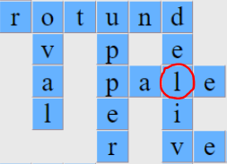
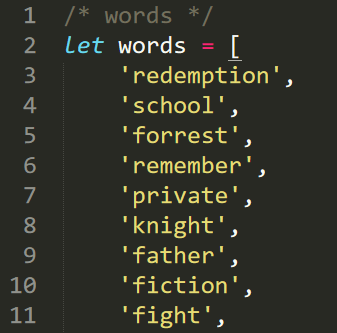
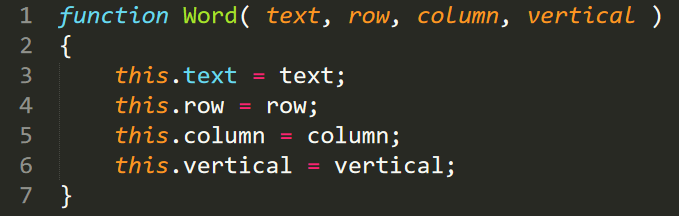
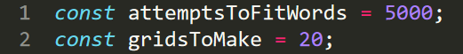
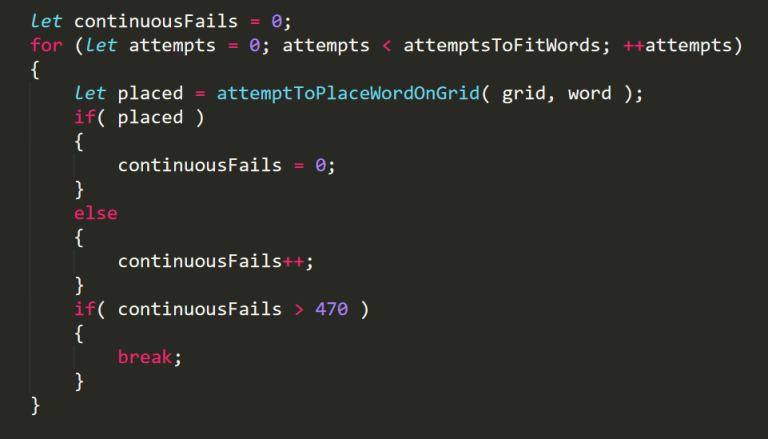
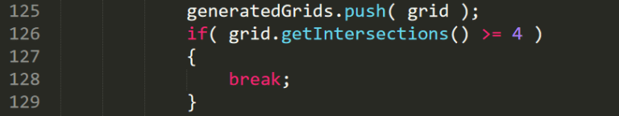

Building A Crossword Puzzle Generator With JavaScript - Mitchum.Blog

Posted on  [May 8, 2020](https://mitchum.blog/building-a-crossword-puzzle-generator-with-javascript/) by [Mitchum](https://mitchum.blog/author/mitchm/)

# Building A Crossword Puzzle Generator With JavaScript

It’s time once again for a [JavaScript tutorial](https://mitchum.blog/game-tutorials/). This will be the most complex code I’ve introduced to date, so I hope you’ve been paying attention and not just copy and pasting! In this post you will learn how to build a crossword puzzle generator with JavaScript.

First I’ll give an introduction into what inspired this project, next I’ll discuss what the different components are and how they fit together, and finally I’ll talk about the performance optimizations I made.

[**You can try it out by clicking this link.**](https://mitchum.blog/games/crossword-puzzle-generator/crosswordpuzzlegenerator.html) Be patient after clicking the button though, as sometimes it takes a moment to create a crossword puzzle. You’ll see why soon enough.

[**And you can click here to check out the source code.**](https://github.com/mmaynar1/games/tree/master/crossword-puzzle-generator)

Ad

[](https://googleads.g.doubleclick.net/aclk?sa=l&ai=CtZ0XnH62Xuz7EoKKmLAPjPyCqAS629L4XP-3l6DSCdiJhZ4LEAEgu4mMdmC7vq6D0AqgAZu8yuwCyAEGqAMByAPDBKoE7QFP0KYDfh4EIFIkQdee6Rk-vhVwgnUTxAZngEYo6uhy-7RG5KCctTg5O2teE3pmPpNtGXfl4ewiqiAf1EsCD-VRK7ZRa0T4w1Ynv9xa_1sKHaB7uzkdq2Xbm35rbHoqq9MctuHw9MoF6FDMp10-FmPZ7g6BpO1FSiF9WkYnTp0l4gBShebBXciK4Dta9JRRBp_gClhJfMBeDD3oa5WuUDebRNUwYr5IZ4vN15YUUmuzGptoq-CQdONoEL4DAzqTuz8bVqRmPqCBLSz9B79W_XCBqL1uHnFw274vgx--XxJwr6EVxYnPQyiKq9HEYUnABN7i0qSEAqAGN4AHzcO1kwGoB47OG6gH1ckbqAeT2BuoB7oGqAfw2RuoB_LZG6gHpr4bqAfs1RuoB_PRG6gH7NUbqAeW2BuoB8LaG9gHAdIICQiM44AQEAEYHrEJFPOjNFR8b5uACgGKCjhodHRwczovL2Fkc3B0LTcwMDUuY29tLz91cmw9e2xwdXJsfSZyPTYxMSZwPW1pdGNodW0uYmxvZ5gLAcgLAeALAdgTDA&ae=1&num=1&sig=AOD64_0-HZaa93uW4vACGyw5lUFaOI9C3Q&client=ca-pub-3731131580005478&nb=9&adurl=http://www.freetemplatefinder.com/index.jhtml%3Fpartner%3D%5ECWW%5Exdm124%26gclid%3DEAIaIQobChMI7Lmyq8Km6QIVAgUGAB0MvgBFEAEYASAAEgLbKvD_BwE)

[Download Template (Free)](https://googleads.g.doubleclick.net/aclk?sa=l&ai=CtZ0XnH62Xuz7EoKKmLAPjPyCqAS629L4XP-3l6DSCdiJhZ4LEAEgu4mMdmC7vq6D0AqgAZu8yuwCyAEGqAMByAPDBKoE7QFP0KYDfh4EIFIkQdee6Rk-vhVwgnUTxAZngEYo6uhy-7RG5KCctTg5O2teE3pmPpNtGXfl4ewiqiAf1EsCD-VRK7ZRa0T4w1Ynv9xa_1sKHaB7uzkdq2Xbm35rbHoqq9MctuHw9MoF6FDMp10-FmPZ7g6BpO1FSiF9WkYnTp0l4gBShebBXciK4Dta9JRRBp_gClhJfMBeDD3oa5WuUDebRNUwYr5IZ4vN15YUUmuzGptoq-CQdONoEL4DAzqTuz8bVqRmPqCBLSz9B79W_XCBqL1uHnFw274vgx--XxJwr6EVxYnPQyiKq9HEYUnABN7i0qSEAqAGN4AHzcO1kwGoB47OG6gH1ckbqAeT2BuoB7oGqAfw2RuoB_LZG6gHpr4bqAfs1RuoB_PRG6gH7NUbqAeW2BuoB8LaG9gHAdIICQiM44AQEAEYHrEJFPOjNFR8b5uACgGKCjhodHRwczovL2Fkc3B0LTcwMDUuY29tLz91cmw9e2xwdXJsfSZyPTYxMSZwPW1pdGNodW0uYmxvZ5gLAcgLAeALAdgTDA&ae=1&num=1&sig=AOD64_0-HZaa93uW4vACGyw5lUFaOI9C3Q&client=ca-pub-3731131580005478&nb=0&adurl=http://www.freetemplatefinder.com/index.jhtml%3Fpartner%3D%5ECWW%5Exdm124%26gclid%3DEAIaIQobChMI7Lmyq8Km6QIVAgUGAB0MvgBFEAEYASAAEgLbKvD_BwE)

[Ad   Find Templates, Download Now]()

[FreeTemplateFinder](https://googleads.g.doubleclick.net/aclk?sa=l&ai=CtZ0XnH62Xuz7EoKKmLAPjPyCqAS629L4XP-3l6DSCdiJhZ4LEAEgu4mMdmC7vq6D0AqgAZu8yuwCyAEGqAMByAPDBKoE7QFP0KYDfh4EIFIkQdee6Rk-vhVwgnUTxAZngEYo6uhy-7RG5KCctTg5O2teE3pmPpNtGXfl4ewiqiAf1EsCD-VRK7ZRa0T4w1Ynv9xa_1sKHaB7uzkdq2Xbm35rbHoqq9MctuHw9MoF6FDMp10-FmPZ7g6BpO1FSiF9WkYnTp0l4gBShebBXciK4Dta9JRRBp_gClhJfMBeDD3oa5WuUDebRNUwYr5IZ4vN15YUUmuzGptoq-CQdONoEL4DAzqTuz8bVqRmPqCBLSz9B79W_XCBqL1uHnFw274vgx--XxJwr6EVxYnPQyiKq9HEYUnABN7i0qSEAqAGN4AHzcO1kwGoB47OG6gH1ckbqAeT2BuoB7oGqAfw2RuoB_LZG6gHpr4bqAfs1RuoB_PRG6gH7NUbqAeW2BuoB8LaG9gHAdIICQiM44AQEAEYHrEJFPOjNFR8b5uACgGKCjhodHRwczovL2Fkc3B0LTcwMDUuY29tLz91cmw9e2xwdXJsfSZyPTYxMSZwPW1pdGNodW0uYmxvZ5gLAcgLAeALAdgTDA&ae=1&num=1&sig=AOD64_0-HZaa93uW4vACGyw5lUFaOI9C3Q&client=ca-pub-3731131580005478&nb=1&adurl=http://www.freetemplatefinder.com/index.jhtml%3Fpartner%3D%5ECWW%5Exdm124%26gclid%3DEAIaIQobChMI7Lmyq8Km6QIVAgUGAB0MvgBFEAEYASAAEgLbKvD_BwE)

[Open](https://googleads.g.doubleclick.net/aclk?sa=l&ai=CtZ0XnH62Xuz7EoKKmLAPjPyCqAS629L4XP-3l6DSCdiJhZ4LEAEgu4mMdmC7vq6D0AqgAZu8yuwCyAEGqAMByAPDBKoE7QFP0KYDfh4EIFIkQdee6Rk-vhVwgnUTxAZngEYo6uhy-7RG5KCctTg5O2teE3pmPpNtGXfl4ewiqiAf1EsCD-VRK7ZRa0T4w1Ynv9xa_1sKHaB7uzkdq2Xbm35rbHoqq9MctuHw9MoF6FDMp10-FmPZ7g6BpO1FSiF9WkYnTp0l4gBShebBXciK4Dta9JRRBp_gClhJfMBeDD3oa5WuUDebRNUwYr5IZ4vN15YUUmuzGptoq-CQdONoEL4DAzqTuz8bVqRmPqCBLSz9B79W_XCBqL1uHnFw274vgx--XxJwr6EVxYnPQyiKq9HEYUnABN7i0qSEAqAGN4AHzcO1kwGoB47OG6gH1ckbqAeT2BuoB7oGqAfw2RuoB_LZG6gHpr4bqAfs1RuoB_PRG6gH7NUbqAeW2BuoB8LaG9gHAdIICQiM44AQEAEYHrEJFPOjNFR8b5uACgGKCjhodHRwczovL2Fkc3B0LTcwMDUuY29tLz91cmw9e2xwdXJsfSZyPTYxMSZwPW1pdGNodW0uYmxvZ5gLAcgLAeALAdgTDA&ae=1&num=1&sig=AOD64_0-HZaa93uW4vACGyw5lUFaOI9C3Q&client=ca-pub-3731131580005478&nb=8&adurl=http://www.freetemplatefinder.com/index.jhtml%3Fpartner%3D%5ECWW%5Exdm124%26gclid%3DEAIaIQobChMI7Lmyq8Km6QIVAgUGAB0MvgBFEAEYASAAEgLbKvD_BwE)

## A Word of Encouragement

I’ve been programming for many years now and have made lots of [mistakes](https://mitchum.blog/getting-bit-by-bigdecimal/)along the way. I like to think of myself as somebody who knows a thing or two about building software. There is an enormous number of things I don’t know, but I’m confident in my skill set and my ability to learn new concepts and technologies as needed.

However, I didn’t get that confidence overnight. I used to be pretty bad, and when I get the chance to look at some of my code from years back it makes me cringe at the silly things I did.

So if that’s you right now don’t feel bad! We all have to [start from the beginning](https://mitchum.blog/landing-and-excelling-at-your-first-web-development-job/) to become good at anything worthwhile.

## The Source of Inspiration

And this brings me to a little a story. I created this crossword puzzle generator by porting an old [Java](https://mitchum.blog/programming-languages-for-beginners/) program I wrote back when I first got out of college. I hadn’t looked at it in years, and let me tell you, it was pretty rough. You can [check it out on GitHub](https://github.com/mmaynar1/CrosswordPuzzleGenerator) if you want to laugh at me.

I began the porting process by going one Java method at a time. I replaced each one with a shiny new JavaScript function that replicated its logic. As I progressed I began to refactor it, fix bugs, and improve the performance.

## The Fruits of My Labor

The finished product isn’t perfectly clean code, but it’s a whole lot better than it was before.

After finishing the JavaScript version of my crossword puzzle generator I began wondering to myself if it’s worth writing a tutorial for. I’m 100% certain there are better [algorithms](https://mitchum.blog/what-is-an-algorithm/)than the one I used, and I’m also 100% certain there are more readability and efficiency improvements I could make. I don’t want to teach you guys any bad habits.

It’s also very complex and not the easiest material to teach.

In the end I decided it would be a good idea. So many tutorials out there are really trivial, and don’t give you a good sense of what a typical company code base looks like. This will give you a better approximation of that. It’s a collaboration of multiple developers with varying ability levels on a fairly complex problem over many years. It just so happens that both of the developers are me.

It will also give you an opportunity add your own improvements, which is key to growing as a developer.

Ad

[](https://googleads.g.doubleclick.net/aclk?sa=l&ai=C7-V3nH62XtyEHdrJ1wa-0oPQA_bH45Rd7dGhrq8LrOa4mv4OEAEgu4mMdmC7vq6D0AqgAe6IpssDyAEGqQIpN_mFyi-yPqgDAcgDwwSqBOYBT9BUgpJanO8TL6Ul9NGm56GMZ9pF4slB-2G9Z2oreS5JPhIjui5PyDDikSwW50_SZzieWjklcltPf6wCfCsHHInB7nwtNUOSxFsLD0F_0TYBxsNQ8iJppWa3Wdy4XYbnk1x4wXG5f3GtjwDQTiHl90kh6s8U3_i2PjdBQjuCXb_7KxgRntbcV6CC_1iO97VmxXFsaD6A5QeIbBTHpBBg2EckgiCGMaDOzqCB8b5nZCmz3D98qFae84dQ_xJqQuP-0emiX1uuv5GU7DjgwT_T1JdlpP3NIvUE457a-wn6wxQAH2W-_a3ABOz23Pn2AqAGN4AHt4aSOKgHjs4bqAfVyRuoB5PYG6gHugaoB_DZG6gH8tkbqAemvhuoB-zVG6gH89EbqAfs1RuoB5bYG6gHwtob2AcB0ggJCIzjgBAQARgesQkuSaTXlcQwaYAKAZgLAcgLAdgTDIgUAQ&ae=1&num=1&sig=AOD64_1Rf7sLrWcepCiUVUAVbeA9Tf0zfw&client=ca-pub-3731131580005478&nb=9&adurl=https://om.elvenar.com/ox/en/%3Fref%3Dgoo_en_nn_smd_nn_nat%26noMobileRedir%3Dtrue%26pid%3D%26external_param%3Dmitchum.blog%26k%3D%26bid%3D10260068n%26gclid%3DEAIaIQobChMI3MK8q8Km6QIV2uTVCh0-6QA6EAEYASAAEgKdZvD_BwE)

[No Download Needed](https://googleads.g.doubleclick.net/aclk?sa=l&ai=C7-V3nH62XtyEHdrJ1wa-0oPQA_bH45Rd7dGhrq8LrOa4mv4OEAEgu4mMdmC7vq6D0AqgAe6IpssDyAEGqQIpN_mFyi-yPqgDAcgDwwSqBOYBT9BUgpJanO8TL6Ul9NGm56GMZ9pF4slB-2G9Z2oreS5JPhIjui5PyDDikSwW50_SZzieWjklcltPf6wCfCsHHInB7nwtNUOSxFsLD0F_0TYBxsNQ8iJppWa3Wdy4XYbnk1x4wXG5f3GtjwDQTiHl90kh6s8U3_i2PjdBQjuCXb_7KxgRntbcV6CC_1iO97VmxXFsaD6A5QeIbBTHpBBg2EckgiCGMaDOzqCB8b5nZCmz3D98qFae84dQ_xJqQuP-0emiX1uuv5GU7DjgwT_T1JdlpP3NIvUE457a-wn6wxQAH2W-_a3ABOz23Pn2AqAGN4AHt4aSOKgHjs4bqAfVyRuoB5PYG6gHugaoB_DZG6gH8tkbqAemvhuoB-zVG6gH89EbqAfs1RuoB5bYG6gHwtob2AcB0ggJCIzjgBAQARgesQkuSaTXlcQwaYAKAZgLAcgLAdgTDIgUAQ&ae=1&num=1&sig=AOD64_1Rf7sLrWcepCiUVUAVbeA9Tf0zfw&client=ca-pub-3731131580005478&nb=0&adurl=https://om.elvenar.com/ox/en/%3Fref%3Dgoo_en_nn_smd_nn_nat%26noMobileRedir%3Dtrue%26pid%3D%26external_param%3Dmitchum.blog%26k%3D%26bid%3D10260068n%26gclid%3DEAIaIQobChMI3MK8q8Km6QIV2uTVCh0-6QA6EAEYASAAEgKdZvD_BwE)

[Ad   Upgrade your buildings. Research technologies. Discover new provinces to…]()

[Elvenar](https://googleads.g.doubleclick.net/aclk?sa=l&ai=C7-V3nH62XtyEHdrJ1wa-0oPQA_bH45Rd7dGhrq8LrOa4mv4OEAEgu4mMdmC7vq6D0AqgAe6IpssDyAEGqQIpN_mFyi-yPqgDAcgDwwSqBOYBT9BUgpJanO8TL6Ul9NGm56GMZ9pF4slB-2G9Z2oreS5JPhIjui5PyDDikSwW50_SZzieWjklcltPf6wCfCsHHInB7nwtNUOSxFsLD0F_0TYBxsNQ8iJppWa3Wdy4XYbnk1x4wXG5f3GtjwDQTiHl90kh6s8U3_i2PjdBQjuCXb_7KxgRntbcV6CC_1iO97VmxXFsaD6A5QeIbBTHpBBg2EckgiCGMaDOzqCB8b5nZCmz3D98qFae84dQ_xJqQuP-0emiX1uuv5GU7DjgwT_T1JdlpP3NIvUE457a-wn6wxQAH2W-_a3ABOz23Pn2AqAGN4AHt4aSOKgHjs4bqAfVyRuoB5PYG6gHugaoB_DZG6gH8tkbqAemvhuoB-zVG6gH89EbqAfs1RuoB5bYG6gHwtob2AcB0ggJCIzjgBAQARgesQkuSaTXlcQwaYAKAZgLAcgLAdgTDIgUAQ&ae=1&num=1&sig=AOD64_1Rf7sLrWcepCiUVUAVbeA9Tf0zfw&client=ca-pub-3731131580005478&nb=1&adurl=https://om.elvenar.com/ox/en/%3Fref%3Dgoo_en_nn_smd_nn_nat%26noMobileRedir%3Dtrue%26pid%3D%26external_param%3Dmitchum.blog%26k%3D%26bid%3D10260068n%26gclid%3DEAIaIQobChMI3MK8q8Km6QIV2uTVCh0-6QA6EAEYASAAEgKdZvD_BwE)

[Open](https://googleads.g.doubleclick.net/aclk?sa=l&ai=C7-V3nH62XtyEHdrJ1wa-0oPQA_bH45Rd7dGhrq8LrOa4mv4OEAEgu4mMdmC7vq6D0AqgAe6IpssDyAEGqQIpN_mFyi-yPqgDAcgDwwSqBOYBT9BUgpJanO8TL6Ul9NGm56GMZ9pF4slB-2G9Z2oreS5JPhIjui5PyDDikSwW50_SZzieWjklcltPf6wCfCsHHInB7nwtNUOSxFsLD0F_0TYBxsNQ8iJppWa3Wdy4XYbnk1x4wXG5f3GtjwDQTiHl90kh6s8U3_i2PjdBQjuCXb_7KxgRntbcV6CC_1iO97VmxXFsaD6A5QeIbBTHpBBg2EckgiCGMaDOzqCB8b5nZCmz3D98qFae84dQ_xJqQuP-0emiX1uuv5GU7DjgwT_T1JdlpP3NIvUE457a-wn6wxQAH2W-_a3ABOz23Pn2AqAGN4AHt4aSOKgHjs4bqAfVyRuoB5PYG6gHugaoB_DZG6gH8tkbqAemvhuoB-zVG6gH89EbqAfs1RuoB5bYG6gHwtob2AcB0ggJCIzjgBAQARgesQkuSaTXlcQwaYAKAZgLAcgLAdgTDIgUAQ&ae=1&num=1&sig=AOD64_1Rf7sLrWcepCiUVUAVbeA9Tf0zfw&client=ca-pub-3731131580005478&nb=8&adurl=https://om.elvenar.com/ox/en/%3Fref%3Dgoo_en_nn_smd_nn_nat%26noMobileRedir%3Dtrue%26pid%3D%26external_param%3Dmitchum.blog%26k%3D%26bid%3D10260068n%26gclid%3DEAIaIQobChMI3MK8q8Km6QIV2uTVCh0-6QA6EAEYASAAEgKdZvD_BwE)

## What Exactly Are We Building?

We are building a crossword puzzle generator with [JavaScript, HTML, and CSS](https://mitchum.blog/programming-languages-for-beginners/). The idea is to take a big list of words, pick some random ones, and try to make a crossword puzzle out of them.

We’ll start by placing a word on a grid. Then we’ll get another word that is a possible candidate to connect to that word. Then we’ll do the same for another word. We’ll continue this process on an on, picking a different word each time the a word is placed or doesn’t fit anywhere in the puzzle.

When do we stop trying to place words? That’s a complicated answer determined by two main factors:

- Have we already placed a bunch of words?
- Do we have a lot of word intersections?

An example of a word intersection.

Once a crossword puzzle is made, we’ll go ahead and create some more. Then we’ll find the one with the most word intersections and show it on the screen!

## Breaking Down The Problem

I won’t go into the weeds as much in this post as I do in some of my [previous tutorials](https://mitchum.blog/game-tutorials/). There are just too many functions and edge cases to go through. Instead, I think it will be most helpful if I explain in detail the high-level components we will be creating. Knowing how all the pieces fit together is half the battle.

I really encourage you to study what each function is accomplishing while keeping in mind which variables are being changed. The comment section is a great way to reach out for help if you don’t understand something. Others will probably thank you for it.

### The Big List of Words

The first thing we need is a big list of words to pick from.
In my original version I pulled the King James Bible in from a text file.

In the updated version I just made a JavaScript array with a bunch of words in it. You can check it out [here](https://github.com/mmaynar1/games/blob/master/crossword-puzzle-generator/words.js).

### Representing a Word

To place a word on the grid we’ll need to know a few things about it. Obviously we’ll need to know the text of the word itself, but we’ll also need to know about it’s positioning. We’ll need a row and a column to mark it’s starting position. We’ll also need a boolean value to represent whether the word is horizontal or vertical in orientation.

We’ll represent words using a word object we create ourselves. You can check it out [here](https://github.com/mmaynar1/games/blob/master/crossword-puzzle-generator/word.js).

### Representing the Crossword Puzzle

The crossword puzzle objects we’re creating are [representations](https://mitchum.blog/representing-data-in-computer-programs/)of fully completed crossword puzzles. Each one will have various functions serving different purposes. Here is the comprehensive list of each function and what it does:

- **update**: Try to add a word to the grid.
- **canBePlaced**: Check if a word can be added to the grid.
- **getIntersections**: Returns a count of the number of word intersections in the grid.
- **placementLegal**: Determines if a word can legally be placed at a specific row/column position.
- **invadingTerritory**: Determines if a word will invade another word’s territory at a certain position.
- **endOfWord**: Determines if a particular row/column position corresponds to the end of the word.
- **doesCharacterExist**: Determines if a character exists at a certain position.
- **overwritingHorizontalWord**: Determines if placing a character at a particular row/column would be overwriting a horizontal word.
- **overwritingVerticalWord**: Determines if placing a character at a particular row/column would be overwriting a vertical word
- **isInterference**: Checks for interference at a set of row/column positions.
- **isLetter**: Checks if there is a letter at a row/column position.
- **isEmptyCell**: Checks if a row/column position is empty.
- **addWord**: Adds a word to the grid.
- **fitsOnGrid**: Checks if a word fits within the bounds of the grid.
- **isValidPosition**: Checks if a row/column position is a valid one for the grid.

You can check it out [here](https://github.com/mmaynar1/games/blob/master/crossword-puzzle-generator/crosswordpuzzle.js).

### Generating the Best Crossword Puzzle

Once we have the ability to place words on a grid we need to start making a whole bunch of crossword puzzles. Then, we need to pick the best one and display it on the screen. The top-level function that does all this is called **createCrosswordPuzzle**.

The **createCrosswordPuzzle** function has several nested functions that help accomplish its goals. Here is the comprehensive list of each function and what it does:

- **generateGrids**: Generate a bunch of crossword puzzles.
- **attemptToPlaceWordOnGrid**: Take a given a word and try to place it on the crossword puzzle.
- **getAWordToTry**: Fetch a word that we want to try placing on the crossword puzzle.
- **getBestGrid**: Pick the best crossword puzzle from the ones we generated.
- **isGoodWord**: Determine if a word is a good candidate to try placing on crossword puzzle based on the letters on the board.
- **displayCrosswordPuzzle**: Show the crossword puzzle on the screen.
- **pushUsedWords**: Mark a word as used and add its letters to a list of ones present on the crossword puzzle.

In addition to the functions above, this file contains some helper functions for getting unused words and various random values.

You can check it out [here](https://github.com/mmaynar1/games/tree/master/crossword-puzzle-generator).

## Performance Optimizations

I hope the previous sections have helped you see how all the pieces fit together. A crossword puzzle generator is a non-trivial problem, but breaking it down into smaller problems is a good way to approach it. In fact, that’s a good approach for any programming task.

I would like to cover one more aspect in further detail. By default, this code isn’t very fast. There is a very large amount of nested looping.

I’m going to share with you the steps I took to make it faster. If you know of better [algorithms](https://mitchum.blog/what-is-an-algorithm/) I’d love for you to write me a comment. This is a life long craft, and I’m as much of a student as I am a teacher.

There are 4 steps I took to improve the performance. I’ll refer to them as Adjusting The Inputs, Smart Word Picking, Knowing When To Quit, and Calling It Good Enough.

### Adjusting The Inputs

There are two variables that can have a major affect on the speed of the program. One controls the number of grids to make, and the other controls the number of attempts to fit words on the grid.

I found that a high number of attempts meant that I could lower the total number of grids to make. A high number of attempts helps ensure that the crossword puzzle will be densely packed with words.

Play around with these inputs yourself and notice how they affect the speed of the program and what the crossword puzzle looks like. I tried to optimize for creating a good looking crossword puzzle while not causing the page to timeout.

## Smart Word Picking

One way to speed things up is to limit our word selection to words that have a chance at being placed on the grid.

At first I picked each word totally at random, but that resulted in trying to place words on the grid that had no possible way of fitting. So I wasted a bunch of time looping through the grid, and I also wasted attempts at fitting words on the grid.

To fix this I started keeping a list of which letters exist on the crossword puzzle. That way I could limit my word selection to only words that start with one of those letters. I created the function below to aid in identifying good words to try. It isn’t perfect, but it prevents some unnecessary looping.

### Knowing When To Quit

Sometimes you just gotta know when to quit. As more words are added to the crossword puzzle, the likelihood of successfully placing another word goes down. There isn’t as much space for it, and the requirements for placement become stricter.

Eventually we’ll start failing for an exceedingly long time to place a word on the grid. I decided it would be better to just end things at that point. If we are having trouble placing words on the grid it is probably pretty full anyways.

It’s the [law of diminishing returns](https://en.wikipedia.org/wiki/Diminishing_returns) at work.

Here is the section of code where this takes place. The number 470 is pretty arbitrary. It seemed about right after doing some testing.

### Calling It Good Enough

The final step I took to improve performance was to stop generating crossword puzzles once I had created one with at least 4 word intersections.

A crossword puzzle with 4 word intersections usually looks pretty good, so stopping once we have one of those cuts down on our average generation time.

See below.

## Conclusion

Wow that was a long and tedious post. I really hope somebody actually reads this far. If you do, leave me a comment. It will make me feel better about writing all of this

I hope you’ve been able to get your own crossword puzzle generator up and running. It’s a fun project with a lot of details to consider. If you can implement it yourself and understand how all the pieces work you’ll definitely be a better developer for it.

As always, thanks for reading. You can [subscribe](https://mitchum.blog/subscribe/)to my blog if you’d like some tips on writing functions and to have my next post emailed to you.

### Share this:

- [Click to share on Twitter (Opens in new window)](https://mitchum.blog/building-a-crossword-puzzle-generator-with-javascript/?share=twitter&nb=1)
- [Click to share on Facebook (Opens in new window)](https://mitchum.blog/building-a-crossword-puzzle-generator-with-javascript/?share=facebook&nb=1)

-

### Like this:

[Like](https://widgets.wp.com/likes/#)
Be the first to like this.

### *Related*

[How To Build Hangman With JavaScript](https://mitchum.blog/how-to-build-hangman-with-javascript/)August 29, 2019In "Software"

[How To Build An Ear Trainer with JavaScript](https://mitchum.blog/how-to-build-an-ear-trainer-with-javascript/)April 3, 2020In "Music"

[How To Build Minesweeper With JavaScript](https://mitchum.blog/how-to-build-minesweeper-with-javascript/)July 9, 2019In "Software"

Categories[Software](https://mitchum.blog/category/software/)![](data:image/svg+xml,%3csvg xmlns='http://www.w3.org/2000/svg' class='icon icon-hashtag js-evernote-checked' aria-hidden='true' role='img' data-evernote-id='145'%3e %3cpath class='path1 js-evernote-checked' d='M17.696 18.286l1.143-4.571h-4.536l-1.143 4.571h4.536zM31.411 9.286l-1 4q-0.125 0.429-0.554 0.429h-5.839l-1.143 4.571h5.554q0.268 0 0.446 0.214 0.179 0.25 0.107 0.5l-1 4q-0.089 0.429-0.554 0.429h-5.839l-1.446 5.857q-0.125 0.429-0.554 0.429h-4q-0.286 0-0.464-0.214-0.161-0.214-0.107-0.5l1.393-5.571h-4.536l-1.446 5.857q-0.125 0.429-0.554 0.429h-4.018q-0.268 0-0.446-0.214-0.161-0.214-0.107-0.5l1.393-5.571h-5.554q-0.268 0-0.446-0.214-0.161-0.214-0.107-0.5l1-4q0.125-0.429 0.554-0.429h5.839l1.143-4.571h-5.554q-0.268 0-0.446-0.214-0.179-0.25-0.107-0.5l1-4q0.089-0.429 0.554-0.429h5.839l1.446-5.857q0.125-0.429 0.571-0.429h4q0.268 0 0.446 0.214 0.161 0.214 0.107 0.5l-1.393 5.571h4.536l1.446-5.857q0.125-0.429 0.571-0.429h4q0.268 0 0.446 0.214 0.161 0.214 0.107 0.5l-1.393 5.571h5.554q0.268 0 0.446 0.214 0.161 0.214 0.107 0.5z' data-evernote-id='664'%3e%3c/path%3e %3c/svg%3e)Tags[crossword](https://mitchum.blog/tag/crossword/), [generator](https://mitchum.blog/tag/generator/), [javascript](https://mitchum.blog/tag/javascript/), [performance optimization](https://mitchum.blog/tag/performance-optimization/), [puzzle](https://mitchum.blog/tag/puzzle/), [tutorial](https://mitchum.blog/tag/tutorial/)