Building Scalable and Resilient Web Applications on Google Cloud Platform  |  Solutions       |  Google Cloud Platform

star_border
star_border
star_border
star_border
star_border

- [Solutions](https://cloud.google.com/solutions/)

#  Building Scalable and Resilient Web Applications on Google Cloud Platform

- [Contents](https://cloud.google.com/solutions/scalable-and-resilient-apps#top_of_page)
- [Defining scalability and resilience](https://cloud.google.com/solutions/scalable-and-resilient-apps#defining_scalability_and_resilience)
    - [Scalability: adjusting capacity to meet demand](https://cloud.google.com/solutions/scalable-and-resilient-apps#scalability_adjusting_capacity_to_meet_demand)
    - [Resilience: designed to withstand the unexpected](https://cloud.google.com/solutions/scalable-and-resilient-apps#resilience_designed_to_withstand_the_unexpected)
    - [Google Cloud Platform: flexible and cost-effective](https://cloud.google.com/solutions/scalable-and-resilient-apps#google_cloud_platform_flexible_and_cost-effective)

-
-
    -
    -
    -
    -
    -
    -
    -
-
    -
    -
-
    -
    -
    -
    -
-
    -
    -
    -
-
-
    -
-

Creating applications that are both resilient and scalable is an essential part of any application architecture. A well-designed application should be able to scale seamlessly as demand increases and decreases, and be resilient enough to withstand the loss of one or more compute resources. In this document, you'll learn how to use Google Cloud Platform to build scalable and resilient application architectures using patterns and practices that apply broadly to any web application. You'll see how these principles apply to real-world scenarios through an example deployment of the popular open source project management tool [Redmine](http://www.redmine.org/), a Ruby on Rails-based app. Later—in the section, [Deploying the Example Solution](https://cloud.google.com/solutions/scalable-and-resilient-apps#deploying_the_example_solution)—you have the chance to deploy the application yourself and download all of the source for reference.

Google Cloud Platform lets you easily and cost-effectively build and run web applications that are both scalable and resilient. Services such as Google Compute Engine and Autoscaler make it easy to adjust your application's resources as demand requires. And with Google Compute Engine’s pricing model, you pay on a per-minute basis, and you automatically receive the best price with[Sustained Usage Discounts](https://cloud.google.com/compute/pricing#sustained_use) without any complicated capacity or reservation planning.

For a general overview of your options for web hosting on Cloud Platform, see [Serving Websites](https://cloud.google.com/solutions/web-serving-overview).

## [arrow_upward](https://cloud.google.com/solutions/scalable-and-resilient-apps#top_of_page)Defining scalability and resilience

Before describing a sample application architecture, it's helpful to define the terms *scalability* and *resilience*.

### Scalability: adjusting capacity to meet demand

A scalable web application is one that works well with 1 user or 1,000,000 users, and gracefully handles peaks and dips in traffic automatically. By adding and removing virtual machines only when needed, scalable apps only consume the resources necessary to meet demand.

The following diagram shows how a scalable application responds to increases and decreases in demand.

 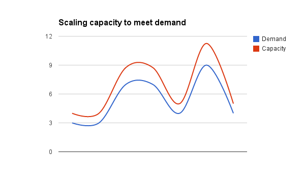

Notice that capacity adjusts dynamically to account for changes in demand. This configuration, sometimes referred to as elasticity in design, helps ensure that you're only paying for the compute resources your application needs at a specific moment in time.

### Resilience: designed to withstand the unexpected

A highly-available, or resilient, web application is one that continues to function despite expected or unexpected failures of components in the system. If a single instance fails or an entire zone experiences a problem, a resilient application remains fault tolerant—continuing to function and repairing itself automatically if necessary. Because stateful information isn’t stored on any single instance, the loss of an instance—or even an entire zone—should not impact the application’s performance.

A truly resilient application requires planning from both a software development level and an application architecture level. This document primarily focuses on the application architecture level.

Designing an application architecture for a resilient application typically involves:

- Load balancers to monitor servers and distribute traffic to servers that can best handle the requests
- Hosting servers in multiple data centers
- Configuring a robust storage solution

### Google Cloud Platform: flexible and cost-effective

Traditional architectures that support scalability and resilience often require significant investments in resources. With on-premises solutions, scalability often means deciding between over-spending on server capacity to handle peak usage, or purchasing only based on average need, risking poor application performance or user experience when traffic spikes. Resilience is more than just server capacity, however—location is also important. To mitigate the impact of physical events such as severe storms or earthquakes, you must consider operating servers in different physical locations, which comes at a significant cost.

Google Cloud Platform offers an alternative: a set of cloud services that provide you a flexible way of adding scalability and resilience to your architecture. In addition, Google Cloud Platform provides these services using a pricing structure that is easy for you to control.

## [arrow_upward](https://cloud.google.com/solutions/scalable-and-resilient-apps#top_of_page)Building resilient and scalable architectures with Google Cloud Platform

The following table shows how different Google Cloud Platform services map to the key requirements necessary to make applications scalable and resilient.

| Architecture Requirement | Google Cloud Platform Service |
| --- | --- |
| **Load balancing** | *[HTTP load balancing](https://cloud.google.com/compute/docs/load-balancing/http/)* |
| **Server hosting** | *[Google Compute Engine](https://cloud.google.com/compute/docs/)**[Regions and Zones](https://cloud.google.com/compute/docs/zones)* |
| **Server Management** | *[Instance groups](https://cloud.google.com/compute/docs/instance-groups/)**[Instance group manager](https://cloud.google.com/compute/docs/instance-groups/manager/)**[Autoscaler](https://cloud.google.com/compute/docs/autoscaler)* |
| **Data Storage** | *[Cloud SQL](https://cloud.google.com/sql/docs)**[Cloud Storage](https://cloud.google.com/storage/)* |

The following diagram shows how these Google Cloud Platform components work together to build a scalable, resilient web application. The role each component plays is described in more detail below.

 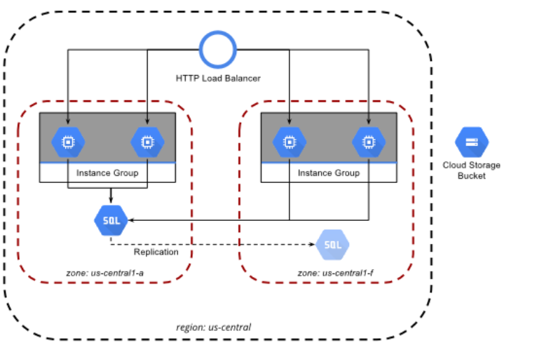

## [arrow_upward](https://cloud.google.com/solutions/scalable-and-resilient-apps#top_of_page)Overview of components

Each component in the example application architecture plays a role in ensuring the application is both scalable and resilient. This section briefly describes each of these services. Later sections show how each of these services work together.

### HTTP load balancer

The [HTTP load balancer](https://cloud.google.com/compute/docs/load-balancing/http/) exposes a single public IP address that customers use to access the application. This IP address can be associated with a DNS `A` record (e.g., example.com) or `CNAME` (e.g., www.example.com). Incoming requests are distributed across the instance groups in each zone according to each group’s capacity. Within the zone, requests are spread evenly over the instances within the group. Although the HTTP load balancer can balance traffic across multiple regions, we’re using it in a single region with multiple zones, as described in the next section.

### Zone

A [zone](https://cloud.google.com/compute/docs/zones) is an isolated location within a region. Zones have high-bandwidth, low-latency network connections to other zones in the same region. Google recommends deploying applications across multiple zones in a region.

### Instance

An [instance](https://cloud.google.com/compute/docs/instances) is a virtual machine hosted on Google’s infrastructure. You can install and configure these instances just like physical servers. In this document, you can use startup scripts and Chef to configure instances with the application server and code for the web application.

### Instance group and instance group manager

An [instance group](https://cloud.google.com/compute/docs/instance-groups/) is a collection of homogeneous instances that can be targeted by an HTTP load balancer. Instances are added to and removed from a group by an [instance group manager](https://cloud.google.com/compute/docs/instance-groups/manager/). An instance group and corresponding manager are required for each zone you want to run in.

### Autoscaler

The [Compute Engine Autoscaler](https://cloud.google.com/compute/docs/autoscaler) adds or removes Google Compute Engine instances to an instance group by interfacing with the group’s manager in response to traffic, CPU utilization, or other signals. In the example solution, the Autoscaler responds to the Request Per Second (RPS) metric of the HTTP load balancer. An Autoscaler is required for each instance group that you want scaled automatically.

### Cloud SQL

[Google Cloud SQL](https://cloud.google.com/sql/docs) is a fully managed MySQL database. Replication, encryption, patches, and backups are managed by Google. A Cloud SQL instance is deployed to a single zone, and data is replicated to other zones automatically. The Redmine application used in this example is compatible with MySQL and works seamlessly with Cloud SQL.

### Cloud Storage

[Cloud Storage](https://cloud.google.com/storage/) allows objects (usually files) to be stored and retrieved with a simple and scalable interface. In this solution, a Cloud Storage Bucket is used to distribute private SSL keys to the scalable Google Compute Engine instances, and is also used to store all files uploaded to the Redmine application, meaning no stateful information is stored on any instance’s disks.

## [arrow_upward](https://cloud.google.com/solutions/scalable-and-resilient-apps#top_of_page)Resilience

For this example architecture to be resilient, it needs to be able to automatically replace instances that have failed or have become unavailable. When a new instance comes online, it should:

- Understand its role in the system
- Configure itself automatically
- Discover any of its dependencies
- Start handling requests automatically

To replace a failed instance automatically you can use several Google Compute Engine components together:

- [Startup scripts](https://cloud.google.com/compute/docs/startupscript)
- [Instance group](https://cloud.google.com/compute/docs/instance-groups/)
- [Instance group manager](https://cloud.google.com/compute/docs/instance-groups/manager/)
- [Instance template](https://cloud.google.com/compute/docs/instance-templates)

A startup script runs when your instance boots up or restarts. You can use these scripts to install software and updates, to ensure that services are running within the virtual machine, or even install a configuration management tool like Chef, Puppet, Ansible, or Salt.

This scenario uses a startup script to install Chef Solo, which in turn will further configure instances to work with the application. To learn about how you can use startup scripts and Chef Solo to automatically configure instances, see [Appendix: Adding a New Instance](https://cloud.google.com/solutions/scalable-and-resilient-apps#appendix_adding_a_new_instance), at the end of this topic.

In addition to a startup script, you need to define a few more items before you launch a Google Compute Engine instance. For example, you need to specify its machine type, the operating system image to use, and any disks that you want to attach. You define these options using an [instance template](https://cloud.google.com/compute/docs/instance-templates).

Together, an instance template and a startup script define how to launch a Google Compute Engine instance and how to configure the software on that instance to fulfill a specific role in your application architecture.

 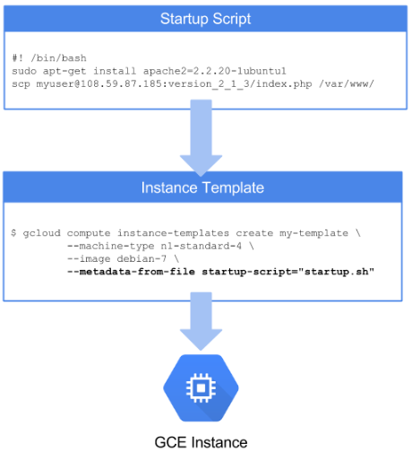

Of course, an instance template is just that—a template. To put this template to work, you need a way to apply that template to new Google Compute Engine instances as they come online. To accomplish this, you use the instance group manager. With this service, you determine the number of instances you want running at any given time, and what instance template you want applied to those instances. The instance group manager then is responsible for launching and configuring those instances as needed.

As the name implies, the instance group manager puts instances into an instance group. Instance groups allow you to manage a collection of instances as a whole, instead of changing each instance individually.

The following diagram shows how these components work together:

- Startup script
- Instance template
- Instance group manager
- Instance group

 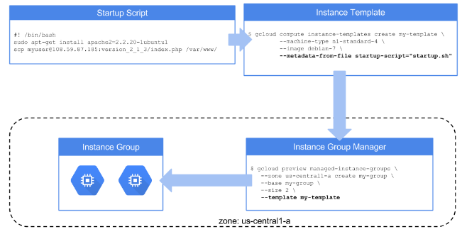

Notice the instance group manager and the instance group are *zone-specific resources*—they reside inside a single zone. To deploy your application across multiple zones, you have to create those resources in each zone. The instance template, on the other hand, is a project-level resource that can be reused across multiple instance group managers in any zone, in any region.

With startup scripts, instance templates, instance group manager, and instance groups, you now have a system that can replace unhealthy instances with new ones. In the next section, you'll see one way in which you can define what an unhealthy instance is and how to detect it.

### Health checks

At this point, the example application has almost all the tools it needs to be resilient. However, there is one piece missing—it needs a way of identifying instances that are unhealthy so it knows it should replace them.

This application is designed to have users connect to an appropriate, healthy instance using an HTTP load balancer. This architecture allows you to use two services to identify instances that are capable of serving requests:

- [Health checks](https://cloud.google.com/compute/docs/load-balancing/health-checks). An HTTP health check specifies the port and path to execute the health check against on each instance. The health check expects a 200 OK response from a healthy instance.
- [Backend services](https://cloud.google.com/compute/docs/load-balancing/http/backend-service). A backend service defines one or more instance groups that should receive traffic from a load balancer. The backend service specifies the port and protocol exposed by the instances (e.g., HTTP port 80), as well as the HTTP health check to be used against instances in the instance groups.

The following diagram shows the application architecture and how a backend service and HTTP health check relate to the load balancer and instance groups.

 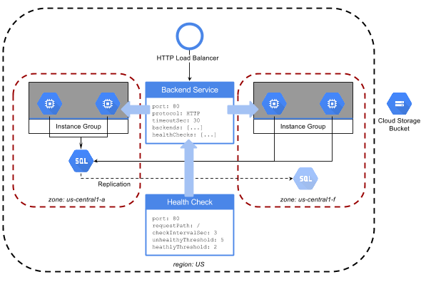

### Data resilience with Google Cloud SQL

The three main areas of any application architecture are networking, computing, and storage. The application architecture described here has covered the networking and computing components, but to be a complete it must also address the storage component.

This example solution uses [Google Cloud SQL](https://cloud.google.com/sql/docs) to provide a fully managed MySQL database. With Google Cloud SQL, Google manages replication, encryption, patch management, and backups automatically.

A Google Cloud SQL database is region-wide, which means data is replicated across the zones within a region. This is equivalent to taking a backup of any updates to your data as they happen. In the unlikely event of a complete failure of a zone, data will be preserved.

Cloud SQL allows you to choose between two replication types:

- **Synchronous replication**. With synchronous replication, updates are copied to multiple zones before returning to the client. This is great for reliability and availability in the event of major incidents, but makes writes slower.
- **Asynchronous replication**. Asynchronous replication increases write throughput by acknowledging writes once they are cached locally, but before copying the data to other locations. Asynchronous replication results in faster writes to the database because you don't have to wait for replication to finish; however, you might lose your latest updates in the unlikely event of a data center system failure within a few seconds of updating the database.

The Redmine application used in this solution uses synchronous replication, because the workload is not very write intensive. You should choose between synchronous and asynchronous replication depending on the specific write-performance and data durability requirements of your specific application.

## [arrow_upward](https://cloud.google.com/solutions/scalable-and-resilient-apps#top_of_page)Scalability

The previous sections have shown how the example application uses Google Cloud Platform to create a resilient application. But resiliency is not enough—scalability is also important. The application should work well for 1 user or 1,000,000 users, and its resources should increase or decrease with those users to be cost effective.

The idea that the application's resources can increase or decrease requires that it has:

- A means by which you can add or remove instances from service. You also need a way of deciding when an instance needs to be added, and when one should be removed. Google Cloud Platform's [Autoscaler](https://cloud.google.com/compute/docs/autoscaler/) solves this issue.
- A means of storing stateful data. Because instances can come and go, it is not advisable to store stateful data on those instances. The application architecture solves this for the relational data by storing it in a separate Cloud SQL instance, but it also needs to account for user-uploaded files. Google Cloud Storage fills this requirement.

The following sections describe how to use Autoscaler to scale the infrastructure running the Redmine application, and how to leverage Google Cloud Storage for uploaded files.

### Scale with Autoscaler

As use of the application ebbs and flows, it needs to be able to dynamically adjust the resources it requires. You can solve this challenge with Google Compute Engine Autoscaler.

When traffic or load rises, Autoscaler adds resources to handle the extra activity and removes resources when the traffic or load lowers to help you reduce costs. Autoscaler performs these actions automatically based on the scaling rules you define and without subsequent intervention on your part.

starFor details on how new instances are configured at launch, see [Appendix: Adding a New Instance](https://cloud.google.com/solutions/scalable-and-resilient-apps#appendix_adding_a_new_instance).

The impact of Autoscaler is twofold:

1. Your users get a great experience using your application, because there are always enough resources to meet demand.

2. You maintain better control over your costs, because Autoscaler removes instances when demand falls below a specified threshold.

Autoscaler can scale the number of virtual machines based on CPU utilization, serving capacity, or a [Stackdriver Monitoring metric](https://cloud.google.com/monitoring/api/metrics). This solution uses the [serving capacity metric](https://cloud.google.com/compute/docs/autoscaler/scaling-cpu-load-balancing#scaling_based_on_https_load_balancing_serving_capacity) to add or remove Google Compute Engine instances based on the number of requests per second (RPS) the instances are receiving from the load balancer. See [Batch Processing with Google Compute Engine Autoscaler](https://cloud.google.com/compute/docs/tutorials/batch-processing-with-autoscaler) to learn more about Autoscaler.

### Requests Per Second (RPS)

[Previous sections](https://cloud.google.com/solutions/scalable-and-resilient-apps#health_checks) described a single backend service that identifies the instance groups to receive traffic from the load balancer. For each of the instance groups associated with the backend service, this example solution also sets **balancingMode=RATE**. This property instructs the load balancer to balance based on the RPS defined in the **maxRatePerInstance** property, which is set to **100** for this example. This configuration means the load balancer attempts to keep each instance at or below 100 RPS. See the [documentation for backend services](https://cloud.google.com/compute/docs/reference/latest/backendServices) to learn more about the configuration properties of a backend service.

To scale on RPS, you need to create an Autoscaler for each instance group that you want scaled automatically. Remember that an instance group is a per-zone resource, so you need to create an Autoscaler in each zone.

 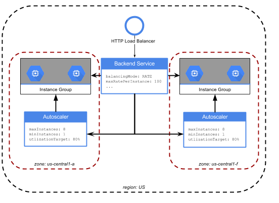

Each Autoscaler includes a `utilizationTarget` property that defines the fraction of the load balancer's maximum serving capacity that the Autoscaler should maintain. This example sets each Autoscaler’s `utilizationTarget` to 80% of the backend service’s maximum rate of 100 RPS for each instance. This means the autoscaler will scale once the RPS exceeds 80% of the maximum rate per instance, which is 80 RPS. The Autoscaler will scale down when RPS drops below that threshold.

 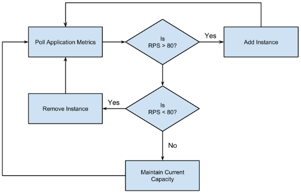

Each Autoscaler also defines a minimum and maximum number of instances that the Autoscaler will not breach.

### Handle file uploads

Part of the Redmine application’s functionality includes allowing users to upload and save files when logged in. The default behavior of Redmine and many other similar web applications is to store those files directly on local disk. This approach is fine if you have just one server with a well-defined backup mechanism. However, this is not the optimal approach when you have multiple, automatically scaled Google Compute Engine instances behind a load balancer. If a user uploads a file, there’s no guarantee that the next request will land on the machine where the files was stored. There's also no guarantee the Autoscaler won't terminate an unneeded instance that has files on it.

A better solution is to use Google Cloud Storage, which provides a centralized location perfect for storing and accessing file uploads from an automatically scaled fleet of web servers. Google Cloud Storage also exposes an API that is interoperable with Amazon S3 clients, making it compatible with existing application plugins for S3, including the [Redmine S3 plugin](https://github.com/ka8725/redmine_s3), without any modifications. Many third party and open source applications have plugins to support object stores like Google Cloud Storage. If you’re building your own application, you can use the Google Cloud Storage API directly to support storing files.

Here’s the flow for uploading (blue arrows) and retrieving (green arrows) files using Redmine and Google Cloud Storage:

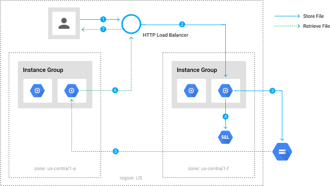

The process shown in the diagram is as follows:
1. The user POSTs the file from a web browser.
2. The load balancer chooses an instance to handle the request.
3. The instance stores the file in Google Cloud Storage.

4. The instance stores file metadata (such as the name, owner, and its location in Google Cloud Storage) in the Cloud SQL database.

5. When a user requests a file, the file is streamed from Google Cloud Storage to an instance.

6. The instances sends the stream through the load balancer.
7. The file is sent to the user.

### Storage capacity

In addition to removing stateful file uploads from Google Compute Engine instances and allowing them to scale dynamically, Google Cloud Storage provides redundant, durable storage for a virtually infinite number of file uploads. This storage solution is resilient, scalable, and cost-effective—you pay only for the storage that you use without worrying about capacity planning, and data is automatically stored redundantly across multiple zones.

## [arrow_upward](https://cloud.google.com/solutions/scalable-and-resilient-apps#top_of_page)Cost

So far, the application architecture described in this document shows how to build a resilient and scalable application using Google Cloud Platform. However, it's not enough to be able to build an app—you need to be able to build it in a way that is as cost-effective as possible.

This section demonstrates how the application architecture described in this document is not only resilient and scalable, but also highly cost effective. It starts by making some general assumptions about how heavily and frequently the application is used, and then convert those assumptions into a basic cost estimate. Keep in mind that these assumptions are just that—assumptions. Feel free to adjust these numbers as necessary to create a cost estimate that more closely matches the anticipated usage of your own applications.

### Compute

A primary concern for any application architecture is how much it costs to keep the servers running. This cost analysis uses the following assumptions:

| Metric | Value |
| --- | --- |
| Average page views per month | 20,000,000 |
| Average HTTP requests per month | 120,000,000 |
| Peak hours (90% or greater) of usage | 7:00am to 6:00pm Monday through Friday |
| Data transfer per page view | 100KB |
| Peak hours per month | 220 |
| Request rate during peak hours | 127 request/second (RPS) |
| Request rate during off-peak hours | 6 request/second (RPS) |

Based on these assumptions, you can figure out how many page views the application receives during the peak hours of 7:00am to 6:00pm Monday through Friday each month:

20,000,000 (views/ month) * 6 (requests/view) * 90% (occurring at peak hours) = **108,000,000**

On average, there are 22 work days each month. If each workday has 11 peak hours in it, then you need to provide enough compute resources to handle 242 peak hours each month.

Next, you need to figure out what type of Google Compute Engine instance can handle this type of traffic. This application architecture was tested using [gatling.io](http://gatling.io/) for basic load testing. The results of these tests determined that 4 Google Compute Engine instances of type `n1-standard-1` would be sufficient.

For non-peak hours, this solutions has a minimum of two `n1-standard-1` instances running.

To see how much it costs to run these instances, [check out the latest price estimates](https://cloud.google.com/products/calculator/#id=964d66ca-f86b-4f49-a9f2-c525eef1a5f0) on the Google Cloud Platform Pricing Calculator. When you do, notice that, in both cases, these instances automatically qualify for [Sustained Usage Discounts](https://cloud.google.com/compute/pricing#sustained_use).

### Load balancing and data transfer

This application provisioned a load balancer with a single Forwarding Rule, which is the public IP address that users connect to. That forwarding rule is billed on an hourly basis.

For data transfer estimates, consider a worst case scenario first. The load balancer charges for data *processed*, meaning both ingress and egress traffic are charged. Assuming that 99.5% of the 120,000,000 HTTP requests are users loading a Redmine project page. Loading a page counts for 1 `HTTP GET` request, which then causes 5 more `HTTP GET` requests to load other assets (CSS, images, and jQuery). Loading an entire page involves 6 HTTP requests. This results in:

- Approximately 20,000,000 complete page loads per month
- About 450KB of data transfer per page
- An approximate total 8,955GB of data processed by the load balancer each month

The other 0.5% of the 20,000,000 HTTP requests are `HTTP POST` requests to upload a file of average size (about .5MB), for an additional 500GB of data processed each month.

[This Google Cloud Platform Pricing Calculator estimate](https://cloud.google.com/products/calculator/#id=4019bcaa-1c67-4e7b-a2ec-21a33cc24bc8) shows the anticipated cost for the 9,495GB of data transfer the load balancer would handle in this scenario.

That data transfer estimate was a worst case scenario because it's serving all of the content—including static assets—on each request from a Google Compute Engine instance and through a load balancer, without the benefit of caching or a content delivery network (CDN). Of the roughly 450KB payload for each page load—and recall this solution is based on over 20M page loads each month—333KB of that is required to load jQuery. By simply updating one line of the application to load jQuery from [Google hosted libraries](https://developers.google.com/speed/libraries/devguide#jquery), you reduce data transfer by 74%.

[This updated price estimate](https://cloud.google.com/products/calculator/#id=b1d36813-7533-4049-9d5f-d64884421dd8) shows the savings in data transfer achieved by switching to the Google Hosted Libraries.

### Storage

This solution uses Google Cloud Storage for all files uploaded through the Redmine application. As described in the previous section, about 0.5% of this usage is to upload files, with each file averaging about .5MB in size. This means you can expect to see 1,000,000 new file uploads each month, resulting in 500GB of new storage each month. This solution also assumes 1,000,000 `HTTP PUT` operations each month to store new files, which is charged as a Class A operation.

[This price estimate from the Google Cloud Platform Pricing Calculator](https://cloud.google.com/products/calculator/#id=071c9475-add5-43f0-ab12-c0cf1ee6fc77) shows the anticipated cost for using Google Cloud Storage.

This architecture uses Cloud SQL to store all relational data for the application. Based on the example metrics described earlier, the **D2** database type with 1024MB RAM should provide sufficient capacity for the application workload, and will be running 24 hours a day, 7 days a week. As this database will likely see heavy utilization, choose the "Heavy" option for I/O Operations in the calculator. A test for this example architecture was made by inserting 100,000 documents, the results of which determined that a 50GB disk will support over 100,000,000 documents, allowing the database to support more than 8 years of use at the described rate.

[Here is an estimate from the Google Cloud Platform Pricing Calculator](https://cloud.google.com/products/calculator/#id=a13ddc79-4d1c-4a08-a9bc-0436a2201c37) that shows the anticipated cost for this part of the architecture costs.

## [arrow_upward](https://cloud.google.com/solutions/scalable-and-resilient-apps#top_of_page)Deploying the example solution

To deploy the example application described in this solution, visit the GitHub repository, [Scalable and Resilient Web Application on Google Cloud Platform](https://github.com/GoogleCloudPlatform/scalable-resilient-web-app).

## [arrow_upward](https://cloud.google.com/solutions/scalable-and-resilient-apps#top_of_page)Appendix: Adding a new instance

As part of your efforts to create a resilient and scalable application architecture, you need to decide on how you want to add new instances. Specifically, you need to determine how to automatically configure new instances as they come online.

In this section, you'll look at a few of the available options.

### Bootstrapping software installation

To serve a user’s web request each instance needs some additional software installed on top of the base operating system, along with configuration data, which includes data such as the database connection info, the name of the Google Cloud Storage bucket that files will be stored in, and so on. If you imagine these components as layers, you can visualize the entire stack that will run on each instance:

 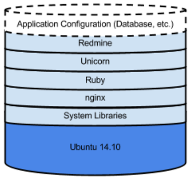

This solution uses an instance template, which specifies the [Google Compute Engine Image](https://cloud.google.com/compute/docs/images) that instances use when launched. Specifically, this solution uses the [Ubuntu 14.10 image](https://cloud.google.com/compute/docs/operating-systems/linux-os#ubuntu) developed and supported by Canonical. Because this is the base operating system image, it doesn’t include any of the specific software or configuration required by the application.

To get the rest of the stack automatically installed when a new instance comes up, you can use a combination of [Google Compute Engine startup-scripts](https://cloud.google.com/compute/docs/startupscript) and [Chef Solo](https://docs.chef.io/chef_solo.html) to bootstrap at launch time. You can specify a startup script by adding a `startup-script` metadata attribute item to an instance template. A startup script runs when the instance boots up.

This startup script:
1. Installs the Chef client.

2. Downloads a special Chef file called `node.json`. This file tells Chef which specific configuration to run for this instance.

3. Runs Chef and lets it take care of the detailed configuration.
Here is the startup script in its entirety:
hdr_strong
content_copy

`#! /bin/bash[[NEWLINE]][[NEWLINE]]# Install Chef[[NEWLINE]]curl -L https://www.opscode.com/chef/install.sh | bash[[NEWLINE]][[NEWLINE]]# Download node.json (runlist)[[NEWLINE]]curl -L https://github.com/googlecloudplatform/... > /tmp/node.json[[NEWLINE]][[NEWLINE]]# Run Chef[[NEWLINE]]chef-solo -j /tmp/node.json -r https://github.com/googlecloudplatform/...[[NEWLINE]]`

*Note: A discussion of how Chef works is beyond the scope of this solution. All recipes and cookbooks are open source and available at [Scalable and Resilient Web Application on Google Cloud Platform](https://github.com/GoogleCloudPlatform/scalable-resilient-web-app). Although this example uses Chef for the initial release of this solution, other configuration providers will be added in the future, and pull requests at this solution’s GitHub repository are welcome for other implementations if you have them*.

#### Providing application configuration

After a new instance boots and configures itself using the startup script and Chef, it needs to know some information before it can begin servicing requests. In this example, each instance needs to know database connection info (such as the hostname, username, and password) as well as the name of the Google Cloud Storage bucket to use and credentials to connect with.

Every Google Compute Engine instance has metadata attributes associated with it that you can define. Earlier, you learned about adding the special `startup-script` metadata attribute, but you can also add arbitrary key=value pairs. Here you can specify attributes in the instance template to include the configuration data the instances need to connect to the database and Google Cloud Storage bucket.

Here’s what the metadata for an instance template looks like from the Cloud Platform Console:

 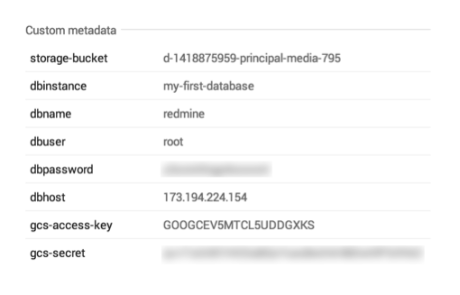

Chef uses a tool called [Ohai](https://docs.chef.io/ohai.html) to parse these bits of configuration information from the instance’s metadata, populating templates to create the configuration files the application needs. Here’s the template that creates the `database.yaml` file containing the database connection info, accessing the appropriate metadata items automatically:

hdr_strong
content_copy

`production:[[NEWLINE]]    adapter: mysql2[[NEWLINE]]    database: <%= node['gce']['instance']['attributes']['dbname'] %>[[NEWLINE]]    host:     <%= node['gce']['instance']['attributes']['dbhost'] %>[[NEWLINE]]    username: <%= node['gce']['instance']['attributes']['dbuser'] %>[[NEWLINE]]    password: <%= node['gce']['instance']['attributes']['dbpassword'] %>[[NEWLINE]]...[[NEWLINE]]`

You can also manually access metadata values from within an instance by using the local metadata service. Here you can use `curl` to retrieve the database password:

hdr_strong
content_copy

`curl "http:/metadata.google.internal/computeMetadata/v1/instance/attributes/dbpassword" -H "Metadata-Flavor: Google"[[NEWLINE]]`

#### Performance and dependency considerations

The bootstrapping approach taken in this solution involves starting with a default operating system image, installing all software at launch time with Chef, and using instance metadata to provide app config data.

 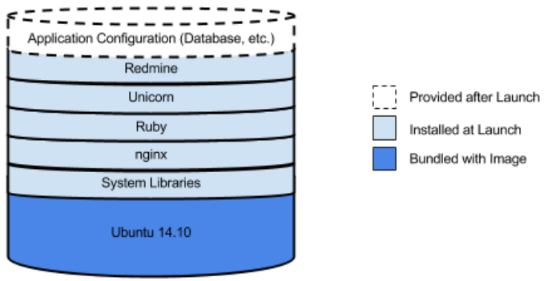

An advantage of this approach is that the system’s configuration is specified in a Chef cookbook. The cookbook can be version controlled, shared, and used to provision virtual machines locally for testing, using Vagrant or Docker, or to configure servers in your data center or with different cloud providers. Image management is also simplified: in this case of this example application, you only need to track the one base OS image the application uses.

Some disadvantages to consider include potentially slow launch times, as all software is being downloaded and installed—in some cases requiring compilation. It is also important to consider dependencies this method introduces: in this example, Chef installed a number of packages from apt, Rubygems, and GitHub. If any of those repositories are unavailable while a new instance is starting up, its configuration will fail.

#### Custom images and bootstrapping

Because [you can create your own custom images](https://cloud.google.com/compute/docs/images) with Google Compute Engine, installing everything at launch time isn’t the only approach to bootstrapping. For example, you might:

1. Launch a base Ubuntu 14.10 image.
2. Install everything *except* the Redmine app (Ruby, nginx, and so on).
3. Create an image from the result.
4. Use that image in the instance template.

Now when a new instance is launched, it only needs to install Redmine. Boot time is improved and you've reduced the number of external package dependencies.

 

You could take the custom image approach even further and bake absolutely **everything** into an image, including all dependencies, application source, and configuration. This has the advantage of fastest boot time and zero external dependencies, but now if **anything at all** changes in your application, you have to create a new image and update the instance template.

 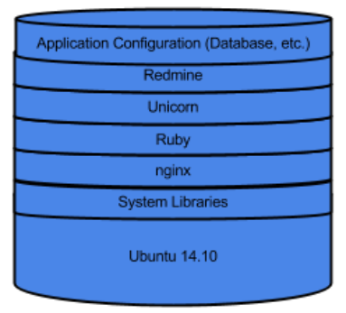

Consider the approaches to bootstrapping an instance as being on a continuum. More configuration at launch time means slower boot times but fewer images to manage. More configuration baked into a custom image means faster boot times and fewer dependencies, but potentially many more images to manage. For most customers, the right approach is a compromise somewhere in the middle. Choose what makes sense for you and your application.

 

Was this page helpful? Let us know how we did:
star_border
star_border
star_border
star_border
star_border

Except as otherwise noted, the content of this page is licensed under the [Creative Commons Attribution 3.0 License](http://creativecommons.org/licenses/by/3.0/), and code samples are licensed under the [Apache 2.0 License](http://www.apache.org/licenses/LICENSE-2.0). For details, see our [Site Policies](https://developers.google.com/terms/site-policies). Java is a registered trademark of Oracle and/or its affiliates.

Last updated March 21, 2017.