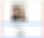
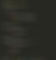

Building Your First React.js App – Learning New Stuff – Medium

This tutorial is suitable from age 3. Credit: [Donnie Ray Jones](https://www.flickr.com/photos/donnieray/)

# Building Your First React.js App

## The easiest way to get started with the popular Javascript library

This article will take you through **every step** of building the simplest React app possible. Even simpler than a to-do list.

Why so simple? Because I’ve found that when I’m trying to learn a new technology, even the simplest features can add unnecessary complexity.

> If you’ve never tried React before, this tutorial is for you.

There are** no pre-requisites **other than basic Javascript and HTML skills. Though if you’d like to read some basic theory before getting started with the coding, you can read the article below and then return.

[**Learn React.JS in 8 Minutes** *React.JS is a Javascript library for building user interfaces. It’s fast, easy to learn and fun to work with.*medium.com](https://medium.com/p/92a1ef023003)[(L)](https://medium.com/p/92a1ef023003)

### Looking at the final project

To claim you’ll be building an app is actually an exaggeration. It’s only a profile page, as you can see below. (The image is taken randomly from http://lorempixel.com/)

#### Step 1: Splitting the page into components

React is built around **components; **everything you see on the page is a part of a component. Before we start coding, it’s a good idea to create a sketch of the components, as we’ve done above.

The main component — which wrap all other components — is marked in red. We’ll call this one *App*.

Once we’ve figured out that *App* is our main component, we’ll need to ask ourselves: which direct children does *App *have?

I’d argue that the name and the profile image can be grouped into one component, which we’ll call *Profile *(green rectangle)*, *and the *Hobbies* section can be another component (blue rectangle).

The structure of our components can also be visualized like this:

- App
- Profile
- Hobbies

> We could split the component further; like ProfileImage and HobbyItem, though we’ll stop here for the sake of simplicity.

#### Step 2: Hello World

Before you begin coding, you’ll need to download the source file. It’s available at [this GitHub repo.](https://github.com/perborgen/YourFirstReactProject) Simply copy or clone it and open the *index.html* file in the browser. (The full code is available in the *finished_project.html* file.)

I’ve setup the file properly, so you’ll see links to the React source and the other necessary libraries in the <head/> section of the file. Your code will start at line 12.

> For a proper React project you wouldn’t use this toy setup. But I don’t want this tutorial to be about anything else than coding in React, so we’ll keep it simple.

Let’s write our first component:

As you can see on the first line, we create a component be calling the *createClass* method on the React object.

We pass in one parameter, the so called **specification object.** This object can have as many methods you want, though the most important one is the *render *method. In the *render *method, you’ll return what you want React to draw on the page. In our case, we simply want a *div *tag with the text “Hello World”.

Then follow up this:

This is how we specify where on the page we want the *App *component to be rendered. This is done by calling *ReactDOM.render, *passing in the *App* component as the first argument and a reference to a *div* with the id of *content *as the second. **Our entire app** will go into this *content div.*

> This syntax might seem a bit weird: we’re taking a Javascript variable (*> App*> ) and turn it into what looks like an HTML/XML tag. **> This is called JSX. **> Read more about JSX in the > [> React.js in 8 minutes article.](https://medium.com/learning-new-stuff/learn-react-js-in-7-min-92a1ef023003#.b2tr5yuzz)

Refresh the page and you’ll see ‘Hello World’ printed out on the screen.

#### Step 3: More components

Let’s add some more components. Looking back at our component overview, we see that the *App* component has got two children called *Profile* and *Hobbies*.

Let’s write out these two components. We’ll begin with *Profile:*

There is actually nothing new here. Just a bit more content i the return statement than it was in *App.*

Let’s write the *Hobbies* component:

If you refresh the page again though, you won’t see any of these components.
This is because only the *App *component has been rendered into the DOM.

We’ll need to modify the *App *component in order to actually turn *Profile* and *Hobbies* into *App’s* children.

This is what we’ll need to do:

If you refresh the page again you’ll see that all the content appears on the page. (Though the image wont appear, as we’ve only added a dummy link to it).

#### Step 4: Get the data

Now that we have the basic structure setup, we’re ready to add the correct data to our project.

React has something called a **one directional data flow**, meaning that the data is passed down from parent to child components.

Above all the components, paste in the following code:
var DATA = {
name: 'John Smith',
imgURL: 'http://lorempixel.com/200/200/',
hobbyList: ['coding', 'writing', 'skiing']
}
You can imagine this data being fetched from an API of something.

The next thing you’ll need to do is add this data to the *App *components as its **props.**

> Data in React is either handled as **> props**>  or **> state. **> We’re only going to care about **> props **> in this tutorial. In general, **> props**>  is immutable and can be shared across components, while **> state**>  is mutable and private. This is better explained in > [> this article.](https://medium.com/learning-new-stuff/learn-react-js-in-7-min-92a1ef023003#.b2tr5yuzz)

Below, you’ll see how you pass the data into the *App *component, by simply changing a little bit on the *ReactDOM.render* method. It’s similar to how you’d add attributes in normal HTML.

The curly bracket tells React that we’re escaping out of the JSX syntax in order to add a Javascript expression (DATA).

Now we’re able to access this data from within the *App *component through *this.props.profileData. *However, the App component is simply a wrapper around the *Profile* and *Hobbies* components, so we’re going to send the data further down the hierarchy, using the same technique as described above.

This is how we pass the data from App to its children:

We’re passing down the *profileImage* and *name* to the *Profile* component, while only the *hobbyList* array down to the *Hobbies* component. This is because the *Hobbies* component doesn’t need the rest of the data; it’s simply going to display a list of hobbies.

Let’s look at how we’ll need to rewrite the *Profile* component order to use the data we’ve passed down to it:

We simply escape out of the JSX syntax by curly brackets and fetch the data from *this.props.*

In the Hobbies component we’ll need to use a technique for looping through the of hobbies.

As you can see, we’re looping through the hobbies array stored in *this.props.hobbies.* We’re using the array prototype method [map](https://developer.mozilla.org/en-US/docs/Web/JavaScript/Reference/Global_Objects/Array/map), which creates a new array based on whatever we return within the callback function.

> Notice that we’re creating a **> key**>  attribute, an giving it the value **> index**> . This has to be a unique key for each element, as React needs it to properly keep track of the elements we created dynamically. However, don’t use the **> index**>  if the mapped results might change, as it’ll be prone to bugs. It’ll work fine in this scenario though, so we’ll use it for the sake of simplicity.

Once we’ve stored all the list elements in the *hobbies *variable, we simply add it to the return statement, so it’ll be rendered out on the screen.

This is the full code:

Congrats, you’ve just built your first React.js project!

#### And be sure to follow me here on Medium if you liked this article!