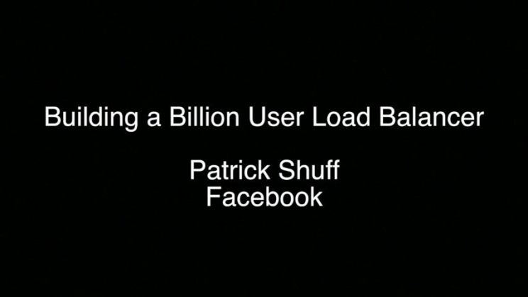

Building a Billion User Load Balancer | USENIX

# Building a Billion User Load Balancer

Wednesday, December 7, 2016 - 11:00am–11:45am
Patrick Shuff, Facebook

## Open Access Content

USENIX is committed to Open Access to the research presented at our events. Papers and proceedings are freely available to everyone once the event begins. Any video, audio, and/or slides that are posted after the event are also free and open to everyone. [Support USENIX](https://www.usenix.org/annual-fund) and our commitment to Open Access.

BibTeX
Abstract:

Want to learn how Facebook scales their load balancing infrastructure to support more than 1.3 billion users? We will be revealing the technologies and methods we use to global route and balance Facebook's traffic. The Traffic team at Facebook has built several systems for managing and balancing our site traffic, including both a DNS load balancer and a software load balancer capable of handling several protocols. This talk will focus on these technologies and how they have helped improve user performance, manage capacity, and increase reliability.

#### Presentation Video

[Download Video](https://2459d6dc103cb5933875-c0245c5c937c5dedcca3f1764ecc9b2f.ssl.cf2.rackcdn.com/lisa16/shuff.mp4)

#### Presentation Audio

     [MP3 Download](https://2459d6dc103cb5933875-c0245c5c937c5dedcca3f1764ecc9b2f.ssl.cf2.rackcdn.com/lisa16/shuff.mp3)

[Download Audio](https://2459d6dc103cb5933875-c0245c5c937c5dedcca3f1764ecc9b2f.ssl.cf2.rackcdn.com/lisa16/shuff.mp3)

- [Log in](https://www.usenix.org/user/login?destination=comment/reply/199773%23comment-form) or    [Register](https://www.usenix.org/user/register?destination=comment/reply/199773%23comment-form) to post comments

LISA16 Open Access Sponsored by Bloomberg