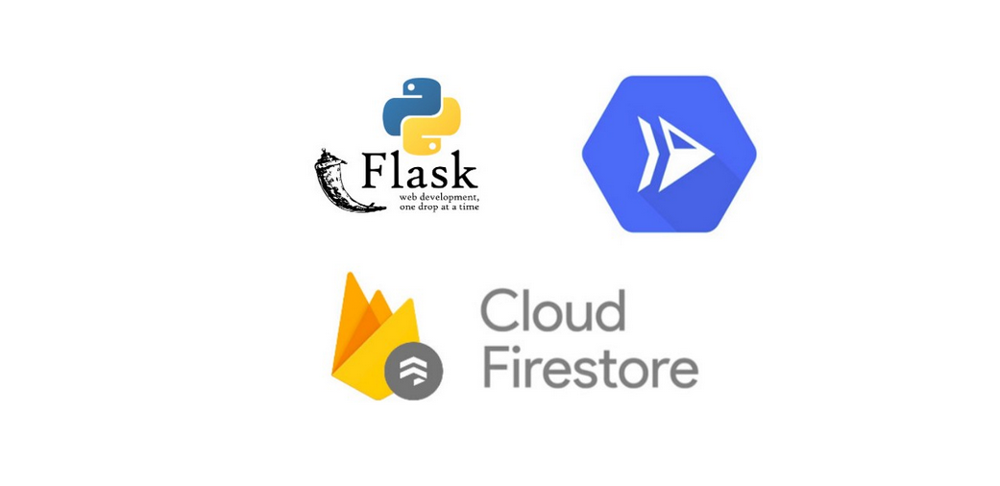
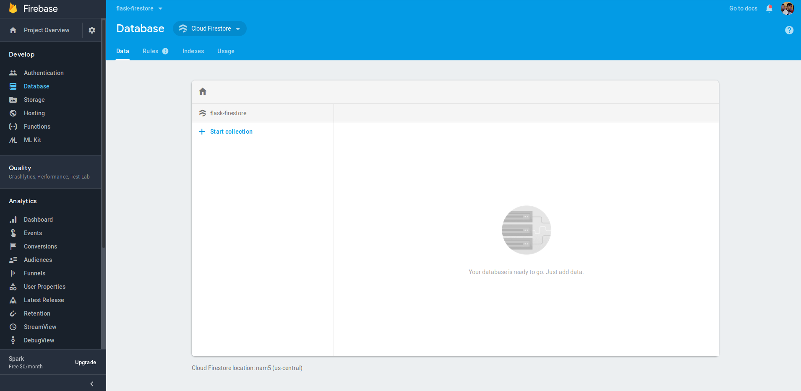
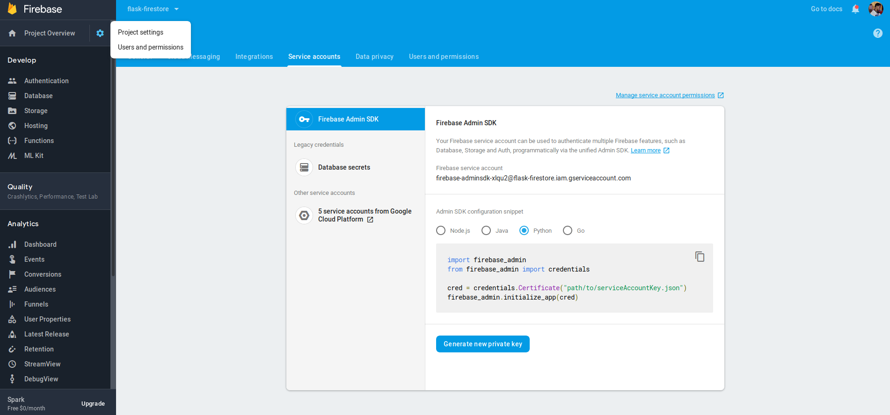
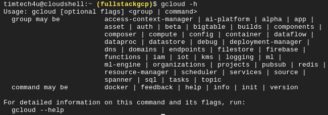
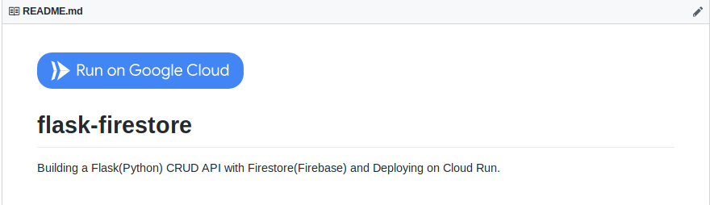

Building a Flask(Python) CRUD API with Cloud Firestore(Firebase) and Deploying on Cloud Run.

# Building a Flask(Python) CRUD API with Cloud Firestore(Firebase) and Deploying on Cloud Run.

[Timothy](https://medium.com/@timtech4u?source=post_page-----29a10c502877----------------------)

[Aug 29, 2019](https://medium.com/google-cloud/building-a-flask-python-crud-api-with-cloud-firestore-firebase-and-deploying-on-cloud-run-29a10c502877?source=post_page-----29a10c502877----------------------) · 5 min read

*> In this tutorial, you will build a CRUD (Create, Read, Update, Delete) API to manage ****> Todo Lists****>  using Flask (a microframework for Python), Cloud Firestore (a flexible, scalable database for mobile, web, and server development from Firebase) and deploy the API to *> [*> Cloud Run*](https://cloud.google.com/run/)*>  (a serverless environment to run containers on Google Cloud Platform).*

[Cloud Firestore](https://firebase.google.com/docs/firestore) stores data as collections of documents, it also features richer, faster queries and scales further than the [Realtime Database](https://firebase.google.com/docs/database).

You would be able to manage *Todo List* documents of varying fields via the API.

# Requirements

- [Python3.7](https://www.python.org/downloads/)
- [Flask](https://github.com/pallets/flask)
- [Firebase Admin Python SDK](https://github.com/firebase/firebase-admin-python)

# Before you begin

[Create a new Firebase project](https://console.firebase.google.com/), or use an existing one.

- Click on **Database** and **Create database** in the Cloud Firestore section.
- Set your [Security Rules](https://firebase.google.com/docs/firestore/security/get-started) and [Location](https://firebase.google.com/docs/projects/locations)
- You should have an initial screen similar to:

Download your Firebase Service Account Key

- Click on the **Settings Icon** at the top of your dashboard
- Click on the **Service Account** Tab
- Select **Python** option for **Admin SDK configuration snippet** and Click on **Generate new private key** and save it as `**key.json**`

[Create a new Google Cloud Platform (GCP) project](https://console.cloud.google.com/project?_ga=2.69989718.-735545701.1566156833), or use an existing one (you would need this to deploy to Cloud Run)

- Install [Cloud SDK](https://cloud.google.com/sdk/) or use Cloud Shell available on the Googl
- (Optional) To set up Continuous Deployment check out [this](https://fullstackgcp.com/simplified-continuous-deployment-on-google-cloud-platform-bc5b0a025c4e)
- Ensure you can run `**gcloud -h**` on your shell.

# Source Code

Time to write some codes.

# app.py# Required Imports

import os
from flask import Flask, request, jsonify

from firebase_admin import credentials, firestore, initialize_app# Initialize Flask App

app = Flask(__name__)# Initialize Firestore DB
cred = credentials.Certificate('key.json')
default_app = initialize_app(cred)
db = firestore.client()
todo_ref = db.collection('todos')
@app.route('/add', methods=['POST'])
def create():
"""
create() : Add document to Firestore collection with request body
Ensure you pass a custom ID as part of json body in post request
e.g. json={'id': '1', 'title': 'Write a blog post'}
"""
try:
id = request.json['id']
todo_ref.document(id).set(request.json)
return jsonify({"success": True}), 200
except Exception as e:
return f"An Error Occured: {e}"
@app.route('/list', methods=['GET'])
def read():
"""
read() : Fetches documents from Firestore collection as JSON
todo : Return document that matches query ID
all_todos : Return all documents """
try:

# Check if ID was passed to URL query

todo_id = request.args.get('id')
if todo_id:
todo = todo_ref.document(todo_id).get()
return jsonify(todo.to_dict()), 200
else:
all_todos = [doc.to_dict() for doc in todo_ref.stream()]
return jsonify(all_todos), 200
except Exception as e:
return f"An Error Occured: {e}"
@app.route('/update', methods=['POST', 'PUT'])
def update():
"""
update() : Update document in Firestore collection with request body
Ensure you pass a custom ID as part of json body in post request
e.g. json={'id': '1', 'title': 'Write a blog post today'}
"""
try:
id = request.json['id']
todo_ref.document(id).update(request.json)
return jsonify({"success": True}), 200
except Exception as e:
return f"An Error Occured: {e}"
@app.route('/delete', methods=['GET', 'DELETE'])
def delete():
"""
delete() : Delete a document from Firestore collection """
try:

# Check for ID in URL query

todo_id = request.args.get('id')
todo_ref.document(todo_id).delete()
return jsonify({"success": True}), 200
except Exception as e:
return f"An Error Occured: {e}"
port = int(os.environ.get('PORT', 8080))
if __name__ == '__main__':
app.run(threaded=True, host='0.0.0.0', port=port)

There are individual methods and routes for each action the API would perform, you can improve upon the code snippet and add more functions to meet your needs. For each CRUD (Create, Read, Update, Delete) action, we define the route and its corresponding [HTTP Method](https://developer.mozilla.org/en-US/docs/Web/HTTP/Methods). We also try to perform that action and return a response with the 200 status code, if there’s a problem somewhere, we return the exception’s error.

# Deploy to Cloud Run

We would have to write a **Dockerfile** for our API so as to be able to build it as a container and have it run on Cloud Run.

# Dockerfile

FROM python:3.7-stretch
RUN apt-get update -y
RUN apt-get install -y python-pip python-dev build-essential
COPY . /app
WORKDIR /app
RUN pip install -r requirements.txt
ENTRYPOINT ["python"]
CMD ["app.py"]
Ensure that you have a **requirements.txt** file with the following contents.

# requirements.txt

flask
firebase_admin

Finally, our **cloudbuild.yaml** file which you will use to trigger builds needs to be created as follows.

# cloudbuild.yaml

steps:

# build & push the container image

- name: "gcr.io/kaniko-project/executor:latest"

args: ["--cache=true", "--cache-ttl=48h", "--destination=gcr.io/$PROJECT_ID/todo:latest"]

# Deploy container image to Cloud Run

- name: "gcr.io/cloud-builders/gcloud"

args: ['beta', 'run', 'deploy', 'todo', '--image', 'gcr.io/$PROJECT_ID/todo:latest', '--region', 'us-central1', '--allow-unauthenticated', '--platform', 'managed']

In addition, you can also import your `**key.json**` Firebase service account file into the same directory as it is not advisable to have it pushed to your source repository. A fast approach to this is to add an additional Cloud Build step that downloads the service account from a private location such as a Google Cloud Storage Bucket.

# Execute Build & Deploy Steps on Cloud Shell

Run the following command to build your Docker container and push to Container Registry as specified in the **cloudbuild.yaml** file. This also performs an extra step of deploying to Cloud Run.

gcloud builds submit --config cloudbuild.yaml .

# Deploy using Cloud Run Button

Recently, Google Cloud announced [Cloud Run Button](https://cloud.google.com/blog/products/serverless/introducing-cloud-run-button-click-to-deploy-your-git-repos-to-google-cloud), an image and link you can add to the README of your source code repositories to allow others to deploy your application to Google Cloud Platform using Cloud Run. The steps to add the Cloud Run Button to your repository are:

- Copy & paste this markdown into your `**README.md**` file

- Replace `**YOUR_HTTP_GIT_URL**` with your HTTP git URL, like: `[**https://github.com/Timtech4u/flask-firestore.git**](https://github.com/Timtech4u/flask-firestore.git)`
- Ensure that your repository has a `**Dockerfile**`

# Cleaning up

To prevent unnecessary charges, clean up the resources created for this tutorial, delete the resources or projects used (if you created a new project).

# Useful Links

- [Source Codes on GitHub](https://github.com/Timtech4u/flask-firestore)
- [Flask Documenation](https://flask.palletsprojects.com/en/1.1.x/)
- [Cloud Firestore Documentation](https://firebase.google.com/docs/firestore)
- [Cloud Run Documentation](https://cloud.google.com/run/docs/)
- [Cloud Build Documentation](https://cloud.google.com/cloud-build/docs/)

*Thanks for reading through! Let me know if I missed any step, if something didn’t work out quite right for you or if this guide was helpful.*

[Originally posted on FullStackGCP](https://fullstackgcp.com/building-a-flaskpython-crud-api-with-cloud-firestorefirebase-and-deploying-on-cloud-run-cjzwbwvid000fpxs10npcr2ps)