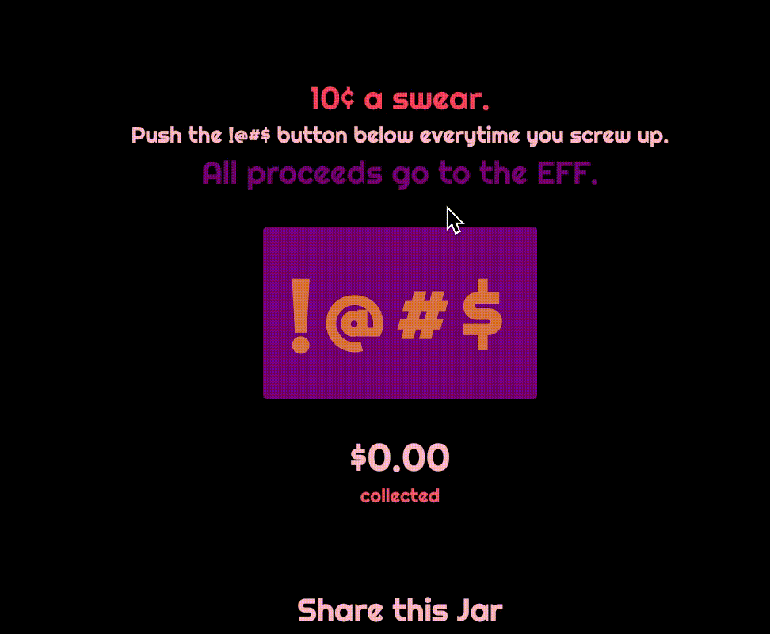
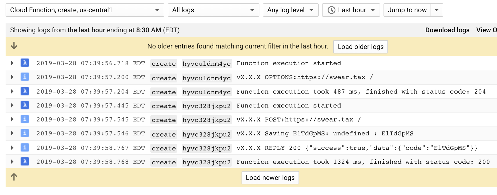
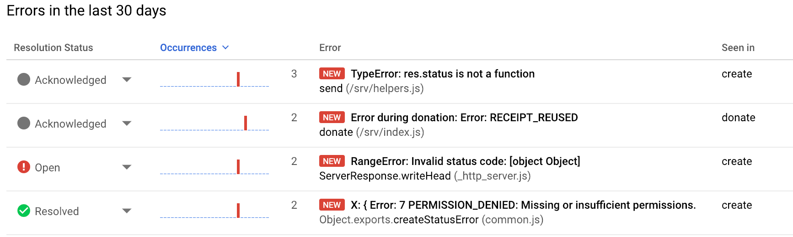
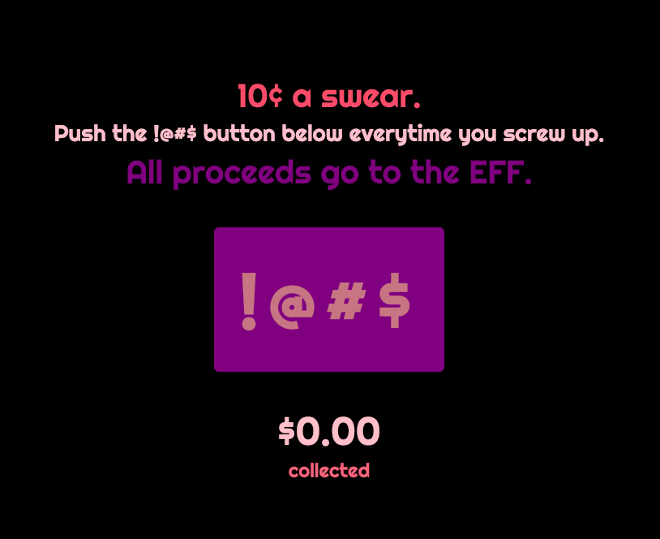
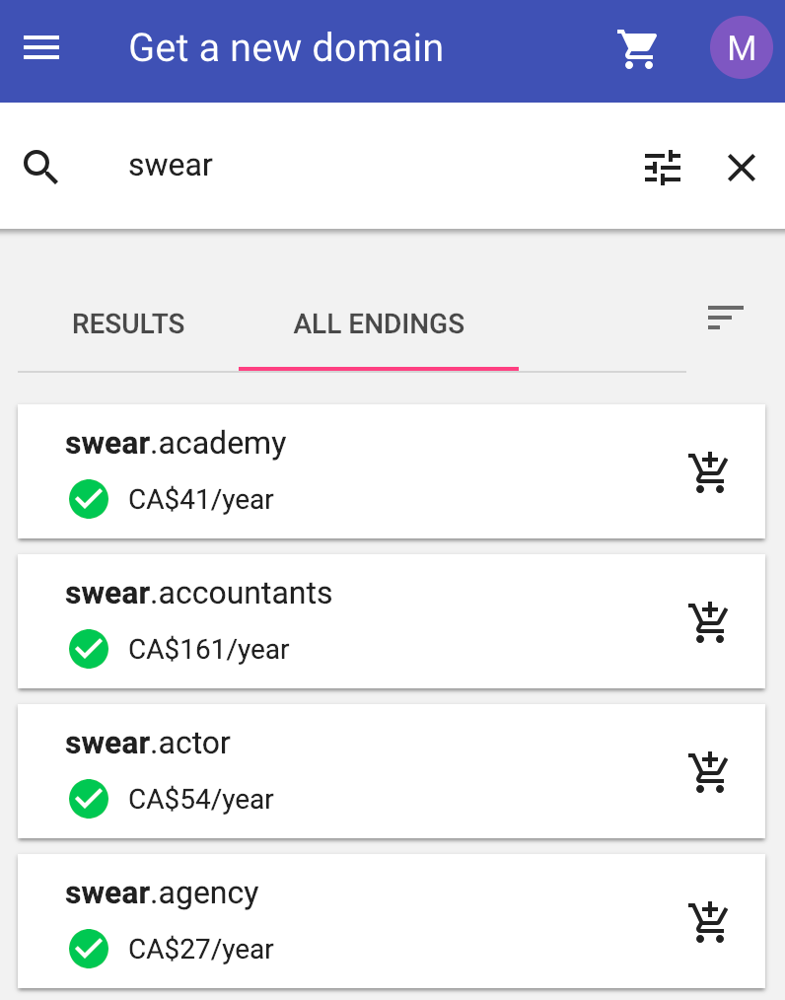
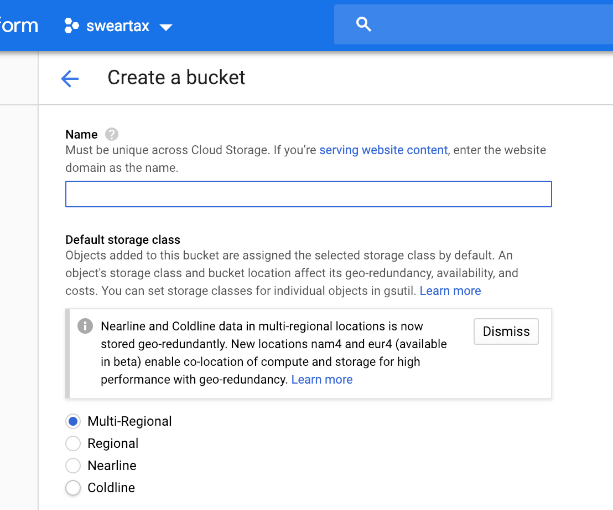
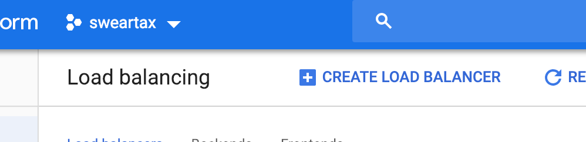
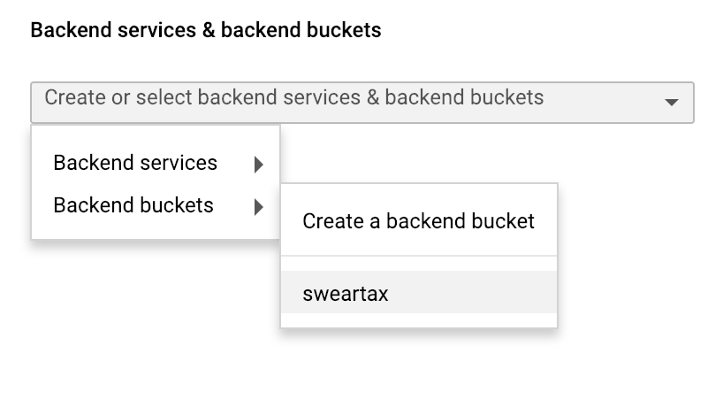
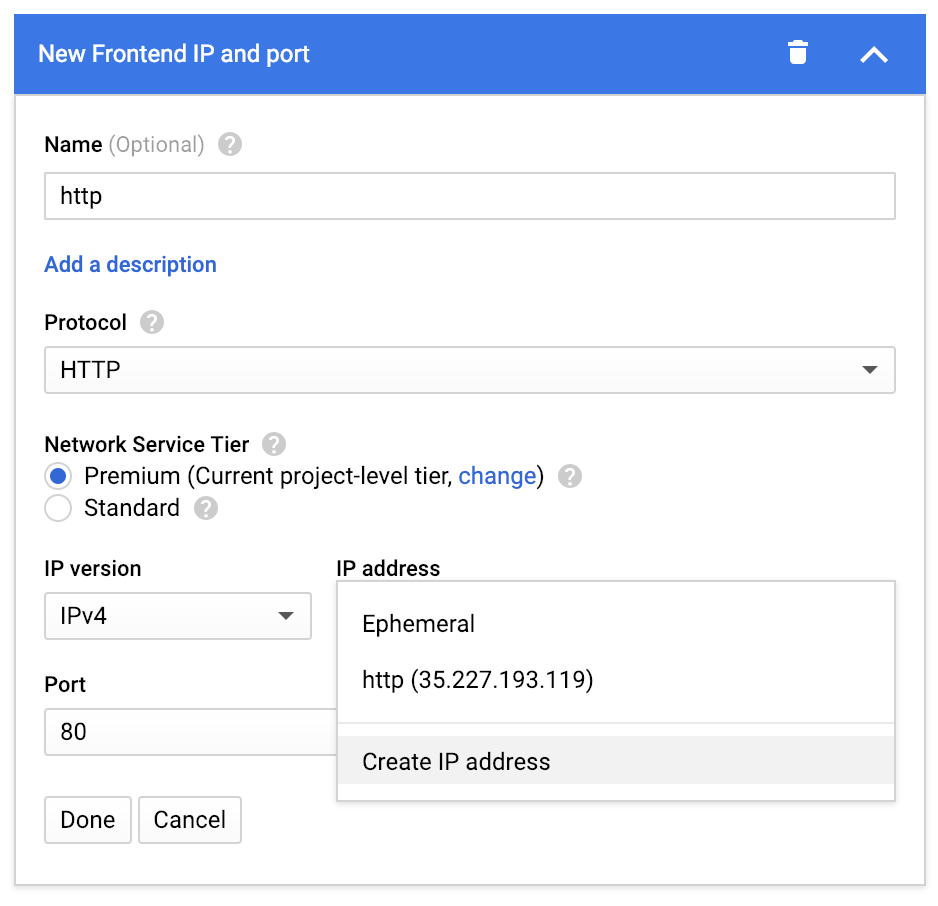
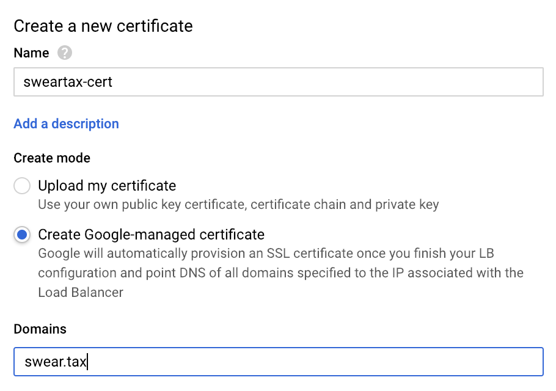

Building a Reliable Serverless Application in a Weekend

# Building a Reliable Serverless Application in a Weekend

[Mohit Cheppudira](https://blog.quid.works/author/mo/)April 01, 2019

- [**](https://www.facebook.com/sharer/sharer.php?u=https://blog.quid.works/building-a-serverless-penny-jar-in-a-weekend/)
- [**](https://twitter.com/share?text=Building%20a%20Reliable%20Serverless%20Application%20in%20a%20Weekend&url=https://blog.quid.works/building-a-serverless-penny-jar-in-a-weekend/)
- [**](http://www.linkedin.com/shareArticle?mini=true&url=https://blog.quid.works/building-a-serverless-penny-jar-in-a-weekend/&title=Building%20a%20Reliable%20Serverless%20Application%20in%20a%20Weekend)

I spent last weekend on a fun experiment. Part of it was to see how quickly I could get a toy project off the ground **that is also robustly built**, and part of it was to implement a cool micropayments idea that a friend pitched to me.

### Concept

The idea was simple – a digital swear jar into which someone could throw 10¢ every time they uttered something... erm... unsavoury.

To see the swear jar in action, try out the demo at [https://swear.tax](https://swear.tax/).

### Goals

For me, the interesting challenge was making it robust, ***quickly***. As a former [SRE](https://en.wikipedia.org/wiki/Site_Reliability_Engineering), I'm always thinking about the multitude of ways software can fail, and how hard it is to build something truly reliable. (Of course, there's no need for a toy project to be very reliable – part of the experiment is to figure out ***how much reliability I can amass in a weekend***.)

After spending just a little bit of time on it, I was quite surprised at how far one could get, as if almost for free, using just the right set of tech. **I had to write about it.**

### Caveat Emptor

This is a long post. I tried hard to minimize boilerplate and fluff, and focus on the the aspects I think provide the most value. You can find all the code for this experiment in the Github repositories: [[backend](https://github.com/0xfe/pennyjar)] [[frontend](https://github.com/0xfe/sweartax)].

Also, there are a lot of aspects to reliability: security, availability, durability, latency, etc. **Each of these aspects are deep and complex** on their own, and the experiment here is by no means all-encompassing.

All this said, **by the end of this post**, we end up with a system that:

- Automatically **scales** with load.
- **Replicates** data durably, and accounts for transactions consistently.
- Serves assets over a global **content delivery network** (CDN.)
- Connections are **TLS-encrypted** and static assets are **gzip-encoded**.
- Supports **hitless updates** of server-side code.
- Accepts and **processes micropayments**, validates signatures, and protects against request forgery.
- Sends **logs to a centralized database** that lets you stream, query, filter, and alert on your logs in realtime.
- Has **realtime error management** built-in: i.e, notifies you on errors, and integrates with your ticketing system.

Not too shabby... *hopefully*.

### Tools of the Trade

To get all of the above to work, we're going to make heavy use of Google Cloud . Why? Because it's what I know, and because it's what we use at [QUID](https://quid.works/).

- [Cloud Functions](https://cloud.google.com/functions/) to process user requests without managing servers
- [Google Datastore](https://cloud.google.com/datastore/docs/concepts/overview), a replicated NoSQL database, to store, query, and transact with our penny jars
- [Cloud Load Balancer](https://cloud.google.com/load-balancing/), to serve static assets over Google's global content delivery network (CDN)
- [Managed SSL](https://cloud.google.com/load-balancing/docs/ssl-certificates#managed-certs) (beta) to setup and TLS certificates and serve our domain over HTTPS
- [Stackdriver Logging](https://cloud.google.com/logging/) for realtime log management and analysis
- [Stackdriver Errors](https://cloud.google.com/error-reporting/) for realtime exception monitoring, management, and alerting
- and finally, [QUID](https://quid.works/), to collect and process micropayments

### What is Serverless, anyway?

Cue [Wikipedia](https://en.wikipedia.org/wiki/Serverless_computing): ***Serverless computing** is a misnomer referring to a cloud-computing execution model in which the cloud provider runs the server, and dynamically manages the allocation of machine resources. Pricing is based on the actual amount of resources consumed by an application, rather than on pre-purchased units of capacity.*

The term **serverless*****  ***seems to cause some controversy in some circles. Serverless does not mean that there are no servers. It just means that you *need not be concerned* about servers – you only manage your application and its runtime environment.

So, no need to upgrade kernels or setup firewalls. No more OS package management or boot scripts. No building containers or managing orchestration.

All-in-all, *assuming that the serverless infrastructure is well managed*, you do have fewer moving parts to worry about.

Okay, let's get started.

### What you'll need

- A [Google Cloud Platform](https://cloud.google.com/) account.
- The [gcloud](https://cloud.google.com/sdk/gcloud/), and [gsutil](https://cloud.google.com/storage/docs/gsutil) commandline tools from the [Cloud SDK](https://cloud.google.com/sdk/docs/).
- The [NodeJS](https://nodejs.org/) development environment, along with [npm](https://npmjs.com/)
- A touch of patience, and a pinch of savvy.

### First things first, create a Google Cloud project

Navigate to the the [Google Cloud Console](https://console.cloud.google.com/) and create a new project. Make sure you connect a billing account so you can use all the GCP services needed for this experiment.

If this is your first time using Google Cloud, you'll need to initialize `gcloud`:

	$ gcloud init
	$ gcloud auth login your.gmail.address@gmail.com

### Enable the Datastore and Functions APIs

As mentioned above, to make this truly end-to-end serverless, we'll make heavy use of:

[Cloud Datastore](https://cloud.google.com/datastore/), which is a Google-managed NoSQL database. Datastore gives you strongly-consistent replication for free, and has support for transactions, so it's great to use for getting ideas off the ground.

[Cloud Functions](https://cloud.google.com/functions/) lets your run chunks of Javascript or Go code in the cloud, which can be triggered in many ways. For this experiment we'll use HTTP-triggered cloud functions.

Go ahead and enable the Datastore API ([enable](https://console.cloud.google.com/datastore)) and the Functions API ([enable](http://console.cloud.google.com/functions)) for your new project. We'll wait.

### Your First Cloud Function

For this project, we'll create three Cloud Functions:

- `create` - Creates a new penny jar and saves it to the database
- `donate` - Donates pennies into a specific jar
- `lookup` - Looks up a penny jar by code

Let's start with `create` -- first define a regular (non-cloud) helper function, `createPennyJar`, which creates a new datastore entity to represent the jar.

Data items in Datastore are called *entities*, each having one or more named *properties*. Think of entites as database rows, and properties as fields. You can [read all about entities, properties, and keys here](https://cloud.google.com/datastore/docs/concepts/entities).

The entity consists of the following three properties:

- `code` - A unique 8-letter code identifying the jar. (This is also the *key*.)
- `createdOn` - Date and time when the jar was created.
- `amount` - How much money (in USD) is in the jar.

Every datastore entity must have a unique key so that it can be retrieved later; let's generate an 8-letter random string.

	const { Datastore } = require('@google-cloud/datastore');
	const H = require('./helpers');

	*// Make sure to use your Google Cloud Project ID here*
	const datastore = new Datastore({ projectId: process.env.PROJECT_ID || 'sweartax' });

	async function createPennyJar() {
	  const code = H.randomString(8);

	  const jarEntity = {
	    *// Entity type: PennyJar*
	    key: datastore.key(['PennyJar', code]),
	    data: {
	      createdOn: Date.now(),
	      amount: 0,
	    },
	  };

	  console.log(`Saving ${jarEntity.key.name}: ${code}`);
	  return datastore.insert(jarEntity).then(() => {success: true, data: {code} }));
	}

The code above creates a new Datastore entity of type `PennyJar`, adds the relevant fields, and inserts it into the database. We can now create the Cloud Function that runs at an HTTP endpoint to call `createPennyJar`.

	*// All functions in `exports` are visible to Google Cloud Functions. The name of this export must be unique to your GCP project or emulator.*
	exports.create = async (req, res) => {
	  *// Reject requests that aren't POST*
	  if (req.method !== 'POST') {
	    res.status(403).send(JSON.stringify({success: false, message: 'Bad request method'});
	    return;
	  }

	  try {
	    *// Create the penny jar*
	    const result = await createPennyJar();
	    if (result.success) {
	      res.status(200).send(JSON.stringify(result));
	    } else {
	      res.status(500).send(JSON.stringify(result));
	    }
	  } catch (e) {
	    res.status(500).send(JSON.stringify(e));
	  }
	};

The code above parses the POST request, creates a new jar, and returns a response over HTTP. Let's try it out.

### Testing your Cloud Function

The best way to test these functions is by using the emulators. Start with installing the [Cloud Functions NodeJS Emulator](https://cloud.google.com/functions/docs/emulator), and the [Datastore Emulator](https://cloud.google.com/datastore/docs/tools/datastore-emulator) as shown below.

	*# Install Datastore emulator*
	$ gcloud components install cloud-datastore-emulator

	*# Start datastore emulator*
	$ gcloud beta emulators datastore start --no-store-on-disk --consistency 1.0
	$ export DATASTORE_EMULATOR_HOST=localhost:8081

	*# Install Cloud Functions NodeJS emulator*
	$ npm install -g @google-cloud/functions-emulator

	*# Start the Functions emulator*
	$ functions start

Note that it's important to set `DATASTORE_EMULATOR_HOST` before calling `functions start``. Without it `functions` will attempt to connect to the actual cloud datastore.

Now we're ready to deploy and test the cloud function.

	*# Deploy function to emulator*
	$ functions deploy create --trigger-http

	*# Call function*
	$ functions call create
	{"success":true,"data":{"code":"MYVDD3AA"}}

	*# Alternatively, call function with CURL*
	$ curl -X POST http://localhost:8010/pennywall/us-central1/create
	{"success":true,"data":{"code":"TK5X8K9V"}}

	*# Check the logs*
	$ functions logs read
	2019-03-26T14:08:21.052Z - info: User function triggered, starting execution
	2019-03-26T14:08:21.054Z - info: v0.1.11 POST:undefined /
	v0.1.11 Saving MYVDD3AA: MYVDD3AA
	2019-03-26T14:08:21.062Z - info: v0.1.11 REPLY 200 {"success":true,"data":{"code":"MYVDD3AA"}}
	2019-03-26T14:08:21.064Z - info: Execution took 11 ms, user function completed successfully

To see the list of deployed functions and their respective HTTP endpoints, use `functions list`. You can deploy the same function repeatedly as you iterate over your project.

### Making it Live

Once everything looks good, you can deploy your function to make it publicly available using `gcloud functions`. The parameters to this command are the same as for the `functions` emulator, with a few extra options that are only relevant in live environments.

	*# Login and configure your project*
	$ gcloud auth login mo@quid.works
	$ gcloud config set project sweartax

	*# Deploy the `create` function*
	$ gcloud functions deploy create --runtime nodejs8 --trigger-http

	*# Call live cloud function*
	$ gcloud functions call create
	{"success":true,"data":{"code":"CJDKMS3P"}}

	*# Call with CURL*
	$ curl -X POST https://us-central1-sweartax.cloudfunctions.net/create \
	    -H "Content-Type:application/json"
	{"success":true,"data":{"code":"JD4DM92W"}}

	*# Read logs*
	$ gcloud functions logs read

Deploying a live cloud function takes about 2 minutes (unlike the emulator which takes only a few seconds.) There's a short window of time after the `gcloud functions deploy` call returns when the old function is still live.

A great **freebie** you get with Cloud Functions is realtime logs management. Jump to the [Stackdriver Logging](https://console.cloud.google.com/logs) console, and you'll be able to stream, filter, and slice and dice all the logs across your project in realtime.

You can also create realtime metrics from the logs, which can be graphed and alerted on.

### Filling the Penny Jar using Datastore Transactions

Let's create another cloud function to throw pennies into the jar.

The code below looks up the jar by its 8-letter code, and increments the amount inside a datastore transaction. Datastore guarantees that operations within transactions are atomic and strongly consistent.

	function validateReceipt(receipt) {
	    *// We're not making real payments (for now)*
	    return true
	}

	async function donate({ code, receipt }) {
	    console.log('Donation:', code, receipt);
	    if (!validatePayment(receipt)) {
	        return {success: false, code: 'BAD_RECEIPT', message: 'Invalid receipt'}
	    }

	    const amount = parseFloat(receipt.amount);
	    const transaction = datastore.transaction();

	    try {
	        *// Everything in this block runs inside a datastore transaction*
	        await transaction.run();

	        *// Check to see if the receipt was already processed. Look up*
	        *// the receipt entity by ID.*
	        const receiptKey = datastore.key(['Receipt', receipt.id]);
	        let results = await transaction.get(receiptKey);

	        *// If a receipt with the same ID exists then throw an error.*
	        if (results && results.length > 0 && results[0] !== undefined) {
	            throw new Error('RECEIPT_REUSED');
	        }

	        *// Look up the penny jar by its code.*
	        const key = datastore.key(['PennyJar', code]);
	        results = await transaction.get(key);
	        if (!results || results.length === 0 || !results[0]) {
	            throw new Error('NOT_FOUND');
	        }

	        *// Add the amount to the jar. Since this is happening inside*
	        *// a transaction, it is guaranteed to be atomic.*
	        const jar = results[0];
	        jar.amount += amount;

	        *// Save the datastore entities (jar and receipt.)*
	        transaction.save([
	            {
	                key,
	                data: jar,
	            },
	            {
	                key: receiptKey,
	                data: receipt,
	            },
	        ]);

	        *// Commit the transaction*
	        transaction.commit();
	      } catch (err) {
	        console.error('Error during donation:', err);

	        *// Rollback the transaction and release Datastore resources*
	        transaction.rollback();
	        return {success: false, code: 'DONATE_ERROR', message: err};
	      }

	      return {success: true, data: 'ok'};
	}

	*// HTTP-triggered Cloud Function: donate*
	exports.donate = async (req, res) => {
	    *// Body is already parsed as JSON by cloud functions.*
	    const { code, receipt } = req.body;
	    try {
	        const result = await donate({ code, receipt });

	        if (result.success) {
	            res.status(200).send(JSON.stringify(result));
	        } else {
	            res.status(500).send(JSON.stringify(result));
	        }
	    } catch (e) {
	        res.status(500).send(JSON.stringify(e));
	    }
	};

The code above implements the `donate` cloud function, which first validates the payment receipt, and if successful fills the penny jar with the amount paid.

The payment receipt is also saved into the `Receipt` entity table, to prevent double-spending. Datastore fields are automatically indexed by default, and lookups outside transactions are quick. Also, if it wasn't already obvious, we're not making real payments here. We'll get to that later.

Let's deploy and test it out.

	*# Deploy the `donate` function*
	$ gcloud functions deploy donate --runtime nodejs8 --trigger-http

	*# Call donate with fake receipt*
	$ gcloud functions call donate --data='{"code": "JD4DM92W", "receipt": {"id": "ABC", "amount": 0.1}}'

	*# Call with curl*
	$ curl -X POST https://us-central1-sweartax.cloudfunctions.net/create \
	    -H "Content-Type:application/json" \
	    --data '{"code": "JD4DM92W", "receipt": {"id": "ABC", "amount": 0.1}}'

Here's **another freebie** you get with Cloud Functions: Realtime error management. Head over to the [Stackdriver Error Reporting](https://console.cloud.google.com/errors) console, and you should see something like this:

All your server errors in one place! You can acknowledge specific errors, connect them to your issue tracker, or simply mute them if they're expected. Go ahead and click ***Turn on notifications***, so you get notified anytime new errors are detected.

### Loading a Penny Jar

This is the last cloud function you'll need. When a user lands on a page for an existing jar, they should be able to see how much was donated.

	exports.lookup = async (req, res) => {
	    *// Body is already parsed as JSON by cloud functions.*
	    const { code } = req.body;
	    const key = datastore.key(['PennyJar', code]);

	    try {
	        const entity = await datastore.get(key);

	        if (!entity || entity.length === 0 || !entity[0]) {
	            return res.status(500).send(JSON.stringify({
	                success: false,
	                code: 'NOT_FOUND',
	                message: "Could not find penny jar with this code"};
	            }));
	        }

	        res.status(200).send(JSON.stringify({
	            success: true,
	            data: entity[0],
	        }));
	    } catch (e) {
	        res.status(500).send(JSON.stringify(e));
	    };
	}

Go ahead, deploy this function and verify that it works.

## Building the Frontend

Now that the server-side code is done, let's build a single-page frontend. This one is hosted at [https://swear.tax](https://swear.tax/).

When the page loads, it checks for a URL parameter, `code`, and if it exists, loads it from the database. If not, it renders a NEW JAR button to create a new jar.

If a code exists, or if the user clicks NEW JAR, the page renders the ***!@#$*** button to drop 10¢ into the jar.

To make HTTP API calls consistently across browsers, I like to use the `axios` library.

	import axios from 'axios';

	*// eslint-disable-next-line*
	const BASEURL_PROD = 'https://us-central1-sweartax.cloudfunctions.net';

	*// eslint-disable-next-line*
	const BASEURL_TEST = 'https://localhost:8010/sweartax/us-central1';

	class API {
	  constructor(options) {
	    this.options = Object.assign(
	      {},
	      {
	        baseURL: BASEURL_PROD,
	      },
	      options,
	    );

	    const baseURL = this.options.baseURL || BASEURL_PROD;
	    this.axios = axios.create({
	      baseURL,
	      timeout: 20000,
	      withCredentials: true,
	      headers: {
	        Accept: 'application/json',
	        'Content-Type': 'application/json',
	      },
	    });

	    console.log('PennyJar API at', baseURL);
	  }

	  create(params) {
	    return this.axios
	      .post('/create', params)
	      .then(response => response.data)
	      .catch(e => e.response);
	  }

	  donate(params) {
	    return this.axios
	      .post('/donate', params)
	      .then(response => response.data)
	      .catch(e => e.response);
	  }

	  lookup(params) {
	    return this.axios
	      .post('/lookup', params)
	      .then(response => response.data)
	      .catch(e => e.response);
	  }
	}

	export default API;

Add click handlers to the *NEW JAR* and *!@#$* buttons to call these methods and take the appropriate action. (See the Github repository for all the code.)

When you're done with this, you should end up with a single HTML file, a CSS stylesheet, and a Javascript bundle to deploy.

I omitted most of the frontend code from this post because there wasn't anything particularly interesting to point out. You can find the whole thing in the [Sweartax Github repo](https://github.com/0xfe/sweartax).

## Deploying the Frontend

Deploying static web assets to Google Cloud is incredibly simple.
1. Register a domain and verify it with Google Cloud

2. Create a Cloud Storage bucket to [host your assets](https://cloud.google.com/storage/docs/hosting-static-website)

3. Set up a load balancer to deliver it over Google's CDN
4. Setup managed SSL certificates to enable HTTPS
5. Point your domain's DNS A-record to the load balancer

For most trivial projects, all you need are steps 1 and 2, but no production system should ignore steps 3 and 4, especially since it would take at most 20 minutes to deploy this end-to-end.

### Register and Verify your Domain

If you're getting a new domain, use [Google Domains](https://domains.google/) to have them automatically verified and recognized by your cloud project. If you use another registrar, you'll need to manually prove ownership by [following these instructions](https://cloud.google.com/storage/docs/domain-name-verification#verification).

### Create a Storage Bucket for the Frontend Assets

On the cloud console, navigate to the [Storage Browser](https://console.cloud.google.com/storage), and create a new bucket for your static assets. Buckets named after domain names are [automatically served over HTTP as static websites](https://cloud.google.com/storage/docs/hosting-static-website). This isn't strictly necessary, because we'll be using the load balancer to serve the assets over HTTPS, however if you want to skip that step, you must name the bucket after your website.

Name your bucket and use the defaults for the rest of the parameters. Then copy your assets to the storage bucket.

	$ gsutil -h "Cache-control:public,max-age=300" -m \
	    cp -a public-read -z html,css,js dist/index.* gs://my.bucket.name

There are a few interesting things going on here.

- `-a public-read` -- This makes the files publicly accessible, so they can be served over the web.
- `-h "Cache-control:public, max-age=300` -- Sets the cache control headers, which tells browsers and the CDN that this content can be cached for 5 minutes. (`public` means that there's no user-specific information, and the content can be cached by proxies.) This step reduces latency and bandwidth.
- `-z html,css,js` -- Compresses the content with `gzip` and sets the right `content-type` and `content-encoding` headers in the response. Reduces latency and bandwidth.

## Enable SSL and use Google's CDN

Google can cache your data in its datacenters worldwide, and serve them to the user from their nearest PoP (point-of-presence.) This significantly reduces latency for the user, and bandwidth over the trunk.

Content Delivery Networks (CDNs) have historically been used for delivering large static assets such as videos and images, but more recently, with the proliferation of single-page Javascript applications, they're commonly used for serving entire application bundles.

Google also now provides you with managed SSL certificates via [Lets Encrypt](https://letsencrypt.org/). This relieves you from the burden of configuring, renewing, and monitoring them.

1. From the [Cloud Load Balancer Console](https://console.cloud.google.com/net-services/loadbalancing), click "Create Load Balancer"

1. Select **HTTP(S) Load Balancing** and pick your storage bucket in the Backend Configuration.

1. In the Frontend configuration, create a Frontend/IP pair for HTTP, and create a new IP address. Do not use an ephemeral address.

1. Create another Frontend/IP pair for HTTPS, and create a new Google Managed SSL certificate. Note that Google does not allow you to share a certificate across domains.

1. Save your configuration, and you're good to go! Make sure to point your domain's DNS to the new IP. (Note that it takes about 30 minutes for the new SSL certificates to go live.)

Doing this correctly requires you to hash or version your application bundles so you don't have to wait for stale caches to clear out.

If you've come this far, you now have a working Penny Jar! Pat yourself on the back, and pull up your sleeves – we're not done yet.

## Filling the Jar with Micropayments

The final frontier involves throwing *actual pennies* into the jar. This actually turns out to be pretty easy to do with [QUID](https://quid.works/).

1. [Sign up](https://app.quid.works/sell) for a seller account.

2. Create an [API key](https://how.quid.works/developer/about-your-api-keys) for your website. Start with a test API key that you use during development, and then create a live one when you're ready to deploy. Note that QUID requires HTTPS origins for live payments.

### Integrate the Penny Jar with QUID

Load the QUID Javascript API into your `index.html`.

	

Initialize QUID with your API key, and enable the payment button. The `onLoad` handler is called when the QUID widget is ready to accept payments.

	const q = new quid.Quid({
	    apiKey: QUID_API_KEY,
	    onLoad: () => {
	      this.hideSpinner();
	      this.enableDonateButton();
	      },
	    });

	q.install();

Add a click-handler to the *!@#$* button to request a payment using the `requestPayment` API call. When a payment is accepted, `successCallback` is called with a signed receipt that must be verified with your secret key.

	donateButton.addEventListener('click', () => {
	      this.showSpinner();
	      q.requestPayment({
	        productID: 'SWEAR-ID-00',
	        productURL: window.location.origin,
	        productName: 'You said a boo boo',
	        productDescription: 'Earnings from your lack of restraint are donated to charity.',
	        requestID: H.randomString(10),
	        price: 0.1,
	        currency: 'USD',
	        successCallback: (receipt) => {
	          this.hideSpinner();
	          this.onPaymentReceived(receipt);
	        },
	      });
	    });

Send the receipt to the server via the `donate` Cloud Function. We don't want to expose the API secret to users, so receipts must be validated by the server.

	onPaymentReceived(receipt) {
	    const donated = parseFloat(receipt.amount);

	    this.showSpinner();
	    this.api.donate({ code: this.code, receipt })
	    .then((resp) => {
	      if (resp.success) {
	        this.total += donated;
	        this.updateTotal(total);
	      } else {
	        this.flashError(resp.message);
	      }

	      return resp;
	    }).catch((e) => {
	      this.flashError(e);
	    }).finally(() => {
	      this.hideSpinner();
	    });
	}

Inside the `donate` Cloud Function, make sure to [validate the receipt's signature](https://how.quid.works/developer/verifying-payments) with your QUID API secret before updating the total. This protects you from forged requests.

	*// Test secret (don't put your live secret here)*
	const QUID_API_SECRET = 'ks-CBX74QJJBPTJ21N4AGS3I0NXGFKD5B39';

	function validatePayment(receipt) {
	  if (!receipt) return false;

	  *// Join the receipt fields to create the payload*
	  const payload = [
	    receipt.id,
	    receipt.userHash,
	    receipt.merchantID,
	    receipt.productID,
	    receipt.currency,
	    receipt.amount,
	    receipt.tsUnix].join(',');

	  *// Hash the secret*
	  const secret = crypto
	    .createHash('SHA256')
	    .update(process.env.QUID_API_SECRET || QUID_API_SECRET)
	    .digest('base64');

	  *// Calculate signature of payload using secret*
	  const sig = crypto
	    .createHmac('SHA256', secret)
	    .update(payload)
	    .digest('base64');

	  *// Return true if the signature matches*
	  return sig === receipt.sig;
	}

You'll notice above that we first look for the API secret in `process.env.QUID_API_SECRET` (an environment variable), and fall back to the global `QUID_API_SECRET`. This lets us use a test API key (and secret) for our test code (which can be safely committed to source control.)

You can send your live API secret to your cloud function on the command-line via the `QUID_API_SECRET` environment variable.

	gcloud functions deploy donate --update-env-vars QUID_API_SECRET=ks-XXX

## Parting Thoughts

**Congratulations!** You just built an entirely serverless web application in a matter of hours. With a whole lot of robustness for the time investment.

Would I recommend this approach for production deployments? *Partly*.

#### Google Datastore is fantastic!

I think Datastore significantly reduces the complexity of building stateful web applications. (As I mentioned earlier, we use Datastore heavily at QUID.)

- You get correct, consistent, replication for free.
- Atomic transactions with serializable isolation (modulo having to think about high-concurrency loads more carefully.)
- Consistent queries (thanks to Firestore.)
- Excellent API support for Go and Javascript.

#### Cloud Functions isn't there yet

Right now, it seems that Cloud Functions works great for experimental (or non-production) projects, however **I would not use it for production scenarios** yet.

- Deployments take way too long, and there's little observability during the deployment process.
- You can't host a function on a custom domain.
- It seems to run in just one region, and it's unclear what the approach for multi-regional functions should be.
- Can't canary a deployment. This is really important for safe production rollouts.

#### Static content delivery works very well

Using **Cloud Storage and Cloud Load Balancer** for serving static assets works very well, and covers most of the common cases, but there are a few gaps that may affect you.

- No server-side redirects, making it hard to automatically redirect from HTTP to HTTPS.
- Managed certificates are limited to a single domain.
- Can't share IP addresses across projects. I'd love to have a single load balancer for all my experiments.

#### Stackdriver Logging is really handy

We kinda bumped into Stackdriver Logging by accident -- Since we use [Kubernetes Engine](https://cloud.google.com/kubernetes-engine/) for all our production workloads, we were pleasantly surprised to discover that all container logs are automatically centralized and indexed in Stackdriver Logging.

It's saved our butts many times, and I highly recommend enabling it if you haven't already.

Anyhow, thanks for reading – I hope you enjoyed this post, and would love to hear your feedback. You can find all the code for this experiment on Github: [[backend](https://github.com/0xfe/pennyjar)] [[frontend](https://github.com/0xfe/sweartax)].

Hit me up at [@11111110b](https://twitter.com/11111110b). Or check out my other projects at [github.com/0xfe](https://github.com/0xfe).

[GET STARTED NOW](https://app.quid.works/sell)

 

#### About [Mohit Cheppudira](https://blog.quid.works/author/mo/)

Mo is the co-founder and CEO of QUID. He is an active open-source contributor and spent 12 years at Google as a Principal Engineer working on ^H^H^H REDACTED.

- [**](https://twitter.com/11111110b)
- [**](https://github.com/0xfe)

[Next Post](https://blog.quid.works/5-reasons-for-developers-to-use-quid-for-micropayments/)

[(L)](https://blog.quid.works/5-reasons-for-developers-to-use-quid-for-micropayments/)

[Dev](https://blog.quid.works/tag/dev/)

### [5 Reasons for Developers to use QUID for Micropayments](https://blog.quid.works/5-reasons-for-developers-to-use-quid-for-micropayments/)

[Derrick Mealiffe](https://blog.quid.works/author/derrick/)

April 19, 2019