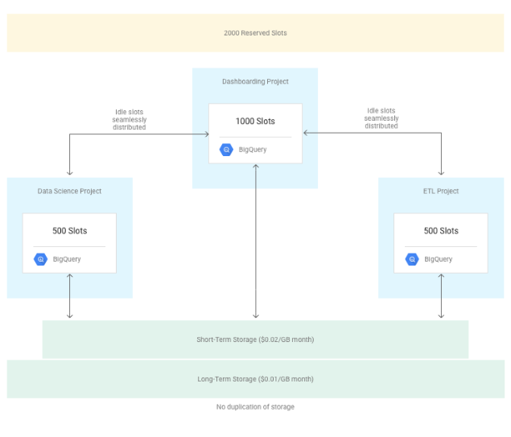
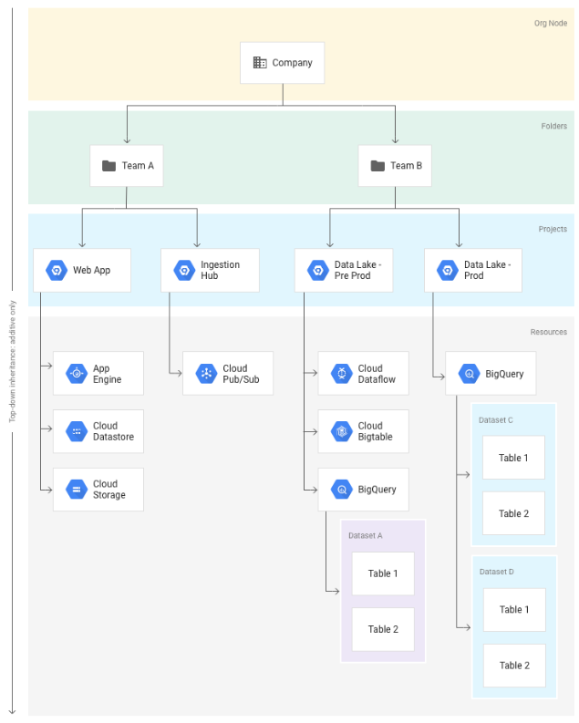
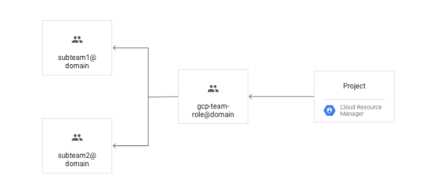
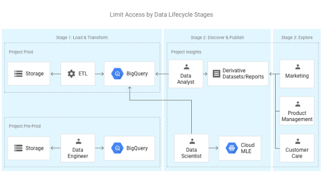
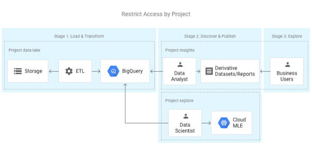
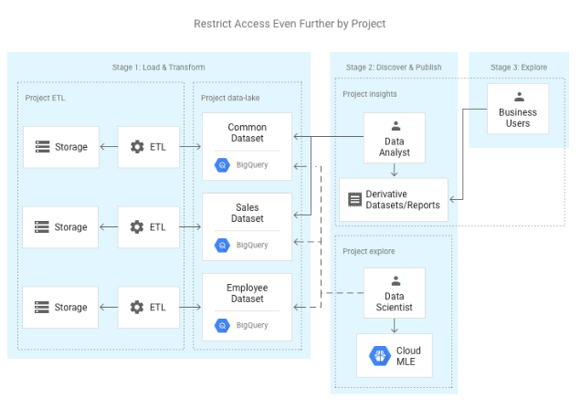
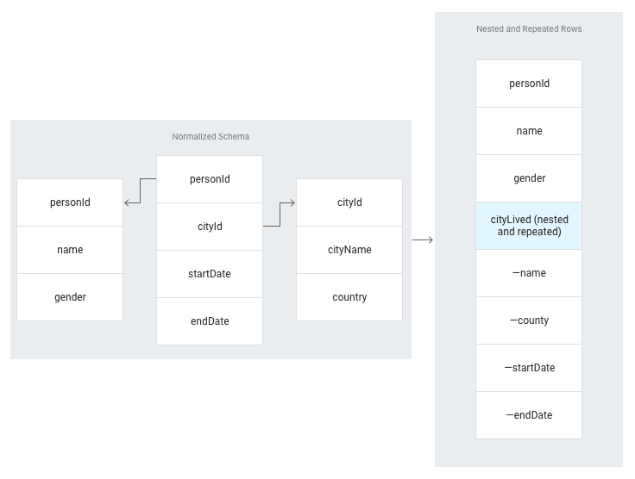

Busting 12 myths about BigQuery | Google Cloud Big Data and Machine Learning Blog  |  Google Cloud Platform

 

## Busting 12 myths about BigQuery

Friday, December 22, 2017

 *By Fereshteh Mahvar, Cloud Solutions Architect, and Ryan McDowell, Strategic Cloud Engineer*

Not long ago,[Forrester Research](https://cloud.google.com/forrester-wave-leader/) named Google Cloud the leader in their report, The Forrester Wave™: Insight Platforms-As-A-Service, Q3 2017 — and we couldn’t have been more proud. Without question,[Google BigQuery](https://cloud.google.com/bigquery/) has played a large role in this achievement.

Every day, we work with a wide variety of customers, from rising startups to large enterprises, who use [Google BigQuery](https://cloud.google.com/bigquery/) to address their data warehousing and analytics challenges. Our customers frequently tell us they love its functionality and flexibility. But along the way, we’ve also come across a few myths about BigQuery. Sometimes these myths are based on experience with very early versions of BigQuery, but often they’re due to misconceptions about BigQuery’s architecture. In this blog post, we present a few truths to help bust 12 of BigQuery’s most common myths.

The topics discussed in this post are universally applicable, but some were originated by our enterprise customers. Aspects such as query prioritization, complex project topology, automated project administration, and fine-grained access control are essential to enterprises, but may not be immediately apparent in product documentation.

### **Truth 1**: With BigQuery, you can achieve near real-time analysis.

People often think of a data warehouse as the result of a batch process, and therefore a stale snapshot of past events based on a predetermined batch schedule. With GCP’s [stream analytics solution](https://cloud.google.com/solutions/big-data/stream-analytics/), that no longer needs to be the case.

When it comes to BigQuery, it’s true that quota policies limit free [load jobs](https://cloud.google.com/bigquery/quotas#import), but you can [stream data into BigQuery](https://cloud.google.com/bigquery/streaming-data-into-bigquery). By default, [quota policies](https://cloud.google.com/bigquery/quota-policy#streaminginserts) enforce some limits on streaming inserts, but when you have a use case that requires it, your quota can be increased. If you work with a Google Cloud representative, reach out to find out how.

Furthermore, if your data is stored in [Cloud Bigtable,](https://cloud.google.com/bigtable/)  [Cloud Storage](https://cloud.google.com/storage), or [Google Drive](https://cloud.google.com/drive/), you can analyze it via BigQuery without storing the data in BigQuery. Refer to truth 3 for more details.

### **Truth 2**: BigQuery supports more than SQL.

While it’s true that BigQuery supports standard ANSI SQL 2011, it also supports [User Defined Functions](https://cloud.google.com/bigquery/docs/reference/standard-sql/user-defined-functions) (UDFs). A UDF lets you create a function using another SQL expression or another programming language, such as JavaScript. These functions accept columns as inputs and perform actions, returning the result of those actions as a value.

### **Truth 3**: BigQuery can analyze data external to its storage.

While it’s true that queries return fastest when data resides in [BigQuery's columnar storage](https://cloud.google.com/blog/big-data/2016/04/inside-capacitor-bigquerys-next-generation-columnar-storage-format), BigQuery is also capable of making SQL queries against [external data sources](https://cloud.google.com/bigquery/external-data-sources), such as log files in Cloud Storage, transactional records in Cloud Bigtable, and many other kinds of data outside BigQuery.

[This article](https://cloud.google.com/solutions/teradata-to-gcp#stage4) discusses how the above-mentioned feature can be used to make a “Silver” grade of data available to Data Analysts and Data Engineers. “Silver” grade compares to “Gold” grade, which refers to data that natively resides in BigQuery. While data outside the data warehouse is of higher [velocity and variety](https://cloud.google.com/solutions/teradata-to-gcp#definitions), [quality and interactivity](https://cloud.google.com/solutions/teradata-to-gcp#definitions) are somewhat sacrificed. The “Silver” grade data is ideal for Data Analysts who need to perform custom studies involving data that is yet to make it into the data warehouse. Also, Data Engineers commonly use this type of data when designing ETL jobs, in order to expand the variety of data in the warehouse.

### **Truth 4**: With BigQuery, you can easily retrieve a point-in-time snapshot of your data.

By maintaining a complete seven-day history of changes against your tables, BigQuery allows you to query [a point-in-time snapshot of your data](https://cloud.google.com/bigquery/table-decorators#snapshot_decorators). You can easily revert changes without having to request a recovery from backups.

Note that when a table is explicitly deleted, its history is flushed after two days.

### **Truth 5**: BigQuery supports query prioritization.

If you use BigQuery with [on-demand pricing](https://cloud.google.com/bigquery/pricing#on_demand_pricing), your project is allocated up to 2000 [slots](https://cloud.google.com/bigquery/docs/slots) distributed among your project’s queries. The only lever available to you is to select [interactive vs. batch](https://cloud.google.com/bigquery/querying-data#interactive-batch) query type. By default, BigQuery runs interactive queries. As soon as an interactive query is issued, it competes for slots with all other interactive queries that are concurrently running in other on-demand projects. Batch queries are queued and executed as soon as idle resources are available. It’s worth noting that interactive queries count towards [query quotas](https://cloud.google.com/bigquery/quota-policy#queries), but batch queries don’t. Given the scale at which BigQuery operates, you may be perfectly satisfied with the on-demand service, but know that it’s not your only option.

You might simply prefer a fixed monthly bill, or encounter workloads that are extremely sensitive to query latency, and thus have predictability and control requirements that cannot be met by the on-demand service. For such situations, you can use the [flat-rate service](https://cloud.google.com/bigquery/pricing#flat_rate_pricing). In this model, a certain number of slots are dedicated to your project(s), and you can establish a hierarchical priority model amongst the projects. The flat-rate model is especially suitable for large enterprises with multiple business units and workloads with varying priorities and budgets. For instance, the arrangement illustrated below gives priority to queries that are issued from the “Dashboarding” project over the queries from the other two projects. But even with prioritization, slots won’t be wasted. If the prioritized “Dashboarding” project does not use all its dedicated slots, they’ll be distributed among the remaining projects. Even data stored in the “Data Science” project can be queried from the “Dashboarding” project with a higher priority than when it’s queried from within the “Data Science” project itself.

### **Truth 6**: BigQuery project topology can mimic your organizational model.

[Google Cloud Identity & Access Management](https://cloud.google.com/iam/) (IAM) provides flexible building blocks that allow you to arrange users and their access to resources according to your organizational model. As of this recent [release](https://cloud.google.com/blog/big-data/2017/12/focus-on-security-bigquery-announces-support-for-customer-managed-encryption-keys-and-custom-roles-for-identity-access-and-management), BigQuery supports [IAM custom roles](https://cloud.google.com/bigquery/docs/access-control#custom_roles), which provide you with more flexibility.

The following diagram illustrates IAM’s intrinsic hierarchy. You can grant permissions to roles at the organization, folder, project, or dataset level. Permissions are inherited down the hierarchy. [This blog post](https://cloudplatform.googleblog.com/2017/05/mapping-your-organization-with-the-Google-Cloud-Platform--resource-hierarchy.html) details how you can map your organization with Google Cloud Platform (GCP) resource hierarchy.

If you’re dealing with onboarding/offboarding a large number of users, you shouldn’t assign roles at the user level. Instead, you should take advantage of nested groups of users. These groups can represent different entities within your organization, such as departments, workflows, campaigns, studies, etc., or simply be named after projects. Some of the typical naming conventions for groups are: *gcp-{team}-{role}* or *gcp-{project}-{role}*.

The number of GCP projects, user groups, and their level of access to each project depends on many factors within your organization. While it’s impractical to lay out every possible topology, the remainder of this section presents some of the common approaches that you can use as-is, in combination or as a starting point to build what suits you.

The following arrangement is based on data lifecycle, where:

- Users of Data Engineer group only work within the PRE_PROD project, where they build and test ETL pipelines.
- In PROD environment, only [service accounts](https://cloud.google.com/iam/docs/service-accounts) perform ETL processes and produce “clean” data for Data Analysts to publish visualizations and derivative datasets for broader usage and Data Scientists to train new machine learning models.
- Functional users such as Marketing, Product Management, etc., use data visualizations and derivative datasets created by Data Analysts.

The topology below places data—and the users of that data—into different projects. This arrangement could be employed to address different requirements, most commonly to establish separate query prioritization and budgets among teams, or to separate other GCP resources from the data warehouse.

In this arrangement, users of the Data Engineer group manage a single project per environment, which stores all of the data. Users of the Data Analysis and Data Science groups build reports and machine learning models in projects separate from the data lake.

In organizations with strict data security requirements, users do not have access to all the data, but rather a subset, based on different security domains. Using datasets, you can separate sensitive data from data that should be commonly available, and control fine-grained access at the dataset level. In the example below, Data Analysts and Data Scientists both have access to the Common and Sales dataset, but only Data Scientists are able to access Employee data.

Expanding on the least-privilege principle, you may also consider splitting your ETL processing into an additional project. This might be necessary when separate teams are responsible for the management of data pipelines and data storage. The separation of concerns also aids in easy cost tracking since billing data can be tallied by project.

### **Truth 7**: BigQuery project configuration management can be automated.

Although BigQuery’s serverless architecture reduces a significant amount of administration burden, you’ll still need to set up projects, set up datasets, and configure IAM. The[Google Cloud console](http://console.cloud.google.com/) simplifies these tasks, but establishing complex organizational models, such as the ones discussed in the previous section, is no manual affair. Large organizations depend on Infrastructure as Code (IaC) to establish predictable deployment processes with code review gates — a similar principle applies in a cloud environment. Although there is no infrastructure to manage, you wouldn’t want to manage your projects manually. You use [Cloud Deployment Manager](https://cloud.google.com/deployment-manager/) instead to do it through code. Check out our sample templates [here](https://github.com/ryanmcdowell/bigquery-dm).

### **Truth 8**: BigQuery supports normalized schemas and JOINs.

BigQuery can handle any relational data model and often doesn’t require any schema change as part of the transition from an existing data warehouse. But if you want the best results, there are a few things you should consider.

As illustrated below, the majority of normalized data structures naturally map to [nested and repeated](https://cloud.google.com/bigquery/docs/nested-repeated) rows in BigQuery. This will simplify loading data from Avro and JSON files. You can access these fields using intuitive dot notation, for example: `cityLived[0].name`.

When the relationship between two tables cannot be represented using nested and repeated rows, we find that a traditional normalized schema works best more often than you might think. Normalization typically works better when a related table is smaller than 1 TB or undergoes frequent updates and deletes. For more information about schema design, take a look at [this solution](https://cloud.google.com/solutions/bigquery-data-warehouse#designing_schema).

### **Truth 9**: BigQuery supports fine-grained access control down to row and column level.

The fact that the lowest level of [IAM control](https://cloud.google.com/bigquery/docs/access-control#roles) for BigQuery is at the [Dataset](https://cloud.google.com/bigquery/docs/datasets-tables-views#datasets) level often leads to misconceptions that controlling access at table, row, or column is not possible. However, using [authorized views](https://cloud.google.com/bigquery/docs/views#authorized-views), you can establish more granular controls. Authorized views allow you to permit users to query a view without having read access to the underlying tables. You can utilize the `SESSION_USER()` function and an access control table to dynamically filter rows which should be presented to the user. For example, if the mapping table is named `private.access_control`, the SQL query used to create the authorized view would be:

hdr_strong
content_copy
#standardSQL
SELECT c.customer, c.id
FROM  `private.customers` c
INNER  JOIN  (
    SELECT  group
    FROM  `private.access_control`
    WHERE  SESSION_USER()  = user_name) g
ON c.allowed_group = g.group

### **Truth 10**: BigQuery is widely integrated, both with GCP and third-party products.

In addition to integration with GCP products like [Data Studio](https://cloud.google.com/data-studio/), [Cloud Datalab](https://cloud.google.com/datalab/), [Cloud Dataproc](https://cloud.google.com/dataproc/), [Cloud Dataflow](https://cloud.google.com/dataflow/), and [Cloud Machine Learning Engine](https://cloud.google.com/ml-engine), there’s a rich catalog of already integrated [partner tools](https://cloud.google.com/bigquery/partners/) that work with BigQuery.

To connect your custom application to BigQuery, you can use [client libraries](https://cloud.google.com/bigquery/client-libraries), which are available for most common programming languages, or use [BigQuery's REST API](https://cloud.google.com/bigquery/docs/reference/rest/v2/) directly.

To connect to BigQuery from a legacy application or an application that cannot be easily modified, you can use [BigQuery JDBC and ODBC drivers](https://cloud.google.com/bigquery/partners/simba-beta-drivers).

### **Truth 11**: You can control the encryption keys.

Your data in BigQuery is [encrypted at rest](https://cloud.google.com/security/encryption-at-rest/default-encryption/), by default. In BigQuery’s most [recent release](https://cloud.google.com/blog/big-data/2017/12/focus-on-security-bigquery-announces-support-for-customer-managed-encryption-keys-and-custom-roles-for-identity-access-and-management), through a feature that is currently in beta, you can now also manage encryption keys. [Learn more](https://cloud.google.com/security/encryption-at-rest/) about the options you have to encrypt your data.

### **Truth 12**: You can monitor and audit BigQuery usage.

You can monitor BigQuery using [Stackdriver](https://cloud.google.com/bigquery/docs/monitoring) and define various charts and alerts based on [BigQuery metrics](https://cloud.google.com/bigquery/docs/monitoring#metrics). For example, you can monitor system throughput with the Query Time metric, or visualize query demand trends with the Slots Allocated metric. When you anticipate a demanding query, plan ahead based on the Slots Available metric. To stay proactive about system health, you can [create alerts](https://cloud.google.com/bigquery/docs/monitoring#create-alert) based on thresholds that you define. Stackdriver provides a self-service web-based portal, and you can control access to it through [Stackdriver accounts](https://cloud.google.com/monitoring/accounts/guide).

BigQuery automatically creates audit logs of user actions. You can export audit logs to another BigQuery dataset in batch or as a data stream, then use your preferred tool to visualize the logs. For details, see [Analyzing Audit Logs Using BigQuery](https://cloud.google.com/bigquery/audit-logs). The section called “Analyzing BigQuery Usage” in [this article](https://medium.com/google-cloud/visualize-gcp-billing-using-bigquery-and-data-studio-d3e695f90c08) shows how you can visualize BigQuery audit logs to answer billing questions. You can expand on this technique and extract different kinds of insights from audit logs.

### Next steps

We hope this post helped correct a few common misconceptions about BigQuery. If you’re interested in learning more, check out our recently updated [BigQuery for Data Warehouse Practitioners](https://cloud.google.com/solutions/bigquery-data-warehouse) solution, and the new article [Transitioning from Data Warehousing in Teradata to GCP Big Data](https://cloud.google.com/solutions/teradata-to-gcp).