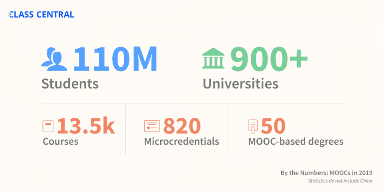
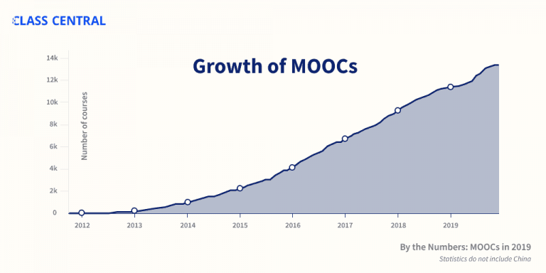
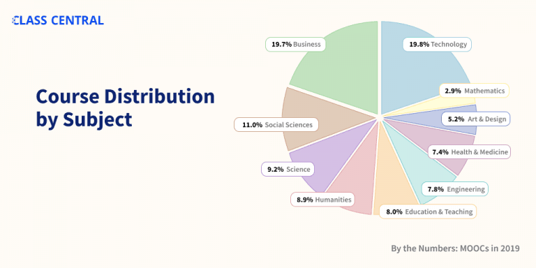

By The Numbers: MOOCs in 2019 — Class Central

# By The Numbers: MOOCs in 2019

 

 [Dhawal Shah](https://www.classcentral.com/report/author/dhawal/)   Dec 2nd, 2019

- [Facebook](http://www.facebook.com/sharer.php?u=https%3A%2F%2Fwww.classcentral.com%2Freport%2Fmooc-stats-2019%2F&t=By%20The%20Numbers%3A%20MOOCs%20in%202019&s=100&p[url]=https%3A%2F%2Fwww.classcentral.com%2Freport%2Fmooc-stats-2019%2F&p[images][0]=https%3A%2F%2Fwww.classcentral.com%2Freport%2Fwp-content%2Fuploads%2F2019%2F12%2F2019-roundup-growth-1024x512.png&p[title]=By%20The%20Numbers%3A%20MOOCs%20in%202019)

- [Twitter](https://twitter.com/intent/tweet?url=https%3A%2F%2Fwww.classcentral.com%2Freport%2Fmooc-stats-2019%2F&text=By%20The%20Numbers%3A%20MOOCs%20in%202019)

- [Envelope](https://www.classcentral.com/report/mooc-stats-2019/mailto:?subject=By%20The%20Numbers%3A%20MOOCs%20in%202019&body=Hey%20check%20this%20out:%20https%3A%2F%2Fwww.classcentral.com%2Freport%2Fmooc-stats-2019%2F)

- Url

- [0  *i*](https://www.classcentral.com/report/mooc-stats-2019/#commentSection)

Now in its eight year, the modern MOOC movement has reached 110 million learners, excluding China1. In 2019, providers launched over 2,500 courses, 11 online degrees, and 170 microcredentials.

Here’s how the top-5 MOOC providers look like in terms of users and offerings:

|     |     |     |     |     |
| --- | --- | --- | --- | --- |
|     | **Learners** | **Courses** | **Microcredentials** | **Degrees** |
| [Coursera](https://www.classcentral.com/provider/coursera) | 45 million | 3,800 | 420 | 16  |
| [edX](https://www.classcentral.com/provider/edx) | 25 million | 2,640 | 292 | 10  |
| [Udacity](https://www.classcentral.com/provider/udacity) | 10 million | 200 | 40  | 1   |
| [FutureLearn](https://www.classcentral.com/provider/futurelearn) 2,4 | 10 million | 880 | 49  | 23  |
| [Swayam](https://www.classcentral.com/provider/swayam) 2,3 | 10 million | 1,000 | 0   | 0   |

## Courses

By the end of 2019, 13.5K MOOCs have been announced or launched by over [900 universities](https://www.classcentral.com/universities) around the world. In 2019 alone, around 2.5K courses were launched by 450 universities.

## Online Degrees

|     |     |     |     |
| --- | --- | --- | --- |
|     | **2017** | **2018** | **2019** |
| **Coursera** | 4   | 11  | 16  |
| **edX** | 1   | 9   | 10  |
| **FutureLearn** | 4   | 18  | 23  |

In 2018, we saw the top MOOC providers announce a large number of degrees: 30 overall!

I called this the [second wave of MOOC Hype](https://www.classcentral.com/report/second-wave-of-mooc-hype/) and 2018, the [year of MOOC-based of degrees](https://www.classcentral.com/report/moocs-stats-and-trends-2018/).

But in 2019, only 11 new degrees were announced, most by Coursera and FutureLearn.

Interestingly, a MOOC-based degree seems to have been either canceled or postponed: edX’s Data Science Master — offered by the University of California, San Diego — isn’t listed on the provider’s page anymore.

The total number of MOOC-based degrees has now grown to 50. This number includes Georgia Tech’s online master’s degree in computer science (OMSCS), which is offered on Udacity and has over 9,000 students.

You can find a comprehensive list of [MOOC-based master’s degrees](https://www.classcentral.com/report/mooc-based-masters-degree/) here.

## Microcredentials

|     |     |     |     |
| --- | --- | --- | --- |
| **Type** | **Provider** | **2018** | **2019** |
| Specializations | Coursera | 310 | 400 |
| Professional Certificate | Coursera | 0   | 13  |
| MasterTrack | Coursera | 3   | 6   |
| Professional Certificate | edX | 89  | 123 |
| MicroMasters | edX | 51  | 56  |
| XSeries | edX | 29  | 40  |
| Professional Education | edX | 62  | 73  |
| Nanodegrees | Udacity | 35  | 40  |
| Programs | FutureLearn | 23  | 32  |
| Academic Certificates4 | FutureLearn | 14  | 17  |
| Programs | Kadenze | 19  | 20  |

The total number of MOOC-based microcredentials has now crossed 800. In 2019, more than 170 new microcredentials of 10 different types have been launched. In 2018, only 120 microcredentials were added.

## Subjects

Overall, the distribution of courses across subjects has remained quite similar to last year. Forty percent of courses belong to the categories that are the easiest to monetize: business and technology.

* * *

[1] We decided to leave China out of our analysis this year because, as we learned more about Chinese online education, we realized that the metrics we’d like to present are: (1) sometimes unavailable, (2) sometimes available but impossible to validate to the extent we’d like, (3) sometimes reflect a view too narrow to adequately capture the overall state of MOOCs in China.

[2] For platforms with session-based courses, we counted the total number of distinct courses offered in 2019.

[3] This is the first year that Swayam is included in Class Central’s analysis. This year, [NPTEL](https://www.classcentral.com/report/nptel-moocs-spring-2019/) and Swayam were merged, which is one of the reasons behind the rapid growth of the Indian MOOC provider.

[4] Graduate and Postgraduate Certificate are listed under microcredentials, instead of under degrees.

*This article is just one of our 2019 MOOC Roundup Series. [Find the whole series here](https://www.classcentral.com/report/tag/mooc-roundup-2019/). You’ll discover everything about MOOCs in 2019 — from the most popular classes, to overviews of MOOC platforms developments, to looking at the future of MOOCs.*

 [    Future of Learning Conference takes place in Bengaluru, India from 3-4 January 2020     AD](http://www.futureoflearningconference.com/)

 [    Future of Learning Conference takes place in Bengaluru, India from 3-4 January 2020     AD](http://www.futureoflearningconference.com/)

####  Category

- [Analysis](https://www.classcentral.com/report/category/analysis/)

- [Features](https://www.classcentral.com/report/category/features/)

- [News](https://www.classcentral.com/report/category/mooc-news/)

####  Tags

 [MOOC Roundup 2019](https://www.classcentral.com/report/tag/mooc-roundup-2019/)

 

###   [Dhawal Shah](https://www.classcentral.com/report/author/dhawal/)

Dhawal is the founder and CEO of Class Central.

 [More articles from Dhawal Shah](https://www.classcentral.com/report/author/dhawal/)