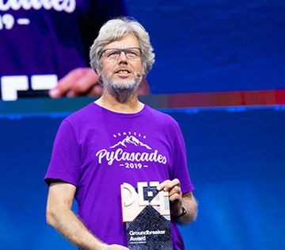

By Welcoming Women, Python’s Founder Overcomes Closed Minds In Open Source

By Welcoming Women, Python’s Founder Overcomes Closed Minds In Open Source

https://www.forbes.com/sites/oracle/2018/11/20/by-welcoming-women-pythons-founder-overcomes-closed-minds-in-open-source/

Python creator Guido van Rossum recently received a Groundbreaker Award, presented by Oracle at its Oracle Code One conference in San Francisco.