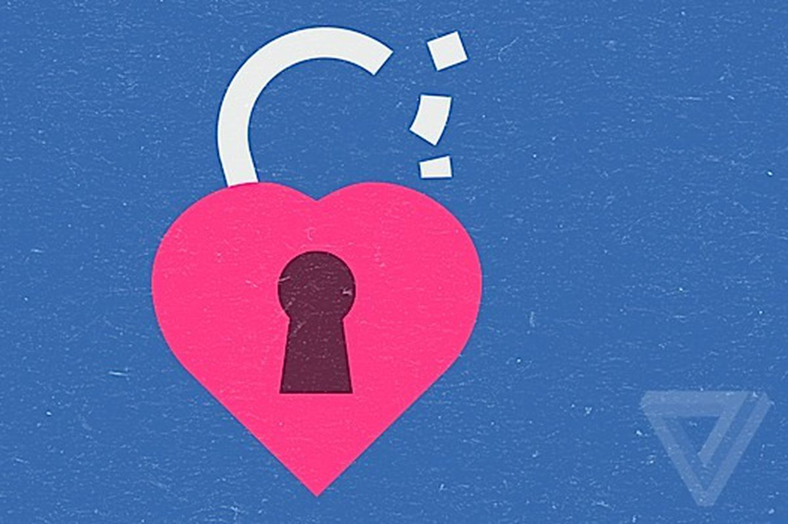

By ditching usernames, OKCupid is removing a crucial protective barrier

- [TL;DR](https://www.theverge.com/tldr)

- [Web](https://www.theverge.com/web)

- [Culture](https://www.theverge.com/culture)

# By ditching usernames, OKCupid is removing a crucial protective barrier

 [46comments](https://www.theverge.com/2017/12/22/16812152/okcupid-usernames-controversy-anonymity-privacy-dating-online#comments)

By   [Megan Farokhmanesh](https://www.theverge.com/users/Megan%20Farokhmanesh)[@Megan_Nicolett](https://www.twitter.com/Megan_Nicolett)       Dec 22, 2017, 5:16pm EST

- [  share](https://www.facebook.com/sharer/sharer.php?text=By+ditching+usernames%2C+OKCupid+is+removing+a+crucial+protective+barrier&u=https%3A%2F%2Fwww.theverge.com%2F2017%2F12%2F22%2F16812152%2Fokcupid-usernames-controversy-anonymity-privacy-dating-online)

- [  tweet](https://twitter.com/intent/tweet?counturl=https%3A%2F%2Fwww.theverge.com%2F2017%2F12%2F22%2F16812152%2Fokcupid-usernames-controversy-anonymity-privacy-dating-online&text=By+ditching+usernames%2C+OKCupid+is+removing+a+crucial+protective+barrier&url=https%3A%2F%2Fwww.theverge.com%2F2017%2F12%2F22%2F16812152%2Fokcupid-usernames-controversy-anonymity-privacy-dating-online&via=Verge)

- [  Linkedin](http://www.linkedin.com/shareArticle?mini=true&source=The+Verge&summary=&title=By+ditching+usernames%2C+OKCupid+is+removing+a+crucial+protective+barrier&url=https%3A%2F%2Fwww.theverge.com%2F2017%2F12%2F22%2F16812152%2Fokcupid-usernames-controversy-anonymity-privacy-dating-online)

       

Days after deleting an OKCupid profile that included personal information, Reddit user [Drinkscocoaandreads](https://www.reddit.com/user/drinkscocoaandreads)**  **logged onto Facebook to find an unpleasant surprise. “I had like three guys find me on Facebook within two days, screaming at me for leaving mid-conversation/not ever acknowledging their initial message,” the Redditor wrote in a [thread about OKCupid](https://www.reddit.com/r/OkCupid/comments/7lb0ko/no_more_pseudonyms_now_you_must_use_your_first/). “One of them also added a few of my friends before I figured out what was happening and got him blocked.”

Drinkscocoaandreads is one of many Reddit users reacting to OKCupid’s [recent announcement](https://theblog.okcupid.com/an-open-letter-on-why-were-removing-usernames-addressed-to-the-worst-ones-we-ve-ever-seen-dd017c75d49a) that it will ditch usernames in favor of a real-name policy. “It’s because, like the recent goodbye we said to AIM screen names, it’s time to keep up with the times,” OKCupid explained. “We’ve also heard from many members of our community that they want to maintain the privacy they enjoy with usernames—with this change, we won’t be collecting full names; instead, we encourage our users to go by the name they’d like their dates to call them on OkCupid.”

Via email, a company spokesperson [told *The Verge*](https://www.theverge.com/2017/12/22/16810128/okcupid-remove-usernames-real-name-policy) that OKCupid won’t require legal names, but the shift is already unpopular with users. Online, the reaction to the news has been overwhelmingly negative, with users either flocking to Reddit to discuss the change, or leaving angry comments on the post itself.

The change isn’t just, as OKCupid’s flippant post suggests, about users no longer going by aliases like “BigDaddyFlash916.” The allure of a place like OKCupid as opposed to, say, Tinder, is that it was a secure place to share more intimate personal details, including sexual preferences. Dating apps made for phones are generally looking for users to find matches based on proximity, age, and gut-instinct attraction to other people’s photos. OKCupid invites users to answer questionnaires, build elaborate profiles, and describe themselves thoughtfully. For users, this is a double-edged sword: you get to know people better, but you also make yourself vulnerable to strangers who can potentially learn a lot about you.

Being online can already feel fraught and dangerous for some people, and it’s even more true for anyone seeking a romantic partner. You’re not just letting someone into your heart, but into your social spaces, your support circles, your home. Part of the process of protecting yourself against potential stalkers or harassers starts with limiting the ways strangers can find you. Information like what school you attended, what you do for a living, or a photo, combined with a correct name, is often all it takes to hunt down a LinkedIn or Facebook page.

Many users have voiced this exact concern about the new policy. “This is a terrible, dangerous idea and I hope all the backlash I’m seeing in the comments section forces you to look at this more closely,” wrote one user in the post’s comments. “It’s unbelievable that you are being so cavalier about exposing users’ identity and privacy this way. A few weeks ago I received a message from someone who told me he’d repeatedly watched me walking down the street and told me the exact location where he kept seeing me. Imagine if this person was unbalanced and had my real name in addition to my general location.” Other commenters point out the dangers of potentially outing gay or bisexual users outside their trusted circles, or exposing people’s open or poly relationships.

The ability to conceal a real name under the cloak of a username isn’t just beneficial for someone trying to keep their identity under wraps. It’s also a stellar indicator of what kind of person is reaching out to you. Some users point out that their usernames contained specific jokes that helped their best matches connect with them. Even getting a message from a user with the word “horny” in their alias tells you what they’re looking for, with no interaction needed.

In an ideal world, the trust and intimacy of allowing a stranger to know your sexual orientation, your religion, or your politics would be a welcome part of finding a potential partner. In reality, it requires more caution than that. OKCupid's decision isn't just ignoring what its users want; it's mocking them while it takes that away. It’s dismantling their ability to stay safe, and it’s doing so with a sneer.

###   Next Up In  [TL;DR](https://www.theverge.com/tldr)

- [All the best reactions to SpaceX’s Friday night rocket launch in California](https://www.theverge.com/2017/12/23/16814036/spacex-falcon-9-rocket-launch-los-angeles-celebrities-ufo)

- [Elon Musk shows off the Tesla Roadster that SpaceX will send beyond Mars](https://www.theverge.com/2017/12/22/16811944/elon-musk-spacex-tesla-roadster-mars-falcon-heavy)

- [Economically speaking, gift-giving can be a waste of money](https://www.theverge.com/2017/12/22/16810034/economics-deadweight-loss-christmas-joel-waldfogel-giftgiving-holidays)

- [If only all food critiques were as enjoyable as this YouTube channel](https://www.theverge.com/2017/12/22/16795146/food-youtube-videos-kalen-reacts)

- [The 11 best, worst, and weirdest robots of 2017](https://www.theverge.com/tldr/2017/12/20/16780132/the-11-best-worst-and-weirdest-robots-of-2017)

- [Twitter broke the only bit of joy I’ve found in its Android app, but you can get it back](https://www.theverge.com/2017/12/20/16799830/twitter-android-highlights-highlighter)

[How to use a password manager](https://www.youtube.com/watch?v=Q0GeMSFGIgI)

This Article has a component height of 8. The sidebar size is medium.
AD

AD

RECOMMENDED

- [

 [Time to tick Canada off your bucket list?](../_resources/41c775972503114e9fd0d7d212874cf1.webp)    Time to tick Canada off your bucket list?  Sponsored | WestJet, WestJet Vacations | Airline Tickets, Seat Sales, Flight Deals](https://www.westjet.com/en-ca/book-trip/destination-guide/canada?h_cid=external-site:routes:DiscoverCanada&utm_source=outbrain&utm_medium=banner&utm_campaign=uk_fall_2017&utm_content=city-breaks&utm_term=$publisher_name$&utm_section=$section_name$&origUrl=true)

- [       Top tips your business needs for Inventory Management  Sponsored | Sage](https://ad.doubleclick.net/ddm/clk/406820985;207128602;f?origUrl=true)
- [

 [Why This Razor Is Causing So Many Guys To Switch](../_resources/d19dbc3c1cff0db85973938224e64b1d.webp)    Why This Razor Is Causing So Many Guys To Switch  Sponsored | Harry's](http://try.harrys.com/en/gb/lp-guys-love-harrys?utm_campaign=lp-why-guys-wl-brand-safe-desktop&utm_source=Outbrain&utm_medium=PCM&utm_content=00d5f8562db28aad358d00f736edc0302b&utm_term=$section_name$&origUrl=true)

- [

 [Time to tick Iceland off your bucket list?](../_resources/19f30fd728f13cc19413e984f9e1a409.webp)    Time to tick Iceland off your bucket list?  Sponsored | The Telegraph - Travel](http://www.telegraph.co.uk/travel/hotels/articles/best-northern-lights-hotels-where-to-watch-the-aurora-borealis/?WT.mc_id=tmgoff_pob_december_hotels&utm_source=tmgoff&utm_medium=pob&utm_content=december&utm_campaign=tmgoff_pob_december_hotels_OB&origUrl=true)

- [

 [50 of the world’s most unusual hotels](../_resources/5a9257e9b16d695ed6f08466d586bf2b.webp)    50 of the world’s most unusual hotels  Sponsored | The Telegraph - Travel](http://www.telegraph.co.uk/travel/hotels/articles/the-worlds-most-unusual-weird-hotels/?WT.mc_id=tmgoff_pob_december_hotels&utm_source=tmgoff&utm_medium=pob&utm_content=december&utm_campaign=tmgoff_pob_december_hotels_OB&origUrl=true)

- [

 [[Gallery\] Most People Don't Know Why 'American Chopper' Was Canceled](../_resources/7f21bd5c4f1787202393badfe0523081.webp)    [Gallery] Most People Don't Know Why 'American Chopper' Was Canceled  Sponsored | DailySportX](http://www.dailysportx.com/american-football/american-chopper?utm_medium=outbrain&utm_source=outbrainjk&utm_campaign=ds-american-chopper&utm_term=$origpubname$&origUrl=true)

[Recommended by](https://www.outbrain.com/what-is/default/en)

#### Loading comments...

##   The Latest

 [

 [eyJpdSI6IjQ2NGMyYTc1ZGNhZWYwYzcwYmM0MGU2NjIyNDI1YTIyM2M2OWU2ZGE3N2I3YTM5MzMyMmZjN2QyMTQ1MGNkYTAiLCJ3IjoyNTAsImgiOjI1MCwiZCI6MS41LCJjcyI6MCwiZiI6MH0.webp](../_resources/c26ba545a2a686b8622266b53216c243.gif)](https://www.theverge.com/2017/12/23/16814490/facebook-instagram-russia-pages-internet-research-agency-tool)

## [You can now check to see if you follow Russian propaganda on Facebook and Instagram](https://www.theverge.com/2017/12/23/16814490/facebook-instagram-russia-pages-internet-research-agency-tool)

By   [Andrew Liptak](https://www.theverge.com/users/AndrewLiptak)

 [7comments](https://www.theverge.com/2017/12/23/16814490/facebook-instagram-russia-pages-internet-research-agency-tool#comments)

 [(L)](https://www.theverge.com/2017/12/23/16806322/science-stories-long-reads-2017-best-of)

## [Our favorite science stories this year (that we didn’t write)](https://www.theverge.com/2017/12/23/16806322/science-stories-long-reads-2017-best-of)

By   [Elizabeth Lopatto](https://www.theverge.com/users/lopatto)

 [(L)](https://www.theverge.com/2017/12/23/16755864/altered-carbon-netflix-richard-k-morgan-book-cyberpunk-mystery)

## [Cyberpunk novel Altered Carbon is headed for Netflix with its razor-sharp indictment of the 1 percent](https://www.theverge.com/2017/12/23/16755864/altered-carbon-netflix-richard-k-morgan-book-cyberpunk-mystery)

By   [Andrew Liptak](https://www.theverge.com/users/AndrewLiptak)

 [2comments](https://www.theverge.com/2017/12/23/16755864/altered-carbon-netflix-richard-k-morgan-book-cyberpunk-mystery#comments)

 [(L)](https://www.theverge.com/2017/12/23/16810740/new-trailers-oceans-8-sicario-2-watch)

## [Nine new trailers you should watch this week](https://www.theverge.com/2017/12/23/16810740/new-trailers-oceans-8-sicario-2-watch)

By   [Jacob Kastrenakes](https://www.theverge.com/users/Jacob%20Kastrenakes)

 [5comments](https://www.theverge.com/2017/12/23/16810740/new-trailers-oceans-8-sicario-2-watch#comments)

 [(L)](https://www.theverge.com/good-deals/2017/12/23/16802850/best-tech-deals-amazon-echo-sale-ravpower-wireless-charger-google-pixelbook-discount)

## [Amazon holiday sales include an exclusive discount on our favorite wireless charger, and more deals](https://www.theverge.com/good-deals/2017/12/23/16802850/best-tech-deals-amazon-echo-sale-ravpower-wireless-charger-google-pixelbook-discount)

By   [Chloe Reznikov](https://www.theverge.com/users/Chloe%20Reznikov)

 [(L)](https://www.theverge.com/2017/12/23/16814036/spacex-falcon-9-rocket-launch-los-angeles-celebrities-ufo)

## [All the best reactions to SpaceX’s Friday night rocket launch in California](https://www.theverge.com/2017/12/23/16814036/spacex-falcon-9-rocket-launch-los-angeles-celebrities-ufo)

By   [Loren Grush](https://www.theverge.com/users/lorengrush)

 [8comments](https://www.theverge.com/2017/12/23/16814036/spacex-falcon-9-rocket-launch-los-angeles-celebrities-ufo#comments)