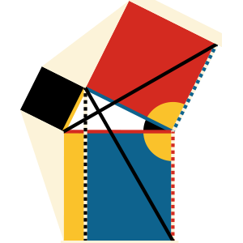
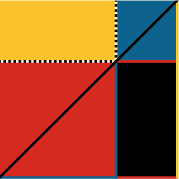
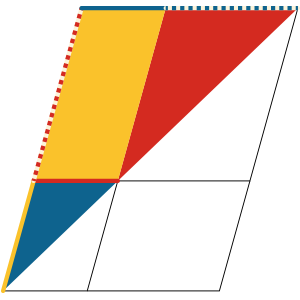

Byrne's Euclid

# Byrne’s Euclid

The First Six Books of The Elements of Euclid With Coloured Diagrams and Symbols

A reproduction of Oliver Byrne’s celebrated work from 1847 plus interactive diagrams, cross references, and posters designed by Nicholas Rougeux

[Explore](https://www.c82.net/euclid/#books)

## Books.

1.   [**Book I.**  Basic plane geometry](https://www.c82.net/euclid/book1)

2.   [**Book II.**  Geometric algebra](https://www.c82.net/euclid/book2)

3.   [**Book III.**  Circles and angles](https://www.c82.net/euclid/book3)

4.   [**Book IV.**  Regular polygons](https://www.c82.net/euclid/book4)

5.   [**Book V.**  Ratios and proportions](https://www.c82.net/euclid/book5)

6.   [**Book VI.**  Geometric proportions](https://www.c82.net/euclid/book6)

## About the project.

Learn about Byrne’s original publication and how this site was made including design, typography, and more.

[Learn more](https://www.c82.net/euclid/about)

[How it was made](https://www.c82.net/blog/?id=79)

 [(L)](https://www.c82.net/euclid/about)

## Posters.

Decorate your walls with a colorful detailed poster of every geometric illustration from Oliver Byrne’s colorful 1847 edition of Euclid’s Elements.

[See the poster](https://www.c82.net/euclid/posters)

 [(L)](https://www.c82.net/euclid/posters)

A project from [Nicholas Rougeux](https://www.c82.net/)     [Licensing](https://www.c82.net/euclid/about#licensing)

[Display issues? Typos?](https://www.c82.net/euclid/about#support)