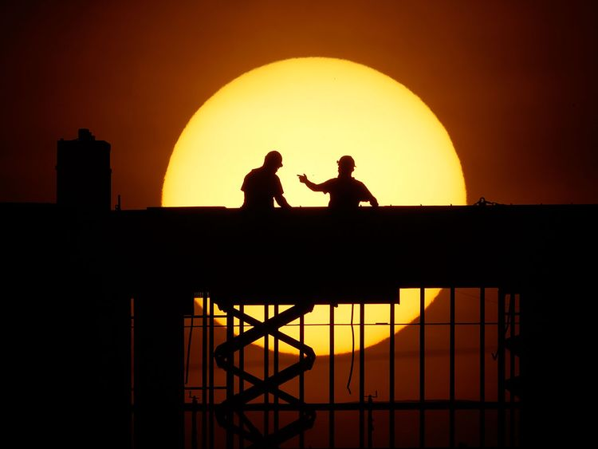

COVID-19 fallout: US housing is up for a perfect storm | Analysis – Gulf News

  Comment

# COVID-19 fallout: US housing is up for a perfect storm

In a worst-case scenario, it could even alter Americans’ attitude towards home buying

* * *

  Published:  April 10, 2020 17:36      [Danielle DiMartino Booth](https://gulfnews.com/business/analysis/covid-19-fallout-us-housing-is-up-for-a-perfect-storm-1.70915451#)

[(L)](https://gulfnews.com/business/analysis/covid-19-fallout-us-housing-is-up-for-a-perfect-storm-1.70915451mailto:?subject=COVID-19%20fallout%3A%20US%20housing%20is%20up%20for%20a%20perfect%20storm&body=https%3A%2F%2Fgulfnews.com%2Fbusiness%2Fanalysis%2Fcovid-19-fallout-us-housing-is-up-for-a-perfect-storm-1.70915451)[(L)](https://gulfnews.com/business/analysis/covid-19-fallout-us-housing-is-up-for-a-perfect-storm-1.70915451whatsapp://send?text=COVID-19 fallout: US housing is up for a perfect storm - https://gulfnews.com/business/analysis/covid-19-fallout-us-housing-is-up-for-a-perfect-storm-1.70915451)[(L)](#)

* * *

* * *

     

The sun might be setting on the great American housing boom. A deluge of supply could be hitting the market when it is least needed. Image Credit: AP

##### Also in this package

- [Coronavirus: No eye test required to renew your driving licence in Dubai](https://gulfnews.com/living-in-uae/transport/coronavirus-no-eye-test-required-to-renew-your-driving-licence-in-dubai-1.1586440090481)

- [UAE: No air ticket refund from travel agency for one year](https://gulfnews.com/uae/reader-complaints/uae-no-air-ticket-refund-from-travel-agency-for-one-year-1.1586421035178)

- [COVID 19: Italy's empty quarters](https://gulfnews.com/photos/news/covid-19-italys-empty-quarters-1.1586436925540)

- [Coronavirus: Bathed in blue in support of COVID-19 front-line workers in US](https://gulfnews.com/photos/news/coronavirus-bathed-in-blue-in-support-of-covid-19-front-line-workers-in-us-1.1586501560107)

(Bloomberg): A US housing crisis is coming and although it won’t be anything like the last one, that won’t make it any less painful. Even though there has been no rampant speculation or subprime mortgage fraud, housing is still overvalued.

And the dearth of inventory that’s plagued the current cycle will reverse in violent fashion once the worst of the virus has passed as financially strapped homeowners seek to raise cash. And as affordability collapses with fewer buyers eligible to buy a home, the only way to rectify the mismatch between supply and demand will be via declining prices.

US home prices dropped about 35 per cent between mid-2006 and early 2009 in the first nationwide decline since the Great Depression as measured by the S&P/Case-Shiller home price index. They have since recovered, and are now at 117 per cent of their prior peak level in 2006.

Home prices historically meandered in a range of three to four times median incomes, jumping to 5.1 times in December 2005 before collapsing. The ratio is now at 4.4 times, a level that was unprecedented prior to June 2004.

### Inflated beyond all rationale

Several factors that characterized the last decade will now work against housing. The lowest interest rates in US history spurred a boom in luxury housing. At the start of the last decade, about a fifth of the homes in the US were priced at $300,000 or higher. Ten years on, that’s true for more than half of all homes.

The National Association of Realtors says the inventory of existing homes for sale has dropped to about three months of supply from more than seven months. Supply has shrunk as millions of Baby Boomers unexpectedly delayed downsizing. One of the reasons for this was the longest bull market in stocks in history, which afforded would-be sellers the wherewithal to continue carrying higher maintenance and larger homes than otherwise possible.

### A selloff is brewing

The recent reversal in the stock market has the potential to expedite the long anticipated “Silver Tsunami”. A June 2019 Fannie Mae report tallied the number of homes owned by boomers and the generation that preceded at about 46 million, more than a third of the 140 million home housing stock. Zillow Group Inc. predicts “upwards of 20 million homes hitting the market through the mid-2030s, (which) will provide a substantial and sustained boost to supply, comparable to the fluctuations that new home construction experienced in the 2000s boom-bust cycle.”

But now, the number of homes Zillow projected to hit the market in a disciplined fashion over the next 15 years will become an exodus as retirees’ need to monetize the equity in their homes to supplement their disposable income skyrockets. One can only imagine how swiftly home prices will decline once boomers feel safe enough to open their homes to outsiders as part of the normal sales process.

The University of Michigan’s preliminary consumer sentiment index for April that was released Thursday showed that plans to buy a home tumbled the most since 1979.

### More problems ahead

The capping of deductions at $10,000 has already led to a 10-25 per cent discount on home prices in high tax states relative to their lower-tax counterparts. Anticipated increases in property taxes to offset collapsing state and municipal budgets will amplify the damage inflict on those on fixed incomes.

A complete unknown that could increase the coming surge in supply is the pool of single-family rentals. About eight million landlords who own between one and 10 properties accounting for half the nation’s rental properties, according to Avail, a software company that caters to landlords.

Financial duress will come swiftly for those carrying multiple mortgages. Also, a small cohort of institutional investors own roughly 250,000 of the roughly 16 million pool of rental homes, according to ATTOM Data Solutions.

Making matters worse is the crash in demand for jumbo mortgages, which are those over the $510,400 conforming loan ceiling. Wells Fargo & Co. recently announced that it was halting the purchase of jumbo mortgages that originate from other lenders. Investors are sticking with government-backed loans which have greater security given payments will still be received even if borrowers have been granted forbearance.

In the last downturn it took almost five years to close the premium charged to attain a jumbo mortgage over rates on conforming mortgages.

And finally, there are more than nine million second homes in the US that may or may not be financially viable given the depth of the current recession. Lending standards tightened dramatically in the last recession as the unemployment rate crested at 10 per cent. It’s difficult to imagine the challenge prospective homebuyers will face in the coming years given we know a 10 per cent jobless rate is not a best-case scenario.

It’s also impossible to quantify how Americans will perceive homeownership given the hardship so many will endure. If frugality is embraced as it was after the Great Depression, homes will once again be viewed as a utility. The McMansion mentality is at risk of extinction.

The reason why the collapse in the subprime mortgage market hit the housing market so hard was because the lead up was predicated on the fact that there had never been a nationwide decline in home prices.

But now for the second time in a little more than a decade, Americans are poised to witness the impossible.

Sign up for Coronavirus Newsletter

Latest local and global Coronavirus news directly to your inbox

This site is protected by reCAPTCHA and the Google [Privacy Policy](https://policies.google.com/privacy) and [Terms of Service](https://policies.google.com/terms) apply.