CS Education Statistics

# CS Education Statistics

#### Computer Science in US Secondary Schools

Computer science courses in K-12 education are fading from the national landscape at the very moment they are needed most. Introductory secondary school computer science courses have decreased in number by 17 percent from 2005. The number of Advanced Placement (AP) Computer Science Courses has similarly decreased by 33 percent.

Source: http://www.computinginthecore.org/facts-resources

Despite its critical and growing importance, computer science is taught in only a small minority of U.S. schools. There currently are just over 42,000 high schools in the United States. But only 2,100 of them were certified to teach the AP computer science course in 2011, and in fact only 21,139 students took the AP exam.

Source: A National Talent Strategy: Ideas for Securing U.S. Competitiveness and Economic Growth

#### STEM Coursetaking Trends

The percentage of U.S. high school students taking STEM courses has increased over the last 20 years across all STEM disciplines except computer science where it dropped from 25% to 19%

2009 NAEP High School Transcript Study

### AP Computer Science Exam Statistics

Nationally, computer science is the only STEM (science, technology, engineering and mathematics) field that has seen a decrease in student participation in the last 20 years ([Time](http://techland.time.com/2012/07/16/can-we-fix-computer-science-education-in-america/%20)). In California, less than 1 percent of all advanced placement exams taken in 2011 were in computer science. Moreover, student access to these courses is unequal and unrepresentative of the state’s demographics.

According to [College Board](http://www.collegeboard.org/), which tracks AP exams, 3,101 students took the AP computer science exam in 2011. By comparison, about 35,000 students took AP government, 55,000 took U.S. history, and 58,500 students took English language. Of those who did take the computer science exam, 29 students were African American and only 21 percent were girls.

#### California K-12 Enrollment vs AP Computer Science Exam Takers

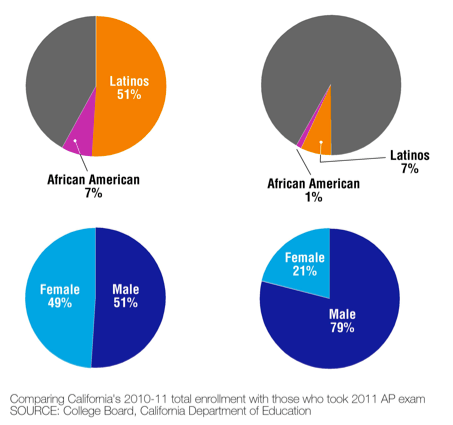

Source: http://idea.gseis.ucla.edu/newsroom/our-ideas/themes-in-the-news/archive/august-2012/states-ap-computer-science-exam-29-african-americans-21-girls

#### Female vs. Male Enrollment 2011 AP Exams

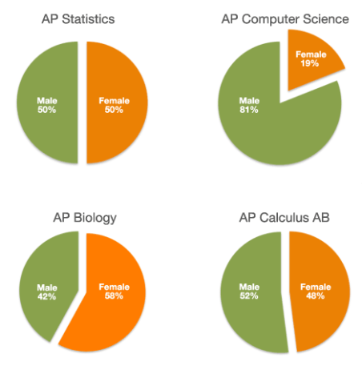

#### AP Exams 1997-2011

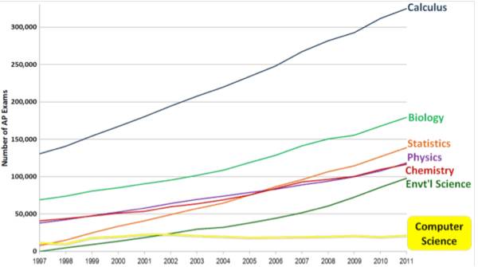

Source: College Board, Advanced Placement (AP) Exam Data 2011, available at http://professionals.collegeboard.com/data-reports-research/ap/data. Calculus represents the combined data of Calculus AB and BC. Physics represents the combined data of Physics B, C:Electricity and Magnetism, and C:Mechanics. Computer Science represents combined data of Computer Science A and B.

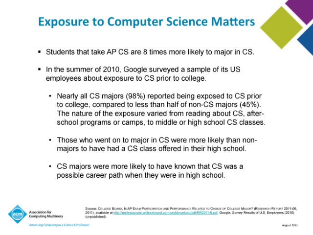

Source: COLLEGE BOARD, IS AP EXAM PARTICIPATION AND PERFORMANCE RELATED TO CHOICE OF COLLEGE MAJOR? (RESEARCH REPORT 2011-06, 2011), available at

http://professionals.collegeboard.com/profdownload/pdf/RR2011-6.pdf. Google, Survey Results of U.S. Employees (2010) (unpublished).

#### AP Computer Science 2013 Exam National Stats

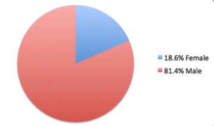

|     |     |     |     |     |
| --- | --- | --- | --- | --- |
|     | ##### Female | ##### % of Total | ##### Male | ##### % of Total |
| **American Indian** | 17  | 0.06% | 109 | 0.37% |
| **Asian** | 2072 | 7.01% | 6403 | 21.66% |
| **Black** | 264 | 0.89% | 826 | 2.79% |
| **Mexican American** | 205 | 0.69% | 784 | 2.65% |
| **Other Hispanic** | 254 | 0.86% | 999 | 3.38% |
| **Puerto Rican** | 29  | 0.10% | 137 | 0.46% |
| **White** | 2348 | 7.94% | 13711 | 46.39% |
| **Other** | 227 | 0.77% | 851 | 2.85% |
| **Not Stated** | 69  | 0.23% | 250 | 0.85% |
| ##### 29555 Total | ##### 5485 Females | ##### 18.56% Female | ##### 24070 Males | ##### 81.44% Male |

#### Detailed AP CS 2013 Results: Unfortunately, much the same

##### Barbara Ericson

http://computinged.wordpress.com/2014/01/01/detailed-ap-cs-2013-results-unfortunately-much-the-same/

- No females took the exam in Mississippi, Montana, and Wyoming.
- For states that had some females take the exam the percentage female ranged from 3.88% in Utah to 29% in Tennessee.
- 11 states had no Black students take the exam: Alaska, Idaho, Kansas, Maine, Mississippi, Montana, Nebraska, New Mexico, North Dakota, Utah, and Wyoming.
- The following states had the most Black students taking the exam: 1) Maryland with 170, 2) Texas with 132, 3) Georgia with 129, 4) Florida with 83, 5) Virginia with 78, 6) California with 74, 7) New York with 68, 8) New Jersey with 34 9) Mass with 34 and 10) North Carolina with 28. The pass rates for Black student in these states: Maryland 27.06%, Texas 48.48%, Georgia 21.7%, Florida 19.28%, Virginia 28.21%, California 56.76%, New York 33.82%, New Jersey 47.06%, Mass 38.24%, and North Carolina 21.43%.
- The pass rate for Black students in states that had at least 5 Black students take the exam ranged from 19% (Florida) to 75% (Alabama) with 6 of 8 passing.
- 8 states had no Hispanic students take the exam: Alaska, Idaho, Kansas, Mississippi, Montana, Nebraska, North Dakota, and Wyoming.
- The following states had the most Hispanic students taking the exam: 1) Texas with 751, 2) California with 392, 3) Florida with 269 , 4) New York with 150, 5) Illinois with 142, 6) New Jersey with 96, 7) Virginia with 90, 8) Maryland with 88, 9) Georgia with 71, and 10) Mass with 56. In report the Hispanic numbers I cam combining the College Board categories of Mexican American, Other Hispanic, and Puerto Rican. The pass rate for Hispanic students in these states: Texas 44.47%, California 47.45%, Florida 44.61%, New York 35.33%, Illinois 39.44%, New Jersey 52.08%, Virginia 46.67%, Maryland 44.32%, Georgia 40.85%, and Mass 39.29%

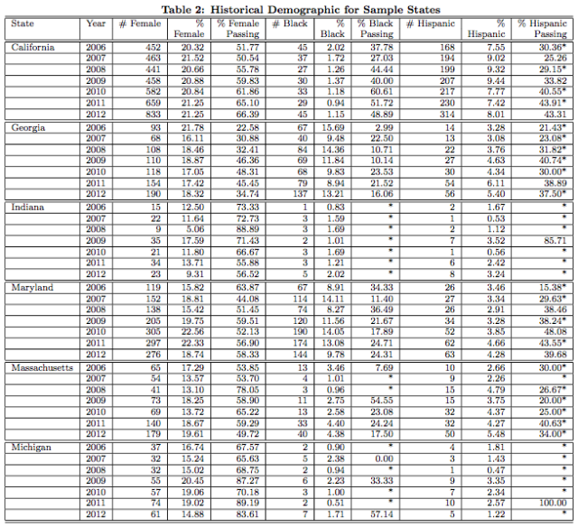

Source: https://dl.dropboxusercontent.com/u/2635522/APCS-analysis-REV-v3.pdf

#### AP Computer Science 2013 Exam California Stats

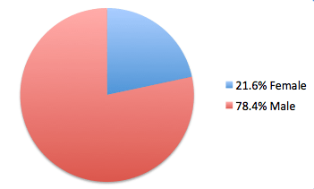

|     |     |     |     |     |
| --- | --- | --- | --- | --- |
|     | ##### Female | #####  % of Total | ##### Male | #####  % of Total |
| **American Indian** | 1   | 0.02% | 10  | 0.20% |
| **Asian** | 635 | 12.79% | 1899 | 38.26% |
| **Black** | 16  | 0.32% | 58  | 1.17% |
| **Mexican American** | 47  | 0.95% | 188 | 3.79% |
| **Other Hispanic** | 33  | 0.66% | 117 | 2.36% |
| **Puerto Rican** | 2   | 0.04% | 5   | 0.10% |
| **White** | 265 | 5.34% | 1350 | 27.2% |
| **Other** | 58  | 1.17% | 205 | 4.13% |
| **Not Stated** | 17  | 0.34% | 58  | 1.17% |
| ##### 4964 Total | ##### 1074 Females | ##### 21.64% Female | ##### 3890 Males | ##### 78.36% Male |

#### ECS enrollment separated by ethnicity for 2013-15

|     |     |     |     |     |     |
| --- | --- | --- | --- | --- | --- |
|     | **Latino/a** | **African American ** | **White** | **Asian** | **Other** |
| **2014-15** | 74% | 8%  | 9%  | 8%  | 2%  |
| **2013-14** | 73% | 11% | 8%  | 7%  | 2%  |
| **AP-CS** | 44% | 7%  | 15% | 22% | 1%  |
| **District Demographics** | 73% | 10% | 10% | 6%  | 1%  |

### Computer Science Degree Statistics

#### Underrepresented Minorities Completing CS Degrees

- 10.6% Bachelors
- 4.8% Masters
- 3.6% PhD

Taulbee Data 2010

[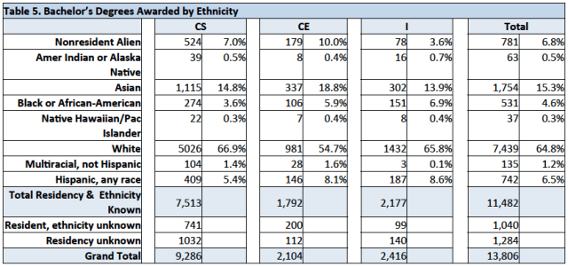](https://i2.wp.com/www.exploringcs.org/wp-content/uploads/2012/12/Screen-shot-2013-01-10-at-3.44.33-PM.png)

CS = Computer Science CE = Computer Engineering I = Information
Source: Computing Degree and Enrollment Trends
From the 2010-2011 CRA Taulbee Survey http://cra.org/resources/taulbee/

[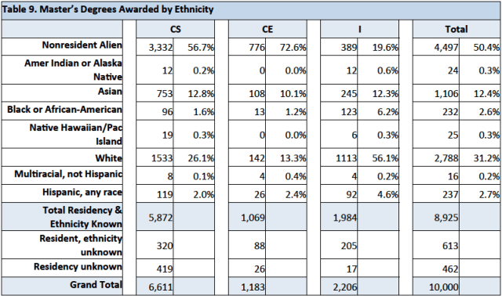](https://i0.wp.com/www.exploringcs.org/wp-content/uploads/2012/12/Screen-shot-2013-01-10-at-3.44.52-PM.png)

CS = Computer Science CE = Computer Engineering I = Information
Source: Computing Degree and Enrollment Trends
From the 2010-2011 CRA Taulbee Survey http://cra.org/resources/taulbee/

[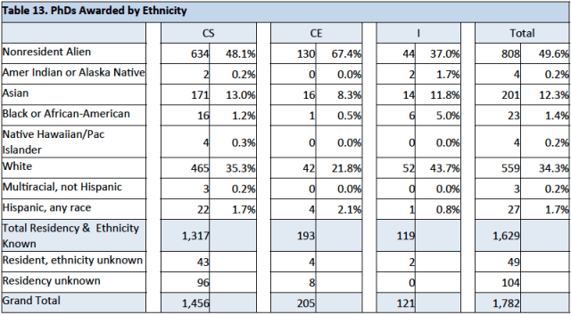](https://i0.wp.com/www.exploringcs.org/wp-content/uploads/2012/12/Screen-shot-2013-01-10-at-3.45.17-PM.png)

CS = Computer Science CE = Computer Engineering I = Information
Source: Computing Degree and Enrollment Trends
From the 2010-2011 CRA Taulbee Survey http://cra.org/resources/taulbee/

### Computer Science Job Statistics

#### United States CS Degrees vs. Job Openings

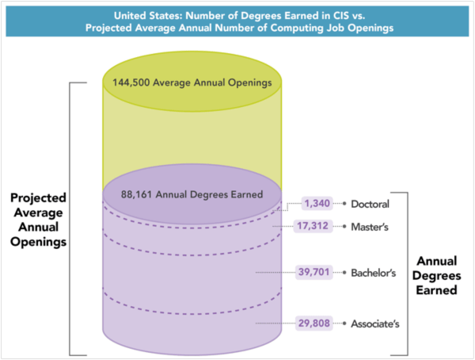

#### Projected Changes – Major STEM Occupations 2008-2018

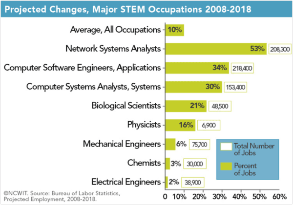

#### Projected Annual Growth of STEM Job Openings 2010-2020

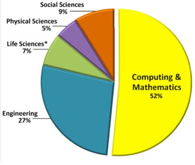

Source: Jobs data are calculated from the Bureau of Labor Statistics (BLS), Employment Projections 2010-2020

#### Best Jobs in America

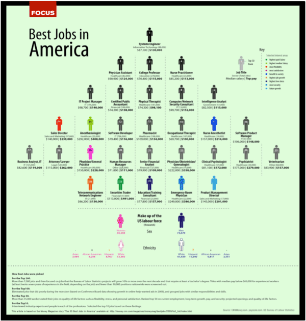

The U.S. Department of Labor estimates that by 2020 there will be more than 1.4 million computing-related job openings. At current rates, however, we can only fill about 30% of those jobs with U.S. computing bachelor’s grads. Girls represent a valuable, mostly untapped talent pool.

####  Women Earn:

- **57%**    of all undergraduate degrees
- **42% **   of all undergraduate math and statistics degrees
- **40%**    of all undergraduate physical sciences degrees

but only …

- **18% **   of all undergraduate computer and information sciences degrees

National Center of Educational Statistics (NCES), 2009 (CIP 11); 2008–2009 CRA Taulbee survey (Computer Science).

#### Women and Information Technology: By the Numbers

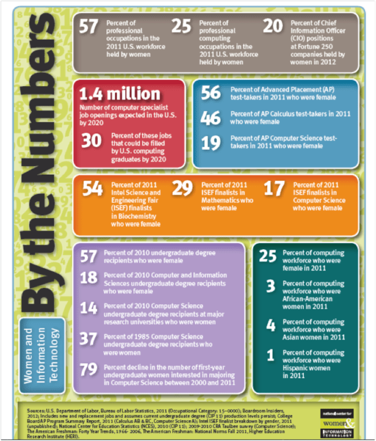