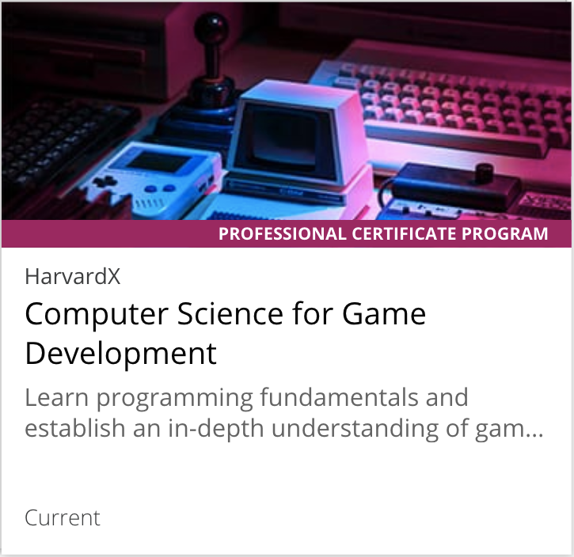
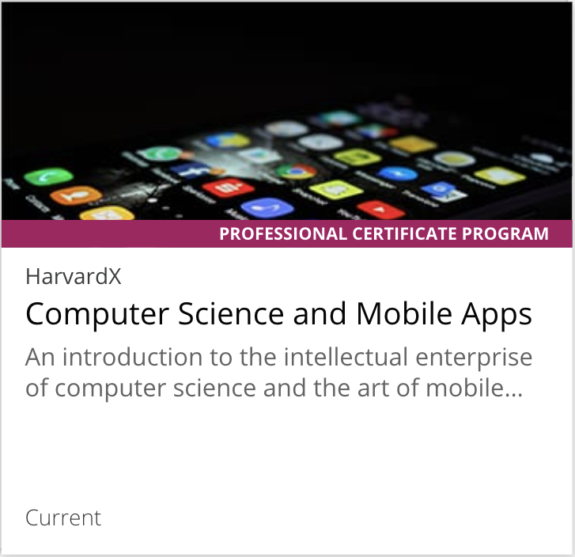
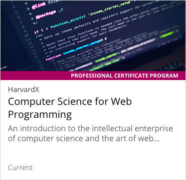
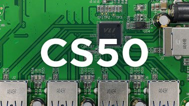
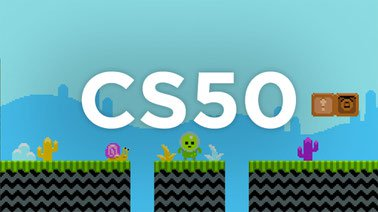
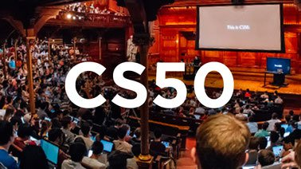

CS50: Computer Science Courses and Programs from Harvard | edX

       

# CS50: Computer Science Courses and Programs from Harvard

 [See Courses](https://www.edx.org/cs50?utm_content=email-harvardx&utm_medium=partner-marketing&utm_source=email&utm_campaign=harvardx&_ke=eyJrbF9lbWFpbCI6ICJtYXJjYWNvaGVuQGdtYWlsLmNvbSIsICJrbF9jb21wYW55X2lkIjogIkFQV051NCJ9#edx-product-discovery-cards)

 [See Programs](https://www.edx.org/cs50?utm_content=email-harvardx&utm_medium=partner-marketing&utm_source=email&utm_campaign=harvardx&_ke=eyJrbF9lbWFpbCI6ICJtYXJjYWNvaGVuQGdtYWlsLmNvbSIsICJrbF9jb21wYW55X2lkIjogIkFQV051NCJ9#edx-product-how-it-works)

Introduction to Computer Science from Harvard, better known as CS50, is the largest course on the Harvard campus and more than 2,000,000 learners worldwide have registered for the course on edX.

We are excited to offer a series of introductory CS50 courses and Professional Certificate programs from Harvard that are open to learners of all backgrounds looking to explore computer science, mobile app and game development, business technologies, and the art of programming.

## CS50 Professional Certificate Programs

 

 

 

 [See All Professional Certificate Programs](https://www.edx.org/course/?type=Professional%20Certificate)

## CS50 Courses

 [         Verified       ### CS50 for Lawyers         Schools and Partners: HarvardX          Availability: Current      Self-Paced](https://www.edx.org/course/cs50-for-lawyers-2)

 [         Verified       ### CS50's Web Programming with Python and JavaScript         Schools and Partners: HarvardX          Availability: Current      Self-Paced](https://www.edx.org/course/cs50s-web-programming-with-python-and-javascript)

 [         Verified       ### CS50's Understanding Technology         Schools and Partners: HarvardX          Availability: Current      Self-Paced](https://www.edx.org/course/cs50s-understanding-technology)

 [         Verified       ### CS50's Mobile App Development with React Native         Schools and Partners: HarvardX          Availability: Current      Self-Paced](https://www.edx.org/course/cs50s-mobile-app-development-with-react-native)

 [         Verified       ### CS50's Computer Science for Business Professionals         Schools and Partners: HarvardX          Availability: Current      Self-Paced](https://www.edx.org/course/cs50s-computer-science-for-business-professionals)

 [         Verified       ### CS50's Introduction to Game Development         Schools and Partners: HarvardX          Availability: Current      Self-Paced](https://www.edx.org/course/cs50s-introduction-to-game-development)

 [         Verified       ### CS50's Introduction to Computer Science         Schools and Partners: HarvardX          Availability: Current      Self-Paced](https://www.edx.org/course/cs50s-introduction-computer-science-harvardx-cs50x)

 [See All Computer Science Courses](https://www.edx.org/course/?subject=Computer%20Science)