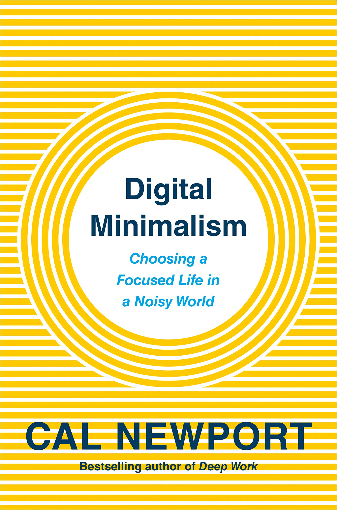
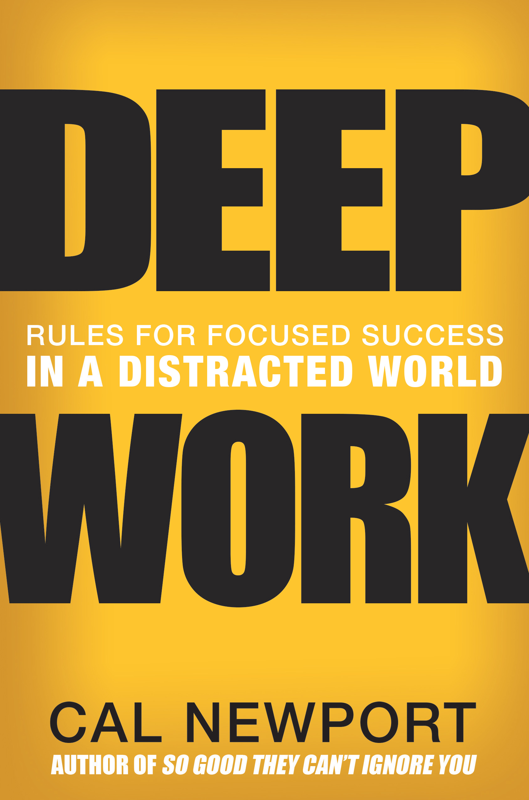
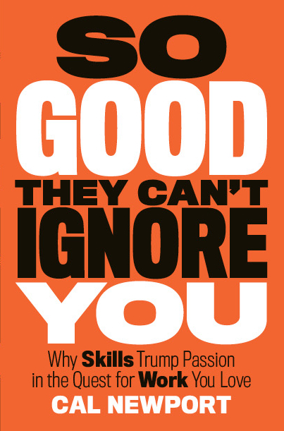

Cal Newport - Author of Deep Work, Study Hacks Blog

## WHAT **THEY SAY**

"I challenge you not to devour this wonderful book in one sitting."

**-Greg McKeown, author of *Essentialism***

“What a timely and useful book! It's neither hysterical nor complacent - a workable guide to being thoughtful about digital media. It's already made me rethink some of my media use in a considered way.”

**- Naomi Alderman, author of *The Power***

"This book is an urgent call to action for anyone serious about being in command of their own life."

**- Ryan Holiday, author of *The Obstacle Is the Way***

"You’re not the user, you’re the product. Hang up, log off, and tune in to a different way to be in the world. Bravo, Cal. Smart advice for good people."

**- Seth Godin, author of *This Is Marketing***

“Newport is making a bid to be the Marie Kondo of technology: someone with an actual plan for helping you realize the digital pursuits that do, and don’t, bring value to your life.”

**- Ezra Klein, founder of Vox.com**

[LEARN MORE](http://calnewport.com/blog/2019/01/12/why-you-should-pre-order-digital-minimalism/)

## ABOUT **CAL NEWPORT**

I’m a computer science professor at Georgetown University who studies the theory of distributed systems. In addition to my academic work, I write about the intersection of technology and culture.

I'm the author of six books, including, most recently, the *New York Times* bestseller, *Digital Minimalism: Choosing a Focused Life in a Noisy World*. My work has been published in over 25 languages and has been featured in many major publications, including the *New York Times*,  *Wall Street Journal*,  *New Yorker*,  *Washington Post*, and  *Economist*.

I've been blogging here at calnewport.com for over a decade.

 [Learn More About Cal](http://www.calnewport.com/about)

## STUDY HACKS BLOG

#####  July 23

####  [The Dynamite Circle: A Long Tail Social Media Case Study](http://www.calnewport.com/blog/2019/07/23/the-dynamite-circle-a-long-tail-social-media-case-study/)

The Dynamite Circle has been on the periphery of my radar since my early days as a blogger. It’s a small, subscription-based social network operated by the Tropical MBA web site, which caters to entrepreneurs running small businesses from exotic locations (I’ve been a guest on their podcast a couple times). This network, abbreviated simply […]

 [READ MORE](http://www.calnewport.com/blog/2019/07/23/the-dynamite-circle-a-long-tail-social-media-case-study/)

◀  ▶
GET THE LATEST FROM
STUDY HACKS BLOG TO YOUR INBOX

 YOU'LL RECEIVE THE BLOG POSTS VIA EMAIL. YOUR EMAIL ADDRESS IS NEVER SOLD OR SHARED.

## BUY **THE BOOKS**

[   ##### Digital Minimalism: Choosing a Focused Life in a Noisy World](http://calnewport.com/books/digital-minimalism/)

[   ##### Deep Work: Rules for Focused Success in a Distracted World](http://calnewport.com/books/deep-work/)

[   ##### So Good They Can’t Ignore You: Why Skills Trump Passion in the Quest for Work...](http://calnewport.com/books/so-good/)

◀  ▶

[See All Books](http://www.calnewport.com/books/)

## FEATURED **MEDIA**

Cal is interviewed by Soledad O’Brien on *Matter of Fact* about *Digital Minimalism* and how to quit your smartphone addiction.

[More Videos, Articles and Interviews](http://www.calnewport.com/media/)