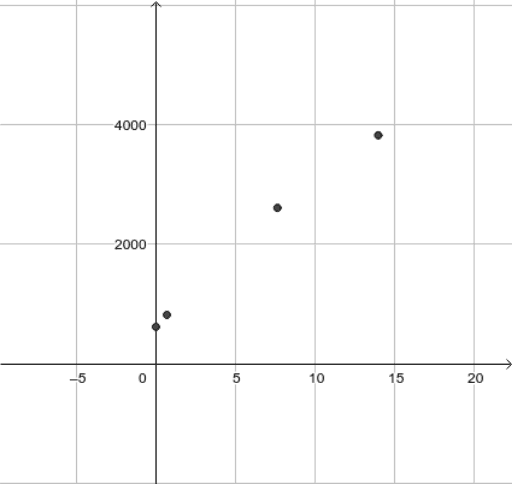

Calculus For The People -- Season 1

# Calculus For The People -- Season 1

Author:
[Greg Petrics](https://www.geogebra.org/u/greg.petrics)
Topic:
[Calculus](https://www.geogebra.org/t/calculus)
The first season of Calculus, now streaming on Geogebra!

## Table of Contents

-

### [Overview](https://www.geogebra.org/m/x39ys4d7#chapter/403420)

    - [Preface](https://www.geogebra.org/m/x39ys4d7#material/phuyhqtw)

-

### [Functions](https://www.geogebra.org/m/x39ys4d7#chapter/398513)

    - [Let's Get Started](https://www.geogebra.org/m/x39ys4d7#material/vudwtey7)
    - [Incoming!](https://www.geogebra.org/m/x39ys4d7#material/kgeypc2s)
    - [Quickly! Model the data!](https://www.geogebra.org/m/x39ys4d7#material/emxhjg78)
    - [Your First Function](https://www.geogebra.org/m/x39ys4d7#material/aayx7rmz)
    - [How high will it get?](https://www.geogebra.org/m/x39ys4d7#material/j5s3ey98)
    - [Two More Predictions](https://www.geogebra.org/m/x39ys4d7#material/sn4u4fqv)
    - [Summary so Far](https://www.geogebra.org/m/x39ys4d7#material/w6bgqy3u)
    - [Make Your Own Function](https://www.geogebra.org/m/x39ys4d7#material/hpwnnppb)
    - [Use Your Own Function](https://www.geogebra.org/m/x39ys4d7#material/k3xjtaza)
    - [Keep using your function!](https://www.geogebra.org/m/x39ys4d7#material/g7tsaupz)
    - [Definition of a Function](https://www.geogebra.org/m/x39ys4d7#material/ftvamrcu)
    - [Length of Day](https://www.geogebra.org/m/x39ys4d7#material/we84syqz)
    - [Length of Day Model Generation](https://www.geogebra.org/m/x39ys4d7#material/tejsttqr)
    - [Length of the Day Model](https://www.geogebra.org/m/x39ys4d7#material/ntenkuu6)
    - [The Atomic Functions](https://www.geogebra.org/m/x39ys4d7#material/wrafy53s)
    - [Combining Functions](https://www.geogebra.org/m/x39ys4d7#material/fybsrxrk)
    - [Composition of Functions Part 1](https://www.geogebra.org/m/x39ys4d7#material/kyb8gjbz)
    - [Composition of Functions Part 2](https://www.geogebra.org/m/x39ys4d7#material/g2q7j8pt)
    - [Composition of Functions Part 3](https://www.geogebra.org/m/x39ys4d7#material/h7stpr9z)
    - [Composition of Functions Part 4](https://www.geogebra.org/m/x39ys4d7#material/phsvsczm)
    - [Practice Questions on Functions](https://www.geogebra.org/m/x39ys4d7#material/jf9qt9ax)

-

### [Limits](https://www.geogebra.org/m/x39ys4d7#chapter/398514)

    - [A Quick Word about Limits](https://www.geogebra.org/m/x39ys4d7#material/zuaq7sgb)
    - [A Little Code To Start](https://www.geogebra.org/m/x39ys4d7#material/mmyjmk4h)
    - [Two Points Determine a...](https://www.geogebra.org/m/x39ys4d7#material/rsp7ve5t)
    - [Two Points Determine a Secant](https://www.geogebra.org/m/x39ys4d7#material/ayvkmske)
    - [Our First Limit](https://www.geogebra.org/m/x39ys4d7#material/wjqeqb8g)
    - [Definition of a Limit](https://www.geogebra.org/m/x39ys4d7#material/zruqdnrq)
    - [Our Second Limit](https://www.geogebra.org/m/x39ys4d7#material/a3w68uv6)
    - [Our Second Limit Part 2](https://www.geogebra.org/m/x39ys4d7#material/hq2mf7r5)
    - [Our Second Limit Part 3](https://www.geogebra.org/m/x39ys4d7#material/rczzmqw4)
    - [Wrap Up](https://www.geogebra.org/m/x39ys4d7#material/ucwxtacg)

-

### [Derivatives](https://www.geogebra.org/m/x39ys4d7#chapter/398515)

    - [A Quick Word About Derivatives](https://www.geogebra.org/m/x39ys4d7#material/nhkuzdzx)
    - [Jumping Right In](https://www.geogebra.org/m/x39ys4d7#material/hvyxfn4d)
    - [Almost a Derivative](https://www.geogebra.org/m/x39ys4d7#material/nqmemxsg)
    - [Connecting the Dots](https://www.geogebra.org/m/x39ys4d7#material/bhuwtk5g)
    - [The Dots Connected](https://www.geogebra.org/m/x39ys4d7#material/bm9qqjra)
    - [But Wait, It's A Little Off...](https://www.geogebra.org/m/x39ys4d7#material/fcqgqehv)
    - [The First of Many Shortcuts](https://www.geogebra.org/m/x39ys4d7#material/chhykph7)
    - [Definition of The Tangent Line](https://www.geogebra.org/m/x39ys4d7#material/nppaxatp)
    - [The Tangent Line and the Derivative](https://www.geogebra.org/m/x39ys4d7#material/gjwrxxyk)
    - [The Tangent Line Part 3](https://www.geogebra.org/m/x39ys4d7#material/qxkqqy3r)
    - [Definition of the Derivative](https://www.geogebra.org/m/x39ys4d7#material/rwdrnrw6)
    - [Another Derivative](https://www.geogebra.org/m/x39ys4d7#material/ht8t4chx)
    - [A Quick Application](https://www.geogebra.org/m/x39ys4d7#material/ybp9bfdt)
    - [The Units of the Derivative](https://www.geogebra.org/m/x39ys4d7#material/kqx3zhn2)
    - [What's Geogebra Doing?](https://www.geogebra.org/m/x39ys4d7#material/ryeuygzc)
    - [The Monkey Rules](https://www.geogebra.org/m/x39ys4d7#material/p8jdmayj)
    - [Monkey Rule 0](https://www.geogebra.org/m/x39ys4d7#material/jpb7h5vk)
    - [Figuring out the rest of the Monkey Rules](https://www.geogebra.org/m/x39ys4d7#material/n3e8723w)
    - [Monkey Rules 1 and 2](https://www.geogebra.org/m/x39ys4d7#material/rhupsdff)
    - [A Bit More About Monkey Rule 2](https://www.geogebra.org/m/x39ys4d7#material/rcxmsezn)
    - [Monkey Rule 3](https://www.geogebra.org/m/x39ys4d7#material/j9bbkxfe)
    - [Monkey Rule 4](https://www.geogebra.org/m/x39ys4d7#material/rqxeesrz)
    - [Monkey Rule 5](https://www.geogebra.org/m/x39ys4d7#material/nwcsfbgw)
    - [Monkey Rule 6](https://www.geogebra.org/m/x39ys4d7#material/twkcnhg2)
    - [Monkey Rule 7](https://www.geogebra.org/m/x39ys4d7#material/jywee6u7)
    - [Monkey Rule 8](https://www.geogebra.org/m/x39ys4d7#material/tymcxxej)
    - [Monkey Rule 8 Part 2](https://www.geogebra.org/m/x39ys4d7#material/kep6gkad)
    - [Monkey Rule Practice](https://www.geogebra.org/m/x39ys4d7#material/rvjgrfm6)
    - [Another Application](https://www.geogebra.org/m/x39ys4d7#material/wxafdatb)
    - [Application: Maximums and Minimums -- Critical Points](https://www.geogebra.org/m/x39ys4d7#material/mznjt3yx)
    - [Application: Maximums and Minimums -- 2nd Derivative Test](https://www.geogebra.org/m/x39ys4d7#material/d4hgqvte)
    - [Application: Modeling Traffic In Johnson, Vermont Pt. 1](https://www.geogebra.org/m/x39ys4d7#material/zdrhsxcx)
    - [Application: Modeling Traffic In Johnson, Vermont Pt. 2](https://www.geogebra.org/m/x39ys4d7#material/xmcgwvpy)
    - [Application: Modeling User Growth Pt. 1](https://www.geogebra.org/m/x39ys4d7#material/jqdpbend)
    - [Application: Modeling User Growth Pt. 2 -- Concavity](https://www.geogebra.org/m/x39ys4d7#material/hyjxbn4e)
    - [Absolute Maximums and Minimums of a Function on a Domain](https://www.geogebra.org/m/x39ys4d7#material/mfrgtcpe)

-

### [Integrals](https://www.geogebra.org/m/x39ys4d7#chapter/398516)

    - [A Quick Word about Integrals](https://www.geogebra.org/m/x39ys4d7#material/f9fkdqgq)
    - [Accumulated Effect of a Rate Part 1](https://www.geogebra.org/m/x39ys4d7#material/g84vxp4n)
    - [Accumulated Effect of a Rate Part 2](https://www.geogebra.org/m/x39ys4d7#material/dvhbu7jq)
    - [Accumulated Effect of a Rate Part 3](https://www.geogebra.org/m/x39ys4d7#material/vvwuqhtj)
    - [Definition of the Integral](https://www.geogebra.org/m/x39ys4d7#material/ufsyvbbx)
    - [Nuances of the Integral](https://www.geogebra.org/m/x39ys4d7#material/aauzrw3w)
    - [Calculating Integrals](https://www.geogebra.org/m/x39ys4d7#material/mmnkz3yp)
    - [The Fundamental Theorem of Calculus](https://www.geogebra.org/m/x39ys4d7#material/hveqkv6m)
    - [Visualizing the Fundamental Theorem of Calculus](https://www.geogebra.org/m/x39ys4d7#material/ejfqqpfe)
    - [The Intuitive Proof of The Fundamental Theorem of Calculus](https://www.geogebra.org/m/x39ys4d7#material/tx9hrc7k)
    - [Constants of Integration](https://www.geogebra.org/m/x39ys4d7#material/jzayrs4v)
    - [Falling Stuff on Earth](https://www.geogebra.org/m/x39ys4d7#material/yqenataa)
    - [Finding Antiderivatives -- Lucifer's Rules](https://www.geogebra.org/m/x39ys4d7#material/reuj7fwc)
    - [Lucifer's 1st Rule](https://www.geogebra.org/m/x39ys4d7#material/hktk47e5)
    - [Lucifer's 2nd Rule](https://www.geogebra.org/m/x39ys4d7#material/rxhehep8)
    - [Lucifer's 3rd Rule](https://www.geogebra.org/m/x39ys4d7#material/hcxahq26)
    - [Lucifer's 4th and 5th Rules](https://www.geogebra.org/m/x39ys4d7#material/x26qhnmh)
    - [Lucifer's Rules Practice](https://www.geogebra.org/m/x39ys4d7#material/yfptaerb)

-

### [Miscellany](https://www.geogebra.org/m/x39ys4d7#chapter/413647)

    - [A Word About Mathematical Models](https://www.geogebra.org/m/x39ys4d7#material/v7rfyy6x)
    - [Domain of a Function](https://www.geogebra.org/m/x39ys4d7#material/fd7edtmx)
    - [Why do People say "Calculus is Impossible"?](https://www.geogebra.org/m/x39ys4d7#material/fxpkwpt7)
    - [An Application of Limits: Archimedes' Infinite Sum](https://www.geogebra.org/m/x39ys4d7#material/rfyyq8ah)