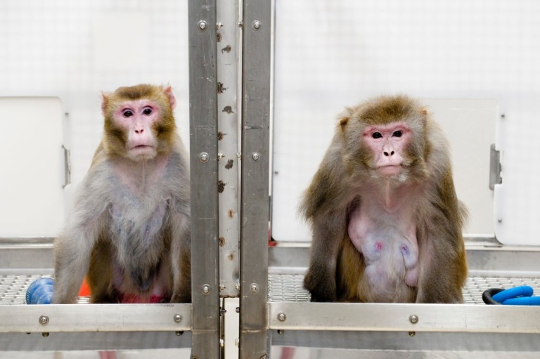
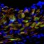

Calorie restriction lets monkeys live long and prosper

# Calorie restriction lets monkeys live long and prosper

 January 17, 2017   | By [Emily Kumlien](http://news.wisc.edu/calorie-restriction-lets-monkeys-live-long-and-prosper/mailto:ekumlien@uwhealth.org)   |

A 2009 image of rhesus monkeys in a landmark study of the benefits of caloric restriction. The 27-year-old monkey on the left was given a diet with fewer calories while the 29-year-old monkey on the right was allowed to eat as much as it liked. Both animals have since died of natural causes. Photo: [Jeff Miller](http://news.wisc.edu/calorie-restriction-lets-monkeys-live-long-and-prosper/mailto:photos@uc.wisc.edu)

Settling a persistent scientific controversy, a long-awaited report shows that restricting calories does indeed help rhesus monkeys live longer, healthier lives.

A remarkable collaboration between two competing research teams — one from the University of Wisconsin–Madison and one from the National Institute on Aging — is the first time the groups worked together to resolve one of the most controversial stories in aging research.

The findings by the collaboration — including Senior Scientist Ricki Colman of the [Wisconsin National Primate Research Center](https://www.primate.wisc.edu/) and UW–Madison Associate Professor of Medicine Rozalyn Anderson; and NIA Staff Scientist and Nonhuman Primate Core Facility Head Julie Mattison and Senior Investigator and Chief of the Translational Gerontology Branch Rafael de Cabo — were published today (Jan. 17, 2017) in the journal *[Nature Communications](http://www.nature.com/ncomms/)*.

In 2009, the UW–Madison study team reported significant benefits in survival and reductions in cancer, cardiovascular disease, and insulin resistance for monkeys that ate less than their peers. In 2012, however, the NIA study team reported no significant improvement in survival, but did find a trend toward improved health.

“These conflicting outcomes had cast a shadow of doubt on the translatability of the caloric-restriction paradigm as a means to understand aging and what creates age-related disease vulnerability,” says Anderson, one of the report’s corresponding authors. Working together, the competing laboratories analyzed data gathered over many years and including data from almost 200 monkeys from both studies. Now, scientists think they know why the studies showed different results.

> The upshot of the report is that caloric restriction does indeed seem to be a means to affect aging. However, for primates, age, diet and sex must all be factored in to realize the full benefits of lower caloric intake.

First, the animals in the two studies had their diets restricted at different ages. Comparative analysis reveals that eating less is beneficial in adult and older primates but is not beneficial for younger animals. This is a major departure from prior studies in rodents, where starting at an earlier age is better in achieving the benefits of a low-calorie diet.

Second, in the old-onset group of monkeys at NIA, the control monkeys ate less than the Wisconsin control group. This lower food intake was associated with improved survival compared to the Wisconsin controls. The previously reported lack of difference in survival between control and restricted groups for older-onset monkeys within NIA emerges as beneficial differences when compared to the UW–Madison data. In this way, it seems that small differences in food intake in primates could meaningfully affect aging and health.

Third, diet composition was substantially different between studies. The NIA monkeys ate naturally sourced foods and the UW–Madison monkeys, part of the colony at the Wisconsin National Primate Research Center, ate processed food with higher sugar content. The UW–Madison control animals were fatter than the control monkeys at NIA, indicating that at nonrestricted levels of food intake, what is eaten can make a big difference for fat mass and body composition.

Finally, the team identified key sex differences in the relationship between diet, adiposity (fat), and insulin sensitivity, where females seem to be less vulnerable to adverse effects of adiposity than males. This new insight appears to be particularly important in primates and likely is translatable to humans.

The upshot of the report is that caloric restriction does indeed seem to be a means to affect aging. However, for primates, age, diet and sex must all be factored in to realize the full benefits of lower caloric intake.

 Share  Tweet  Email

Tags: [aging](http://news.wisc.edu/tag/aging/), [animal research](http://news.wisc.edu/tag/animal-research/), [food](http://news.wisc.edu/tag/food/), [health](http://news.wisc.edu/tag/health/), [research](http://news.wisc.edu/tag/research/)

### You may also like…

- 

#### [Researchers make headway toward understanding Alexander disease](http://news.wisc.edu/researchers-make-headway-toward-understanding-alexander-disease/)

- 

#### [Researchers home in on why female newborns are better protected from brain injury](http://news.wisc.edu/researchers-hone-in-on-why-female-newborns-are-better-protected-from-brain-injury/)

- 

#### [Wisconsin researchers transform common cell to master heart cell](http://news.wisc.edu/wisconsin-researchers-transform-common-cell-to-master-heart-cell/)