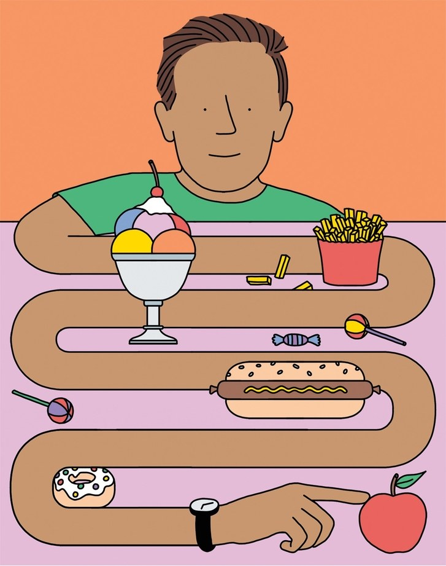

Can Brain Science Help Us Break Bad Habits?

[Books](https://www.newyorker.com/magazine/books)
[October 28, 2019 Issue](https://www.newyorker.com/magazine/2019/10/28)

# Can Brain Science Help Us Break Bad Habits?

## Studies suggest that relying on will power is hopeless. Instead, we must find strategies that don’t require us to be strong.

By [Jerome Groopman](https://www.newyorker.com/contributors/jerome-groopman)
October 21, 2019

*
Because the brain forms habits unconsciously, resolutions rarely work.
*Illustration by Jan Buchczik

Several years ago, I bought a smartphone and soon came to love it. Being able to send an e-mail, look up a fact, or buy something no matter where I was meant a previously unimaginable gain in productivity. Every time I got an e-mail, the phone emitted a ping and I would deal with whatever it was, priding myself on my efficiency. Texts arrived with the tones of a French horn and were similarly dispatched. Soon, I was reaching for the device every time it made a sound, like Pavlov’s dog salivating when it heard a bell. This started to interfere with work and conversations. The machine had seemed like a miraculous servant, but gradually I became its slave.

I’d always prided myself on my will power. Like most people who’ve made it through medical training—with its early mornings and its long shifts when your friends are partying—I had an established track record of delaying gratification. It didn’t matter. When I tried switching the phone to silent, I ended up checking it perhaps even more often, *just in case* there was something to deal with. The only time I managed to resist was during Shabbos, when I don’t read e-mail. But I’d be watching the clock, counting the hours till I could turn the thing on. For the first time, I could imagine what it’s like to be a smoker craving a cigarette. Checking the smartphone had become a bad habit that I couldn’t break.

Habits, good and bad, have long fascinated philosophers and policymakers. Aristotle, in the Nicomachean Ethics, surveyed existing notions of virtue and offered this summary: “Some thinkers hold that it is by nature that people become good, others that it is by habit, and others that it is by instruction.” He concluded that habits were responsible. Cicero called habit “second nature,” a phrase that we still use. And when Alexander Hamilton, in Federalist Paper No. 27, considered how to create citizens who would obey the federal laws of the newly formed republic, he used another proverbial phrase: “Man is very much a creature of habit.” If federal law permeated matters at the state level, it would seem part of everyday life. “The more it circulates through those channels and currents in which the passions of mankind naturally flow, the less will it require the aid of the violent and perilous expedients of compulsion,” he wrote.

In the modern era, habits have become a significant area of scientific inquiry. Psychologists have explored the genesis of habitual behavior and its impact on health and happiness. William James, echoing Aristotle, wrote, “All our life, so far as it has definite form, is but a mass of habits,—practical, emotional, and intellectual . . . bearing us irresistibly toward our destiny.”

Few of us like to think of ourselves in such passive terms. What about will power? Marketers flatter our sense of agency with slogans like “Just Do It” (Nike) and “Declare Your Path” (New Balance). Much popular psychology, too, bolsters our belief in self-control. In the famous Stanford marshmallow experiment, devised by Walter Mischel, in the nineteen-sixties, children were seated alone in front of a marshmallow and were scored on whether they resisted gobbling it down. The resulting determination of a child’s level of “executive function” supposedly distinguishes life’s winners and losers, predicting such things as performance on the SAT, duration of relationships, and career success. But how can that be, if we’re just creatures of habit?

In “[Good Habits, Bad Habits](https://www.amazon.com/dp/1250159075/?tag=thneyo0f-20)” (Farrar, Straus & Giroux), the social psychologist Wendy Wood refutes both James’s determinism and glib exhortations to be proactive, and seeks to give the general reader more realistic ideas for how to break habits. Drawing on her work in the field, she sees the task of sustaining positive behaviors and quelling negative ones as involving an interplay of decisions and unconscious factors. Our minds, Wood explains, have “multiple separate but interconnected mechanisms that guide behavior.” But we are aware only of our decision-making ability—a phenomenon known as the “introspection illusion”—and that may be why we overestimate its power. The executive functions that make will power possible give us, she writes, “the sense of agency that we recognize as ‘me.’ ” But that comes at a cost in terms of effort. To go about our lives, we need to make some behaviors automatic.

Functional MRI scans have given researchers a peek into the respective neural networks that are active during rote and conscious tasks. A brain scan of someone learning a task shows activity in the prefrontal cortex and the hippocampus, networks associated with decision-making and executive control. With repetition of a task, brain activity moves into areas of the putamen and the basal ganglia, deep in what Wood calls “the rudimentary machinery of our minds.” There, a task is turned into a habit.

These more primitive areas of the brain demand less of our mental energy. Whole sequences of actions become linked, a process known as “chunking.” When we get into a car and drive off, we don’t need to think about the separate actions of buckling a seat belt, turning on the ignition, putting the car in drive, checking the mirrors and the blind spot, and pressing the gas pedal. All these steps, chunked into a single unit in the memory, are triggered by the environmental cue of getting into your car. This frees us up to concentrate on what most requires conscious attention. We can think about where we’re going or the day’s tasks, and keep an eye out for anything unusual on the road.

MORE FROM THIS ISSUE
[October 28, 2019](https://www.newyorker.com/magazine/2019/10/28)

[(L)](https://www.newyorker.com/magazine/2019/10/28/astrology-in-the-age-of-uncertainty)

[Modern Life](https://www.newyorker.com/magazine/modern-life)

[Astrology in the Age of Uncertainty](https://www.newyorker.com/magazine/2019/10/28/astrology-in-the-age-of-uncertainty)

By [Christine Smallwood](https://www.newyorker.com/contributors/christine-smallwood)

[(L)](https://www.newyorker.com/magazine/2019/10/28/the-real-nature-of-thomas-edisons-genius)

[Books](https://www.newyorker.com/magazine/books)

[The Real Nature of Thomas Edison’s Genius](https://www.newyorker.com/magazine/2019/10/28/the-real-nature-of-thomas-edisons-genius)

By [Casey Cep](https://www.newyorker.com/contributors/casey-cep)
[(L)](https://www.newyorker.com/magazine/2019/10/28/the-ghosts-of-yaddo-act-up)
[The Creative Life](https://www.newyorker.com/magazine/the-creative-life)

[The Ghosts of Yaddo Act Up](https://www.newyorker.com/magazine/2019/10/28/the-ghosts-of-yaddo-act-up)

By [Sarah Larson](https://www.newyorker.com/contributors/sarah-larson)

[(L)](https://www.newyorker.com/magazine/2019/10/28/your-immortality-application)

[Shouts & Murmurs](https://www.newyorker.com/magazine/shouts-murmurs)

[Your Immortality Application](https://www.newyorker.com/magazine/2019/10/28/your-immortality-application)

By [Cora Frazier](https://www.newyorker.com/contributors/cora-frazier)
[(L)](https://www.newyorker.com/magazine/2019/10/28/the-bunty-club)
[Fiction](https://www.newyorker.com/magazine/fiction)

[“The Bunty Club”](https://www.newyorker.com/magazine/2019/10/28/the-bunty-club)

By [Tessa Hadley](https://www.newyorker.com/contributors/tessa-hadley)

[(L)](https://www.newyorker.com/magazine/2019/10/28/golden-diner-updates-the-greasy-spoon-tradition)

[Tables for Two](https://www.newyorker.com/magazine/tables-for-two)

[Golden Diner Updates the Greasy-Spoon Tradition](https://www.newyorker.com/magazine/2019/10/28/golden-diner-updates-the-greasy-spoon-tradition)

By [Hannah Goldfield](https://www.newyorker.com/contributors/hannah-goldfield)
Advertisement

Wood’s research originally focussed not on habits but on persistence. For “one-off, occasional behaviors,” like getting a flu shot, conscious decisions were all that was required. For behaviors involving repetition, though, habits were crucial. William James estimated that “ninety-nine hundredths or, possibly, nine hundred and ninety-nine thousandths of our activity is purely automatic and habitual.” This was a guess; Wood, however, devised a study to quantify just how often people act out of habit. Using a research technique known as experience sampling, she had participants spend two days recording what they did while they were doing it. Results varied across the groups studied, but the basic finding was that our actions are habitual forty-three per cent of the time.

### Video From The New Yorker

[### Pete Buttigieg Discusses America’s Crisis of Belonging](https://video.newyorker.com/watch/the-new-yorker-festival-pete-buttigieg/)

This explains why conscious knowledge is not in itself enough to change behavior, and why public-health initiatives that educate people about healthy choices tend to fail. In 1991, the National Cancer Institute determined that only eight per cent of Americans were aware of the recommendation to eat at least five servings of fruit and vegetables daily. A national campaign was declared: 5 a Day for Better Health. Six years later, thirty-nine per cent of Americans knew about five servings a day, a nearly fivefold increase, but actual diets had barely changed. In 2007, government officials tried again, launching a program called Fruits & Veggies—More Matters. Even so, by 2018 only twelve per cent of Americans ate the recommended two servings of fruit daily, and only nine per cent ate three servings of vegetables. Simply informing us of what’s good for us doesn’t work, because so much of our eating, cooking, and shopping is governed by habit.

In Mischel’s marshmallow experiment, only a quarter of the subjects were able to resist eating the marshmallow for fifteen minutes. This implies that a large majority of us lack the self-control required to succeed in life. But a less discussed part of the study suggests a way of circumventing our frailty. The researchers compared the results of two situations: in one, children could see the marshmallow in front of them; in the other, they knew that it was there but couldn’t see it. On average, the children lasted only six minutes when presented with visible temptation but could manage ten minutes if the treat was hidden. For Wood, this outcome shows that self-control is “not so much an inherent disposition but instead a reflection of the situation we are in.” A few tweaks to our environment may enable us to emulate people who seem more disciplined.

A study of self-control among college students bears out this hypothesis. The students were told to report every time they thought, “Oops, I shouldn’t do this”—for instance, when they stayed up too late, overslept, overate, or procrastinated. They were most successful at adopting productive behaviors not when they resolved to do better, or distracted themselves from temptation, but when they altered their environment. Instead of studying on a couch in a dorm, with a TV close by, they went to the library. They ate better when they removed junk food from the dorm refrigerator. “Successful self-control,” Wood writes, “came from essentially covering up the marshmallow.”

Even people who score high on self-control questionnaires may owe their apparent virtue to situational factors rather than to sheer fortitude. A study of such people in Germany found that they reported resisting temptation surprisingly rarely. “They were living their lives in a way that hid the marshmallow almost all the time,” Wood writes. This observation leads to the crux of her book’s thesis: the path to breaking bad habits lies not in resolve but in restructuring our environment in ways that sustain good behaviors. Wood cites the psychologist Kurt Lewin, who argued that behavior was influenced by “a constellation of forces” analogous to gravity or to the fluid dynamics that make a river run faster or slower. Those forces work depending on where you are, who’s around you, the time of day, and your recent actions. We achieve situational control, paradoxically, not through will power but by finding ways to take will power out of the equation.

The central force for eliminating bad habits, according to Wood, is “friction”: if we can make bad habits more inconvenient, then inertia can carry us in the direction of virtue, without ever requiring us to be strong. She cites the ways in which increased friction has produced a decline in smoking: laws that ban it in restaurants, bars, airplanes, and trains; taxes that have helped triple the price of cigarettes in the U.S. in the past twenty years; the purge of cigarettes from vending machines, and of tobacco ads from TV and the radio.

Meanwhile, however, businesses all around us try to reduce friction. A cashier taking an order at McDonald’s is scripted to ask, “Would you like fries with that?” This simple question encourages us to eat more fat and carbs. Binge-watching on Netflix or Hulu is facilitated by the way that the next episode starts automatically as the credits roll on the previous one. Wood talks to M. Keith Chen, a former head of economic research for Uber, who explains that the app was designed to minimize friction. “The phone’s GPS knows where you are,” he says. “You don’t even need to think about it. . . . You get out without handling cash.”

The tendency of companies to act as our enablers was extensively examined in Charles Duhigg’s best-seller “[The Power of Habit](https://www.amazon.com/dp/081298160X/?tag=thneyo0f-20)” (2012). Like Wood, Duhigg, who when he wrote the book was a reporter at the *Times*, notes ways that the fast-food industry designs prompts to make us consume more. McDonald’s standardizes the appearance of its restaurants, in order to trigger habitual eating routines. The foods at many chains are specifically engineered to deliver bursts of salt and fat that immediately light up the reward centers of the brain.

Examining corporate efforts to capitalize on habit formation, Duhigg describes the work of an early-twentieth-century advertising guru, Claude C. Hopkins, whose campaign for Pepsodent toothpaste is said to have established toothbrushing as habitual among Americans. When Pepsodent first appeared, in 1915, few people bothered to brush their teeth, and a leading dental researcher of the time pronounced all toothpastes useless. Hopkins focussed his marketing message on the film of plaque that covers our teeth; in 1917, his newspaper ads proclaimed it “the basic cause of all tooth troubles.” In fact, plaque can be temporarily removed simply by eating an apple, and toothpastes of the time didn’t remove any more of it than brushing without toothpaste did. Nevertheless, Hopkins set about amping up the dangers of plaque and telling the public that Pepsodent was the only way to get rid of it. “Just run your tongue across your teeth,” another ad read. “*You’ll feel a film*—that’s what makes your teeth look ‘off color’ and invites decay.” In just a few years, Pepsodent had become one of the best-known products in the world.

Duhigg, like Wood, sees habitual routines as being driven by cues and rewards. Pepsodent wasn’t the only brand that claimed to remove the film on teeth, but ingredients that it used to insure a fresh taste, such as citric acid and mint oil, also happened to be mild irritants, which produced a satisfying tingle in the mouth. If Hopkins, by making consumers aware of the film on their teeth, had created a cue, the toothpaste itself provided a physical reward. Such loops of cue and reward are powerful: if we haven’t brushed our teeth, something feels wrong. Two decades after Hopkins launched his campaign, using toothpaste had become the norm for a sizable majority of the U.S. population. Hopkins, as Duhigg puts it, had “created a craving.”

Where Wood emphasizes situational control as a way of making good habits easy, Duhigg writes about a woman who bites her nails and is advised to find something else to do with her hands that will produce a comparable physical stimulation, such as rapping her knuckles on a desk. The idea is to keep the powerful structure of cue and reward intact but to tweak the content of the routine. For both writers, though, the key lies not in breaking a habit through will power but in replacing one habit with another.

Both, too, emphasize the role of conscious effort—not in resisting habit but in analyzing it, the better to formulate a strategy for reform. Duhigg describes how, after having gained some weight, he gave up getting a cookie each afternoon in the *Times* cafeteria. Putting a no-cookie injunction on a Post-it note was a non-starter: he’d ignore it, wander to the cafeteria, chat with colleagues at the cash register, and buy and eat his cookie. So he set about identifying the trigger for his habit, adopting five categories proposed by researchers: time, place, emotional state, other people, and the action immediately preceding the habitual one. Was he hungry, or bored, or in need of a break or a blood-sugar boost? He switched up his routine, eating a doughnut at his desk instead of visiting the cafeteria, or taking a brief stroll outside. He was testing hypotheses: if eating the doughnut at his desk didn’t sate the urge to go to the cafeteria, he could rule out sugar. By a process of elimination, he determined that his habit was really driven by a need for interaction and distraction. The best replacement for a cookie turned out to be going over to a friend’s desk to chat.

Wood ends her book with advice for those of us who have become hostages to our smartphones. She offers a stepwise strategy. First, recognize your dependency, and acknowledge how the habit disrupts work, social interactions, and safe driving. Next, “control the context cues,” meaning identify what triggers you to grab the phone. For me, the cues are aural (the ping, the French horn) and visual (pop-ups on the screen). I already knew that putting the phone on silent wasn’t enough to break the habit, but, as in the marshmallow experiment, out of sight could be out of mind. In the mornings, preparing breakfast, I found that it helped to leave the phone in another room. In the car, it went in the glove compartment. When walking around, I’d put it in a zippered pocket. There were other ways of generating friction and making the habit harder to indulge. Turning the phone off completely was much more effective than silencing it, not because I wasn’t curious about who might have e-mailed me but because turning it back on was a hassle.

Wood advises us to come up with new rewards as substitutes for the ones the phone provided. I listened to music on the car radio. In the evening, instead of scrolling through tweets and e-mails, I sought out authors I’d never read. At the end of each day, I felt calmer, and free. ♦

*Published in the print edition of the [October 28, 2019](https://www.newyorker.com/magazine/2019/10/28), issue, with the headline “The Resistance.”*

- Jerome Groopman, a staff writer at The New Yorker since 1998, writes primarily about medicine and biology. His latest book is “[Your Medical Mind: How to Decide What Is Right for You](https://www.amazon.com/dp/014312224X/?tag=thneyo0f-20),” with Dr. Pamela Hartzband.

[Read more »](https://www.newyorker.com/contributors/jerome-groopman)
More:

- [Magazine](https://www.newyorker.com/tag/magazine)
- [Habits](https://www.newyorker.com/tag/habits)
- [Self-help](https://www.newyorker.com/tag/self-help)
- [Psychology](https://www.newyorker.com/tag/psychology)
- [Marshmallows](https://www.newyorker.com/tag/marshmallows)
- [Experiments](https://www.newyorker.com/tag/experiments)

Get book recommendations, fiction, poetry, and dispatches from the world of literature in your in-box. Sign up for the Books & Fiction newsletter.

### Most Popular

- 1.

Letter from Trump’s Washington[##### “He’s No Mr. Nice Guy”: Impeachment Comes for Trump](https://www.newyorker.com/news/letter-from-trumps-washington/hes-no-mr-nice-guy-impeachment-comes-for-donald-trump)

By [Susan B. Glasser](https://www.newyorker.com/contributors/susan-b-glasser)

- 2.

A Reporter at Large[##### A Cybersecurity Firm’s Sharp Rise and Stunning Collapse](https://www.newyorker.com/magazine/2019/11/04/a-cybersecurity-firms-sharp-rise-and-stunning-collapse)

By [Raffi Khatchadourian](https://www.newyorker.com/contributors/raffi-khatchadourian)

- 3.

A Critic at Large[##### Why We Can’t Tell the Truth About Aging](https://www.newyorker.com/magazine/2019/11/04/why-we-cant-tell-the-truth-about-aging)

By [Arthur Krystal](https://www.newyorker.com/contributors/arthur-krystal)

- 4.

Our Columnists[##### How Trump’s Supporters Distort Alexander Vindman’s Very American Origin Story](https://www.newyorker.com/news/our-columnists/how-trumps-supporters-distort-alexander-vindmans-very-american-origin-story)

By [Masha Gessen](https://www.newyorker.com/contributors/masha-gessen)

- 5.

Dispatch[##### After ICE Came to Morton, Mississippi](https://www.newyorker.com/news/dispatch/after-ice-came-to-morton-mississippi)

By [Charles Bethea](https://www.newyorker.com/contributors/charles-bethea)

[our thirty most popular»](https://www.newyorker.com/popular?intcid=most-popular)

[](https://adclick.g.doubleclick.net/pcs/click?xai=AKAOjssHqjOcHqpUsIIH6wsDNTg81dY3Q0vojkMoPPiTZBylh-oeQX4u42qTs7bh_MGNtX-_NceuKoEFyHJmgnEu_n75004hCxu4dTNRDP_dVmj9bPtAA-m08DpQbVYtJmbPwhlw01S9kj_rQS3xIyskP3snDxaYUtSuVDdHHyKVcz0Q82e4xAA1iRNTMCURWh5nG6IGDl0BAmi3IDCTUs2YSwP1NzNrYMHFl4B2nj1X_yE0_Mq0sBCygAugMCQ8LTHjVtScy5dW4rKtARj_01LbrOVU0qTn98AVEmCpW-CvgA&sai=AMfl-YTNNPc_jV54m8MR-TI7CeOfSBN4ojRgQVxTbAswZaXvdXMnuPDN5DGwT1ne4m0dc0J2hyegomBRFAk9RY1YV2r_dpHJKPBgdft5G8_f&sig=Cg0ArKJSzG19jBMHvMulEAE&urlfix=1&adurl=https://adclick.g.doubleclick.net/pcs/click?xai=AKAOjssCY4sn-pAi89AMSL_eVVwjLdMIpi3-sqp_DqbTFMhBR-TSRdTgfxfmfdgZ3YLnLfByUPzxL_35p03yUKfuI0dOKOeprCXRv7unslvrpNa42SBTRbpabBnqrKSz9oSvmV65qmBpWDUMawKJMM7tGYt6S8NUMTJxm1Tb1ZnAPguiBblX9up9NC9fvSLOgugK_Cng5tsfFMJHkgKon5DU-Yt8vCcPmHNBdNJD2XUIw8s8AfMk58QIm9pypRhkjJJVzQ--WR2zN57v3pIlqgOX622UohzZygfp1ZNa4N9KwwgYt9zAcEHp_-l-J6RzFhZGTCJvuiWclyRXB41xXxGvZQJTkChXJc4JqsByDgDU7qzHSYHm4f3ARXvN4RYXqqQyTCx4pP6daWwIbwNUh3J-w7wBsPJcGx_Tro4If2v5pBLHPvcQ3aINvXdF7aukeHXOHZMNU0CuxwMdd3k8um4F9Ieo9CPoKV1sRKrIXTKPEuZ-66DRU3lH5P6RWW-G3krn16sAXfVqRXexgBMNieJroy0MSIwtdL1UDdXQjzFgFuvLQ4lUmeZ3jTSIcTZG_yMnjIP-mtwo9Co02tXXv7p6fgGXzMk8U4Hu74su-6hI6VJysULBHSWWb1zMCchGdd1QZEnCWzfIyl1LCcEKddHifsnzd9fiJXUte0fIg7FKGQ8_-3nSzBy2xoOiKQrATg434598SLuWiP9hSTlIqHrUywo5ipy8NamfSY3i192sfCnjxlN6c8Q6hKquHcr_FoNrqc6KQXGDA6wVNq-5oUZ_hY9GzyFL2b2MZxxcb3OuOBUhCT9ogSrfgznuDK_q_4dh9UMCv1fFbYo1zUx963PVkWrfZI4Cg7cf7tiDRLLQahWFgdf1qg02yzBg9KiLs55cjMhMv2s5UdlBozle4r1a4milzqIMJD1rICumuiU8Dgg-fxUtcvZe5Q&sai=AMfl-YTYMwwiDS6YuzbwjpurVi3pVUB_BmHWQv3Cd7j4M-KGOOERg90b7eY8II50tQS3rHo3P8hYuxZhzFGNFsjafr_DIGh6RCGrKWUy7vZavY8ZQXFPNQckwJPhzQ-ivmygahE&sig=Cg0ArKJSzLF3K9D5VjPMEAE&urlfix=1&adurl=https://www.rosewoodhotels.com/en/default%3Futm_medium%3DDISPLAY-WW-LOC%26utm_source%3DCNUS%26utm_campaign%3D20191101-RW-WW-2HBRANDINGCAMPAIGN2019%26utm_content%3D300X600%26utm_term%3DEN)

- [**](https://www.facebook.com/sharer/sharer.php?u=https%3A%2F%2Fwww.newyorker.com%2Fmagazine%2F2019%2F10%2F28%2Fcan-brain-science-help-us-break-bad-habits&display=popup&ref=plugin)
- [**](https://twitter.com/intent/tweet?original_referer=https%3A%2F%2Fwww.newyorker.com%2Fmagazine%2F2019%2F10%2F28%2Fcan-brain-science-help-us-break-bad-habits&text=Can%20Brain%20Science%20Help%20Us%20Break%20Bad%20Habits%3F&tw_p=tweetbutton&url=https%3A%2F%2Fwww.newyorker.com%2Fmagazine%2F2019%2F10%2F28%2Fcan-brain-science-help-us-break-bad-habits)
- [**](https://www.newyorker.com/magazine/2019/10/28/can-brain-science-help-us-break-bad-habits?utm_content=buffer13345&utm_medium=Arianna&utm_source=LinkedIn&utm_campaign=Buffermailto:?subject=From%20newyorker.com:%20Can%20Brain%20Science%20Help%20Us%20Break%20Bad%20Habits%3F&body=Studies%20suggest%20that%20relying%20on%20will%20power%20is%20hopeless.%20Instead%2C%20we%20must%20find%20strategies%20that%20don%E2%80%99t%20require%20us%20to%20be%20strong.%C2%A0%0D%0Ahttps%3A%2F%2Fwww.newyorker.com%2Fmagazine%2F2019%2F10%2F28%2Fcan-brain-science-help-us-break-bad-habits)
- [**](https://www.newyorker.com/magazine/2019/10/28/can-brain-science-help-us-break-bad-habits?utm_content=buffer13345&utm_medium=Arianna&utm_source=LinkedIn&utm_campaign=Buffer#)

##### Recommended Stories

[A Critic at Large](https://www.newyorker.com/magazine/a-critic-at-large)[## Improving Ourselves to Death](https://www.newyorker.com/magazine/2018/01/15/improving-ourselves-to-death)

## What the self-help gurus and their critics reveal about our times.

By [Alexandra Schwartz](http://www.newyorker.com/contributors/alexandra-schwartz)

Jan. 08, 2018

[Books](https://www.newyorker.com/magazine/books)[## The Efficiency Trap](http://www.newyorker.com/magazine/2016/03/28/smarter-faster-better-the-secrets-of-being-productive-in-life-and-business)

## Questioning the self-help books that promise us success at work and at home.

By [Louis Menand](http://www.newyorker.com/contributors/louis-menand)
Mar. 21, 2016

Letter from Trump’s Washington[## “He’s No Mr. Nice Guy”: Impeachment Comes for Trump](https://www.newyorker.com/news/letter-from-trumps-washington/hes-no-mr-nice-guy-impeachment-comes-for-donald-trump)

## The President says that he wants to argue the facts, but the facts are bad for him—and are getting worse.

By [Susan B. Glasser](https://www.newyorker.com/contributors/susan-b-glasser)
Oct. 31, 2019

A Reporter at Large[## A Cybersecurity Firm’s Sharp Rise and Stunning Collapse](https://www.newyorker.com/magazine/2019/11/04/a-cybersecurity-firms-sharp-rise-and-stunning-collapse)

## Tiversa dominated an emerging online market—before it was accused of fraud, extortion, and manipulating the federal government.

By [Raffi Khatchadourian](https://www.newyorker.com/contributors/raffi-khatchadourian)

#### [Listen to the New Yorker Radio Hour](https://www.newyorker.com/podcast/the-new-yorker-radio-hour)·

#### [Buy the Cover](http://www.condenaststore.com/-st/New-Yorker-Covers-Prints_c147247_.htm)·

#### [Play the Crossword](https://www.newyorker.com/crossword)·

#### [Play the Jigsaw Puzzle](https://www.newyorker.com/jigsaw)

#### [News & Politics](https://www.newyorker.com/news)

- [Daily Comment](https://www.newyorker.com/news/daily-comment)
- [Our Columnists](https://www.newyorker.com/news/our-columnists)
- [News Desk](https://www.newyorker.com/news/news-desk)

#### [Culture](https://www.newyorker.com/culture)

- [Cultural Comment](https://www.newyorker.com/culture/cultural-comment)
- [Culture Desk](https://www.newyorker.com/culture/culture-desk)
- [Goings On About Town](https://www.newyorker.com/goings-on-about-town)
- [The Critics](https://www.newyorker.com/magazine/critics)

#### [Business, Science & Tech](https://www.newyorker.com/business)

- [Currency](https://www.newyorker.com/business/currency)
- [Elements](https://www.newyorker.com/tech/elements)

#### [Humor](https://www.newyorker.com/humor)

- [Daily Shouts](https://www.newyorker.com/humor/daily-shouts)
- [Shouts & Murmurs](https://www.newyorker.com/magazine/shouts-murmurs)
- [The Borowitz Report](https://www.newyorker.com/humor/borowitz-report)

#### [Cartoons](https://www.newyorker.com/cartoons)

- [Daily Cartoon](https://www.newyorker.com/cartoons/daily-cartoon)
- [Cartoon Caption Contest](http://contest.newyorker.com/)
- [Cartoon Bank](https://condenaststore.com/conde-nast-brand/cartoonbank?utm_medium=referral)

#### [Books & Fiction](https://www.newyorker.com/books)

- [Page-Turner](https://www.newyorker.com/books/page-turner)
- [Books](https://www.newyorker.com/magazine/books)
- [Poems](https://www.newyorker.com/magazine/poems)
- [Fiction](https://www.newyorker.com/magazine/fiction)

#### [Magazine](https://www.newyorker.com/magazine)

- [This Week's Issue](https://www.newyorker.com/magazine)
- [Archive](https://www.newyorker.com/archive)
- [Subscribe](https://www.newyorker.com/subscribe)

#### [Photography](https://www.newyorker.com/tag/photography)

- [Photo Booth](https://www.newyorker.com/culture/photo-booth)
- [Portfolio](https://www.newyorker.com/magazine/portfolio)

#### [Video](http://video.newyorker.com/)

- [Culture](http://video.newyorker.com/genres/Culture)
- [Humor](http://video.newyorker.com/genres/Humor)
- [News](http://video.newyorker.com/genres/News)
- [Politics](http://video.newyorker.com/genres/Politics)
- [Science & Tech](http://video.newyorker.com/genres/Science%20&%20Tech)
- [Sports](http://video.newyorker.com/genres/Sports)

#### [Podcasts](https://www.newyorker.com/podcast)

- [The New Yorker Radio Hour](https://www.newyorker.com/podcast/the-new-yorker-radio-hour)
- [Political Scene](https://www.newyorker.com/podcast/political-scene)
- [The Writer's Voice](https://www.newyorker.com/podcast/the-authors-voice)
- [Fiction](https://www.newyorker.com/podcast/fiction)
- [Poetry](https://www.newyorker.com/podcast/poetry)

#### More

- [Customer Care](http://w1.buysub.com/servlet/CSGateway?cds_mag_code=NYR)
- [Buy the Cover](http://www.condenaststore.com/-st/New-Yorker-Covers-Prints_c147247_.htm)
- [Apps](https://www.newyorker.com/digital-editions)
- [Crossword Puzzle](https://www.newyorker.com/crossword)
- [Jigsaw Puzzle](https://www.newyorker.com/jigsaw)
- [SecureDrop](https://projects.newyorker.com/securedrop/)
- [Store](http://www.condenaststore.com/~/new-yorker-store)
- [RSS](https://www.newyorker.com/about/feeds)
- [Site Map](https://www.newyorker.com/sitemap)

#### [Newsletters](https://www.newyorker.com/newsletters)

- [The Daily](https://www.newyorker.com/newsletters/daily-newsletter)
- [The New Yorker Recommends](https://www.newyorker.com/newsletters/culture-review-newsletter)
- [Daily Humor](https://www.newyorker.com/newsletters/send-me-the-cartoon-chronicle-newsletter)
- [John Cassidy](https://www.newyorker.com/newsletters/john-cassidy-newsletter)
- [The Borowitz Report](https://www.newyorker.com/newsletters/andy-borowitz-newsletter)
- [Amy Davidson Sorkin](https://www.newyorker.com/home/about/sign-up-for-amy-davidson-sorkins-newsletter)
- [Midterms 2018](https://www.newyorker.com/home/about/sign-up-for-the-new-yorker-midterms-2018-newsletter)
- [Food](https://www.newyorker.com/home/about/sign-up-for-the-new-yorker-food-newsletter)

#### [About Us](https://www.newyorker.com/about/us)

- [About](https://www.newyorker.com/about/us)
- [Careers](https://www.newyorker.com/about/careers)
- [Contact](https://www.newyorker.com/about/contact)
- [FAQ](https://www.newyorker.com/about/faq)
- [Media Kit](http://www.condenast.com/brands/the-new-yorker)
- [Press](https://www.newyorker.com/about/press)
- [Accessibility Help](https://www.newyorker.com/about/accessibility-help/)

#### Follow Us

[![](data:image/svg+xml,%3csvg width='21' height='20' viewBox='0 0 21 20' xmlns='http://www.w3.org/2000/svg' xmlns:xlink='http://www.w3.org/1999/xlink' data-evernote-id='286' class='js-evernote-checked'%3e%3cdefs data-evernote-id='1142' class='js-evernote-checked'%3e%3cpath id='a' d='M20.3 19H0V0h20.3z' data-evernote-id='1143' class='js-evernote-checked'%3e%3c/path%3e%3c/defs%3e%3cg fill='none' fill-rule='evenodd' data-evernote-id='1144' class='js-evernote-checked'%3e%3cpath d='M10.3 19H10c-1.2 0-2-.6-2.7-1.2-.5-.3-1-.7-1.5-.7H4c-.3 0-.4.2-.5.2-.2 0-.3 0-.3-.2v-.5l-.4-.6c-2-.4-2.4-.8-2.6-1v-.2s0-.2.2-.2c3-.5 4-3.4 4.2-3.6.2-.3.2-.6 0-1 0-.4-.7-.6-1.2-.7h-.2c-1-.4-1-.8-1-1 0-.2.5-.4.8-.4h.3l1 .2c.4 0 .6-.2.6-.2v-.6c-.2-1.4-.3-3 0-4 1.4-3 4-3 5-3h.3c.8 0 3.6 0 4.8 3 .6 1 .5 2.6.4 4V8s0 .2.5.2c.2 0 .5 0 1-.3 0 0 0-.2.2-.2h.3c.3.2.5.4.5.6 0 .2-.2.5-1 .8H17c-.4.2-1 .4-1.2 1v.8c0 .2 1.4 3 4.3 3.6v.2c0 .4-.6.8-2.5 1-.2 0-.2.3-.3.7v.5l-.4.2h-.4c-.3-.2-.7-.2-1-.2h-1c-.5 0-1 .5-1.5.8-.8.6-1.6 1-2.7 1' fill='%23DDD' data-evernote-id='1145' class='js-evernote-checked'%3e%3c/path%3e%3cg transform='translate(0 .02)' data-evernote-id='1146' class='js-evernote-checked'%3e%3cmask id='b' fill='%23ddd' data-evernote-id='1147' class='js-evernote-checked'%3e%3c/mask%3e%3cpath d='M10.3 0H10C9 0 6.2.3 5 3.3c-.5 1-.4 2.7-.3 4V8h-.4c-.3 0-.6 0-1-.3H3c-.4 0-1 .2-1 .6 0 .3 0 .7 1 1l.4.2c.4 0 1 .3 1 .7.2.2.2.4 0 .7 0 0-1.3 3-4 3.3-.3 0-.4.3-.4.5v.2c.3.4 1 .8 2.7 1 0 0 0 .4.2.5v.5c0 .2 0 .4.5.4H4c.2-.2.5-.2 1-.2h.8c.5 0 1 .4 1.4.8.7.5 1.6 1 2.8 1h.3c1.2 0 2-.5 2.7-1 .5-.4 1-.7 1.5-.8h2.3c.3 0 .4 0 .5-.2v-.5l.2-.5c1.6-.2 2.5-.6 2.7-1v-.2c0-.2 0-.4-.3-.5C17 14 16 11 16 11c-.3-.4-.3-.6-.2-.8 0-.4.7-.6 1-.7h.4c.7-.4 1-.7 1-1 0-.4-.2-.7-.6-.8h-.4-.4l-1 .2h-.2v-.6c0-1.4.2-3-.3-4-1.3-3-4-3.4-5-3.4m0 .5c.8 0 3.4.2 4.7 3 .4 1 .3 2.5.2 3.8V8s.2.3.7.4c.2 0 .6 0 1-.3h.4l.4.4s0 .3-.8.6h-.2c-.5.2-1.2.5-1.4 1-.2.3 0 .7 0 1 .2.3 1.5 3.3 4.4 3.8 0 0-.3.5-2.3.8-.3 0-.4.4-.5.8v.5h-.2-.4c-.3-.2-.6-.2-1-.2h-1c-.6 0-1 .5-1.6.8-.7.5-1.4 1-2.5 1H10c-1 0-1.8-.5-2.5-1-.6-.3-1-.7-1.7-.8h-2-.3c-.2 0-.2-.2-.2-.4 0-.4-.2-.7-.5-.8-2-.3-2.3-.7-2.4-.8 3-.5 4.3-3.5 4.4-3.7.2-.3.2-.7 0-1 0-.5-.8-.8-1.3-1h-.3c-.6-.2-.8-.5-.7-.6 0-.2.3-.4.5-.4h.2c.4.3.8.4 1 .4.6 0 .8-.3 1-.3v-.7c-.2-1.3-.3-3 0-4C6.6.8 9.3.6 10 .6h.3' fill='%23DDD' mask='url(%23b)' data-evernote-id='1149' class='js-evernote-checked'%3e%3c/path%3e%3c/g%3e%3c/g%3e%3c/svg%3e)](https://www.snapchat.com/add/newyorkermag)[' data-evernote-id='1153' class='js-evernote-checked'%3e%3cg id='FOLLOW' transform='translate(850.000000%2c 528.000000)' data-evernote-id='1154' class='js-evernote-checked'%3e%3cg id='YT' transform='translate(2.000000%2c 79.000000)' data-evernote-id='1155' class='js-evernote-checked'%3e%3cmask fill='white' id='mask-2' data-evernote-id='1156' class='js-evernote-checked'%3e%3c/mask%3e%3cg id='Clip-2' data-evernote-id='1158' class='js-evernote-checked'%3e%3c/g%3e%3cpath d='M11.2732128%2c13.6774465 L11.2719054%2c5.6941363 L18.949235%2c9.69969958 L11.2732128%2c13.6774465 Z M28.1293185%2c4.31113213 C28.1293185%2c4.31113213 27.8516551%2c2.35316273 26.9997775%2c1.49093741 C25.9193324%2c0.35925452 24.7082615%2c0.353663421 24.152879%2c0.287404729 C20.1768846%2c5.56328223e-06 14.2126843%2c5.56328223e-06 14.2126843%2c5.56328223e-06 L14.2003338%2c5.56328223e-06 C14.2003338%2c5.56328223e-06 8.2362726%2c5.56328223e-06 4.26013908%2c0.287404729 C3.70472879%2c0.353663421 2.49410292%2c0.35925452 1.41326843%2c1.49093741 C0.561363004%2c2.35316273 0.284144645%2c4.31113213 0.284144645%2c4.31113213 C0.284144645%2c4.31113213 0%2c6.6104089 0%2c8.90971349 L0%2c11.0652907 C0%2c13.3645396 0.284144645%2c15.6638164 0.284144645%2c15.6638164 C0.284144645%2c15.6638164 0.561363004%2c17.6218136 1.41326843%2c18.4840389 C2.49410292%2c19.615694 3.91385257%2c19.5799221 4.54620306%2c19.6985313 C6.81927677%2c19.9165007 14.2065369%2c19.9839555 14.2065369%2c19.9839555 C14.2065369%2c19.9839555 20.1768846%2c19.9749708 24.152879%2c19.6875438 C24.7082615%2c19.6213129 25.9193324%2c19.615694 26.9997775%2c18.4840389 C27.8516551%2c17.6218136 28.1293185%2c15.6638164 28.1293185%2c15.6638164 C28.1293185%2c15.6638164 28.4130459%2c13.3645396 28.4130459%2c11.0652907 L28.4130459%2c8.90971349 C28.4130459%2c6.6104089 28.1293185%2c4.31113213 28.1293185%2c4.31113213 L28.1293185%2c4.31113213 Z' fill='%23DDDDDD' id='Fill-1' mask='url(%23mask-2)' data-evernote-id='1159' class='js-evernote-checked'%3e%3c/path%3e%3c/g%3e%3c/g%3e%3c/g%3e%3c/g%3e%3c/svg%3e)](https://www.youtube.com/user/NewYorkerDotCom)[' data-evernote-id='1163' class='js-evernote-checked'%3e%3cg id='FOLLOW' transform='translate(850.000000%2c 528.000000)' data-evernote-id='1164' class='js-evernote-checked'%3e%3cg id='insta' transform='translate(66.000000%2c 79.000000)' data-evernote-id='1165' class='js-evernote-checked'%3e%3cg id='Group-3' transform='translate(0.000000%2c 0.033390)' data-evernote-id='1166' class='js-evernote-checked'%3e%3cmask fill='white' id='mask-2' data-evernote-id='1167' class='js-evernote-checked'%3e%3c/mask%3e%3cg id='Clip-2' data-evernote-id='1169' class='js-evernote-checked'%3e%3c/g%3e%3cpath d='M10.0019917%2c0.00631277204 C7.28559403%2c0.00631277204 6.94498226%2c0.017826633 5.87820319%2c0.0665024727 C4.81356808%2c0.115059204 4.08652732%2c0.284154148 3.45028724%2c0.531384534 C2.79256786%2c0.786992247 2.23478086%2c1.12899362 1.67874078%2c1.6850337 C1.1227007%2c2.24111348 0.780699327%2c2.79890049 0.525091614%2c3.45661987 C0.277821524%2c4.09282024 0.108766283%2c4.81990071 0.0601698492%2c5.88449611 C0.0114940095%2c6.95131488 -1.98514845e-05%2c7.29192665 -1.98514845e-05%2c10.0083244 C-1.98514845e-05%2c12.7246824 0.0114940095%2c13.0652942 0.0601698492%2c14.1321129 C0.108766283%2c15.1967083 0.277821524%2c15.9237888 0.525091614%2c16.5599892 C0.780699327%2c17.2177086 1.1227007%2c17.7754956 1.67874078%2c18.3315753 C2.23478086%2c18.8876154 2.79256786%2c19.2296168 3.45028724%2c19.4852245 C4.08652732%2c19.7324549 4.81356808%2c19.9015498 5.87820319%2c19.9501066 C6.94498226%2c19.9987824 7.28559403%2c20.0102963 10.0019917%2c20.0102963 C12.7183895%2c20.0102963 13.0590012%2c19.9987824 14.1257803%2c19.9501066 C15.1904154%2c19.9015498 15.9174562%2c19.7324549 16.5536963%2c19.4852245 C17.2114156%2c19.2296168 17.7692026%2c18.8876154 18.3252427%2c18.3315753 C18.8812828%2c17.7754956 19.2232842%2c17.2177086 19.4788919%2c16.5599892 C19.726162%2c15.9237888 19.8952172%2c15.1967083 19.9438136%2c14.1321129 C19.9924895%2c13.0652942 20.0040033%2c12.7246824 20.0040033%2c10.0083244 C20.0040033%2c7.29192665 19.9924895%2c6.95131488 19.9438136%2c5.88449611 C19.8952172%2c4.81990071 19.726162%2c4.09282024 19.4788919%2c3.45661987 C19.2232842%2c2.79890049 18.8812828%2c2.24111348 18.3252427%2c1.6850337 C17.7692026%2c1.12899362 17.2114156%2c0.786992247 16.5536963%2c0.531384534 C15.9174562%2c0.284154148 15.1904154%2c0.115059204 14.1257803%2c0.0665024727 C13.0590012%2c0.017826633 12.7183895%2c0.00631277204 10.0019917%2c0.00631277204 M10.0019917%2c1.80847023 C12.6726516%2c1.80847023 12.9889652%2c1.81867389 14.0436349%2c1.86679389 C15.0188192%2c1.91126121 15.5484568%2c2.0742022 15.9009%2c2.21117744 C16.3677275%2c2.39262001 16.7009149%2c2.60935851 17.0509362%2c2.95937989 C17.4009179%2c3.30936156 17.6176961%2c3.64254887 17.7991387%2c4.10941608 C17.9360742%2c4.46185934 18.0990152%2c4.99145724 18.1435222%2c5.96664156 C18.1916422%2c7.02131122 18.2018062%2c7.33766447 18.2018062%2c10.0083244 C18.2018062%2c12.6789446 18.1916422%2c12.9952978 18.1435222%2c14.0499675 C18.0990152%2c15.0251518 17.9360742%2c15.5547497 17.7991387%2c15.907193 C17.6176961%2c16.3740602 17.4009179%2c16.7072475 17.0509362%2c17.0572292 C16.7009149%2c17.4072505 16.3677275%2c17.623989 15.9009%2c17.8054316 C15.5484568%2c17.9424068 15.0188192%2c18.1053478 14.0436349%2c18.1498152 C12.989124%2c18.1979351 12.6728105%2c18.2081388 10.0019917%2c18.2081388 C7.33117304%2c18.2081388 7.01485949%2c18.1979351 5.96034863%2c18.1498152 C4.98516432%2c18.1053478 4.45552671%2c17.9424068 4.10308346%2c17.8054316 C3.63625595%2c17.623989 3.30306864%2c17.4072505 2.95304726%2c17.0572292 C2.60306559%2c16.7072475 2.38628738%2c16.3740602 2.20484482%2c15.907193 C2.06790928%2c15.5547497 1.90496829%2c15.0251518 1.86046127%2c14.0499675 C1.81234127%2c12.9952978 1.80217731%2c12.6789446 1.80217731%2c10.0083244 C1.80217731%2c7.33766447 1.81234127%2c7.02131122 1.86046127%2c5.96664156 C1.90496829%2c4.99145724 2.06790928%2c4.46185934 2.20484482%2c4.10941608 C2.38628738%2c3.64254887 2.60306559%2c3.30936156 2.95304726%2c2.95937989 C3.30306864%2c2.60935851 3.63625595%2c2.39262001 4.10308346%2c2.21117744 C4.45552671%2c2.0742022 4.98516432%2c1.91126121 5.96030893%2c1.86679389 C7.0150183%2c1.81867389 7.33133185%2c1.80847023 10.0019917%2c1.80847023' fill='%23DDDDDD' id='Fill-1' mask='url(%23mask-2)' data-evernote-id='1170' class='js-evernote-checked'%3e%3c/path%3e%3c/g%3e%3cpath d='M10.0019917%2c13.375688 C8.16068716%2c13.375688 6.66797465%2c11.8830152 6.66797465%2c10.0417106 C6.66797465%2c8.20036631 8.16068716%2c6.7076935 10.0019917%2c6.7076935 C11.8432963%2c6.7076935 13.3359691%2c8.20036631 13.3359691%2c10.0417106 C13.3359691%2c11.8830152 11.8432963%2c13.375688 10.0019917%2c13.375688 M10.0019917%2c4.90553604 C7.16537344%2c4.90553604 4.86581719%2c7.20505259 4.86581719%2c10.0417106 C4.86581719%2c12.8783289 7.16537344%2c15.1778455 10.0019917%2c15.1778455 C12.8386101%2c15.1778455 15.1381663%2c12.8783289 15.1381663%2c10.0417106 C15.1381663%2c7.20505259 12.8386101%2c4.90553604 10.0019917%2c4.90553604' fill='%23DDDDDD' id='Fill-4' data-evernote-id='1171' class='js-evernote-checked'%3e%3c/path%3e%3cpath d='M16.5413208%2c4.70260623 C16.5413208%2c5.36548699 16.0039412%2c5.90282697 15.3411001%2c5.90282697 C14.6782193%2c5.90282697 14.1408396%2c5.36548699 14.1408396%2c4.70260623 C14.1408396%2c4.03972546 14.6782193%2c3.50238548 15.3411001%2c3.50238548 C16.0039412%2c3.50238548 16.5413208%2c4.03972546 16.5413208%2c4.70260623' fill='%23DDDDDD' id='Fill-6' data-evernote-id='1172' class='js-evernote-checked'%3e%3c/path%3e%3c/g%3e%3c/g%3e%3c/g%3e%3c/g%3e%3c/svg%3e)](https://www.instagram.com/newyorkermag/)

[![](data:image/svg+xml,%3csvg xmlns='http://www.w3.org/2000/svg' width='120' height='25' viewBox='0 120 288 50' data-evernote-id='289' class='js-evernote-checked'%3e%3cstyle data-evernote-id='1173' class='js-evernote-checked'%3e.a %7b fill:%23999%3b %7d%3c/style%3e%3cpath d='M26 161c-1.5 1.4-3.6 2.4-5.8 2.4-7 0-8.5-6-8.5-14s1.5-14 8.4-14c2.3 0 4.3 1 5.8 2.4l3.8 6.7h.2v-9.2h-.2l-3.6 2c-1-1-3-2.4-6-2.4-6.6 0-14.5 5.2-14.5 14.4S13.3 164 20.2 164c2.7 0 5-1.5 6-2.4l3.8 2h.2v-9.7H30l-4 7zm22.5-26.2c-6.5 0-14.2 5.7-14.2 14.5s7.7 14.5 14.2 14.5 14.2-5.7 14.2-14.5-7.7-14.5-14.2-14.5zm0 28.6c-6.6 0-8-5.6-8-14s1.4-14 8-14 8 5.6 8 14-1.3 14-8 14zm37-27.6h3.6v18l-12.4-18.4H66v.4h3.4V163H66v.4h7.5v-.4H70v-27.2l19.5 28h.2v-28h3.5v-.4h-7.6m22.8 0h-12v.4h3.4V163h-3.5v.4h12c6 0 16.3-2.7 16.3-14.2s-10.2-13.8-16.2-13.8zm-.2 27.6h-3v-27.2h3c7 0 10.4 5 10.4 13.6 0 8.5-3.3 13.6-10.4 13.6zm38.8 0h-10.3v-14.4h5.2c1.6 1.4 3.6 5.4 3.6 5.4h.2v-11.3h-.2s-2 4-3.7 5.4h-5.3V136h9.2c2.6 1.8 5 7 5 7v-7.4h-23.3v.4h3.5V163h-3.5v.4H152V154h-.3s-2.4 6.3-4.7 9zm-.5-33.6l-.7-2 .6-3.2h-.2l-8.6 7.2v.2m64.4 3.8h-7.6v.4h3.5v18l-12.6-18.4h-10.7v.4h3.5V163h-3.5v.4h7.6v-.4h-3.5v-27.2l19.5 28h.2v-28h3.5m14.7-1.4h-.2L204.8 163h-3.2v.4h7.3v-.4h-3.6l4.4-10.7h8.8l4.6 10.7h-3.5v.4h12.8v-.4h-3.3l-12.5-28.6zm-6.8 17.4l4-10 4.3 10H210zm38.2-5L243 145c-2.8-1-5-2.3-5-5 0-3 2.4-4.7 6-4.7 2.2 0 3.6.6 5 2l3.7 6.4h.2v-9h-.3l-3.6 2c-.8-1-2.4-2-5-2-5.2 0-8.6 3.6-8.6 8.5 0 4 2.7 6 5.8 7.2l5.5 2c3 1 4.8 2.4 4.8 5.3 0 2.8-1.8 5.6-6.5 5.6-2.2 0-4.8-1-6.2-2.5l-4-7.2h-.3l.2 9.7h.2l3.6-2c1 1 3.7 2.4 6.4 2.4 6 0 9.8-4.3 9.8-9 0-4.5-3.2-6.6-6.6-7.8zm9.2-11.4v8.7h.2s2.6-5.5 5-8.2h4.6V163H263v.4h14v-.4h-4.4v-27.2h4.7c2.4 2.7 5 8.3 5 8.3v-8.6h-25z' class='a js-evernote-checked' data-evernote-id='1174'%3e%3c/path%3e%3c/svg%3e)](https://www.condenast.com/)

© 2019 Condé Nast. All rights reserved. Use of and/or registration on any portion of this site constitutes acceptance of our [User Agreement](https://www.condenast.com/user-agreement/) (updated 5/25/18) and [Privacy Policy and Cookie Statement](https://www.condenast.com/privacy-policy#privacypolicy) (updated 5/25/18). [Your California Privacy Rights](https://www.condenast.com/privacy-policy#privacypolicy-california). The material on this site may not be reproduced, distributed, transmitted, cached or otherwise used, except with the prior written permission of Condé Nast. *The New Yorker* may earn a portion of sales from products and services that are purchased through links on our site as part of our affiliate partnerships with retailers. [Ad Choices](http://www.condenast.com/online-behavioral-advertising-oba-and-how-to-opt-out-of-oba/#clickheretoreadmoreaboutonlinebehavioraladvertising(oba))

