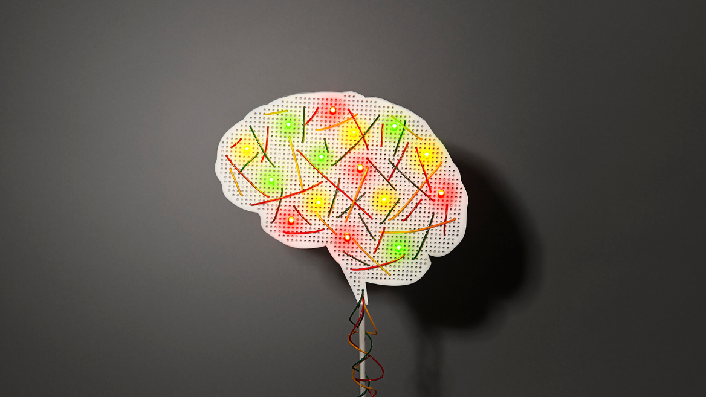

Can you think yourself into a different person?

© Kyle Bean

# Can you think yourself into a different person?

We used to believe our brains couldn’t be changed. Now we believe they can – if we want it enough. But is that true? Will Storr wades through the facts and fiction.

17 November 2015
-

- [Republish](https://mosaicscience.com/mwt_republish/nojs/829)

-

*Listen to or download an audiobook of this story on [SoundCloud](https://soundcloud.com/mosaicscience/can-you-think-yourself-into-a-different-person) and [iTunes](https://itunes.apple.com/gb/podcast/mosaic/id964928211?mt=2).*

For years she had tried to be the perfect wife and mother but now, divorced, with two sons, having gone through another break-up and in despair about her future, she felt as if she’d failed at it all, and she was tired of it. On 6 June 2007 Debbie Hampton, of Greensboro, North Carolina, took an overdose. That afternoon, she’d written a note on her computer: “I’ve screwed up this life so bad that there is no place here for me and nothing I can contribute.” Then, in tears, she went upstairs, sat on her bed, and put on a Dido CD to listen to as she died.

But then she woke up again. She’d been found, rushed to hospital, and saved. “I was mad,” she says. “I’d messed it up. And, on top of that, I’d brain-damaged myself.” After Debbie emerged from her one-week coma, her doctors gave her their diagnosis: encephalopathy. “That’s just a general term which means the brain’s not operating right,” she says. She couldn’t swallow or control her bladder, and her hands constantly shook. Much of the time, she couldn’t understand what she was seeing. She could barely even speak. “All I could do was make sounds,” she says. “It was like my mouth was full of marbles. It was shocking, because what I heard from my mouth didn’t match what I heard in my head.” After a stay in a rehabilitation centre, she began recovering slowly. But, a year in, she plateaued. “My speech was very slow and slurred. My memory and thinking was unreliable. I didn’t have the energy to live a normal life. A good day for me was emptying the dishwasher.”

It was around this time that she tried a new treatment called neurofeedback. She was required to have her brain monitored while playing a simple Pac-Man-like game, controlling movements by manipulating her brain waves. “Within ten sessions, my speech improved.” But Debbie’s real turnaround happened when her neurofeedback counsellor recommended a book: the international bestseller *The Brain that Changes Itself* by Canadian psychotherapist Norman Doidge. “Oh my God,” she says. “For the first time it really showed me it was possible to heal my brain. Not only that it was possible, that it was up to me.”

After reading Doidge’s book, Debbie began living what she calls a “brain-healthy” life. That includes yoga, meditation, visualisation, diet and the maintenance of a positive mental attitude. Today, she co-owns a yoga studio, has written an autobiography and a guide to “brain-healthy living” and runs the website thebestbrainpossible.com. The science of neuroplasticity, she says, has taught her that, “You’re not stuck with the brain you’re born with. You may be given certain genes but what you do in your life changes your brain. And that’s the magic wand.” Neuroplasticity, she says, “allows you to change your life and make happiness a reality. You can go from being a victim to a victor. It’s like a superpower. It’s like having X-ray vision.”

Debbie’s not alone in her enthusiasm for neuroplasticity, which is what we call the brain’s ability to change itself in response to things that happen in our environment. Claims for its benefits are widespread and startling. Half an hour on Google informs the curious browser that neuroplasticity is a “magical” scientific discovery that shows that our brains are not hard-wired like computers, as was once thought, but like “play-doh” or a “gooey butter cake”. This means that “our thoughts can change the structure and function of our brains” and that by doing certain exercises we can actually, physically increase our brain’s “strength, size and density”. Neuroplasticity is a “series of miracles happening in your own cranium” that means we can be better salespeople and better athletes, and learn to love the taste of broccoli. It can treat eating disorders, prevent cancer, lower our risk of dementia by 60 per cent and help us discover our “true essence of joy and peace”. We can teach ourselves the “skill” of happiness and train our brains to be “awesome”. And age is no limitation: neuroplasticity shows that “our minds are designed to improve as we get older”. It doesn’t even have to be difficult. “Simply by changing your route to work, shopping at a different grocery store, or using your non-dominant hand to comb your hair will increase your brain power.” As the celebrity alternative-medicine guru Deepak Chopra has said, “Most people think that their brain is in charge of them. We say we are in charge of our brain.”

Debbie’s story is a mystery. The techniques promising to change her brain via an understanding of the principles of neuroplasticity have clearly had tremendous positive effects for her. But is it true that neuroplasticity is a superpower, like X-ray vision? Can we really increase the weight of our brain just by thinking? Can we lower our risk of dementia by 60 per cent? And learn to love broccoli?

Some of these seem like silly questions, but some of them don’t. That’s the problem. It’s hard, for the non-scientist, to understand what exactly neuroplasticity is and what its potential truly is. “I’ve seen tremendous exaggeration,” says Greg Downey, an anthropologist at Macquarie University and co-author of the popular blog Neuroanthropology. “People are so excited about neuroplasticity they talk themselves into believing anything.”

§

For many years, the consensus was that the human brain couldn’t generate new cells once it reached adulthood. Once you were grown, you entered a state of neural decline. This was a view perhaps most famously expressed by the so-called founder of modern neuroscience, Santiago Ramón y Cajal. After an early interest in plasticity, he became sceptical, writing in 1928, “In adult centres the nerve paths are something fixed, ended, immutable. Everything may die, nothing may be regenerated. It is for the science of the future to change, if possible, this harsh decree.” Cajal’s gloomy prognosis was to rumble through the 20th century.

Although the notion that the adult brain could undergo significant positive changes received sporadic attention, throughout the 20th century, it was generally overlooked, as a young psychologist called Ian Robertson was to discover in 1980. He’d just begun working with people who had had strokes at the Astley Ainslie Hospital in Edinburgh, and found himself puzzled by what he was seeing. “I’d moved into what was a new field for me, neuro-rehabilitation,” he says. At the hospital, he witnessed adults receiving occupational therapy and physiotherapy. Which made him think… if they’d had a stroke, that meant a part of their brain had been destroyed. And if a part of their brain had been destroyed, everyone knew it was gone for ever. So how come these repetitive physical therapies so often helped? It didn’t make sense. “I was trying to get my head around, what was the model?” he says. “What was the theoretical basis for all this activity here?” The people who answered him were, by today’s standards, pessimistic.

“Their whole philosophy was compensatory,” Robertson says. “They thought the external therapies were just preventing further negative things happening.” At one point, still baffled, he asked for a textbook that explained how it all was supposed to work. “There was a chapter on wheelchairs and a chapter on walking sticks,” he says. “But there was nothing, absolutely nothing, on this notion that the therapy might actually be influencing the physical reconnection of the brain. That attitude really went back to Cajal. He really influenced the whole mindset which said that the adult brain is hardwired, all you can do is lose neurons, and that if you have brain damage all you can do is help the surviving parts of the brain work around it.”

But Cajal’s prognosis also contained a challenge. And it wasn’t until the 1960s that the “science of the future” first began to rise to it. Two stubborn pioneers, whose tales are recounted so effectively in Doidge’s bestseller, were Paul Bach-y-Rita and Michael Merzenich. Bach-y-Rita is perhaps best known for his work helping blind people ‘see’ in a new and radically different way. Rather than receiving information about the world from the eyes, he wondered if they could take it in in the form of vibrations on their skin. They’d sit on a chair and lean back on a metal sheet. Pressing up against the back side of that metal sheet were 400 plates that would vibrate in accord with the way an object was moving. As Bach-y-Rita’s devices became more sophisticated (the most recent version sits on the tongue), congenitally blind people began to report having the experience of ‘seeing’ in three dimensions. It wasn’t until the advent of brain-scanning technology that scientists began to see evidence for this incredible hypothesis: that information seemed to be being processed in the visual cortex. Although this hypothesis is yet to be firmly established, it seems as if their brains had rewired themselves in a radical and useful way that had long been thought impossible.

Merzenich, meanwhile, helped to confirm in the late 1960s that the brain contains ‘maps’ of the body and the outside world, and that these maps have the ability to change. Next, he co-developed the cochlear implant, which helped deaf people hear. This relies on the principle of plasticity, as the brain needs to adapt to receive auditory information from the artificial implant instead of the cochlea (which, in the deaf person, isn’t working). In 1996 he helped establish a commercial company that produces educational software products called Fast ForWord for “enhancing the cognitive skills of children using repetitive exercises that rely on plasticity to improve brain function,” according to their website. As Doidge writes, “In some cases, people who have had a lifetime of cognitive difficulties get better after only thirty to sixty hours of treatment.”

Although it took several decades, Merzenich and Bach-y-Rita were to help prove that Cajal and the scientific consensus were wrong. The adult brain was plastic. It could rewire itself, sometimes radically. This came as a surprise to experts like Robertson, now a Director of Trinity College Dublin’s Institute of Neuroscience. “I can look back on giving lectures at Edinburgh University to students where I gave wrong information, based on the dogma which said that, once dead, a brain cell cannot regenerate and plasticity happens in early childhood but not later,” he says.

It wasn’t until the publication of a series of vivid studies involving brain scans that this new truth began to be encoded into the synapses of the masses. In 1995, neuropsychologist Thomas Elbert published his work on string players that showed the ‘maps’ in their brain that represented each finger of the left hand – which they used for fingering – were enlarged compared to those of non-musicians (and compared to their own right hands, not involved in fingering). This demonstrated their brains had rewired themselves as a result of their many, many, many hours of practice. Three years later, a Swedish–American team, led by Peter Eriksson of Sahlgrenska University Hospital, published a study in *Nature* that showed, for the very first time, that neurogenesis – the creation of new brain cells – was possible in adults. In 2006, a team led by Eleanor Maguire at the Institute of Neurology at University College London found that the city’s taxi drivers have more grey matter in one hippocampal area than bus drivers, due to their incredible spatial knowledge of London’s maze of streets. In 2007, Doidge’s *The Brain that Changes Itself* was published. In its review of the book, the *New York Times* proclaimed that “the power of positive thinking has finally gained scientific credibility”. It went on to sell over one million copies in over 100 countries. Suddenly, neuroplasticity was everywhere.

§

It’s easy, and perhaps even fun, to be cynical about all this. But neuroplasticity really is a remarkable thing. “What we do know is that almost everything we do, all our behaviour, thoughts and emotions, physically change our brains in a way that is underpinned by changes in brain chemistry or function,” says Robertson. “Neuroplasticity is a constant feature of the very essence of human behaviour.” This understanding of the brain’s power, he says, opens up new techniques for treating a potentially spectacular array of illnesses. “There’s virtually no disease or injury, I believe, where the potential doesn’t exist for very intelligent application of stimulation to the brain via behaviour, possibly combined with other stimulation.”

Does he agree that the power of positive thinking has now gained scientific credibility? “My short answer is yes,” he says. “I do think human beings have much more control over their brain function than has been appreciated.” The long answer is: yes, but with caveats. First there’s the influence of our genes. Surely, I ask Robertson, they still hold a powerful influence over everything from our health to our character? “My own crude rule of thumb is a 50–50 split in terms of the influence of nature and that of nurture,” he says. “But we should be very positive about that 50 per cent that’s environmental.”

Adding extra tangle to the already confused public discussion of neuroplasticity is the fact that the word itself can mean several things. Broadly, says Sarah-Jayne Blakemore, Deputy Director of London’s Institute of Cognitive Neuroscience, it refers to “the ability of the brain to adapt to changing environmental stimuli”. But the brain can adapt in many different ways. Neuroplasticity can refer to structural changes, such as when neurons are created or die off or when synaptic connections are created, strengthened or pruned. It can also refer to functional reorganisations, such as those experienced by the blind patients of Paul Bach-y-Rita, whose contraptions triggered their brains to start using their visual cortices, which had previously been redundant.

On the larger, developmental scale, there are two categories of neuroplasticity. They are “really different,” says Blakemore. “You need to differentiate between them.” Throughout childhood our brains undergo a phase of ‘experience-expectant’ plasticity. They ‘expect’ to learn certain important things from the environment, at certain stages, such as how to speak. Our brains don’t finish developing in this way until around our mid-20s. “That’s why car insurance premiums are so high for people under 25,” says Robertson. “Their frontal lobes aren’t fully wired up to the rest of their brains until then. Their whole capacity for anticipating risk and impulsivity isn’t there.” Then there’s ‘experience-dependent’ plasticity. “That’s what the brain does whenever we learn something, or whenever something changes in the environment,” says Blakemore.

One way in which science has been exaggerated has been by the blending of these different types of change. Some writers have made it seem as if almost anything counts as ‘neuroplasticity’, and therefore revolutionary and magical and newsworthy. But it’s definitely not news, for example, that the brain is highly affected by its environment when we’re young. Nevertheless, in *The Brain that Changes Itself* Norman Doidge observes the wide variety of human sexual interests and calls it “sexual plasticity”. Neuroscientist Sophie Scott, Deputy Director of London’s Institute of Cognitive Neuroscience, is dubious. “That’s just the effect of growing up on your brain,” she says. Doidge even uses neuroplasticity to explain cultural changes, such as the broad acceptance in the modern age that we marry for romantic love, rather than socioeconomic convenience. “That isn’t neuroplasticity,” says Scott.

This, then, is the truth about neuroplasticity: it does exist, and it does work, but it’s not a miracle discovery that means that, with a little effort, you can turn yourself into a broccoli-loving, marathon-running, disease-immune, super-awesome genius. The “deep question”, says Chris McManus, Professor of Psychology and Medical Education at University College London, is, “Why do people, even scientists, want to believe all this?” Curious about the underlying causes of the neuroplasticity craze, he believes it is just the latest version of the personal-transformation myth that’s been haunting the culture of the West for generations.

§

“People have all sorts of dreams and fantasies and I don’t think we’re very good at achieving them,” says McManus. “But we like to think that when somebody is unsuccessful in life they can transform themselves and become successful. It’s Samuel Smiles, isn’t it? That book he wrote, *Self-Help*, was the positive thinking of Victorian times.”

Samuel Smiles [Full disclosure: Samuel Smiles is my great-great-uncle] is commonly cited as the inventor of the ’self-help’ movement and his book, just like Doidge’s, spoke to something deep in the population and became a surprise bestseller. The optimistic message Smiles delivered spoke of both the new, modern world and the dreams of the men and women living in it. “In the 18th century, power had all been about the landed gentry,” says historian Kate Williams. “Smiles was writing in the era of the Industrial Revolution, widespread education and economic opportunities offered by Empire. It was the first time a middle-class man could work hard and do well. They needed a formidable work ethic to succeed, and that’s what Smiles codified in *Self-Help*.”

In the latter part of the 19th century, US thinkers adapted this idea to reflect their national belief that they were creating a new world. Adherents of the New Thought, Christian Science and Metaphysical Healing movements stripped away much of the talk of hard work, insisted upon by the Brits, to create the positive thinking movement to which some believe neuroplasticity has given scientific credence. Psychologist William James called it “the mind-cure movement”, the “intuitive belief in the all-saving power of healthy-minded attitudes as such, in the conquering efficacy of courage, hope, and trust, and a correlative contempt for doubt, fear, worry, and all nervously precautionary states of mind”. Here was the inherently American notion that self-confidence and optimism – thoughts themselves – could offer personal salvation.

This myth – that we can be whoever we want to be, and achieve our dreams, as long as we have sufficient self-belief – emerges again and again, in our novels, films and news, and TV singing competitions featuring Simon Cowell, as well as unexpected crazes like that for neuroplasticity. One previous, and remarkably similar, incarnation was Neuro-Linguistic Programming, which had it that psychological conditions such as depression were nothing more than patterns learned by the brain and that success and happiness were just a matter of reprogramming it. The idea appeared in a more academic costume, according to McManus, in the form of what’s known as the Standard Social Science Model. “This is the idea from the 1990s where, in effect, all human behaviour is infinitely malleable and genes play no role at all.”

But the plasticity boosters have an answer to the tricky question of genes, and their heavy influence over all matters of health, life and wellbeing. Their answer is epigenetics. This is the relatively new understanding of the ways in which the environment can change how genes express themselves. Deepak Chopra has said that epigenetics has shown us that, “regardless of the nature of the genes we inherit from our parents, dynamic change at this level allows us almost unlimited influence on our fate”.

Jonathan Mill, Professor of Epigenetics at the University of Exeter, dismisses this kind of claim as “babble”. “It’s a really exciting science,” he says, “but to say these things are going to totally rewire your whole brain and gene functioning is taking it far too far.” And it’s not just Chopra, he adds. Broadsheet newspapers and academic journals have also been guilty, at times, of falling for the myth. “There have been all sorts of amazingly overhyped headlines. People who have been doing epigenetics for a while are almost in despair, at the moment, partly because it’s being used as an explanation for all sorts of things without any real direct evidence.”

§

Just as epigenetics doesn’t fulfil our culture’s promise of personal transformation, nor does neuroplasticity. Even some of the more credible-sounding claims are, according to Ian Robertson, currently unjustifiable. Take the one about reducing our risk of dementia by 60 per cent. “There is not a single scientific study that has ever shown that any intervention of any kind can reduce the risk of dementia by 60 per cent, or indeed by any percentage,” he says. “No one has done the research using appropriate control-group methodologies to show that there is any cause-and-effect link.”

Indeed, the clinical record for many famous treatments that use the principles of neuroplasticity is notably mixed. In June 2015, the Food and Drug Administration in the US permitted the marketing of the latest iteration of Bach-y-Rita’s on-the-tongue ‘seeing’ devices for the blind, citing successful studies. And yet a 2015 Cochrane Review of constraint induced movement therapy – a touchstone treatment for neuroplasticity evangelists that offers improvements in motor function for people who have had a stroke – found that “these benefits did not convincingly reduce disability”. A 2011 meta-analysis of neuroplasticity Godfather Michael Merzenich’s Fast ForWord learning techniques, described to such thrilling effect by Doidge, found “no evidence” that they were “effective as a treatment for children’s oral language or reading difficulties”. This, according to Sophie Scott, goes for other treatments too. “There’s been a lot of excitement about brain-training packages and, actually, big studies of those tend not to show very much effect,” she says. ”Or they show you’ve got better at the thing you’ve practised at, but it doesn’t generalise to something else.” In November 2015, a team lead by Clive Ballard at King’s College London found some evidence that online brain-training games might help reasoning, attention and memory in the over-50s.

It’s perhaps understandable why crazy levels of hope are raised when people read tales of apparently miraculous recovery from brain injury that feature people seeing again, hearing again, walking again and so on. These dramatic accounts can make it sound as if *anything* is possible. But what’s usually being described, in these instances, is a very specific form of neuroplasticity – functional reorganisation – which can happen only in certain circumstances. “The limits are partly architectural,” says Greg Downey. “Certain parts of the brain are better at doing certain kinds of thing, and part of that comes simply from where they are.”

Another limitation, for the person hoping to develop a superpower, is the simple fact that every part of a normal brain is already occupied. “The reason you get reorganisation after an amputation, for example, is that you’ve just put into unemployment a section of the somatosensory cortex,” he says. A healthy brain just doesn’t have this available real estate. “Because it keeps getting used for what it’s being used for, you can’t train it to do something else. It’s already doing something.”

Age, too, presents a problem. “Over time, plastic sets,” says Downey. “You start off with more of it and space for movement slowly decreases. That’s why a brain injury at 25 is a total different ballgame to a brain injury at seven. Plasticity says you start off with a lot of potential but you’re laying down a future that’s going to become increasingly determined by what you’ve done before.”

Robertson speaks of treating a famous writer and historian who’d had a stroke. “He completely lost the capacity for all expressive language,” he says. “He couldn’t say a word, he couldn’t write. He had a huge amount of therapy and no amount of stimulation could really recover that because the brain had become hyper-specialised and a whole network had developed for the highly refined production of language.” Despite what the currents of our culture might insistently beckon us towards believing, the brain is not Play-Doh. “You can’t open up new areas of it,” says McManus. “You can’t extend it into different parts. The brain isn’t a mass of grey gloop. You can’t do anything you like.”

Even the people whose lives are being transformed by neuroplasticity are finding that brain change is anything but easy. Take recovery from a stroke. “If you’re going to recover the use of an arm, you may need to move that arm tens of thousands of times before it begins to learn new neural pathways to do that,” says Downey. “And, after that, there’s no guarantee it’s going to work.” Scott says something similar about speech and language therapy. “There were dark days, say, 50 years ago, where if you’d had a stroke you didn’t get that kind of treatment other than to stop you choking because they’d decided it doesn’t work. But now it’s becoming absolutely clear that it does, and that it’s a phenomenally good thing. But none of it comes for free.”

Those who over-evangelise emerging disciplines like neuroplasticity or epigenetics can sometimes be guilty of talking as if the influence of our genes no longer matters. Their enthusiasm can make it seem, to the non-specialist, as if nurture can easily conquer nature. This is a story that attracts people in great numbers, to newspapers, blogs and gurus, because it’s one our culture reinforces, and one we want to believe: that radical personal transformation is possible, that we have the potential to be whoever and whatever we want to be, that we can find happiness, success, salvation – all we need to do is try. We are dreamers down to our very synapses, we are the people of the American Dream.

Of course, it’s our malleable brains that have moulded themselves to these rhythms. As we grow up, the optimistic myths of our culture become so embedded in our sense of self that we can lose touch with the fact that they are just myths. The irony is that when scientists carefully describe the blind seeing and the deaf hearing, and we hear it as talk of wild miracles, it’s the fault of our neuroplasticity.

*This article contains a reference to a person's attempt to taking her life. For people in the UK and Ireland, the [Samaritans](http://www.samaritans.org/) are available around the clock, every single day of the year, to listen and offer confidential support about anything that is getting to you. You can reach them by phone on 08457 909090, email [jo@samaritans.org](https://mosaicscience.com/story/neuroplasticitymailto:jo@samaritans.org) or [find the details for your local branch](http://www.samaritans.org/branches). If you are interested in becoming a volunteer, [you can find out more here](http://www.samaritans.org/volunteer-us).*

*For people outside the UK and Ireland, [Befrienders Worldwide](http://www.befrienders.org/) can help.*

- Author: [Will Storr](https://mosaicscience.com/people/willstorr)
- Editor: [Mun-Keat Looi](https://mosaicscience.com/people/mun-keatlooi)
- Fact checker: Lowri Daniels
- Copyeditor: [Tom Freeman](https://mosaicscience.com/people/tomfreeman)
- Artwork: Kyle Bean
- Photography: Grzegorz Krzeszowiec

### Share

- [Email](https://mosaicscience.com/mwt_send_friend/nojs/829)
- [Twitter](https://twitter.com/intent/tweet?original_referer=https://mosaicscience.com&url=https%3A%2F%2Fmosaicscience.com%2Fstory%2Fneuroplasticity&text=Can%20you%20think%20yourself%20into%20a%20different%20person?&via=mosaicscience)
- [Facebook](https://mosaicscience.com/story/neuroplasticity#)

### Discuss

Join in the discussion on Twitter with the hashtag [#neuroplasticity](https://twitter.com/search?q=%23neuroplasticity).

### Reuse

[CC-BY 4.0](http://creativecommons.org/licenses/by/4.0/deed.en_US)

Find out more [about reusing our content](https://mosaicscience.com/using-our-content).

- [Republish](https://mosaicscience.com/mwt_republish/nojs/829)

### [References and resources](https://mosaicscience.com/story/neuroplasticity#)

### [Amendments and updates](https://mosaicscience.com/story/neuroplasticity#)

###

### Related stories

- [     ## Can you supercharge your brain?](https://mosaicscience.com/story/can-you-supercharge-your-brain)

Applying mild electrical currents to your head could take away pain, help memory and improve attention – and the US military is very interested. Emma Young reports.

03 June 2014

- [     ## Secrets of the strong-minded](https://mosaicscience.com/story/secrets-strong-minded)

Can children be made more psychologically ‘resilient’ to traumas like 9/11 – as well as the stress of everyday life? Emma Young meets a former school principal who believes they can.

16 September 2014

- [     ## The mind readers](https://mosaicscience.com/story/mind-readers)

Thousands remain trapped between life and death. Three scientists are working to free them. Roger Highfield reports.

20 April 2014

- [Will Storr: More stories](https://mosaicscience.com/people/413/stories)
- [Mind: More stories](https://mosaicscience.com/topics/mind)
- [Neuroscience: More stories](https://mosaicscience.com/topics/neuroscience)