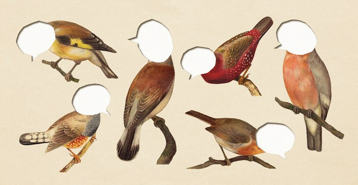

Can “Indie” Social Media Save Us?

[Annals of Technology](https://www.newyorker.com/tech/annals-of-technology)

# Can “Indie” Social Media Save Us?

By [Cal Newport](https://www.newyorker.com/contributors/cal-newport)
May 18, 2019

*

Artisanal versions of Twitter and Facebook hope to keep the good while jettisoning the bad.

*Illustration by Alvaro Dominguez; Source Illustrations by Hein Nouwens / Shutterstock

In the summer of 2016, I gave a talk at a small *TED*x conference in northern Virginia. I began by admitting that I’ve never had a social-media account; I then outlined arguments for why other people should consider eliminating social media from their lives. The event organizers uploaded the video of my talk to [YouTube](https://www.newyorker.com/tag/youtube), where it languished for a few months. Then, for unknowable reasons, it entered the viral slipstream. It was shared repeatedly on [Facebook](https://www.newyorker.com/tag/facebook) and [Instagram](https://www.newyorker.com/tag/instagram) and, eventually, viewed more than five million times. I was both pleased and chagrined by the irony of the fact that my anti-social-media talk had found such a large audience on social media.

I think of this episode as typical of the conflicted relationships many of us have with Facebook, Instagram, and other social-media platforms. On the one hand, we’ve grown wary of the so-called attention economy, which, in the name of corporate profits, exploits our psychological vulnerabilities in ways that corrode social life, diminish privacy, weaken civic cohesion, and make us vulnerable to manipulation. But we also benefit from social media and hesitate to disengage from it completely. Not long ago, I met a partner at a large law firm in Washington, D.C., who told me that she keeps Instagram on her phone because she misses her kids when she travels; browsing pictures of them makes her feel better. Meanwhile, because she also worries about her phone usage, she’s instituted a rule that requires her, before looking at Instagram, to read for at least thirty minutes. Last year, she read fifty-five books. Many of us have similar stories. Even as we dream of abandoning social media, we search for ways to redeem it.

In recent months, some of the biggest social-media companies have begun searching for this redemption, too. Facebook and [Twitter](https://www.newyorker.com/tag/twitter), in particular, have promised various reforms. In March, Mark Zuckerberg [announced a plan](https://www.newyorker.com/tech/annals-of-technology/mark-zuckerbergs-plans-to-capitalize-on-facebooks-failures) to move his platform toward private communication protected by end-to-end encryption; later that month, he proposed the establishment of a third-party group to set standards for acceptable content. Around the same time, [Jack Dorsey](https://www.newyorker.com/news/letter-from-silicon-valley/jack-dorseys-ted-interview-and-the-end-of-an-era) brought one of Twitter’s head lawyers onto Joe Rogan’s podcast to better explain the platform’s evolving standards for banning users. Legislators are also getting involved. Elizabeth Warren shared a plan for [breaking up tech giants](https://www.newyorker.com/tech/annals-of-technology/mark-zuckerberg-elizabeth-warren-and-the-case-for-regulating-big-tech) like Facebook; others admire the European Union’s sweeping and byzantine General Data Protection Regulation, which deploys aggressive fines to coerce companies into better protecting user privacy.

All of these approaches assume that the reformation of social media will be an intricate, lengthy, and incremental process involving lawyers, Ph.D.s, and government experts. But not everyone sees it that way. Alongside these official responses, a loose collective of developers and techno-utopians that calls itself the IndieWeb has been creating another alternative. The movement’s affiliates are developing their own social-media platforms, which they say will preserve what’s good about social media while jettisoning what’s bad. They hope to rebuild social media according to principles that are less corporate and more humane.

Proponents of the IndieWeb offer a fairly straightforward analysis of our current social-media crisis. They frame it in terms of a single question: Who owns the servers? The bulk of our online activity takes places on servers owned by a small number of massive companies. Servers cost money to run. If you’re using a company’s servers without paying for the privilege, then that company must be finding other ways to “extract value” from you—and it’s that quest for large-scale value extraction, they argue, that leads directly to the crises of compromised privacy and engineered addictiveness with which we’re currently grappling.

In their view, freedom of expression is also affected by server ownership. When you confine your online activities to so-called walled-garden networks, you end up using interfaces that benefit the owners of those networks; on social media, this means that you are forced to choose among what the techno-philosopher Jaron Lanier has called “multiple-choice identities.” According to this way of thinking, sites like Facebook and Instagram encourage conformism because it makes your data easier to process and monetize. This creates the exhausting sense that you’re a worker in a data factory rather than a three-dimensional individual trying to express yourself and connect with other real people in an organic way online.

When the problem is framed this way, the solution promoted by the IndieWeb movement becomes obvious: own your own servers. On a smaller scale, this is an old idea. For the past twelve years, I’ve hosted my personal blog using a server that I lease in a Michigan data center; I’ve enjoyed knowing that I own what I post there and that no one is trying to monetize my data or exploit my attention. And yet, running a personal blog that you write yourself is quite different from running a social network. To create social platforms that work on servers owned by users rather than big corporations, the IndieWeb developers have had to solve a tricky technical problem: decentralization.

In 2017, Manton Reece, an IndieWeb developer based in Austin, Texas, launched a Kickstarter for a service called Micro.blog. On its surface, Micro.blog looks a lot like Twitter or Instagram; you can follow users and see their posts sorted into a time line, and, if you like a post, you can send a reply that everyone can see. When I checked Micro.blog’s public time line recently, the top post was a picture of a blooming dogwood tree, with the caption “Spring is coming!”

MORE FROM
[Annals of Technology](https://www.newyorker.com/tech/annals-of-technology)

[(L)](https://www.newyorker.com/tech/annals-of-technology/facebooks-audacious-pitch-for-a-global-cryptocurrency)

[Facebook’s Audacious Pitch for a Global Cryptocurrency](https://www.newyorker.com/tech/annals-of-technology/facebooks-audacious-pitch-for-a-global-cryptocurrency)

By [Sue Halpern](https://www.newyorker.com/contributors/sue-halpern)

[(L)](https://www.newyorker.com/tech/annals-of-technology/the-hidden-costs-of-automated-thinking)

[The Hidden Costs of Automated Thinking](https://www.newyorker.com/tech/annals-of-technology/the-hidden-costs-of-automated-thinking)

By [Jonathan Zittrain](https://www.newyorker.com/contributors/jonathan-zittrain)

[(L)](https://www.newyorker.com/tech/annals-of-technology/how-cyber-weapons-are-changing-the-landscape-of-modern-warfare)

[How Cyber Weapons Are Changing the Landscape of Modern Warfare](https://www.newyorker.com/tech/annals-of-technology/how-cyber-weapons-are-changing-the-landscape-of-modern-warfare)

By [Sue Halpern](https://www.newyorker.com/contributors/sue-halpern)

[(L)](https://www.newyorker.com/tech/annals-of-technology/what-the-superhuman-controversy-reveals-about-the-shifting-ethics-of-software)

[What the Superhuman Controversy Reveals About the Shifting Ethics of Software](https://www.newyorker.com/tech/annals-of-technology/what-the-superhuman-controversy-reveals-about-the-shifting-ethics-of-software)

By [Anna Wiener](https://www.newyorker.com/contributors/anna-wiener)

[(L)](https://www.newyorker.com/science/elements/the-persuasive-power-of-the-wolf-lady)

[The Persuasive Power of the Wolf Lady](https://www.newyorker.com/science/elements/the-persuasive-power-of-the-wolf-lady)

By [Ingfei Chen](https://www.newyorker.com/contributors/ingfei-chen)

[(L)](https://www.newyorker.com/tech/annals-of-technology/the-fight-for-the-future-of-youtube)

[The Fight for the Future of YouTube](https://www.newyorker.com/tech/annals-of-technology/the-fight-for-the-future-of-youtube)

By [Neima Jahromi](https://www.newyorker.com/contributors/neima-jahromi)
Advertisement

Even as it offers a familiar interface, though, everyone posting to Micro.blog does so on his or her own domain hosted on Micro.blog’s server or on their own personal server. Reece’s software acts as an aggregator, facilitating a sense of community and gathering users’ content so that it can be seen on a single screen. Users own what they write and can do whatever they want with it—including post it, simultaneously, to other competing aggregators. IndieWeb developers argue that this system—which they call *POSSE*, for “publish on your own site, syndicate elsewhere”—encourages competition and innovation while allowing users to vote with their feet. If Reece were to begin aggressively harvesting user data, or if another service were to start offering richer features, users could shift their attention from one aggregator to another with little effort. They wouldn’t be trapped on a platform that owns everything they’ve written and is doing everything it can to exploit their data and attention.

### Video From The New Yorker

[### Could Overtime Larry Change the Game of Teen Hoops?](http://video.newyorker.com/watch/could-overtime-larry-change-the-game-of-teen-hoops)

Mastodon, another popular IndieWeb service, exists in the middle ground between centralized and decentralized social media. Founded, in 2016, by a young programmer named Eugen Rochko, Mastodon offers an experience similar to the one available on existing social-media platforms: after setting up an account on a Mastodon server—called an “instance”—one can post and browse text and images presented in a chronological time line. What distinguishes Mastodon is that anyone can download the software and begin running their own instance. When you set up an account with Mastodon, you do so on a specific instance that becomes your home; you see the posts of others users on your home instance, and they see yours. Together, the independent instances make up a “federation.” A “federation protocol” allows independent instances to talk with each other, so that a user with an account on infosec.exchange, say—“a Mastodon instance for info/cyber-security-minded people”—can follow updates from a user on queer.party. Most Mastodon users, however, tend to focus their online interactions on a small number of instances representing communities to which they feel a strong connection.

Each Mastodon instance can set its own rules about formats, acceptable speech, privacy, and other issues. The rules of the infosec.exchange instance, for example, emphasize civility (“don’t be a jerk”), while the queer.party instance allows not-safe-for-work content. As Rochko explains on his Patreon page, this model aims to return “control of the content distribution channels to the people.”

Because most Mastodon instances are small—typically, each numbers a couple of thousand users—and crowdfunded by their members, they feel different from mass social media, with an enticing free-form energy reminiscent of the Internet’s early days. The contrast between this atmosphere and the one found on existing social networks is striking. Thanks to its cavernous scale and the dynamics of retweet-driven virality, Twitter has devolved into a place where users seem desperate for attention, shouting at influencers and competing to see whose snark is most cutting. Mastodon, at least for now, is a human-scale environment in which users are happy to chat about quirky things with other quirky people. Recently, when I logged into the Mastodon instance sunbeam.city—a “Libertarian Socialist solarpunk instance”—I found a photo of someone’s blooming spider plant next to a conversation about the consequences of ethical transparency in hierarchical systems. It struck me as the quintessential early-Internet experience.

Could the IndieWeb movement—or a streamlined, user-friendly version of it to come—succeed in redeeming the promise of social media? If we itemize the woes currently afflicting the major platforms, there’s a strong case to be made that the IndieWeb avoids them. When social-media servers aren’t controlled by a small number of massive public companies, the incentive to exploit users diminishes. The homegrown, community-oriented feel of the IndieWeb is superior to the vibe of anxious narcissism that’s degrading existing services. And, in a sense, decentralization also helps solve the problem of content moderation. One reason Mark Zuckerberg has called for the establishment of a third-party moderation organization is, presumably, that he’s realized how difficult it is to come up with a single set of guidelines capable of satisfying over a billion users; the IndieWeb would allow many different standards to emerge, trusting users to gravitate toward the ones that work for them. Decentralization still provides corners in which dark ideas can fester, but knowing that there’s a neo-Nazi Mastodon instance out there somewhere may be preferable to encountering neo-Nazis in your Twitter mentions. The Internet may work better when it’s spread out, as originally designed.

Despite its advantages, however, I suspect that the IndieWeb will not succeed in replacing existing social-media platforms at their current scale. For one thing, the IndieWeb lacks the carefully engineered addictiveness that helped fuel the rise of services like Facebook, Twitter, and Instagram. This addictiveness has kept people returning to their devices even when they know there are better uses for their time; remove the addiction, and you might lose the users.

It may be, too, that people who are uneasy about social media aren’t looking for a better version of it but are instead ready to permanently reduce the role that smartphone screens play in their lives. Many of those who flocked to social media out of a sense of exuberance or experimentation are now losing interest. Some are people my age, who signed up for services like Facebook in college but now have families and responsibilities in their real-world communities and find the obligation to like posts or comment on photos increasingly superfluous. Others are older people who tried social media later in life, when it seemed like the thing to do, but now doubt that it’s worth the effort. Increasing numbers of teen-agers are rejecting the ceaseless pressure for digital performance; in March, Edison Research released a report claiming that young people made up the largest share of the fifteen million users Facebook has lost since 2017. To be sixteen and offline has become countercultural.

At the end of my *TED*x talk, I note that people often ask me what life is like without social media. By way of an answer, I project a photograph of a bench overlooking a quiet pastoral landscape. As a technology enthusiast, I’m a believer in the IndieWeb movement and think it will play an important role in the future of the Internet. For the exhausted majority of social-media users, however, the appeal of the proverbial quiet bench might outweigh the lure of a better Facebook. In this vision of the future, there will be many more social-media platforms but far fewer people spending significant time on any of them. Social media has reshaped our culture, and this has convinced us that it is fundamentally appealing. Strip away its most manipulative elements, though, and we may find that it’s less rewarding than it seems.

More:

- [Cal Newport](https://www.newyorker.com/tag/cal-newport)
- [Social Media](https://www.newyorker.com/tag/social-media)
- [Minimalism](https://www.newyorker.com/tag/minimalism)
- [Facebook](https://www.newyorker.com/tag/facebook)
- [Instagram](https://www.newyorker.com/tag/instagram)
- [Twitter](https://www.newyorker.com/tag/twitter)

Sign up for our daily newsletter and get the best of *The New Yorker* in your in-box.

### Most Popular

- 1.

Annals of Law[##### Alan Dershowitz, Devil’s Advocate](https://www.newyorker.com/magazine/2019/08/05/alan-dershowitz-devils-advocate)

By [Connie Bruck](https://www.newyorker.com/contributors/connie-bruck)

- 2.

News Desk[##### Iran’s Foreign Minister Was Invited to Meet Trump in the Oval Office](https://www.newyorker.com/news/news-desk/irans-foreign-minister-invited-to-meet-trump-in-the-oval-office)

By [Robin Wright](https://www.newyorker.com/contributors/robin-wright)

- 3.

The Front Row[##### Review: Quentin Tarantino’s Obscenely Regressive Vision of the Sixties in “Once Upon a Time . . . in Hollywood”](https://www.newyorker.com/culture/the-front-row/review-quentin-tarantinos-obscenely-regressive-vision-of-the-sixties-in-once-upon-a-time-in-hollywood)

By [Richard Brody](https://www.newyorker.com/contributors/richard-brody)

- 4.

Q. & A.[##### How a Historian Uncovered Ronald Reagan’s Racist Remarks to Richard Nixon](https://www.newyorker.com/news/q-and-a/how-a-historian-uncovered-ronald-reagans-racist-remarks-to-richard-nixon)

By [Isaac Chotiner](https://www.newyorker.com/contributors/isaac-chotiner)

- 5.

Books[##### How Mosquitoes Changed Everything](https://www.newyorker.com/magazine/2019/08/05/how-mosquitoes-changed-everything)

By [Brooke Jarvis](https://www.newyorker.com/contributors/brooke-jarvis)

[our thirty most popular»](https://www.newyorker.com/popular?intcid=most-popular)

- [**](https://www.facebook.com/sharer/sharer.php?u=https%3A%2F%2Fwww.newyorker.com%2Ftech%2Fannals-of-technology%2Fcan-indie-social-media-save-us&display=popup&ref=plugin)
- [**](https://twitter.com/intent/tweet?original_referer=https%3A%2F%2Fwww.newyorker.com%2Ftech%2Fannals-of-technology%2Fcan-indie-social-media-save-us&text=Can%20%E2%80%9CIndie%E2%80%9D%20Social%20Media%20Save%20Us%3F&tw_p=tweetbutton&url=https%3A%2F%2Fwww.newyorker.com%2Ftech%2Fannals-of-technology%2Fcan-indie-social-media-save-us)
- [**](https://www.newyorker.com/tech/annals-of-technology/can-indie-social-media-save-usmailto:?subject=From%20newyorker.com:%20Can%20%E2%80%9CIndie%E2%80%9D%20Social%20Media%20Save%20Us%3F&body=Artisanal%20versions%20of%20Twitter%20and%20Facebook%20hope%20to%20keep%20the%20good%20while%20jettisoning%20the%20bad.%0D%0Ahttps%3A%2F%2Fwww.newyorker.com%2Ftech%2Fannals-of-technology%2Fcan-indie-social-media-save-us)
- [**](https://www.newyorker.com/tech/annals-of-technology/can-indie-social-media-save-us#)

##### Video

Why Noise Pollution Is More Dangerous Than We Think

David Owen reports on noise pollution, an intangible phenomenon with serious costs to human health and wildlife.

##### Recommended Stories

[(L)](https://www.newyorker.com/culture/annals-of-inquiry/a-history-of-the-influencer-from-shakespeare-to-instagram)[Annals of Inquiry](https://www.newyorker.com/culture/annals-of-inquiry)[## A History of the Influencer, from Shakespeare to Instagram](https://www.newyorker.com/culture/annals-of-inquiry/a-history-of-the-influencer-from-shakespeare-to-instagram)

## For centuries, influencers have been forcing us to admit an uncomfortable truth: we are neither entirely self-determining nor self-contained.

By [Laurence Scott](http://www.newyorker.com/contributors/laurence-scott)
Apr. 21, 2019

[(L)](https://www.newyorker.com/culture/annals-of-inquiry/the-urgent-quest-for-slower-better-news)[Annals of Inquiry](https://www.newyorker.com/culture/annals-of-inquiry)[## The Urgent Quest for Slower, Better News](https://www.newyorker.com/culture/annals-of-inquiry/the-urgent-quest-for-slower-better-news)

## The current system for delivering news online is broken. Readers and journalists will need to work together to find a new one.

By [Michael Luo](http://www.newyorker.com/contributors/michael-luo)
Apr. 10, 2019

[(L)](https://www.newyorker.com/magazine/2019/08/05/alan-dershowitz-devils-advocate)Annals of Law[## Alan Dershowitz, Devil’s Advocate](https://www.newyorker.com/magazine/2019/08/05/alan-dershowitz-devils-advocate)

## Alan Dershowitz’s long, controversial career—and the accusations against him.

By [Connie Bruck](https://www.newyorker.com/contributors/connie-bruck)

[(L)](https://www.newyorker.com/news/news-desk/irans-foreign-minister-invited-to-meet-trump-in-the-oval-office)News Desk[## Iran’s Foreign Minister Was Invited to Meet Trump in the Oval Office](https://www.newyorker.com/news/news-desk/irans-foreign-minister-invited-to-meet-trump-in-the-oval-office)

## The invitation was extended just weeks before the Administration placed sanctions on Mohammad Javad Zarif for functioning “as a propaganda minister, not a foreign minister.”

By [Robin Wright](https://www.newyorker.com/contributors/robin-wright)
Aug. 02, 2019

#### [Listen to the New Yorker Radio Hour](https://www.newyorker.com/podcast/the-new-yorker-radio-hour)·

#### [Buy the Cover](http://www.condenaststore.com/-st/New-Yorker-Covers-Prints_c147247_.htm)·

#### [Play the Crossword](https://www.newyorker.com/crossword)·

#### [Play the Jigsaw Puzzle](https://www.newyorker.com/jigsaw)

#### [News & Politics](https://www.newyorker.com/news)

- [Daily Comment](https://www.newyorker.com/news/daily-comment)
- [Our Columnists](https://www.newyorker.com/news/our-columnists)
- [News Desk](https://www.newyorker.com/news/news-desk)

#### [Culture](https://www.newyorker.com/culture)

- [Cultural Comment](https://www.newyorker.com/culture/cultural-comment)
- [Culture Desk](https://www.newyorker.com/culture/culture-desk)
- [Goings On About Town](https://www.newyorker.com/goings-on-about-town)
- [The Critics](https://www.newyorker.com/magazine/critics)

#### [Business, Science & Tech](https://www.newyorker.com/business)

- [Currency](https://www.newyorker.com/business/currency)
- [Elements](https://www.newyorker.com/tech/elements)

#### [Humor](https://www.newyorker.com/humor)

- [Daily Shouts](https://www.newyorker.com/humor/daily-shouts)
- [Shouts & Murmurs](https://www.newyorker.com/magazine/shouts-murmurs)
- [The Borowitz Report](https://www.newyorker.com/humor/borowitz-report)

#### [Cartoons](https://www.newyorker.com/cartoons)

- [Daily Cartoon](https://www.newyorker.com/cartoons/daily-cartoon)
- [Cartoon Caption Contest](http://contest.newyorker.com/)
- [Cartoon Bank](https://condenaststore.com/conde-nast-brand/cartoonbank?utm_medium=referral)

#### [Books & Fiction](https://www.newyorker.com/books)

- [Page-Turner](https://www.newyorker.com/books/page-turner)
- [Books](https://www.newyorker.com/magazine/books)
- [Poems](https://www.newyorker.com/magazine/poems)
- [Fiction](https://www.newyorker.com/magazine/fiction)

#### [Magazine](https://www.newyorker.com/magazine)

- [This Week's Issue](https://www.newyorker.com/magazine)
- [Archive](https://www.newyorker.com/archive)
- [Subscribe](https://www.newyorker.com/subscribe)

#### [Photography](https://www.newyorker.com/tag/photography)

- [Photo Booth](https://www.newyorker.com/culture/photo-booth)
- [Portfolio](https://www.newyorker.com/magazine/portfolio)

#### [Video](http://video.newyorker.com/)

- [Culture](http://video.newyorker.com/genres/Culture)
- [Humor](http://video.newyorker.com/genres/Humor)
- [News](http://video.newyorker.com/genres/News)
- [Politics](http://video.newyorker.com/genres/Politics)
- [Science & Tech](http://video.newyorker.com/genres/Science%20&%20Tech)
- [Sports](http://video.newyorker.com/genres/Sports)

#### [Podcasts](https://www.newyorker.com/podcast)

- [The New Yorker Radio Hour](https://www.newyorker.com/podcast/the-new-yorker-radio-hour)
- [Political Scene](https://www.newyorker.com/podcast/political-scene)
- [The Writer's Voice](https://www.newyorker.com/podcast/the-authors-voice)
- [Fiction](https://www.newyorker.com/podcast/fiction)
- [Poetry](https://www.newyorker.com/podcast/poetry)

#### More

- [Customer Care](http://w1.buysub.com/servlet/CSGateway?cds_mag_code=NYR)
- [Buy the Cover](http://www.condenaststore.com/-st/New-Yorker-Covers-Prints_c147247_.htm)
- [Apps](https://www.newyorker.com/digital-editions)
- [Crossword Puzzle](https://www.newyorker.com/crossword)
- [Jigsaw Puzzle](https://www.newyorker.com/jigsaw)
- [SecureDrop](https://projects.newyorker.com/securedrop/)
- [Store](http://www.condenaststore.com/~/new-yorker-store)
- [RSS](https://www.newyorker.com/about/feeds)
- [Site Map](https://www.newyorker.com/sitemap)

#### [Newsletters](https://www.newyorker.com/newsletters)

- [The Daily](https://www.newyorker.com/newsletters/daily-newsletter)
- [The New Yorker Recommends](https://www.newyorker.com/newsletters/culture-review-newsletter)
- [Daily Humor](https://www.newyorker.com/newsletters/send-me-the-cartoon-chronicle-newsletter)
- [John Cassidy](https://www.newyorker.com/newsletters/john-cassidy-newsletter)
- [The Borowitz Report](https://www.newyorker.com/newsletters/andy-borowitz-newsletter)
- [Amy Davidson Sorkin](https://www.newyorker.com/home/about/sign-up-for-amy-davidson-sorkins-newsletter)
- [Midterms 2018](https://www.newyorker.com/home/about/sign-up-for-the-new-yorker-midterms-2018-newsletter)
- [Food](https://www.newyorker.com/home/about/sign-up-for-the-new-yorker-food-newsletter)

#### [About Us](https://www.newyorker.com/about/us)

- [About](https://www.newyorker.com/about/us)
- [Careers](https://www.newyorker.com/about/careers)
- [Contact](https://www.newyorker.com/about/contact)
- [FAQ](https://www.newyorker.com/about/faq)
- [Media Kit](http://www.condenast.com/brands/the-new-yorker)
- [Press](https://www.newyorker.com/about/press)
- [Accessibility Help](https://www.newyorker.com/about/accessibility-help/)

#### Follow Us

[![](data:image/svg+xml,%3csvg width='21' height='20' viewBox='0 0 21 20' xmlns='http://www.w3.org/2000/svg' xmlns:xlink='http://www.w3.org/1999/xlink' data-evernote-id='257' class='js-evernote-checked'%3e%3cdefs data-evernote-id='1098' class='js-evernote-checked'%3e%3cpath id='a' d='M20.3 19H0V0h20.3z' data-evernote-id='1099' class='js-evernote-checked'%3e%3c/path%3e%3c/defs%3e%3cg fill='none' fill-rule='evenodd' data-evernote-id='1100' class='js-evernote-checked'%3e%3cpath d='M10.3 19H10c-1.2 0-2-.6-2.7-1.2-.5-.3-1-.7-1.5-.7H4c-.3 0-.4.2-.5.2-.2 0-.3 0-.3-.2v-.5l-.4-.6c-2-.4-2.4-.8-2.6-1v-.2s0-.2.2-.2c3-.5 4-3.4 4.2-3.6.2-.3.2-.6 0-1 0-.4-.7-.6-1.2-.7h-.2c-1-.4-1-.8-1-1 0-.2.5-.4.8-.4h.3l1 .2c.4 0 .6-.2.6-.2v-.6c-.2-1.4-.3-3 0-4 1.4-3 4-3 5-3h.3c.8 0 3.6 0 4.8 3 .6 1 .5 2.6.4 4V8s0 .2.5.2c.2 0 .5 0 1-.3 0 0 0-.2.2-.2h.3c.3.2.5.4.5.6 0 .2-.2.5-1 .8H17c-.4.2-1 .4-1.2 1v.8c0 .2 1.4 3 4.3 3.6v.2c0 .4-.6.8-2.5 1-.2 0-.2.3-.3.7v.5l-.4.2h-.4c-.3-.2-.7-.2-1-.2h-1c-.5 0-1 .5-1.5.8-.8.6-1.6 1-2.7 1' fill='%23DDD' data-evernote-id='1101' class='js-evernote-checked'%3e%3c/path%3e%3cg transform='translate(0 .02)' data-evernote-id='1102' class='js-evernote-checked'%3e%3cmask id='b' fill='%23ddd' data-evernote-id='1103' class='js-evernote-checked'%3e%3c/mask%3e%3cpath d='M10.3 0H10C9 0 6.2.3 5 3.3c-.5 1-.4 2.7-.3 4V8h-.4c-.3 0-.6 0-1-.3H3c-.4 0-1 .2-1 .6 0 .3 0 .7 1 1l.4.2c.4 0 1 .3 1 .7.2.2.2.4 0 .7 0 0-1.3 3-4 3.3-.3 0-.4.3-.4.5v.2c.3.4 1 .8 2.7 1 0 0 0 .4.2.5v.5c0 .2 0 .4.5.4H4c.2-.2.5-.2 1-.2h.8c.5 0 1 .4 1.4.8.7.5 1.6 1 2.8 1h.3c1.2 0 2-.5 2.7-1 .5-.4 1-.7 1.5-.8h2.3c.3 0 .4 0 .5-.2v-.5l.2-.5c1.6-.2 2.5-.6 2.7-1v-.2c0-.2 0-.4-.3-.5C17 14 16 11 16 11c-.3-.4-.3-.6-.2-.8 0-.4.7-.6 1-.7h.4c.7-.4 1-.7 1-1 0-.4-.2-.7-.6-.8h-.4-.4l-1 .2h-.2v-.6c0-1.4.2-3-.3-4-1.3-3-4-3.4-5-3.4m0 .5c.8 0 3.4.2 4.7 3 .4 1 .3 2.5.2 3.8V8s.2.3.7.4c.2 0 .6 0 1-.3h.4l.4.4s0 .3-.8.6h-.2c-.5.2-1.2.5-1.4 1-.2.3 0 .7 0 1 .2.3 1.5 3.3 4.4 3.8 0 0-.3.5-2.3.8-.3 0-.4.4-.5.8v.5h-.2-.4c-.3-.2-.6-.2-1-.2h-1c-.6 0-1 .5-1.6.8-.7.5-1.4 1-2.5 1H10c-1 0-1.8-.5-2.5-1-.6-.3-1-.7-1.7-.8h-2-.3c-.2 0-.2-.2-.2-.4 0-.4-.2-.7-.5-.8-2-.3-2.3-.7-2.4-.8 3-.5 4.3-3.5 4.4-3.7.2-.3.2-.7 0-1 0-.5-.8-.8-1.3-1h-.3c-.6-.2-.8-.5-.7-.6 0-.2.3-.4.5-.4h.2c.4.3.8.4 1 .4.6 0 .8-.3 1-.3v-.7c-.2-1.3-.3-3 0-4C6.6.8 9.3.6 10 .6h.3' fill='%23DDD' mask='url(%23b)' data-evernote-id='1105' class='js-evernote-checked'%3e%3c/path%3e%3c/g%3e%3c/g%3e%3c/svg%3e)](https://www.snapchat.com/add/newyorkermag)[' data-evernote-id='1109' class='js-evernote-checked'%3e%3cg id='FOLLOW' transform='translate(850.000000%2c 528.000000)' data-evernote-id='1110' class='js-evernote-checked'%3e%3cg id='YT' transform='translate(2.000000%2c 79.000000)' data-evernote-id='1111' class='js-evernote-checked'%3e%3cmask fill='white' id='mask-2' data-evernote-id='1112' class='js-evernote-checked'%3e%3c/mask%3e%3cg id='Clip-2' data-evernote-id='1114' class='js-evernote-checked'%3e%3c/g%3e%3cpath d='M11.2732128%2c13.6774465 L11.2719054%2c5.6941363 L18.949235%2c9.69969958 L11.2732128%2c13.6774465 Z M28.1293185%2c4.31113213 C28.1293185%2c4.31113213 27.8516551%2c2.35316273 26.9997775%2c1.49093741 C25.9193324%2c0.35925452 24.7082615%2c0.353663421 24.152879%2c0.287404729 C20.1768846%2c5.56328223e-06 14.2126843%2c5.56328223e-06 14.2126843%2c5.56328223e-06 L14.2003338%2c5.56328223e-06 C14.2003338%2c5.56328223e-06 8.2362726%2c5.56328223e-06 4.26013908%2c0.287404729 C3.70472879%2c0.353663421 2.49410292%2c0.35925452 1.41326843%2c1.49093741 C0.561363004%2c2.35316273 0.284144645%2c4.31113213 0.284144645%2c4.31113213 C0.284144645%2c4.31113213 0%2c6.6104089 0%2c8.90971349 L0%2c11.0652907 C0%2c13.3645396 0.284144645%2c15.6638164 0.284144645%2c15.6638164 C0.284144645%2c15.6638164 0.561363004%2c17.6218136 1.41326843%2c18.4840389 C2.49410292%2c19.615694 3.91385257%2c19.5799221 4.54620306%2c19.6985313 C6.81927677%2c19.9165007 14.2065369%2c19.9839555 14.2065369%2c19.9839555 C14.2065369%2c19.9839555 20.1768846%2c19.9749708 24.152879%2c19.6875438 C24.7082615%2c19.6213129 25.9193324%2c19.615694 26.9997775%2c18.4840389 C27.8516551%2c17.6218136 28.1293185%2c15.6638164 28.1293185%2c15.6638164 C28.1293185%2c15.6638164 28.4130459%2c13.3645396 28.4130459%2c11.0652907 L28.4130459%2c8.90971349 C28.4130459%2c6.6104089 28.1293185%2c4.31113213 28.1293185%2c4.31113213 L28.1293185%2c4.31113213 Z' fill='%23DDDDDD' id='Fill-1' mask='url(%23mask-2)' data-evernote-id='1115' class='js-evernote-checked'%3e%3c/path%3e%3c/g%3e%3c/g%3e%3c/g%3e%3c/g%3e%3c/svg%3e)](https://www.youtube.com/user/NewYorkerDotCom)[' data-evernote-id='1119' class='js-evernote-checked'%3e%3cg id='FOLLOW' transform='translate(850.000000%2c 528.000000)' data-evernote-id='1120' class='js-evernote-checked'%3e%3cg id='insta' transform='translate(66.000000%2c 79.000000)' data-evernote-id='1121' class='js-evernote-checked'%3e%3cg id='Group-3' transform='translate(0.000000%2c 0.033390)' data-evernote-id='1122' class='js-evernote-checked'%3e%3cmask fill='white' id='mask-2' data-evernote-id='1123' class='js-evernote-checked'%3e%3c/mask%3e%3cg id='Clip-2' data-evernote-id='1125' class='js-evernote-checked'%3e%3c/g%3e%3cpath d='M10.0019917%2c0.00631277204 C7.28559403%2c0.00631277204 6.94498226%2c0.017826633 5.87820319%2c0.0665024727 C4.81356808%2c0.115059204 4.08652732%2c0.284154148 3.45028724%2c0.531384534 C2.79256786%2c0.786992247 2.23478086%2c1.12899362 1.67874078%2c1.6850337 C1.1227007%2c2.24111348 0.780699327%2c2.79890049 0.525091614%2c3.45661987 C0.277821524%2c4.09282024 0.108766283%2c4.81990071 0.0601698492%2c5.88449611 C0.0114940095%2c6.95131488 -1.98514845e-05%2c7.29192665 -1.98514845e-05%2c10.0083244 C-1.98514845e-05%2c12.7246824 0.0114940095%2c13.0652942 0.0601698492%2c14.1321129 C0.108766283%2c15.1967083 0.277821524%2c15.9237888 0.525091614%2c16.5599892 C0.780699327%2c17.2177086 1.1227007%2c17.7754956 1.67874078%2c18.3315753 C2.23478086%2c18.8876154 2.79256786%2c19.2296168 3.45028724%2c19.4852245 C4.08652732%2c19.7324549 4.81356808%2c19.9015498 5.87820319%2c19.9501066 C6.94498226%2c19.9987824 7.28559403%2c20.0102963 10.0019917%2c20.0102963 C12.7183895%2c20.0102963 13.0590012%2c19.9987824 14.1257803%2c19.9501066 C15.1904154%2c19.9015498 15.9174562%2c19.7324549 16.5536963%2c19.4852245 C17.2114156%2c19.2296168 17.7692026%2c18.8876154 18.3252427%2c18.3315753 C18.8812828%2c17.7754956 19.2232842%2c17.2177086 19.4788919%2c16.5599892 C19.726162%2c15.9237888 19.8952172%2c15.1967083 19.9438136%2c14.1321129 C19.9924895%2c13.0652942 20.0040033%2c12.7246824 20.0040033%2c10.0083244 C20.0040033%2c7.29192665 19.9924895%2c6.95131488 19.9438136%2c5.88449611 C19.8952172%2c4.81990071 19.726162%2c4.09282024 19.4788919%2c3.45661987 C19.2232842%2c2.79890049 18.8812828%2c2.24111348 18.3252427%2c1.6850337 C17.7692026%2c1.12899362 17.2114156%2c0.786992247 16.5536963%2c0.531384534 C15.9174562%2c0.284154148 15.1904154%2c0.115059204 14.1257803%2c0.0665024727 C13.0590012%2c0.017826633 12.7183895%2c0.00631277204 10.0019917%2c0.00631277204 M10.0019917%2c1.80847023 C12.6726516%2c1.80847023 12.9889652%2c1.81867389 14.0436349%2c1.86679389 C15.0188192%2c1.91126121 15.5484568%2c2.0742022 15.9009%2c2.21117744 C16.3677275%2c2.39262001 16.7009149%2c2.60935851 17.0509362%2c2.95937989 C17.4009179%2c3.30936156 17.6176961%2c3.64254887 17.7991387%2c4.10941608 C17.9360742%2c4.46185934 18.0990152%2c4.99145724 18.1435222%2c5.96664156 C18.1916422%2c7.02131122 18.2018062%2c7.33766447 18.2018062%2c10.0083244 C18.2018062%2c12.6789446 18.1916422%2c12.9952978 18.1435222%2c14.0499675 C18.0990152%2c15.0251518 17.9360742%2c15.5547497 17.7991387%2c15.907193 C17.6176961%2c16.3740602 17.4009179%2c16.7072475 17.0509362%2c17.0572292 C16.7009149%2c17.4072505 16.3677275%2c17.623989 15.9009%2c17.8054316 C15.5484568%2c17.9424068 15.0188192%2c18.1053478 14.0436349%2c18.1498152 C12.989124%2c18.1979351 12.6728105%2c18.2081388 10.0019917%2c18.2081388 C7.33117304%2c18.2081388 7.01485949%2c18.1979351 5.96034863%2c18.1498152 C4.98516432%2c18.1053478 4.45552671%2c17.9424068 4.10308346%2c17.8054316 C3.63625595%2c17.623989 3.30306864%2c17.4072505 2.95304726%2c17.0572292 C2.60306559%2c16.7072475 2.38628738%2c16.3740602 2.20484482%2c15.907193 C2.06790928%2c15.5547497 1.90496829%2c15.0251518 1.86046127%2c14.0499675 C1.81234127%2c12.9952978 1.80217731%2c12.6789446 1.80217731%2c10.0083244 C1.80217731%2c7.33766447 1.81234127%2c7.02131122 1.86046127%2c5.96664156 C1.90496829%2c4.99145724 2.06790928%2c4.46185934 2.20484482%2c4.10941608 C2.38628738%2c3.64254887 2.60306559%2c3.30936156 2.95304726%2c2.95937989 C3.30306864%2c2.60935851 3.63625595%2c2.39262001 4.10308346%2c2.21117744 C4.45552671%2c2.0742022 4.98516432%2c1.91126121 5.96030893%2c1.86679389 C7.0150183%2c1.81867389 7.33133185%2c1.80847023 10.0019917%2c1.80847023' fill='%23DDDDDD' id='Fill-1' mask='url(%23mask-2)' data-evernote-id='1126' class='js-evernote-checked'%3e%3c/path%3e%3c/g%3e%3cpath d='M10.0019917%2c13.375688 C8.16068716%2c13.375688 6.66797465%2c11.8830152 6.66797465%2c10.0417106 C6.66797465%2c8.20036631 8.16068716%2c6.7076935 10.0019917%2c6.7076935 C11.8432963%2c6.7076935 13.3359691%2c8.20036631 13.3359691%2c10.0417106 C13.3359691%2c11.8830152 11.8432963%2c13.375688 10.0019917%2c13.375688 M10.0019917%2c4.90553604 C7.16537344%2c4.90553604 4.86581719%2c7.20505259 4.86581719%2c10.0417106 C4.86581719%2c12.8783289 7.16537344%2c15.1778455 10.0019917%2c15.1778455 C12.8386101%2c15.1778455 15.1381663%2c12.8783289 15.1381663%2c10.0417106 C15.1381663%2c7.20505259 12.8386101%2c4.90553604 10.0019917%2c4.90553604' fill='%23DDDDDD' id='Fill-4' data-evernote-id='1127' class='js-evernote-checked'%3e%3c/path%3e%3cpath d='M16.5413208%2c4.70260623 C16.5413208%2c5.36548699 16.0039412%2c5.90282697 15.3411001%2c5.90282697 C14.6782193%2c5.90282697 14.1408396%2c5.36548699 14.1408396%2c4.70260623 C14.1408396%2c4.03972546 14.6782193%2c3.50238548 15.3411001%2c3.50238548 C16.0039412%2c3.50238548 16.5413208%2c4.03972546 16.5413208%2c4.70260623' fill='%23DDDDDD' id='Fill-6' data-evernote-id='1128' class='js-evernote-checked'%3e%3c/path%3e%3c/g%3e%3c/g%3e%3c/g%3e%3c/g%3e%3c/svg%3e)](https://www.instagram.com/newyorkermag/)

[![](data:image/svg+xml,%3csvg xmlns='http://www.w3.org/2000/svg' width='120' height='25' viewBox='0 120 288 50' data-evernote-id='260' class='js-evernote-checked'%3e%3cstyle data-evernote-id='1129' class='js-evernote-checked'%3e.a %7b fill:%23999%3b %7d%3c/style%3e%3cpath d='M26 161c-1.5 1.4-3.6 2.4-5.8 2.4-7 0-8.5-6-8.5-14s1.5-14 8.4-14c2.3 0 4.3 1 5.8 2.4l3.8 6.7h.2v-9.2h-.2l-3.6 2c-1-1-3-2.4-6-2.4-6.6 0-14.5 5.2-14.5 14.4S13.3 164 20.2 164c2.7 0 5-1.5 6-2.4l3.8 2h.2v-9.7H30l-4 7zm22.5-26.2c-6.5 0-14.2 5.7-14.2 14.5s7.7 14.5 14.2 14.5 14.2-5.7 14.2-14.5-7.7-14.5-14.2-14.5zm0 28.6c-6.6 0-8-5.6-8-14s1.4-14 8-14 8 5.6 8 14-1.3 14-8 14zm37-27.6h3.6v18l-12.4-18.4H66v.4h3.4V163H66v.4h7.5v-.4H70v-27.2l19.5 28h.2v-28h3.5v-.4h-7.6m22.8 0h-12v.4h3.4V163h-3.5v.4h12c6 0 16.3-2.7 16.3-14.2s-10.2-13.8-16.2-13.8zm-.2 27.6h-3v-27.2h3c7 0 10.4 5 10.4 13.6 0 8.5-3.3 13.6-10.4 13.6zm38.8 0h-10.3v-14.4h5.2c1.6 1.4 3.6 5.4 3.6 5.4h.2v-11.3h-.2s-2 4-3.7 5.4h-5.3V136h9.2c2.6 1.8 5 7 5 7v-7.4h-23.3v.4h3.5V163h-3.5v.4H152V154h-.3s-2.4 6.3-4.7 9zm-.5-33.6l-.7-2 .6-3.2h-.2l-8.6 7.2v.2m64.4 3.8h-7.6v.4h3.5v18l-12.6-18.4h-10.7v.4h3.5V163h-3.5v.4h7.6v-.4h-3.5v-27.2l19.5 28h.2v-28h3.5m14.7-1.4h-.2L204.8 163h-3.2v.4h7.3v-.4h-3.6l4.4-10.7h8.8l4.6 10.7h-3.5v.4h12.8v-.4h-3.3l-12.5-28.6zm-6.8 17.4l4-10 4.3 10H210zm38.2-5L243 145c-2.8-1-5-2.3-5-5 0-3 2.4-4.7 6-4.7 2.2 0 3.6.6 5 2l3.7 6.4h.2v-9h-.3l-3.6 2c-.8-1-2.4-2-5-2-5.2 0-8.6 3.6-8.6 8.5 0 4 2.7 6 5.8 7.2l5.5 2c3 1 4.8 2.4 4.8 5.3 0 2.8-1.8 5.6-6.5 5.6-2.2 0-4.8-1-6.2-2.5l-4-7.2h-.3l.2 9.7h.2l3.6-2c1 1 3.7 2.4 6.4 2.4 6 0 9.8-4.3 9.8-9 0-4.5-3.2-6.6-6.6-7.8zm9.2-11.4v8.7h.2s2.6-5.5 5-8.2h4.6V163H263v.4h14v-.4h-4.4v-27.2h4.7c2.4 2.7 5 8.3 5 8.3v-8.6h-25z' class='a js-evernote-checked' data-evernote-id='1130'%3e%3c/path%3e%3c/svg%3e)](https://www.condenast.com/)

© 2019 Condé Nast. All rights reserved. Use of and/or registration on any portion of this site constitutes acceptance of our [User Agreement](https://www.condenast.com/user-agreement/) (updated 5/25/18) and [Privacy Policy and Cookie Statement](https://www.condenast.com/privacy-policy#privacypolicy) (updated 5/25/18). [Your California Privacy Rights](https://www.condenast.com/privacy-policy#privacypolicy-california). The material on this site may not be reproduced, distributed, transmitted, cached or otherwise used, except with the prior written permission of Condé Nast. *The New Yorker* may earn a portion of sales from products and services that are purchased through links on our site as part of our affiliate partnerships with retailers. [Ad Choices](http://www.condenast.com/online-behavioral-advertising-oba-and-how-to-opt-out-of-oba/#clickheretoreadmoreaboutonlinebehavioraladvertising(oba))

Could not connect to the reCAPTCHA service. Please check your internet connection and reload to get a reCAPTCHA challenge.

