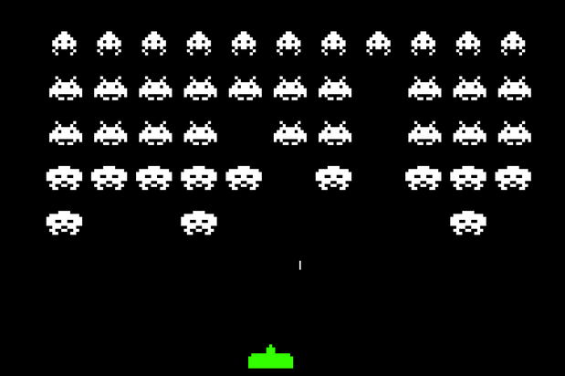
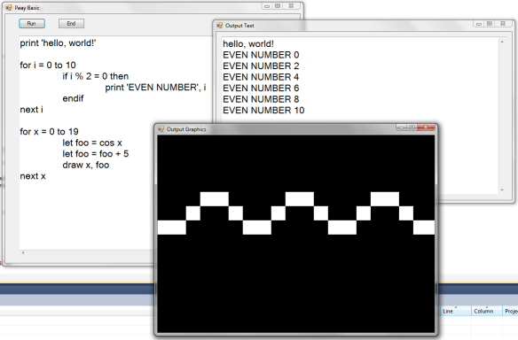
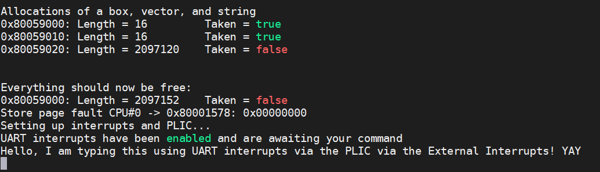

Challenging projects every programmer should try - Austin Z. Henley

### Challenging projects every programmer should try

12/11/2019

*Update 12/14: This post spurred a lot of discussion on [Hacker News](https://news.ycombinator.com/item?id=21790779) and [Reddit](https://www.reddit.com/r/programming/comments/ean6ch/challenging_projects_every_programmer_should_try/). I collected some of the suggested projects and put them in a list at the end of this post.*

I talk to a lot of students and professional developers that often want to start a side project, but aren't sure what to build. Below is a handful of software projects that taught me a lot. In fact, they're great because you could build them multiple times and learn new things each time. So whenever I don't know what to build or I want to learn a new programming language or framework, I start with one of these:

- Text editor

- 2D game - Space Invaders

- Compiler - Tiny BASIC

- Mini operating system

- Spreadsheet (*hard!*)

- Video game console emulator (*hard!*)

#### Text Editor

We use text editors everyday, but do you know how it really works? Ignoring all of the fancy features that your favorite editor has, how would you implement a textbox that supports a movable text cursor and selecting, inserting, and deleting text? No, you can't use the builtin textbox component from your favorite GUI framework!

The biggest challenge is figuring out how to store the text document in memory. My first thought was to use an array, but that has horrible performance if the user inserts text anywhere other than the end of the document. Luckily, there are some nice data structures to learn to solve this.

Another hurdle was learning how a text cursor behaves in popular editors. For example, if I press the up arrow key with the cursor in the middle of the document, where will the cursor move? Same column? Not if that line is shorter. Keep pressing up. The cursor will snap back to the original column once a line is long enough. It turns out that the cursor has a memory for the column and tries to get back to it. It is these details that I never noticed until I tried to implement it.

After implementing the basic editor, I challenge you to implement two more features: undo/redo and word wrapping. Implementing undo/redo in an efficient way was mind blowing to me! I first tried keeping an array of previous states, then tried the Memento pattern, before finally settling on the Command pattern. Word wrapping forces you to separate the *visual* aspects of a text line from the memory aspects.

Things to learn:

- Data structures for storing the text: array, [rope](https://en.wikipedia.org/wiki/Rope_(data_structure)), [gap buffer](https://en.wikipedia.org/wiki/Gap_buffer), [piece table](https://en.wikipedia.org/wiki/Piece_table).

- Behavior and implementation of the text cursor.

- Design patterns for undo/redo: [memento](https://en.wikipedia.org/wiki/Memento_pattern), [command](https://en.wikipedia.org/wiki/Command_pattern).

- Abstractions to separate the visual and memory aspects of the text.

Further reading:

- Text Editor: Data Structures ([web](https://www.averylaird.com/programming/the%20text%20editor/2017/09/30/the-piece-table/))

- Design and Implementation of a Win32 Text Editor ([web](http://www.catch22.net/tuts/neatpad#))

- Data Structures and Algorithms in Java ([Amazon](https://amzn.to/36k1kEv))

#### 2D game - Space Invaders

Even the most simple games require some unique data structures and design patterns. The idea here is to implement a well-defined game from start to finish without getting bogged down on the other fun stuff (e.g., game design and art). Also, it is best if you use a barebones 2D graphics library (e.g., SDL, SFML, PyGame), not a big game engine that'll hide all of the interesting bits from you.

First, you'll have to learn to draw to the screen. I had no idea how this worked. You are actually clearing the screen then drawing each portion of the screen in rapid succession, many times a second, to create the effect that objects are moving.

Second, you'll learn all about the game loop. A game is effectively looping between drawing, getting user input, and processing the game logic.

Third, you'll learn how to process user input. I never paid attention to the subtlties of initially pressing, holding, and releasing keys or mouse buttons, let alone handling things like a double click. And how often do you check for user input? If you are constantly checking then that means the rest of the game is frozen!

Fourth, you'll learn how to create and manage all of your game objects and their state. For example, how do you generate a dynamic number of enemies? The factory pattern helps a lot.

Fifth, you'll learn how to apply the game's logic. When do bullet positions get updated? When do more enemies come onscreen? How do you know when an enemy is destroyed? When is the game over? I had never used the modulo operator prior to making games but it is littered all over my games' code.

Once you get the basic game working, add a title screen menu, a game over screen, make sure the game runs at the same speed even on different computers, and explore how to implement more interesting enemies with AI. Still not enough? Add shader effects, sound, and online multiplayer!

Things to learn:

- Drawing to the screen.

- Handling user input.

- Game loop.

- Creating and managing a dynamic number of objects (e.g., [factory pattern](https://en.wikipedia.org/wiki/Factory_(object-oriented_programming))).

- State machines for enemy AI.

- Playing sound.

- Using shaders.

- Networking for online features.

Further reading:

- Game Programming Patterns ([Amazon](https://amzn.to/2RDtk1K), [web](https://gameprogrammingpatterns.com/contents.html))

- Data Structures for Game Programmers ([Amazon](https://amzn.to/2qEb79b))

- Programming Game AI by Example ([Amazon](https://amzn.to/2RDtk1K))

- The 8 lessons I learned from releasing 8 video games ([web](http://web.eecs.utk.edu/~azh/blog/8lessons8games.html))

#### Compiler - Tiny BASIC

The most-eye opening projects I have worked on are compilers. Even now, if I have a free Sunday afternoon to do some coding, chances are it is a compiler. It is a great feeling when you create something that enables others to create more things. By implementing one I had to learn so much more about the intricacies of compilers that I normally would never think about (e.g., when do expressions get implicitly type converted).

I suggest writing the compiler from scratch for a very small BASIC-like language (see [Tiny BASIC](https://en.wikipedia.org/wiki/Tiny_BASIC)) and compile to any other language that you know well. For example, you could write a Tiny BASIC compiler in Python that outputs C# code. It does **not** have to output assembly or C! Avoiding those will let you focus on the compiler itself.

The first hurdle is figuring out how to lex (or tokenize) the input code. Then you will parse the code, that is check the structure of the input and produce a tree representation of the code. The recursive descent parsing technique is beautiful! Next you will semantically check the input, ensuring the code makes sense and that the type rules are being followed. Finally, you can generate output!

This project has a ton of existing resources to help you, and a simple compiler can be completed in a few days. Don't let the jargon scare you. Plus the possibilities are endless to what you can add! Once you have the basic compiler working, you can add a standard library (in PeayBASIC I added simple 2D graphics functionality), optimization passes, and improve the error messages. Finally, you should write some example programs in your own language to show off to the world!

Things to learn:

- [Lexical analysis](https://en.wikipedia.org/wiki/Lexical_analysis)

- [Syntactic analysis](https://en.wikipedia.org/wiki/Parsing)

- [Recursive descent parsing](https://en.wikipedia.org/wiki/Recursive_descent_parser)

- [Abstract syntax tree](https://en.wikipedia.org/wiki/Abstract_syntax_tree)

- [Semantic analysis](https://en.wikipedia.org/wiki/Semantic_analysis_(compilers))

- [Optimization passes](https://en.wikipedia.org/wiki/Optimizing_compiler)

- [Code generation](https://en.wikipedia.org/wiki/Code_generation_(compiler))

Further reading:

- Crafting Interpreters ([web](https://www.craftinginterpreters.com/contents.html))

- Write an Interpreter in Go ([Amazon](https://amzn.to/2PA5LEh))

- Let's Build a Compiler ([web](https://compilers.iecc.com/crenshaw/))

- PeayBASIC source code ([GitHub](https://github.com/AZHenley/PeayBASIC))

#### Mini Operating System

Over the years I have found myself applying fundamental concepts from operating systems to a variety of domains, like games and even predictive models of human behavior. In a classroom setting the algorithms and data structures used by operating systems might seem abstract or useless, but they really are useful. Implementing an operating system also helped me understand far more about what is going on under the hood.

There is a bit of a learning curve and some barriers to get started since it is dependent on hardware. However, by following a book or tutorial then you should be able to get a bootable OS working that can run your own programs. I highly recommend my colleague's free online book, [Making a RISC-V Operating System using Rust](http://osblog.stephenmarz.com/index.html).

Things to learn:

- [Cross compiling](https://en.wikipedia.org/wiki/Cross_compiler)

- [Bootloading](https://en.wikipedia.org/wiki/Booting#Modern_boot_loaders)

- [BIOS interrupts](https://en.wikipedia.org/wiki/BIOS_interrupt_call)

- x86 modes

- Memory management and paging

- [Scheduling](https://en.wikipedia.org/wiki/Scheduling_(computing)) (e.g., round robin)

- [File systems](https://en.wikipedia.org/wiki/File_system) (e.g., FAT)

Further reading:

- OSDev.org's wiki of resources ([web](https://wiki.osdev.org/Main_Page))

- Making a RISC-V Operating System using Rust ([web](http://osblog.stephenmarz.com/index.html))

- Operating System Concepts ([Amazon](https://amzn.to/2E9mMjy))

* * *

*Still not difficult enough for you? Try these two projects:*

#### Spreadsheet

A spreadsheet application, like Excel, combines some of the challenges from a text editor with those of a compiler. You'll have to learn how to represent the cell contents in memory and implement an interpreter for the programming language used for equations.

Further reading:

- Directed acyclic graph ([web](https://en.wikipedia.org/wiki/Directed_acyclic_graph))

- Reactive programming paradigm ([web](https://en.wikipedia.org/wiki/Reactive_programming))

- Spreadsheet Implementation Technology ([Amazon](https://amzn.to/38k5m1o))

#### Video game console emulator

Writing an emulator (or virtual machine) for a video game console combines the challenges of writing a compiler, an operating system, and a compiler all into one. It is quite rewarding to play a real game made by someone else with your emulator!

Emulating a real video game console means writing a virtual machine that pretends to function just like the actual CPU and other hardware components. This allows you to run games designed for the video game console with your emulator.

I recommend starting by emulating CHIP-8, which is a simple, fictitious console, before moving on to a real video game console. The NES, SNES, Gameboy, and Gameboy Advance are all quite feasible to emulate, with a far amount of documentation and open source emulators already, though they each have their own quirks to make things interesting (e.g., certain games may rely on undocumented bugs/features of the specific hardware). There is also the PICO-8, which has become a very profitable "fantasy" console.

Further reading:

- Writing a Chip-8 emulator ([web](https://aymanbagabas.com/2018/09/17/chip-8-emulator.html))

- JavaScript Chip-8 Emulator ([web](http://blog.alexanderdickson.com/javascript-chip-8-emulator)

- How to Emulate a Game Boy ([web](https://blog.ryanlevick.com/DMG-01/public/book/))

- PyBoy source code ([GitHub](https://github.com/Baekalfen/PyBoy))

* * *

Please let me know if you have any other project ideas! Here is a list of suggestions from [Hacker News](https://news.ycombinator.com/item?id=21790779), [Reddit](https://www.reddit.com/r/programming/comments/ean6ch/challenging_projects_every_programmer_should_try/), Twitter, and emails I received:

- Database from scratch

- Ray tracer

- MS Paint clone

- Vector graphics editor

- Image decoder

- Chatroom web app

- Digits of pi calculator

- Common terminal utilities (e.g., grep)

- FTP client and server

* * *

There are Amazon affiliate links on this page.