Chihuahua OR Muffin? Searching For The Best Computer Vision API - TOPBOTS

# Chihuahua OR Muffin? Searching For The Best Computer Vision API

Posted by [Mariya Yao](https://www.topbots.com/author/mariya/) | Sep 22, 2017

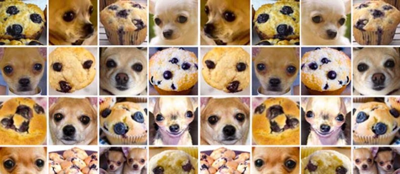

You’ve probably seen this internet meme demonstrating the alarming resemblance of chihuahuas and muffins. Everyone in the AI industry (including myself) loves putting the image in their presentations.

But, one question I haven’t seen anyone answer rigorously is: **just how good IS modern AI at disambiguating between a chihuahua and a muffin?** For your entertainment and education, I’ll be investigating this question today.

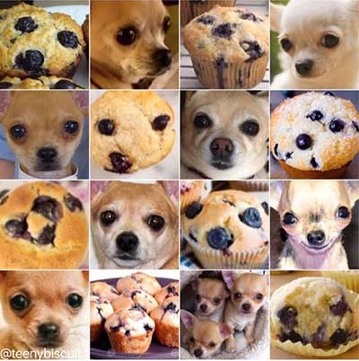

Binary classification has been possible ever since the [perceptron algorithm](https://en.wikipedia.org/wiki/Perceptron) was invented in 1957. If you think AI is hyped now, the New York Times reported in 1958 that the invention was the beginning of a computer that would “be able to walk, talk, see, write, reproduce itself and be conscious of its existence.” But while perceptron machines like the Mark 1 were designed for image recognition, in reality they could only discern patterns that are linearly separable, preventing them from learning the complex patterns that underlie most visual media.

No wonder the world was disillusioned and an “[AI Winter](https://en.wikipedia.org/wiki/AI_winter)” ensued. Since then, multi-layer perceptions (popular in the 1980s) and convolutional neural networks (pioneered by Yann LeCun in 1998) have greatly outperformed single-layer perceptions in image recognition tasks. With the advent of large labeled data sets like [ImageNet](http://www.image-net.org/) and powerful GPU computing, increasingly more advanced neural network architectures like [AlexNet](https://papers.nips.cc/paper/4824-imagenet-classification-with-deep-convolutional-neural-networks.pdfhttps://papers.nips.cc/paper/4824-imagenet-classification-with-deep-convolutional-neural-networks.pdf), [VGG](https://arxiv.org/pdf/1409.1556.pdf), [Inception](https://www.cv-foundation.org/openaccess/content_cvpr_2015/papers/Szegedy_Going_Deeper_With_2015_CVPR_paper.pdf), and [ResNet](https://arxiv.org/pdf/1512.03385.pdf) have achieved state-of-the-art performance in computer vision.

#### **Computer Vision & Image Recognition APIs**

If you’re a machine learning engineer, it’s easy to start experimenting with and fine-tuning these models by using pre-trained models and weights in either [Keras / Tensorflow](https://keras.io/applications/) or [PyTorch](https://github.com/pytorch/visionhttps://github.com/pytorch/vision). If you’re not comfortable tweaking neural networks on your own, you’re in luck because virtually all the leading technology giants and promising startups claim to “democratize AI” by offering easy-to-use computer vision APIs:

- [Amazon Rekognition](https://aws.amazon.com/rekognition/)
- [Microsoft Computer Vision](https://azure.microsoft.com/en-us/services/cognitive-services/computer-vision/https://azure.microsoft.com/en-us/services/cognitive-services/computer-vision/)
- [Google Cloud Vision](https://cloud.google.com/vision/)
- [IBM Watson Visual Recognition](https://www.ibm.com/watson/services/visual-recognition/https://www.ibm.com/watson/services/visual-recognition/)
- [Cloudsight](http://cloudsight.ai/)
- [Clarifai](https://www.clarifai.com/)

Which one is the “best”? To truly answer that question, you’d have to clearly define your business goals, product use cases, test data sets, and metrics of success before you benchmark the solutions against each other.

In lieu of a serious inquiry, we can at least get a high-level sense of the different behaviors of each platform by testing them with our toy problem of chihuahua vs. muffin.

#### **Conducting The Test**

To do this, I split the canonical meme above into 16 separate test images and use [open source code](https://github.com/goberoi/cloudy_visionhttps://github.com/goberoi/cloudy_vision) written by engineer Gaurav Oberoi to consolidate results from the different APIs. Each image is pushed through the 6 APIs listed above which return high confidence labels as predictions. The only exceptions are Microsoft which returns both labels and a caption and Cloudsight which uses human-AI hybrid technology to return only a single caption. This is why Cloudsight can return eerily accurate captions for complex images, but takes 10-20x longer to process.

Below is an example of the output. You can see the full list of results on all 16 chihuahua vs. muffin images by [clicking here](http://www.topbots.com/downloads/code/vision/chihuahua_vs_muffin/).

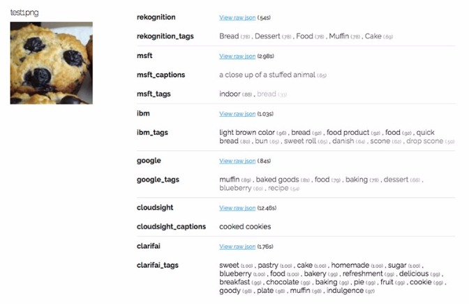

How well did the APIs do? Other than Microsoft which confused this muffin for a stuffed animal, every other API recognized the image was of food, but there wasn’t agreement as to whether the food was bread, cake, cookies, or muffins. Google was the only API to successfully identify “muffin” as the highest probability label.

Let’s look at a chihuahua example:

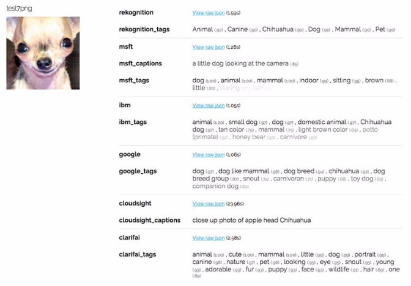

Again, the APIs did rather well. All of them realized the image was of a dog, although a few of them missed the exact breed.

There were definite failures, though. Microsoft returned a blatantly wrong caption three separate times describing muffins as either stuffed animals or a teddy bear.

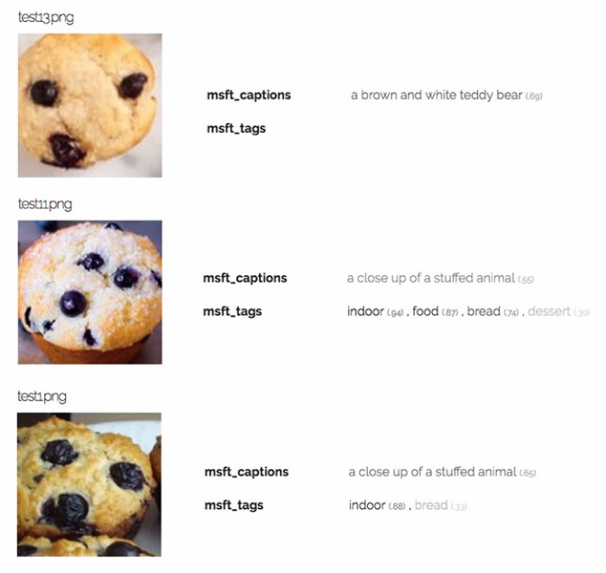

Google was the ultimate muffin identifier, returning “muffin” as its highest confidence label for 6 out of the 7 muffin images in our test set. The other APIs never returned “muffin” as the first label for any muffin picture, but instead related but less relevant labels like “bread”, “cookie”, or “cupcake”.

However, despite the string of successes, Google did fail on this specific muffin image, returning “snout” and “dog breed group” as predictions.

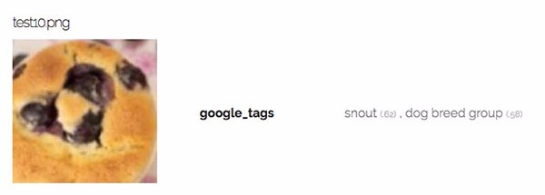

Even the world’s most advanced machine learning platforms are tripped up by our facetious chihuahua vs. muffin challenge! A human toddler beats deep learning when it comes to figuring what’s food and what’s Fido.

#### Testing With Real-World Images

As a further test, I’d like to know how well the APIs perform on more real-world images of chihuahuas and muffins, not just ones carefully curated to resemble each other. ImageNet happens to have [1750 images of chihuahuas](http://image-net.org/synset?wnid=n02085620) and [1335 images of various types of muffins](http://image-net.org/synset?wnid=n07690273).

Some of the images turned out to be pretty easy for our APIs to recognize because they exhibit very distinct class features, such as buggy eyes and pointy ears in the case of this chihuahua:

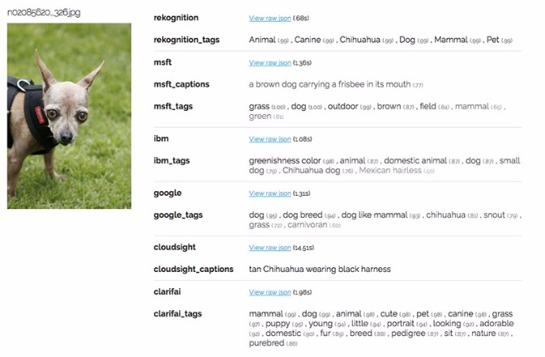

Other images, on the other hand, proved tricky. APIs often miss identifying objects in photos if there are multiple subjects within the same photo or if the subject is costumed or otherwise obstructed:

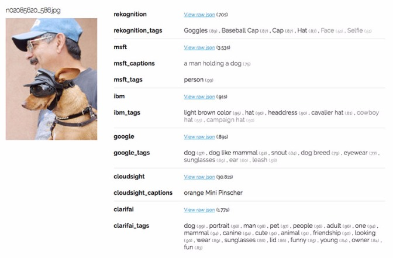

In the above case, the costume on the dog may have prevented the APIs (and likely many human classifiers) from correctly identifying the breed. IBM Watson manages to tag just the hats but not the dog or the person wearing them.

#### **Handling Noisy Labels**

With unstructured real-world data, including images, human-tagged labels are not always “ground truth” and labels can be incorrect or “noisy”. Here’s an example of an image that was included in the [“muffin” category](http://image-net.org/synset?wnid=n07690273) on ImageNet:

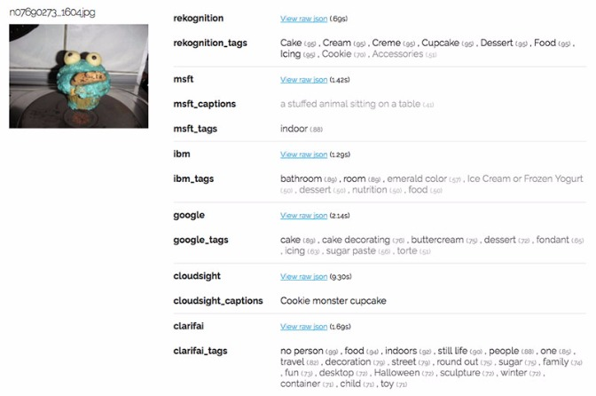

We humans would likely identify this “muffin in disguise” more accurately as a “cupcake”. Fortunately many of our APIs did return “cake”, “cupcake”, or “cookie” as predictions that are more relevant than the ImageNet category. Cloudsight’s human labeling produced the most accurate result of “cookie monster cupcake” for what is indeed a strange human invention for machines to interpret.

Utilizing multiple different models and APIs could be one interesting way to assess the “noisiness of labels”. In the case of ImageNet’s “muffin” category, the muffin varieties (i.e. bran, corn, popover, etc) can appear quite visually distinct and many are actually mislabeled cupcakes or other non-muffin types of baked goods.

Running large numbers of images through a number of different image recognition APIs and tracking the common overlaps and divergent one-offs can help you systematically flag images which might have noisy or incorrect labels.

**Weird side note:** in searching for different muffin categories on ImageNet, I happened across an unexpected category called “muffin man”, which ImageNet defines as “Formerly an itinerant peddler of muffins”. If you’re ever looking for photos of dudes presenting muffins, now you know where to go.

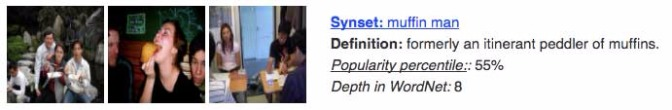

#### **Playing Trickster**

Just for fun, I tried to fool the APIs with these types of tricky photos:

- Photos of both a chihuahua AND a muffin
- Photos of dog-shaped cupcakes

Here’s how the APIs did on one of the photos featuring both a chihuahua AND a muffin:

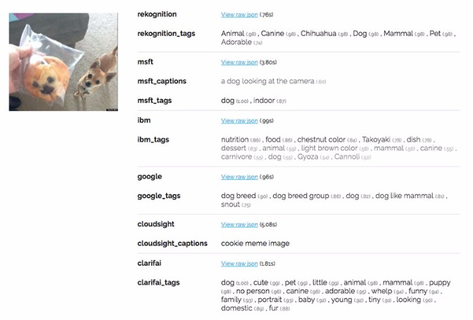

IBM and Cloudsight were the only two APIs that acknowledged any food was present in the image, although IBM got a bit creative with its guesses of “takoyaki”, “gyoza”, and “cannoli”.

There was also confusion caused by the dog-shaped cupcakes:
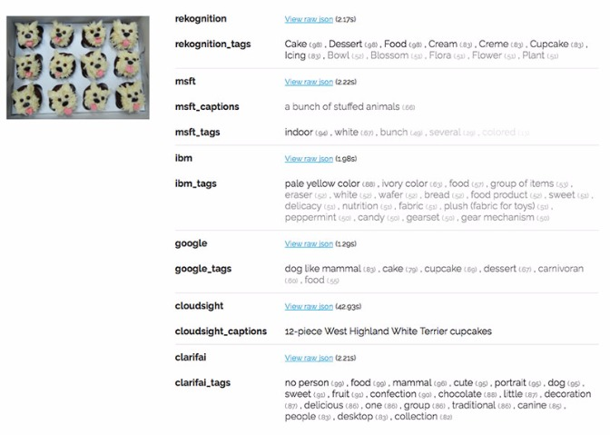

Microsoft, in traditional fashion, captioned the image as “a bunch of stuffed animals.” Google predicted the photo was more likely to be of a “dog like mammal” (0.89) than “cake” (0.79). Clarifai seemed to think the image contained both “food” (0.99) and a “mammal” (0.96) with very high confidence.

In these complex or unusual cases, Cloudsight’s human captioning demonstrated superior results, with this last image tagged very specifically as “12-piece West Highland White Terrier cupcakes” and the previous image even being recognized as being a popular meme!

#### **So, Which Computer Vision API Is The Best? **

While we can’t determine conclusively that one API is “better” than another just by these joke examples, you can definitely observe qualitative differences in how they perform.

**Amazon Rekognition**

Amazon’s Rekognition is not just good at identifying the primary object, but also many of the objects around the scene, such as when a human, bird, or piece of furniture is also in the image. It also includes qualitative judgements, just as “cute” or “adorable”. There’s a nice balance of objective and subjective labels in their top predictions.

**Google & IBM**

Google’s Vision API and IBM Watson Vision are both very literal and never seem to return labels other than straightforward descriptive labels. The performance seems comparable between the two, with IBM typically returning slightly more labels on average for any given photo.

**Microsoft**

Microsoft’s tags were usually too high level, i.e. “dog”, “canine”, “mammal” and they never once specified “chihuahua” or “muffin” which is a huge surprise. They also seemed to be very trigger happy with identifying muffins as “stuffed animals” in their automatically generated captions. You’d think that the company behind ResNet would have better performance to show for it, but this may be a quirk of this dataset so I encourage more robust testing on your own.

**Cloudsight**

Cloudsight is a hybrid between human tagging and machine labeling, so the API is much slower than the others as you can see from the speed stats below. That said, for difficult or strange photos, the Cloudsight description tends to be the most accurate, i.e. “12-piece West Highland White Terrier cupcakes.”

**Clarifai**

Clarifai returns by far the most tags (20), yet never once correctly identified the breed of the dog images as “chihuahua”. Instead they resorted to more generic tags like “dog”, “mammal”, or “animal”. What Clarifai does do well is add a lot of qualitative and subjective labels, such as “cute”, “funny”, “adorable”, “delicious”, etc. They also sometimes return abstracted concepts like “facial expression” or “no person”. These can be useful if you’re looking for a richer description of images for use in advertising or other consumer-facing purposes.

**Other Considerations**

As stated before, actual assessment of these APIs would require you to define clear business and product goals, an appropriate test data set, and metrics for success. You’d likely also need to consider factors such as cost, speed, and number of tags returned.

Here’s the summary for these additional metrics based on the 16 images from the classic chihuahua vs. muffin meme. Amazon Rekognition regularly performs a smidge faster than the other fully automated APIs. Cloudsight, as expected is materially slower because of the human / AI hybrid structure and only returns a single caption. Clarifai returns 20 labels by default.

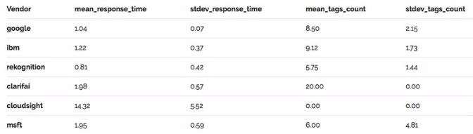

Pricing for all of the APIs can be found on their pricing pages which are linked below. Most of the APIs offer a free tier and then charge based on monthly processing volume. These are approximate starting prices per image as of the date of this article, but pricing is constantly in flux so you’ll need to check for updates before you commit to any platform.

- [Amazon](https://aws.amazon.com/rekognition/pricing/) – $0.001
- [Microsoft](https://azure.microsoft.com/en-us/pricing/details/cognitive-services/computer-vision/) – $0.001
- [IBM Watson](https://www.ibm.com/watson/services/visual-recognition/) – $0.002
- [Google Cloud](https://cloud.google.com/vision/pricing) – $0.0015
- [Cloudsight](https://cloudsight.ai/pricing) – $0.02
- [Clarifai](https://www.clarifai.com/developer/pricing/) – $0.0015

Most of the APIs charge between $0.001 and $0.002 per image for a few million images, but Cloudsight is notably more expensive at $0.02 an image, with pricing based on 30,000 images per month. Lower volume accounts can pay up to $0.07 an image!

#### **Further Research**

If you would like to conduct your own highly unscientific yet wildly entertaining research into image recognition APIs, it may be helpful to know that the chihuahua vs. muffin meme originator [Karen Zack](https://twitter.com/teenybiscuit) made a ton of “food vs animal” comparisons that are ripe for API benchmarking!

These are some of my favorites:

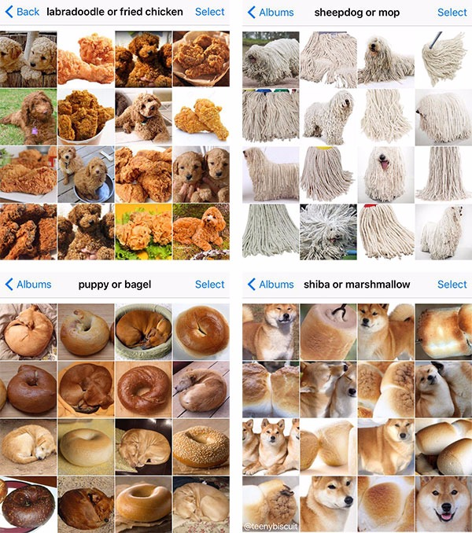

**Have fun & let me know what results you get in the comments below!**

## Love What You Just Read?

Well, don't stop here! Join the TOPBOTS community and we'll make sure you get the best content about applied artificial intelligence, machine learning, and automation.

