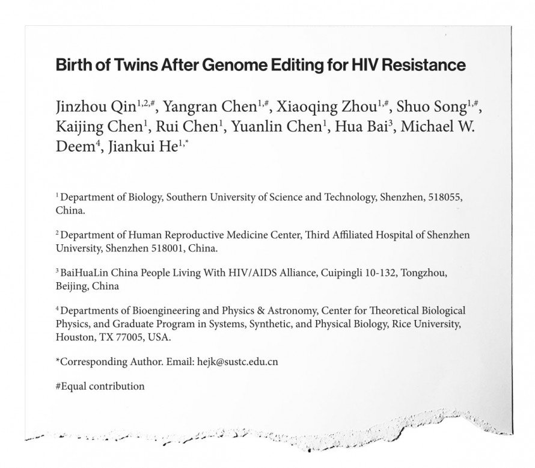
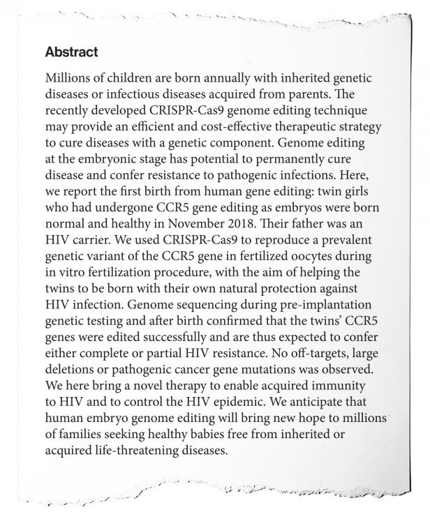
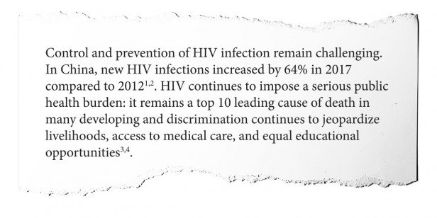
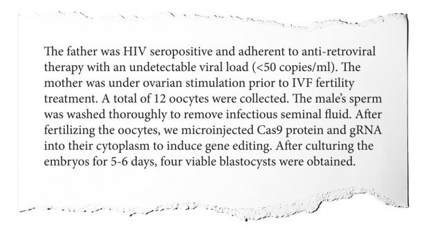
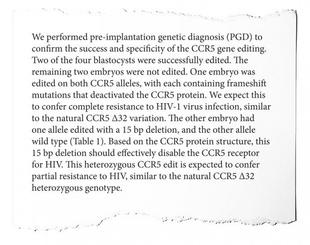
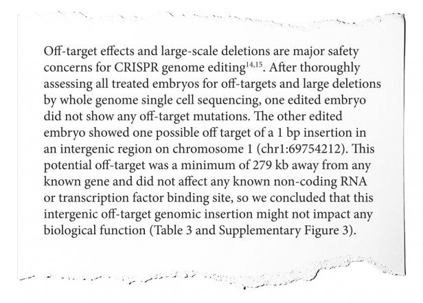
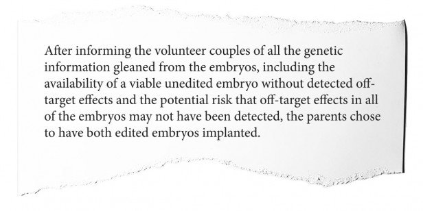
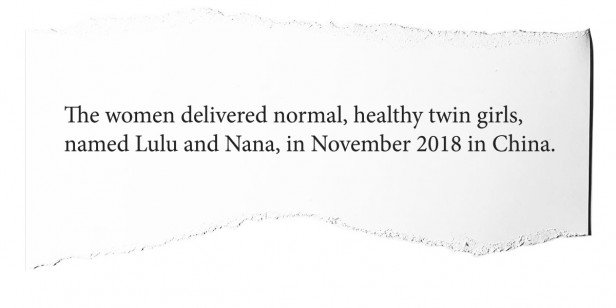
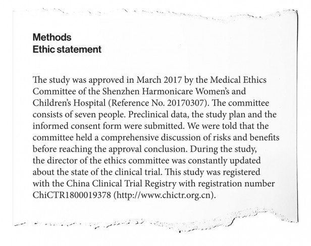
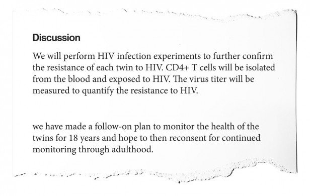

China’s CRISPR babies: Read exclusive excerpts from the unseen original research - MIT Technology Review

### [Biotechnology](https://www.technologyreview.com/biotechnology/) / [CRISPR](https://www.technologyreview.com/biotechnology/crispr/)

# China’s CRISPR babies: Read exclusive excerpts from the unseen original research

## He Jiankui’s manuscript shows how he ignored ethical and scientific norms in creating the gene-edited twins Lulu and Nana.

by [Antonio Regalado](https://www.technologyreview.com/profile/antonio-regalado/)

Dec 3, 2019

Earlier this year a source sent us a copy of an unpublished manuscript describing the creation of the first gene-edited babies, born last year in China. Today, we are making excerpts of that manuscript public for the first time.

Titled “Birth of Twins After Genome Editing for HIV Resistance,” and 4,699 words long, the still unpublished paper was authored by He Jiankui, the Chinese biophysicist who created the edited twin girls. A second manuscript we also received discusses laboratory research on human and animal embryos.

The metadata in the files we were sent indicate that the two draft papers were edited by He in late November 2018 and appear to be what he initially submitted for publication. A combined manuscript may also exist. After consideration by at least two prestigious journals, Nature and JAMA, his research remains unpublished.

The text of the twins paper is replete with expansive claims of a medical breakthrough that can “control the HIV epidemic.” It claims “success”—a word used more than once—in using a “novel therapy” to render the girls resistant to HIV. Yet surprisingly, it makes little attempt to prove that the twins really are resistant to the virus. And the text largely ignores data elsewhere in the paper suggesting that the editing went wrong.

We shared the unpublished manuscripts with four experts—a legal scholar, an IVF doctor, an embryologist, and a gene-editing specialist—and asked them for their reactions. Their views were damning. Among them: key claims that He and his team made are not supported by the data; the babies’ parents may have been under pressure to agree to join the experiment; the supposed medical benefits are dubious at best; and the researchers moved forward with creating living human beings before they fully understood the effects of the edits they had made.

Because these documents relate to one of the most important public interest issues of all time—the ability to change human heredity using technology—we here present excerpts from the “twins” manuscript, together with some of the experts’ comments, and explain the questions they raise. The excerpts are in the order in which they appear in the paper.

To understand why the manuscripts have remained unpublished up to now, read the accompanying article on [He's attempts to get them into scientific journals](https://www.technologyreview.com/s/614761/nature-jama-rejected-he-jiankui-crispr-baby-lulu-nana-paper/). For the [case for making their content public](https://www.technologyreview.com/s/614762/crispr-baby-twins-lulu-and-nana-what-happened/), read the op-ed by Kiran Musunuru, a gene-editing specialist at the University of Pennsylvania, who argues the Chinese data shows that gene-editing for reproduction is unsafe and premature.

### 1. Why aren’t the doctors among the paper’s authors?

The manuscript begins with a list of the authors—10 of them, mostly from He Jiankui’s lab at the Southern University of Science and Technology, but also including Hua Bai, director of an AIDS support network, who helped recruit couples, and Michael Deem, an American biophysicist whose role is under review by Rice University.

It’s a small number of people for such a significant project, and one reason is that some names are missing—notably, the fertility doctors who treated the patients and the obstetrician who delivered the babies. Concealing them may be an attempt to obscure the identities of the patients. However, it also leaves unclear whether or not these doctors understood they were helping to create the first gene-edited babies.

To some, the question of whether the manuscript is trustworthy arises immediately.

—**Hank Greely**, professor of law, Stanford University: *We have no, or almost no, independent evidence for anything reported in this paper. Although I believe that the babies probably were DNA-edited and were born, there’s very little evidence for that. Given the circumstances of this case, I am not willing to grant He Jiankui the usual presumption of honesty. *

### 2. The researchers’ own data don’t support their main claims

The abstract, or summary, lays out the aim of the project—to generate humans resistant to HIV—and the main results. It states that the team was “successfully” able to “reproduce” a known mutation in a gene called *CCR5*. The small percentage of people born naturally with this mutation, known as *CCR5 delta 32*, can be immune to infection by HIV.

But the summary goes well beyond what the data in the paper can back up. Specifically, as we’ll see later, the team didn’t actually reproduce the known mutation. Rather, they created new mutations, which might lead to HIV resistance but might not. They never checked to see, according to the paper.

—**Fyodor Urnov**, genome-editing scientist, Innovative Genomics Institute, University of California, Berkeley: *The claim they have reproduced the prevalent CCR5 variant is a blatant misrepresentation of the actual data and can only be described by one term: a deliberate falsehood. The study shows that the research team instead failed to reproduce the prevalent CCR5 variant. The statement that embryo editing will help millions is equal parts delusional and outrageous, and is akin to saying that the 1969 moonwalk “brings hopes to millions of human beings seeking to live on the moon.” *

**—Rita Vassena**, scientific director, Eugin Group: *Approaching this document, I was hoping to see a reflective and mindful approach to gene editing in human embryos. Unfortunately, it reads more like an experiment in search of a purpose, an attempt to find a defensible reason to use CRISPR/Cas9 technology in human embryos at all costs, rather than a conscientious, carefully thought through, stepwise approach to editing the human genome for generations to come. As the current scientific consensus indicates, the use of CRISPR/Cas9 in human embryos destined to give rise to a pregnancy is, at this stage, unjustified and unnecessary, and should not be pursued.*

### 3. Gene-editing embryos won’t bring HIV under control, especially in the worst-affected countries

The end of the abstract and beginning of the main text is where the authors justify their research. They suggest that gene-editing babies could save millions of people from HIV infection. Our commenters call this claim “preposterous” and “ludicrous,” and point out that even if the CRISPR method works to create people who are HIV resistant, it’s unlikely to be practical in places where HIV is rampant, such as in the southern part of Africa.

**—Rita Vassena**: *This work offers little justification for the editing and subsequent transfer of human embryos to generate a pregnancy. The idea that editing-derived embryos may one day be able to “control the HIV epidemic,” as the authors claim, is preposterous. Public health initiatives, education, and widespread access to antiviral drugs have been shown to control the HIV epidemic.*

**—Hank Greely**: *That this is a plausible way to “control the HIV epidemic” seems ludicrous. If every baby in the world were given this variation (beyond unlikely), it would begin to affect HIV infection substantially in 20 to 30 years, by which time we should have much better methods of stemming the epidemic—as well as existing methods that have substantially, if not yet sufficiently, slowed it. The 64% increase in infections in China (if true) is from a very low base. China has a substantially lower rate of HIV infection than Western countries. The situation in some developing countries remains more serious. But that this high-tech response is likely to be helpful in those countries is not plausible.*

### 4. The parents might have wanted to take part for the wrong reasons

Contrary to some interpretations, the point of using CRISPR on the babies’ DNA wasn’t to prevent them from catching HIV from their father, who was infected. As the paper describes, this was achieved by sperm washing, a well-established technique. Instead, the purpose of the editing was to give the children immunity to HIV later in life. Thus, the experiment didn’t provide clear, immediate medical benefits to either the parents or the children. Why did the couple agree? One reason may have been to access fertility treatment at all.

**—Rita Vassena**: *I find it worrying that the husband in the couple offered this experimental genome editing was positive to HIV infection, as one can imagine the unnecessary emotional pressure on the couple to consent to a procedure offering no improvement to the patient and their children’s health, but carrying a potential risk of negative consequences. It is worth remembering that HIV infection is not passed on through generations like a genetic disease; the embryo needs to “catch” the infection. For this reason, preventive measures such as controlling the viral load of the patient with appropriate drugs, and careful handling of the gametes during IVF, can avoid contagion very efficiently. Current assisted reproductive techniques ensure safe procreation for HIV-positive men and women, avoiding both horizontal (between partners) and vertical (between parent and embryo/fetus) transmission, making the editing of embryos in these cases unnecessary. In fact, the couple in the experiment did undergo such ART procedures, consisting in this case of an extended wash of semen to remove all seminal fluid, which may harbor HIV. Extended sperm washing has been used for almost two decades in IVF laboratories worldwide and in thousands of patients; in ours and others’ experience, it is safe for both parents and their future children and does not entail invasive manipulation of embryos.*

**—Jeanne O’Brien**, reproductive endocrinologist, Shady Grove Fertility: *Being HIV-positive in China carries a significant social stigma. In spite of intense familial and societal obligations to have a child, HIV-positive patients have no access to treatment for infertility. The social context in which the clinical study was carried out is problematic and it targeted a vulnerable patient group. Did the study provide a genetic treatment for a social problem? Was this couple free from undue coercion?*

### 5. The gene edits weren’t the same as the mutations that confer natural HIV resistance

Here, the researchers describe the changes CRISPR actually made to the twins. They removed a few cells from the IVF embryos to look at their DNA, and found that edits intended to disable the *CCR5* gene had indeed taken hold.

But while they “expect” these edits to confer HIV resistance by nullifying the activity of the gene, they can’t know for sure, because the edits are “similar” but not identical to *CCR5 delta 32*, the mutation that occurs in nature. Moreover, only one of the embryos had edits to both copies of the *CCR5* gene (one from each parent); the other had only one edited, giving partial HIV resistance at best.

**—Hank Greely**: *“Successfully” is iffy here. None of the embryos got the 32-base-pair deletion to CCR5 that is known in millions of humans. Instead, the embryos/eventual babies got novel variations, whose effects are not clear. As well, what does “partial resistance” to HIV mean? How partial? And was that enough to justify transferring the embryo, with a CCR5 gene never before seen in humans, to a uterus for possible birth?*

### 6. There could have been other, unwanted CRISPR edits

CRISPR isn’t a perfect tool. Trying to edit one gene can sometimes create other, unintended changes elsewhere in the genome. Here the team discusses their search for such unwanted edits, called “off-target” mutations, and say they found just one.

The search was incomplete, however, and the manuscript also glosses over a key point: any cells the researchers took from the early-stage embryos to test didn’t, therefore, actually contribute to the twins’ bodies. The remaining cells, the ones that would multiply and grow to become the twins, could have harbored off-target effects too, but there would have been no way to know that in advance of starting the pregnancy.

**—Fyodor Urnov**: *An egregious misrepresentation of the actual data that can, again, only be described as a blatant falsehood. It is technically impossible to determine whether an edited embryo “did not show any off-target mutations” without destroying that embryo by inspecting every one of its cells. This is a key problem for the entirety of the embryo-editing field, one that the authors sweep under the rug here.*

### 7. The doctors treating the couple may not have known what was going on

Reporting by a variety of news outlets, including the [Wall Street Journal](https://www.wsj.com/articles/how-a-chinese-scientist-broke-the-rules-to-create-the-first-gene-edited-babies-11557506697), has charged that He’s team tricked doctors by switching blood samples and that not all of them knew they were involved in creating gene-edited children. If true, that’s a problem, since it’s the duty of doctors to do what is in the best interest of the patient.

**—Jeanne O’Brien**: *The IVF procedure described follows the same steps and time line whether or not CRISPR is used for genome editing. The Chinese physicians who performed the IVF may have been unaware of the father’s HIV status or that the embryos were genetically modified. He Jiankui would have only needed a willing embryologist to inject CRISPR at the time of insemination. He’s comments make it appear as if the physicians who performed the IVF were not involved in the subsequent decision regarding which embryos to select for transfer. This is a wake-up call to physicians involved in IVF: the science and technology will continue to progress, and desperate couples with infertility may overlook the unknowns or believe the technology is proven safe. Once we, the infertility physicians, knowingly transfer an embryo with germline editing, we are in essence confirming the safety of the modification to the parents and the future child. Is it ever possible to know that?*

### 8. The manuscript misrepresents when the babies were born

By now, several media reports and people familiar with the research have established that the twins were born in October, not November. Why did He’s team include a false date? It may have been to protect the anonymity of the patients and their twins. In a country the size of China, there could be more than ten thousand sets of twins born each month. The falsified date may have been an attempt to make their reidentification even more difficult.

### 9. It’s not clear if there was a proper ethics review

The paper includes an exceptionally brief discussion of ethics. It says the research plan was registered with the China Clinical Trial Registry, but in fact the public registration occurred only after the twins were born.

**—Hank Greely**: *Registered when? The answer is on November 8, 2018, after the births and very shortly before they were announced, and probably in order to increase publication potential. This was not a normal registration. Maybe there was an ethics approval—though that hospital has denied it. Who is telling the truth? Not sure we’ll ever know. The phrase “we were told” about a comprehensive ethics review is not very powerful evidence. The article also does not discuss the Chinese ban on assisted reproductive services for HIV-positive parents. It has been reported that He had other men pretend to be the intended fathers for purpose of the required HIV tests. The article doesn’t say this. It seems to me likely to be true—and damning. If true, it means He defrauded the Chinese regulatory process.*

### 10. The researchers didn’t test whether the HIV immunity worked before creating living human beings

Here the Chinese team outlines their plan to collect blood from the twins to see if their edited cells really resist HIV. That is something they could have tried to learn ahead of time, before creating the girls. Before transferring the embryos, they could have kept them frozen while they made identical edits in laboratory  cells and tested the effects of HIV on those cells.

**—Fyodor Urnov**: *This statement proves that the research team placed their interests above those of the couple who donated the embryos and of their prospective children. There is zero evidence in the manuscript supporting the essential expectation that the new forms of CCR5 would be HIV-protective. It was essential to have determined that before the embryos were implanted. They could have done so using a known assay: introduce the same edits into immune system cells in the laboratory and then infect them with HIV. Only the cells that have HIV-protective variants of CCR5 survive. The research team chose not to do that assay. Instead, they made children out of embryos that had forms of CCR5 of entirely uncertain functional impact. Were the researchers in a rush? Did they simply not care? Whatever the explanation, this egregious violation of elementary norms of ethics and of research borders on the criminal.*

### 11. An American Nobelist may have helped He justify his experiment

The article’s conclusion contains an unexpected digression that puts forth an entirely new justification for the research, one that connects the project to the heart of the HIV epidemic in Africa. It’s that many uninfected children of African mothers with HIV suffer a syndrome called “HEU” that makes them more susceptible to a variety of childhood illnesses. The authors say genome editing could be a “novel strategy” against HEU.

There isn’t any evidence for this idea, but there are some clues about where He got it. In [an email](https://images.wsj.net/im-73321?width=1260&size=custom_1802x1696) he sent on November 22 to Craig Mello, a biologist at the University of Massachusetts who at the time was an advisor to one of his companies, He thanked Mello for suggestions on the topic and enclosed in his email the same paragraph above.

Does that mean Mello, a winner of the 2006 Nobel Prize for medicine, contributed a key idea to the paper? Mello was [told about](https://apnews.com/3f3bdc73e7c84fe685f2813510329d62) the twins project early on but, through a spokesman, says he never gave He advice on how to write the paper. According to He’s email, however, any such interaction was meant to remain unacknowledged. “Again, I won’t tell people you know what is happening here,” he wrote to Mello.

### 12. The project had other supporters, but some key information is missing

The manuscript concludes by thanking a list of people who, according to He, gave him direct feedback on draft versions of the text or other advice. In an acknowledgement for “editing” the text, he names Mark Dewitt, a researcher at the University of California. Dewitt didn’t reply to emails but earlier gave a [description of his role](https://www.statnews.com/2018/11/27/uc-berkeley-gene-edited-babies-china/), saying he had warned against the project. William Hurlbut, an ethicist at Stanford, says he gave ethics advice to He but didn’t know that the Chinese scientist had created children.

He also thanks W.R. “Twink” Allen, an equine reproduction specialist in the United Kingdom, and Allen’s onetime student Jin Zhang, also known as John Zhang, who is now head of New Hope Fertility Center in New York, one of the largest in the US. According to [reports](https://www.sciencemag.org/news/2019/08/untold-story-circle-trust-behind-world-s-first-gene-edited-babies), Zhang was planning with He late last year to open a [medical tourism business](https://www.technologyreview.com/s/614051/crispr-baby-maker-explored-starting-a-business-in-designer-baby-tourism/) for gene-edited babies.

Of these names, only Allen’s has not previously been cited in connection with the CRISPR-baby research. Allen did not reply to attempts to contact him by email. Zhang, who [has not been forthcoming](https://www.sciencemag.org/news/2019/08/untold-story-circle-trust-behind-world-s-first-gene-edited-babies) about his role, told us he was not familiar with the manuscript. “I have never seen it,” he told us in October.

The version of the twins manuscript we have is missing two critically important disclosures usually present in scientific papers. First, it gives no information about who funded the project or what financial interests the authors have in the outcome. Also missing is a section in which each author’s scientific contribution is detailed. This means the text does not explicitly describe the role of the single non-Chinese author, Michael Deem of Rice University in Texas. The nature of Deem’s role—particularly any hands-on involvement with the patients—could determine penalties that Deem, or his university, could face. Deem’s lawyers did not answer questions, including a request for copies of his past statements, which sought to minimize his role in the research. Rice says its investigation is ongoing.

### 13. The researchers ignored evidence that the gene edits weren’t uniform

In data attached to the paper, in the so-called “supplementary” material, are tables that He previously showed publicly. It shows chromatograms, or the readout of the DNA sequences found in the embryos and birth tissues of the twins (the umbilical cord and placenta) when his team tried to measure what editing had happened to the *CCR5* gene.

Some observers, including Musunuru in our [accompanying op-ed](https://www.technologyreview.com/s/614762/crispr-baby-twins-lulu-and-nana-what-happened/), say these data show clearly that the embryos are “mosaic,” meaning that different cells in the embryo were edited differently. He says presence of multiple edits is visible in the chromatograms, where several distinct readings are registered in overlapping signals at a given DNA position.

The implication of the data is that the twins’ bodies could be composites of cells edited in different ways, or not at all. That, Musunuru points out, means only some of their cells might have the HIV-resistant gene edit; it also means some might have undetected "off-target" edits, which could potentially cause health problems. The problem of mosaicism was well known to He from his experiments on animal embryos. One of the mysteries of the research project is why He chose to proceed with embryos if they were flawed in this way.

#### Sign up for **The Download** — your daily dose of what's up in emerging technology

Also stay updated on MIT Technology Review initiatives and events?
YesNo

In his manuscript, He doesn’t resolve the mystery. It says only, “The CCR5 gene was deep sequenced for all samples to examine the mosaicism of gene editing.” There’s no interpretation of what was found, and no acknowledgement that the data seem to show mosaicism or that it’s a problem.

**—Fyodor Urnov**: *They should have worked and worked and worked until they reduced mosaicism to as close to zero as possible. This failed completely. They forged ahead anyway.*' class='jsx-671803276 js-evernote-checked' data-evernote-id='989'%3e%3c/path%3e%3c/svg%3e)

Share

[**](https://www.facebook.com/dialog/share?app_id=140586622674265&display=popup&title=China%E2%80%99s%20CRISPR%20babies%3A%20Read%20exclusive%20excerpts%20from%20the%20unseen%20original%20research&description=He%20Jiankui%E2%80%99s%20manuscript%20shows%20how%20he%20ignored%20ethical%20and%20scientific%20norms%20in%20creating%20the%20gene-edited%20twins%20Lulu%20and%20Nana.&href=https%3A%2F%2Fwww.technologyreview.com%2Fs%2F614764%2Fchinas-crispr-babies-read-exclusive-excerpts-he-jiankui-paper%2F%3Futm_campaign%3Dsite_visitor.unpaid.engagement%26utm_source%3Dfacebook%26utm_medium%3Dsocial_share%26utm_content%3D2019-12-04)

[**](https://twitter.com/intent/tweet?text=China%E2%80%99s%20CRISPR%20babies%3A%20Read%20exclusive%20excerpts%20from%20the%20unseen%20original%20research%20-%20via%20%40techreview&url=https%3A%2F%2Fwww.technologyreview.com%2Fs%2F614764%2Fchinas-crispr-babies-read-exclusive-excerpts-he-jiankui-paper%2F%3Futm_campaign%3Dsite_visitor.unpaid.engagement%26utm_source%3Dtwitter%26utm_medium%3Dsocial_share%26utm_content%3D2019-12-04)

[**](https://reddit.com/submit?text=China%E2%80%99s%20CRISPR%20babies%3A%20Read%20exclusive%20excerpts%20from%20the%20unseen%20original%20research&url=https%3A%2F%2Fwww.technologyreview.com%2Fs%2F614764%2Fchinas-crispr-babies-read-exclusive-excerpts-he-jiankui-paper%2F%3Futm_campaign%3Dsite_visitor.unpaid.engagement%26utm_source%3Dreddit%26utm_medium%3Dsocial_share%26utm_content%3D2019-12-04)

[**](https://linkedin.com/shareArticle?text=China%E2%80%99s%20CRISPR%20babies%3A%20Read%20exclusive%20excerpts%20from%20the%20unseen%20original%20research&url=https%3A%2F%2Fwww.technologyreview.com%2Fs%2F614764%2Fchinas-crispr-babies-read-exclusive-excerpts-he-jiankui-paper%2F%3Futm_campaign%3Dsite_visitor.unpaid.engagement%26utm_source%3Dlinkedin%26utm_medium%3Dsocial_share%26utm_content%3D2019-12-04&summary=He%20Jiankui%E2%80%99s%20manuscript%20shows%20how%20he%20ignored%20ethical%20and%20scientific%20norms%20in%20creating%20the%20gene-edited%20twins%20Lulu%20and%20Nana.)

[**](https://api.whatsapp.com/send?text=China%E2%80%99s%20CRISPR%20babies%3A%20Read%20exclusive%20excerpts%20from%20the%20unseen%20original%20research%20https%3A%2F%2Fwww.technologyreview.com%2Fs%2F614764%2Fchinas-crispr-babies-read-exclusive-excerpts-he-jiankui-paper%2F%3Futm_campaign%3Dsite_visitor.unpaid.engagement%26utm_source%3Dwhatsapp%26utm_medium%3Dsocial_share%26utm_content%3D2019-12-04)

[**](https://www.technologyreview.com/s/614764/chinas-crispr-babies-read-exclusive-excerpts-he-jiankui-paper/mailto:?subject=China%E2%80%99s%20CRISPR%20babies%3A%20Read%20exclusive%20excerpts%20from%20the%20unseen%20original%20research&body=From%20MIT%20Technology%20Review%3A%0A%0AChina%E2%80%99s%20CRISPR%20babies%3A%20Read%20exclusive%20excerpts%20from%20the%20unseen%20original%20research%0AHe%20Jiankui%E2%80%99s%20manuscript%20shows%20how%20he%20ignored%20ethical%20and%20scientific%20norms%20in%20creating%20the%20gene-edited%20twins%20Lulu%20and%20Nana.%0A%0Ahttps%3A%2F%2Fwww.technologyreview.com%2Fs%2F614764%2Fchinas-crispr-babies-read-exclusive-excerpts-he-jiankui-paper%2F%3Futm_campaign%3Dsite_visitor.unpaid.engagement%26utm_source%3Demail%26utm_medium%3Dsocial_share%26utm_content%3D2019-12-04)

Link

Author
[(L)](https://www.technologyreview.com/profile/antonio-regalado/)
[Antonio Regalado](https://www.technologyreview.com/profile/antonio-regalado/)