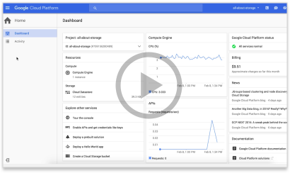
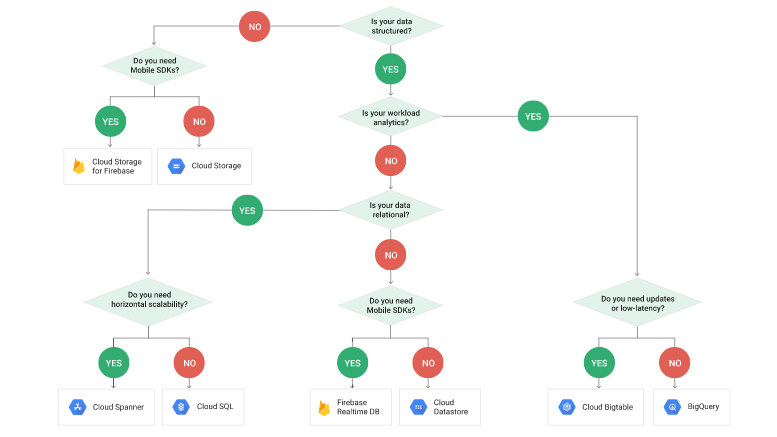

Choosing a Storage Option  |  Google Cloud Platform

# Choosing a Storage Option

##  Managed storage and databases to satisfy all your needs

 [View Documentation](https://cloud.google.com/docs/)  [View Console](https://console.cloud.google.com/)

###  Choosing a storage option

Different applications and workloads require different storage and database solutions. We offer a full suite of industry-leading storage services that are price performant and meet your needs for structured, unstructured, transactional, and relational data. This page helps you identify the solutions that fit your scenarios, whether they are mobile applications, hosting commercial software, data pipelines, or storing backups.

 

 

.    

| Product | Description | Good For | Common Workloads |
| --- | --- | --- | --- |
|    [Persistent Disk](https://cloud.google.com/persistent-disk/) | Fully-managed, price-performant block storage that is suitable for virtual machines and containers. | - Block storage for Google Compute Engine and Google Container Engine - Snapshots for data backup | - Disks for virtual machines - Sharing read-only data across multiple virtual machines - Rapid, durable backups of running virtual machines |
|    [Google Cloud Storage](https://cloud.google.com/storage/) | A scalable, fully-managed, highly reliable, and cost-efficient object / blob store. | - Images, pictures, and videos - Objects and blobs - Unstructured data | - Storing and streaming multimedia - Storage for custom data analytics pipelines - Archive, backup, and disaster recovery |
|    [Google Cloud Bigtable](https://cloud.google.com/bigtable/) | A scalable, fully-managed NoSQL wide-column database that is suitable for both real-time access and analytics workloads. | - Low-latency read/write access - High-throughput analytics - Native time series support | - IoT, finance, adtech - Personalization, recommendations - Monitoring - Geospatial datasets - Graphs |
|    [Google Cloud Datastore](https://cloud.google.com/datastore/) | A scalable, fully-managed NoSQL document database for your web and mobile applications. | - Semi-structured application data - Hierarchical data - Durable key-value data | - User profiles - Product catalogs - Game state |
|    [Google Cloud SQL](https://cloud.google.com/sql/) | A fully-managed MySQL and PostgreSQL database service that is built on the strength and reliability of Google’s infrastructure. | - Web frameworks - Structured data - OLTP workloads | - Websites, blogs, and content management systems (CMS) - Business Intelligence (BI) applications - ERP, CRM, and eCommerce applications - Geospatial applications |
|    [Google Cloud Spanner](https://cloud.google.com/spanner/) | Mission-critical, relational database service with transactional consistency, global scale and high availability. | - Mission-critical applications - High transactions - Scale + Consistency requirements | - Adtech - Financial services - Global supply chain - Retail |
|    [Google BigQuery](https://cloud.google.com/bigquery/) | A scalable, fully-managed Enterprise Data Warehouse (EDW) with SQL and fast response times. | - OLAP workloads up to petabyte-scale - Big Data exploration and processing - Reporting via Business Intelligence (BI) tools | - Analytical reporting on large data - Data Science and advanced analyses - Big Data processing using SQL |
|    [Google Drive](https://www.google.com/drive/) | A collaborative space for storing, sharing, and editing files, including Google Docs. | - End-user interaction with docs and files - Collaborative creation and editing - Syncing files between cloud and local devices | - Access files from anywhere through web, apps, and sync clients - Create and work on documents with coworkers - Backup photos and media |

### Additional storage options for mobile

| Product | Description | Good For | Common Workloads |
| --- | --- | --- | --- |
|    [Cloud Storage for Firebase](https://firebase.google.com/docs/storage/) | Mobile and web access to Google Cloud Storage with serverless third party authentication and authorization. | - Images, pictures, and videos - Objects and blobs - Unstructured data | - User-generated content - Uploads over mobile networks |
|    [Firebase Realtime Database](https://firebase.google.com/docs/database/) | A realtime, NoSQL JSON database for your web and mobile applications. | - Mobile and web applications - Realtime | - Chat and social - Business and education collaboration - Mobile games |
|    [Firebase Hosting](https://firebase.google.com/docs/hosting/) | Production-grade web and mobile content hosting for developers. | - Atomic release management - JS app support (for example, URL rewriting) - Firebase integration | - Landing pages for startups and apps - Rich JavaScript client applications - Static sites (for example, Jekyll blogs) |

 [View Documentation](https://cloud.google.com/docs/)  [View Console](https://console.cloud.google.com/)

.

# Additional Resources

 [ ### Webinar    Watch how to choose a storage option](https://www.youtube.com/watch?v=mmjuMyRBPO4&feature=youtu.be)

 [ ### Cloud Platform Blog    Stay up to date](https://cloudplatform.googleblog.com/)

 [ ### Getting started    Cloud Platform Tutorials and Solutions](https://cloud.google.com/docs/tutorials/)

 .