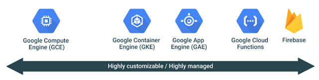

Choosing the right compute option in GCP: a decision tree

## [Choosing the right compute option in GCP: a decision tree](https://cloudplatform.googleblog.com/2017/07/choosing-the-right-compute-option-in-GCP-a-decision-tree.html)

Wednesday, July 5, 2017
 By Terrence Ryan, Developer Advocate and Adam Glick, Product Marketing Manager

When you start a new project on [Google Cloud Platform](https://cloud.google.com/) (GCP), one of earliest decisions you make is which computing service to use: Google Compute Engine, Google Container Engine, App Engine or even Google Cloud Functions and Firebase.

GCP offers a range of compute services that go from giving users full control (i.e., Compute Engine) to highly-abstracted (i.e., Firebase and Cloud Functions), letting Google take care of more and more of the management and operations along the way.

Here’s how many long-time readers of our blog think about GCP compute options. If you're used to managing VMs and want a similar experience in the cloud, pick Compute Engine. If you use containers and need to coordinate more than one container in your solution, you can abstract away some of the necessary management overhead by using Container Engine. If you want to focus on your code and avoid the infrastructure pieces entirely, use App Engine. Finally, if you want to focus purely on code and build microservices that expose API endpoints for your applications, use Firebase and Cloud Functions.

Over the years, you've told us that this model works great if you have no constraints, but can be challenging if you do. We’ve heard your feedback and propose another way to choose your compute options using a constraint-based set of questions. (It should go without saying that we’re considering very small aspects of your project.)

**1. Are you building a mobile or HTML application that does its heavy lifting, processing-wise, on the client?** If you're building a thick client that only relies on a backend for synchronization and/or storage, Firebase is a great option. Firebase allows you to store complex NoSQL documents (or objects if that’s how you think of them) and files using a very easy-to-use API and client available for iOS, Android and Javascript. There’s also a REST API for access from other platforms.

**2. Are you building a system based more on events than user interaction? In other words, are you building an app that responds to uploaded files, or maybe logins to other applications?** Are you already looking at “serverless” or “Functions as a Service” solutions? Look no further than Cloud Functions. Cloud Functions allows you to write Javascript functions that run on Node.js and that can call any one of our APIs including Cloud Vision, Translate, Cloud Storage or over 100 others. With Cloud Functions, you can build complex individual functions that get exposed as microservices to take advantage of all our services without having to maintain systems and glue them all together.

**3. Does your solution already exist somewhere else? Does it include licensed software? Does it require anything other than HTTP/S? **If you answered “no,” App Engine is worth a look. App Engine is a serverless solution that runs your code on our infrastructure and charges you only for what you use. We scale it up or down for you depending on demand. In addition, App Engine has access to all the Google SDKs available so you can take advantage of the full Google Cloud ecosystem.

4**. Are you looking to build a container-based system? Do you require orchestration?** If you're building a multi-container solution, orchestration becomes a consideration. Container orchestration is service that handles deployment, redundancy and load distribution of your containers. One of the most mature, and popular, orchestrators is Kubernetes. If you're considering using Kubernetes on GCP, you should just use Container Engine. (You should think about it wherever you're going to run Kubernetes actually.) Container Engine reduces building a Kubernetes solution to a single click. Additionally, it auto-scales Kubernetes cluster members, allowing you to build Kubernetes solutions that grow and shrink based on demand.

**5. Are you looking to use GPUs in your solution? Are you building a non-Kubernetes container-based solution? Are you migrating an existing on-prem solution to the cloud? Are you using licensed software? Do you need a custom kernel or arbitrary OS? Have you not found another solution to meet your needs?** If you answered “yes” to any of these questions, you’re probably going to need to run your solution on virtual machines on Compute Engine. Compute Engine is our most flexible computing product, and allows you the most freedom to configure and manage your VMs however you like.

Put all of these questions together and you get the following flowchart:

This is by no means a comprehensive decision tree, and each one of our products supports a wider range of use cases than is presented here. But this should be a good guide to get you started.

To find out more about or computing solutions please check out[Computing on Google Cloud Platform](https://cloud.google.com/products/compute/) and then try it out for yourself today with $300 in free credits when you [sign up](https://console.cloud.google.com/freetrial?_ga=1.42138917.1875422736.1494577439).

Happy building!

Labels:[Compute](https://cloudplatform.googleblog.com/search/label/Compute)