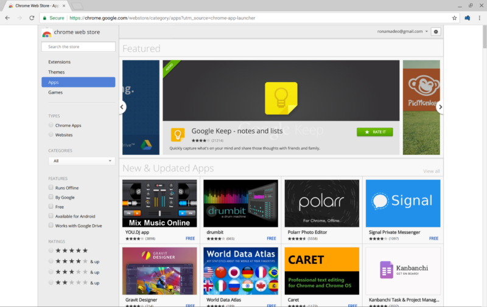

Chrome Apps are dead, as Google shuts down the Chrome Web Store section

####  Joining the choir invisible —

# Chrome Apps are dead, as Google shuts down the Chrome Web Store section

## Google says Progressive Web Apps are the future of app-like webpages.

 [Ron Amadeo](https://arstechnica.com/author/ronamadeo/) - 12/6/2017, 5:01 PM

 

[Enlarge](https://cdn.arstechnica.net/wp-content/uploads/2017/12/Screenshot-2017-12-06-at-11.44.44-AM.png)  / The Chrome Web Store.

[reader comments129](https://arstechnica.com/gadgets/2017/12/google-shuts-down-the-apps-section-of-the-chrome-web-store/?comments=1)

 Share this story  [(L)](https://www.facebook.com/sharer.php?u=https%3A%2F%2Farstechnica.com%2F%3Fpost_type%3Dpost%26p%3D1227899)  [(L)](https://twitter.com/share?text=Chrome+Apps+are+dead%2C+as+Google+shuts+down+the+Chrome+Web+Store+section&url=https%3A%2F%2Farstechnica.com%2F%3Fpost_type%3Dpost%26p%3D1227899)  [(L)](https://www.reddit.com/submit?url=https%3A%2F%2Farstechnica.com%2F%3Fpost_type%3Dpost%26p%3D1227899&title=Chrome+Apps+are+dead%2C+as+Google+shuts+down+the+Chrome+Web+Store+section)  [(L)](https://plus.google.com/share?url=https%3A%2F%2Farstechnica.com%2F%3Fpost_type%3Dpost%26p%3D1227899)

[More than a year ago,](https://arstechnica.com/gadgets/2016/08/google-is-killing-chrome-apps-on-windows-mac-and-linux/) Google announced that Chrome Apps would be removed from Windows, Mac, and Linux versions of Chrome (but not Chrome OS) some time in 2017, and it seems we've come to that point today. Google has shut down the "app" section of the Chrome Web Store for those platforms, meaning you can't install Chrome Apps anymore. Google has started [sending out emails](https://plus.google.com/+NobleAckerson/posts/i8uLr9rpGwR) to Chrome app developers telling them that Chrome Apps are deprecated, and while previously installed apps still work, the functionality will be stripped out of Chrome in Q1 2018.

As Google explained in its [blog pos](https://blog.chromium.org/2016/08/from-chrome-apps-to-web.html)t last year, Chrome apps are being killed because no one uses them. In the post, Google said that "approximately 1 percent of users on Windows, Mac and Linux actively use Chrome packaged apps." Chrome Apps came in two varieties: "packaged apps" and "hosted apps." Hosted apps were basically glorified bookmarks, which makes little sense on a real desktop OS but gave Chrome OS users a way to pin important webpages to certain parts of the UI. The more powerful Chrome Apps were "packaged apps," which could run in the background and access hardware like USB ports. Both were desktop-only features, and now both will exist as Chrome OS-only features.

There's also Chrome Extensions, which are still desktop only and aren't going anywhere. Extensions are also installed through the Chrome Web Store and usually live next to the address bar as buttons. This is the plug-in point for password managers, script and ad blockers, and mail checkers, and even the occasional fully fledged "app," like [Google Hangouts](https://chrome.google.com/webstore/detail/google-hangouts/nckgahadagoaajjgafhacjanaoiihapd) for Chrome.

Google wants to throw yet another app type into the mix, though. With the shutdown of Chrome Apps, Google is working to bring Progressive Web Apps (PWAs) to the desktop. PWAs again aim to bring a few app-like features to websites, giving them a full-screen interface, an ["installable" app icon](https://arstechnica.com/gadgets/2015/03/chrome-for-android-to-push-web-app-adoption-with-add-to-home-screen-popup/), push notifications, and offline capabilities. They already work on Chrome for Android, so once Google is done here, PWAs would be the only Chrome app type to work across desktop and mobile.

Progressive Web Apps are not Chrome-specific. PWAs aren't exactly a "standard" but are a catch-all phrase for a combination of existing W3C standards like a [Web app manifest](https://www.w3.org/TR/appmanifest/) for app icons and [service workers](https://www.w3.org/TR/service-workers-1/) for push notifications and background updates. Because of this, other companies are jumping on the PWA bandwagon: it works [on Samsung Android phones](https://medium.com/samsung-internet-dev/6-myths-of-progressive-web-apps-81e28ca9d2b1) in the Samsung browser, [Firefox on Android](https://hacks.mozilla.org/2017/10/progressive-web-apps-firefox-android/), and [Opera on Android](https://dev.opera.com/articles/pwa-resources/). PWAs got a big boost to move beyond Android when Microsoft announced it was[ bringing PWAs to Windows 10](https://channel9.msdn.com/Events/Build/2017/B8075), and [even Apple](https://dockyard.com/blog/2017/10/25/work-on-web-app-manifest-in-webkit-has-begun) has slowly started work on adding PWA support to Safari.

Google says it is "roughly targeting mid-2018" for PWA desktop apps. There's still no word on removing Chrome Apps from Chrome OS, though. If only 1 percent of users used Chrome Apps when it was supported on the major desktop OSes, you've got to wonder how dead and abandoned the platform will be when it is only available on Chrome OS.

**Update:** You can still install Chrome apps by [directly linking](https://chrome.google.com/webstore/detail/videostream-for-google-ch/cnciopoikihiagdjbjpnocolokfelagl?hl=en) to a Chrome app, so right now only search and the browsable app section is turned off. All Chrome apps are now confusingly listed as extensions, though, even though they are apps.