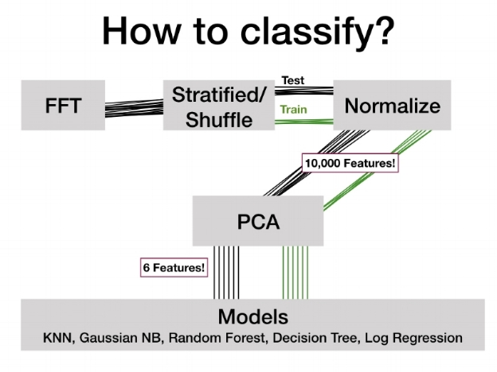
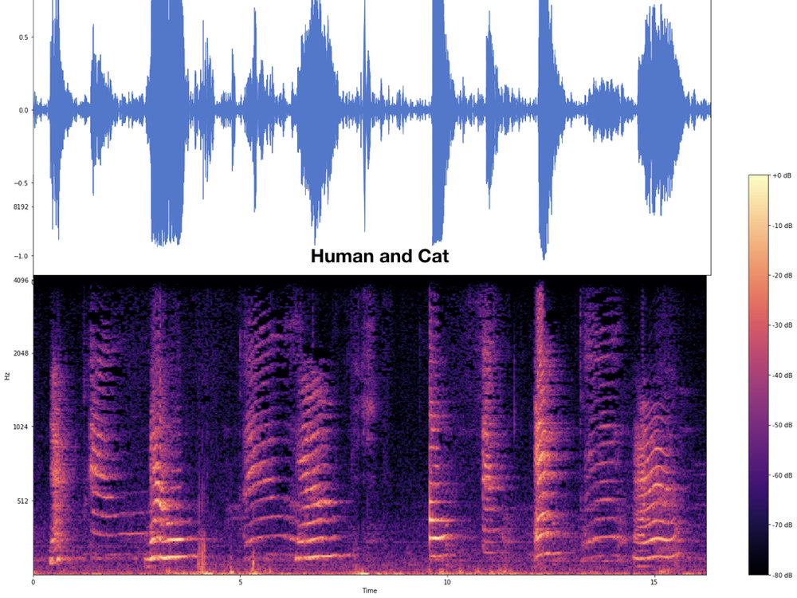
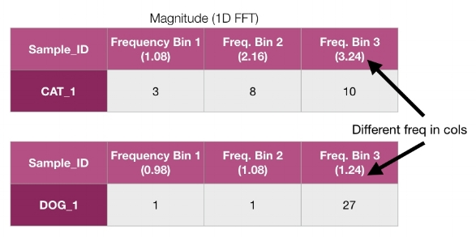
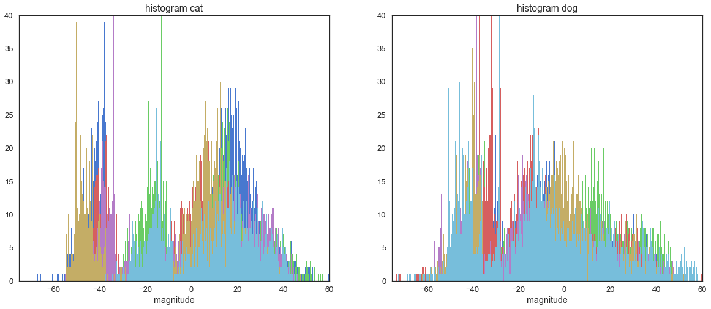
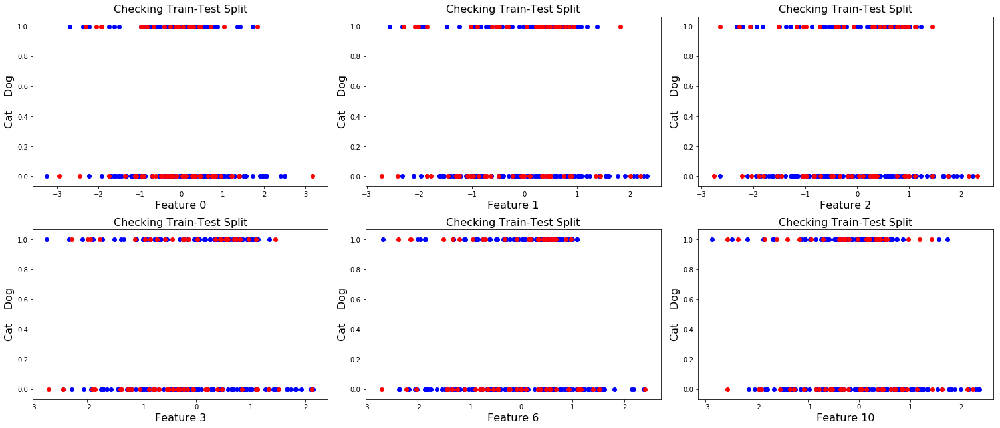
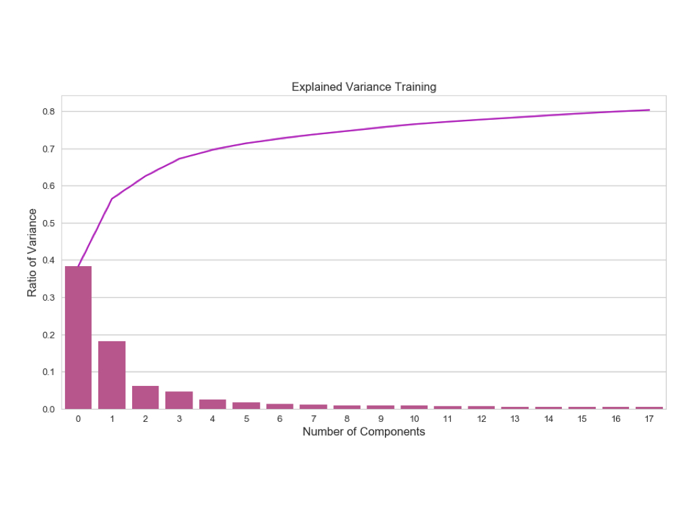
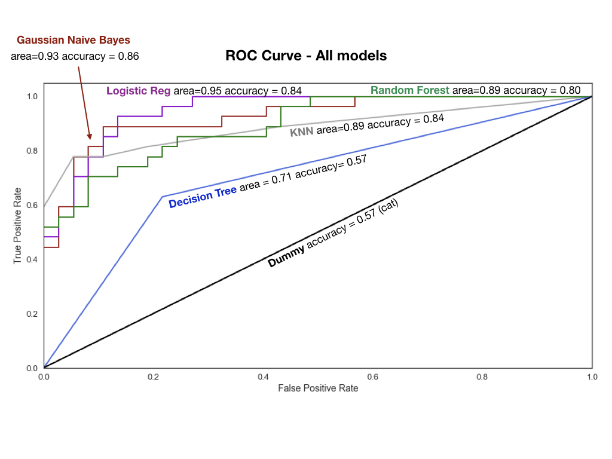

Classification of Meows and Woofs: Part 2

#   [Classification of Meows and Woofs: Part 2](https://www.summerrankin.com/dogandponyshow/2017/10/16/catdog-bd3gt)

 November 14, 2017

This is the 2nd part of my dog/cat sound classification project. I built a model to classify a set of .wav files into sounds made by either a cat or a dog. See my [previous pos](https://www.summerrankin.com/dogandponyshow?tag=audio%20analysis)t for the initial exploration of the data. I have posted the data and some Ipython/jupyter notebooks for this project in a [repo on github](https://github.com/1fmusic/Audio_cat_dog_classification). Feel free to use my code to do some explorations of your own.

I used the python libraries numpy, scipy, [librosa](https://librosa.github.io/librosa/install.html) and [sklearn](http://scikit-learn.org/stable/) for this project.

The flow chart below gives you an overview of the different analysis stages and steps of the project.

 

human and cat meowing

    /

 

As I mentioned in the last post about the spectral analysis of the audio signal, a typical time-frequency decomposition of the audio signal looks like the figure on the left. The top blue line is the actual audio signal. The colorful picture at the bottom is how the strength in the different frequencies are distributed over time. You might recall from the last post the hotter/brigher colors mean more power at that frequency at that instant in time. This type of time-frequency representation has all the information the you need about the signal. If we use this time-frequency matrix in the classifier, it is the maximum information we can put in, at least based on the spectrogram approach.

This brings up two problems a) it makes it computationally more expensive, and b) we don't know whether we need all that information to accurately classify the files. Starting with a more parsimonious representation has the benefit of making it computationally simple and easier to interpret.

So as a first step I decided to compress the the time-frequency representation into something more manageable. I decided to keep all the frequency information but compressed over time. Maybe an aggregate representation of the power across time would be a good starting point. To get that, instead of binning the sound file into windows and calcuating it FFT within that window and across time, I took the whole file and calcuated its power in each frequency over the entire length of the file. This give us a single numpy vector per file. This type of frequency representation is obtained from a **1D FFT** (Fast Fourier Transform) and is also called a periodogram.

Here's the catch. Since the files are all of different lengths the 'resolution' of the frequency space will be different. The longer the file is the more frequency resolution a file will have (check here if you want to know more about this). So we are faced with a data standardization problem.

There are two solutions to this problem. The first one is to chop/crop all the files to the length of the shortest file and then do FFT on it. But that means we are throwing out raw data. I usually prefer no to do that. In my previous life as a practising neuroscientist we always frowned upon this. We preferred to standardize on derived metrics. In this case our derived variable is the FFT vector. Also the estimate of the power becomes better as you have more data. So that is what I went with. Let me make this more clear with a specific example.

The first few colums of CAT_1.wav and DOG_1.wav are given in the plot below. The dog sound file is longer than the cat sound file. As a result the frequency resolution in the dog file is higher (smaller increment from column to column) and frequencty resolution in the cat sound file is smaller (greater jump from column to column). I wanted to have the columns represent similar frequency bins so that we are comparing apples to apples. So I applied the following standardization procedure to the 1D FFT vectors.

 

I took the frequencies from our 'shortest' 1D FFT and used it as a master frequency index. This has the coarsest frequency representation and hence the minimal information. If this works any further information we provide will only improve the model. So using this set of frequencies I resampled all the other FFT vectors as follows:

	1. I took a small sample of 10 of the smallest (in KB) wav files from the entire corpus (does not matter if cat or dog), and did the FFT, and output the dataframe conatining all the (positive) frequencies.

	freqs1 = np.fft.fftfreq(y.size, time_step)

	2. Looked at the lengh of the frequency vectors as a proxy for the frequency resolution (i.e. more resolution longer the vector) and saved the shortest one as my "master_frequencies". These master frequencies are now going to be our template for how we 'resample' the rest of the files.

	3. Next in the resample_freq function, we load our master frequencies along with a cat or dog FFT and freq file. Then, we find the frequencies that are the closest to the frequencies in the master freqs and get the index.

	for freq in master_freq:
	       ind = (np.abs(old_freq,freq)).argmin()
	       idf.append(ind)

	4. Take this index to pull the corresponding magnitude values (fft values) and we now have something that is comparable!

	new_fft = old_fft[idf]
	new_freq = old_freq[idf]

This technique allows us to have a large dataframe where each row is a cat/dog sample and each column represents roughly the same requency, each value is that sample's power (magnitude) at that frequency.

The last thing to do is take the cat and dog data frames, concatenate them and add a target/label column that tells us which category the row belongs to (cat or dog).

# Dimensionality Reduction

### train_cat_dog

As you may have noticed, we have over 10,000 features! The first thing we do after opening the file, is plot some histograms so that you can get an idea of what we are dealing with.

 

We will use Principal Components Analysis (PCA) to reduce the dimensions to something less computationally expensive and allow us to capture (use) most of the variation in the feature space without the noise.

First we need to do a **stratified** (because classes are unbalanced) **shuffle** (because all the cats are together and dogs are together in the dataframe) **split** into a Training set and a Test set. Sklearn has a funtion that does this for us.

	rs = StratifiedShuffleSplit(n_splits=1, random_state=24, test_size=0.25, train_size=None)
	for train_index, test_index in rs.split(X,y):
	    print("TRAIN:", train_index, "TEST:", test_index)

Then, we use standard scaler to scale the data; this is critical for PCA since it is using the distance between points in the space. YOU HAVE TO SCALE THE TRAIN AND TEST SETS SEPARATELY OR YOU ARE PEEKING AT YOUR TEST DATA!

	stdScale = StandardScaler()
	X_train = stdScale.fit_transform(X_train1)
	X_test = stdScale.transform(X_test1)

Plot the test-train split of a few features for a sanity check to make sure it looks like things have been evenly sampled from the 2 classes (cat class is plotted along the bottom, dog class is along the top).

 

Then do the PCA with a large number of components (in this case I started with 75 components). Why? Because we need to see how much each component is contributing to the overall variance. Then, we plot the ratio of explained variance for each component along with the cumulative sum. Sklearn makes this simple, too.

	sns.barplot(y=pca.explained_variance_ratio_, x=np.arange(18), data=None)
	plt.plot(np.cumsum(pca.explained_variance_ratio_),'m')

Plotted here are the first 18 components. Note that if we take these first 17 components we will account for approx 80% of the variance and we COULD go with this number of components. However, this is probably not the best approach because after component 5 or 6 the contribution that each component makes is quite small and will likely just add noise if we include them in our model. I chose to take the first 6 components which explained approximately 71% of the variance in our feature space.

 

Now that we know how many components contribute the bulk of our variance, we run the PCA again using n_components=6 on the Training set. Fit, transform, plot.

	pca = PCA(n_components=6)
	pca.fit(X_train)
	X_train_pca = pca.transform(X_train)

Notice in this plot that we get some pretty good separation for one of the classes (dogs=green). This is what we are after.

First 3 PCA eigenvectors (Training Data Woofs/Meows)catdog
[Download plot as a png]()
[Zoom]()[Pan]()[orbital rotation]()[turntable rotation]()
[Reset camera to default]()[Reset camera to last save]()
[Toggle show closest data on hover]()
[Produced with Plotly](https://plot.ly/)

 [Edit chart](https://plot.ly/create/?fid=1fmusic:16)

Then, we run the model on the test set & plot. It's hard to see the separation here since the test set is pretty small, but it looks like there's some separation between the two colors (classes) that is very similar to the training set.

First 3 PCA eigenvectors (Training Data Woofs/Meows)catdog
[Download plot as a png]()
[Zoom]()[Pan]()[orbital rotation]()[turntable rotation]()
[Reset camera to default]()[Reset camera to last save]()
[Toggle show closest data on hover]()
[Produced with Plotly](https://plot.ly/)

 [Edit chart](https://plot.ly/create/?fid=1fmusic:20)

# Classification models

Now we can take these reduced training and test sets and try some different classification models.

 

All of these models come out of the sklearn library. First we run a dummy classifier that predicts 'cat' every single time and use this as our base line (black line). Essentially, we want to see if our models can perform better than this.

Now, we try a suite of models, output their scores and compare them using a roc curve (see plot). KNN with varying Ks to see which one gives us the highest accuracy (it's 5 for us) Logistic Regression Gaussian Naive Bayes, SVC with Poly kernel (remember our cluster was not really separable with a straight line), Decision Tree Classifier, RandomForest Classifier (2000 Trees). I feel that this post has been quite long, so I am not going into detail for the models, here.

What you need to know, is shown in the ROC curve. We can see that Gaussian Naive Bayes and Logistic Regression had the highest accuracy scores and the largest area under the curve (larger=better).

There are more things we could do to improve the score, too. Future directions would be to tweak the PCA, use Cross Validation, try PCA on each class, then put them back together for the modeling. Or, add more data (of course). The small data set was a limitation but to my surpise, the model still worked pretty well.

 Tags  [audio analysis](https://www.summerrankin.com/?tag=audio+analysis), [signal processing](https://www.summerrankin.com/?tag=signal+processing), [cat](https://www.summerrankin.com/?tag=cat), [dogs](https://www.summerrankin.com/?tag=dogs), [PCA](https://www.summerrankin.com/?tag=PCA), [supervised learning](https://www.summerrankin.com/?tag=supervised+learning), [dimensionality reduction](https://www.summerrankin.com/?tag=dimensionality+reduction), [FFT](https://www.summerrankin.com/?tag=FFT), [librosa](https://www.summerrankin.com/?tag=librosa), [sklearn](https://www.summerrankin.com/?tag=sklearn)

     1 Likes
Share