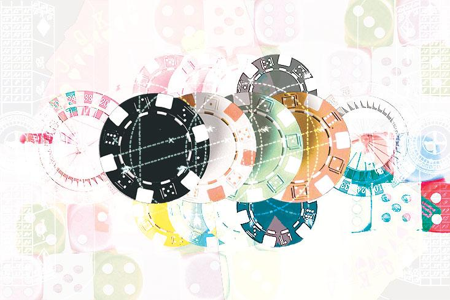
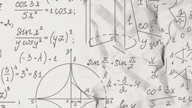
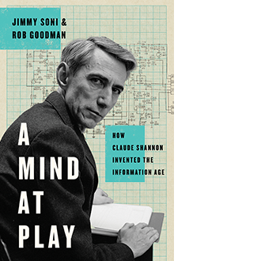

Claude Shannon, the Las Vegas Shark - Issue 50: Emergence - Nautilus

# Claude Shannon, the Las Vegas Shark

## The father of information theory built a machine to game roulette, then abandoned it.

By Jimmy Soni & Rob GoodmanJuly 27, 2017

Many of Claude Shannon’s off-the-clock creations were whimsical—a machine that made sarcastic remarks, for instance, or the Roman…By Jimmy Soni & Rob Goodman

Many of Claude Shannon’s off-the-clock creations were whimsical—a machine that made sarcastic remarks, for instance, or the Roman numeral calculator. Others created by the Massachusetts Institute of Technology professor and father of information theory showed a flair for the dramatic and dazzling: the trumpet that spit flames or the machine that solved Rubik’s cubes. Still other devices he built anticipated real technological innovations by more than a generation. One in particular stands out, not just because it was so far ahead of its time, but because of just how close it came to landing Shannon in trouble with the law—and the mob.

Long before the Apple Watch or the Fitbit, what was arguably the world’s first wearable computer was conceived by Ed Thorp, then a little-known graduate student in physics at the University of California, Los Angeles. Thorp was the rare physicist who felt at home with both Vegas bookies and bookish professors. He loved math, gambling, and the stock market, roughly in that order. The tables and the market he loved for the challenge: Could you create predictability out of seeming randomness? What could give one person an edge in games of chance? Thorp wasn’t content just pondering these questions; like Shannon, he set out to find and build answers.

In 1960, Thorp was a junior professor at MIT. He had been working on a theory for playing blackjack, the results of which he hoped to publish in the *Proceedings of the National Academy of Sciences*. Shannon was the only academy member in MIT’s mathematics department, so Thorp sought him out. “The secretary warned me that Shannon was only going to be in for a few minutes, not to expect more, and that he didn’t spend time on subjects (or people) that didn’t interest him. Feeling awed and lucky, I arrived at Shannon’s office to find a thinnish, alert man of middle height and build, somewhat sharp featured,” Thorp recalled.

Thorp had piqued Shannon’s interest with the blackjack paper, to which Shannon recommended only a change of title, from “A Winning Strategy for Blackjack” to the more mundane “A Favorable Strategy for Twenty-One,” the better to win over the academy’s staid reviewers. The two shared a love of putting math in unfamiliar territory in search of chance insights. After Shannon “cross-examined” Thorp about his blackjack paper, he asked, “Are you working on anything else in the gambling area?”

[Also in Math](http://nautil.us/term/f/Math)

#### [Chaos Makes the Multiverse Unnecessary](http://nautil.us/issue/49/The%20Absurd/chaos-makes-the-multiverse-unnecessary)

By Noson S. Yanofsky

Scientists look around the universe and see amazing structure. There are objects and processes of fantastic complexity. Every action in our universe follows exact laws of nature that are perfectly expressed in a mathematical language. These laws of nature appear...**[READ MORE](http://nautil.us/issue/49/The%20Absurd/chaos-makes-the-multiverse-unnecessary)**

Thorp confessed. “I decided to spill my other big secret and told him about roulette. Ideas about the project flew between us. Several exciting hours later, as the wintery sky turned dusky, we finally broke off with plans to meet again on roulette.” As one writer, William Poundstone, put it, “Thorp had inadvertently set one of the century’s great minds on yet another tangent.”

Thorp was immediately invited to Shannon’s house. The basement, Thorp remembered, was “a gadgeteer’s paradise. ... There were hundreds of mechanical and electrical categories, such as motors, transistors, switches, pulleys, gears, condensers, transformers, and on and on.” Thorp was in awe: “Now I had met the ultimate gadgeteer.”

> What impressed him more than any of the gadgets was his host’s uncanny ability to “see” a solution to a problem rather than to muscle it out with unending work.

>

It was in this tinkerer’s laboratory that they set out to understand how roulette could be gamed, ordering “a regulation roulette wheel from Reno for $1,500,” a strobe light, and a clock whose hand revolved once per second. Thorp was given inside access to Shannon in all his tinkering glory:

Gadgets ... were everywhere. He had a mechanical coin tosser which could be set to flip the coin through a set number of revolutions, producing a head or tail according to the setting. As a joke, he built a mechanical finger in the kitchen which was connected to the basement lab. A pull on the cable curled the finger in a summons. Claude also had a swing about 35 feet long attached to a huge tree, on a slope. We started the swing from uphill and the downhill end of the arc could be as much as 15 or 20 feet above the ground. ... Claude’s neighbors on the Mystic lake were occasionally astounded to see a figure “walking on the water.” It was me using a pair of Claude’s huge styrofoam “shoes” designed just for this.

And yet, Thorp wrote, what impressed him more than any of the gadgets was his host’s uncanny ability to “see” a solution to a problem rather than to muscle it out with unending work. “Shannon seemed to think with ‘ideas’ more than with words or formulas. A new problem was like a sculptor’s block of stone and Shannon’s ideas chiseled away the obstacles until an approximate solution emerged like an image, which he proceeded to refine as desired with more ideas.”

For eight months, the pair dove into the challenge of developing a device that would predict the final resting spot of a roulette ball. For the device to beat the house, Thorp and Shannon didn’t have to predict the precise outcome every time: They just had to acquire any kind of slight edge over the odds. Over time, and with enough bets, even the smallest advantage would multiply into a meaningful return.

> “Once a lady next to me looked over in horror,” Thorp recalled. “I left the table quickly and discovered the speaker peering from my ear canal like an alien insect.”

>

Picture a roulette wheel divided up into eight segments: By June 1961, Thorp and Shannon had a working version of a device that could determine which of those segments would end up holding the ball. As soon as they concluded that they had, in fact, found their edge, Shannon impressed upon Thorp the need for absolute secrecy. He invoked the work of social network theorists, who argued that two people chosen at random would be, at most, three degrees of separation from one another. In other words, the distance between Shannon, Thorp, and an enraged casino owner was slim.

The device that they created “was the size of a pack of cigarettes,” operated by Thorp’s and Shannon’s big toes, “with microswitches in our shoes,” and delivered gambling advice in the form of music. Thorp explained:

One switch initialized the computer and the other timed the rotor and the ball. Once the rotor was timed, the computer transmitted a musical scale whose eight tones marked the rotor octants passing the reference mark. ... We each heard the musical output through a tiny loudspeaker in one ear canal. We painted the wires connecting the computer and the speaker to match our skin and hair and affixed them with “spirit gum.” The wires were the diameter of a hair to make them inconspicuous but even the hair thin steel wire we used was fragile.

They took it to the casinos, where Thorp and Shannon took turns placing bets. “The division of labor,” Thorp said, “was that Claude stood by the wheel and timed, while I sat at the far end of the layout, unable to see the spinning ball well, and placed bets.” Their wives served as lookouts, “checking to see whether the casino suspected anything and if we were inconspicuous.” Even so, they had some close calls: “Once a lady next to me looked over in horror,” Thorp recalled. “I left the table quickly and discovered the speaker peering from my ear canal like an alien insect.”

Mishaps aside, Thorp was confident that the duo could run the tables. Claude, Betty, and Thorp’s wife, Vivian, were less sure. Thorp would later concede that the others were probably on the right side of caution: The Nevada gaming industry was, notoriously, entangled with the mafia. Had Shannon and Thorp been caught, the odds were against two MIT professors talking their way out of it. The experiment was called off after its trial run, and the wearable computer was consigned to Shannon’s growing heap of curiosities.

*Jimmy Soni is an author, editor, and former speechwriter**.*

*Rob Goodman is a doctoral candidate at Columbia University and a former congressional speechwriter.*

*From *[A Mind at Play](https://www.amazon.com/Mind-Play-Shannon-Invented-Information/dp/1476766681/ref=sr_1_1?s=books&ie=UTF8&qid=1501098558&sr=1-1&keywords=a+mind+at+play) *by Jimmy Soni and Rob Goodman. Copyright © 2017 by Jimmy Soni and Rob Goodman. Reprinted by permission of Simon & Schuster, Inc. *