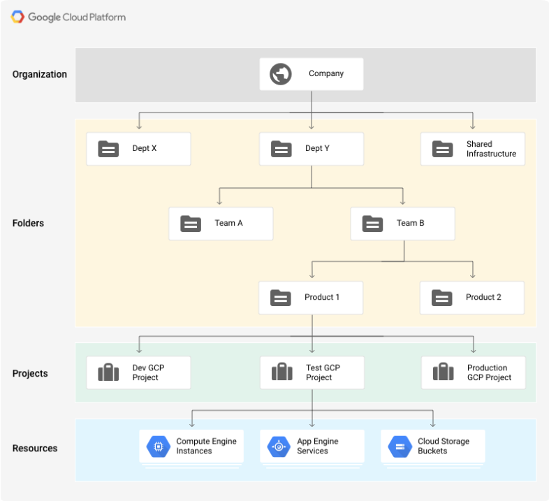
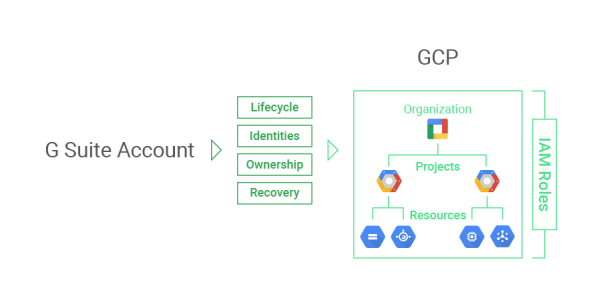

Cloud Platform Resource Hierarchy  |  Google Cloud Resource Manager Documentation       |  Google Cloud Platform

star_border
star_border
star_border
star_border
star_border

- [Google Cloud Resource Manager](https://cloud.google.com/resource-manager/)

- chevron_right

 [Documentation](https://cloud.google.com/resource-manager/docs/)

#  Cloud Platform Resource Hierarchy

- [Contents](https://cloud.google.com/resource-manager/docs/cloud-platform-resource-hierarchy#top_of_page)
- [Cloud Platform Resource Hierarchy in detail](https://cloud.google.com/resource-manager/docs/cloud-platform-resource-hierarchy#cloud_platform_resource_hierarchy_in_detail)
- [The Organization resource](https://cloud.google.com/resource-manager/docs/cloud-platform-resource-hierarchy#organizations)
    - [Link with G Suite or Cloud Identity (Alpha) accounts](https://cloud.google.com/resource-manager/docs/cloud-platform-resource-hierarchy#link_with_g_suite_or_cloudid_name_accounts)
    - [Benefits of the Organization resource](https://cloud.google.com/resource-manager/docs/cloud-platform-resource-hierarchy#benefits_of_the_organization_resource)
- [The Folder resource](https://cloud.google.com/resource-manager/docs/cloud-platform-resource-hierarchy#folders)
- [The Project resource](https://cloud.google.com/resource-manager/docs/cloud-platform-resource-hierarchy#projects)
- [IAM policy inheritance](https://cloud.google.com/resource-manager/docs/cloud-platform-resource-hierarchy#inheritance)

This page describes the Google Cloud Platform (GCP) Resource Hierarchy and the resources that can be managed using Google Cloud Resource Manager.

The purpose of the Cloud Resource Hierarchy is two-fold:

- Provide a hierarchy of ownership, which binds the lifecycle of a resource to its immediate parent in the hierarchy.
- Provide attach points and inheritance for access control and organization policies.

Metaphorically speaking, the Cloud Resource Hierarchy resembles the file system found in traditional operating systems as a way of organizing and managing entities hierarchically. Each resource has exactly one parent. This hierarchical organization of resources enables you to set access control policies and configuration settings on a parent resource, and the policies and IAM settings are inherited by the child resources.

### Cloud Platform Resource Hierarchy in detail

At the lowest level, resources are the fundamental components that make up all Google Cloud services. Examples of Cloud resources are Google Compute Engine Virtual Machines (VMs), Google Cloud Pub/Sub topics, Google Cloud Storage (GCS) buckets, Google App Engine (GAE) instances, and so forth. All these lower level resources can only be parented by projects, which represent the first grouping mechanism of the Cloud Resource Hierarchy.

G Suite and Cloud Identity (Alpha) customers have access to additional features of the Cloud Resource Hierarchy that provide benefits such as centralized visibility and control, and further grouping mechanisms, such as folders. We have launched the Cloud Identity (Alpha) management tool. Contact our [sales team](https://cloud.google.com/contact/) to request access to the Alpha.

Cloud Platform resources are organized hierarchically. Starting from the bottom of the hierarchy, projects are the first level, and they contain other resources. All resources must belong to exactly one project.

The Organization resource is the root node of the Cloud Resource Hierarchy and all resources that belong to an organization are grouped under the organization node. This provides central visibility and control over every resource that belongs to an organization.

Folders are an additional grouping mechanism on top of projects. You are required to have an Organization resource as a prerequisite to use folders. Folders and projects are all mapped under the Organization resource.

The Cloud Resource Hierarchy, especially in its most complete form which includes an Organization resource and folders, allows companies to map their organization onto GCP and provides logical attach points for access management policies (Cloud Identity Access Management) and [Organization policies](https://cloud.google.com/resource-manager/docs/organization-policy/overview). Both Cloud IAM and Organization policies are inherited through the hierarchy, and the effective policy at each node of the hierarchy is the result of policies directly applied at the node and policies inherited from its ancestors.

The diagram below represents an example Cloud Resource Hierarchy in complete form:

## [arrow_upward](https://cloud.google.com/resource-manager/docs/cloud-platform-resource-hierarchy#top_of_page)The Organization resource

The [Organization](https://cloud.google.com/resource-manager/reference/rest/v1/organizations) resource represents an organization (for example, a company) and is the root node in the Cloud Platform Resource Hierarchy. The Organization resource is the hierarchical ancestor of project resources and Folders. The IAM access control policies applied on the Organization resource apply throughout the hierarchy on all resources in the organization.

Cloud Platform users are not required to have an Organization resource. A user acquires an Organization resource only if they are also[G Suite](https://gsuite.google.com/) or Cloud Identity (Alpha) customers. The Organization resource is closely associated with a G Suite or Cloud Identity (Alpha) account. Once an Organization resource is created for a domain, all Cloud Platform projects created by members of the account domain will by default belong to the Organization resource.

### Link with G Suite or Cloud Identity (Alpha) accounts

For simplicity we will refer to G Suite meaning both G Suite and Cloud Identity (Alpha) users.

The G Suite or Cloud Identity (Alpha) account represents a company and is a prerequisite to have access to the Organization resource. In the GCP context, it provides identity management, recovery mechanism, ownership and lifecycle management. The picture below shows the link between G Suite / Cloud Identity (Alpha) and the GCP resource hierarchy.

The G Suite super admin is the individual responsible for domain ownership verification and the contact in cases of recovery. For this reason, the G Suite super admin is granted the ability to assign GCP IAM roles by default. The G Suite super admin’s main duty with respect to GCP is to assign the Organization Administrator IAM role to appropriate users in their domain. This will create the separation between G Suite and GCP administration responsibilities that users typically seek.

### Benefits of the Organization resource

With an Organization resource, projects belong to your organization instead of the employee who created the project. This means that the projects are no longer deleted when an employee leaves the company; instead they will follow the organization’s lifecycle on Google Cloud Platform.

Furthermore, organization administrators have central control of all resources. They can view and manage all of your company's projects. This enforcement means that there can no longer be shadow projects or rogue admins.

Also, you can grant roles at the organization level, which are inherited by all projects and folders under the Organization resource. For example, you can grant the Network Admin role to your networking team at the organization level, allowing them to manage all the networks in all projects in your company, instead of granting them the role for all individual projects.

An Organization resource created using the Google Cloud Resource Manager API consists of the following:

- An organization ID, which is a unique identifier for an organization.
- A display name, which is mutable.
- The creation time of the organization.
- The last modified time of the organization.
- The owner of the organization. The owner is specified when creating the Organization resource. It cannot be changed once its set. It is the G Suite customer ID that is specified in the [Directory API](https://developers.google.com/admin-sdk/directory/).

The following code snippet shows the structure of an Organization resource:
hdr_strong
content_copy

`{[[NEWLINE]]  "displayName": "myorganization",[[NEWLINE]]  "organizationId":"34739118321",[[NEWLINE]]  "createTime": "2016-01-07T21:59:43.314Z"[[NEWLINE]]  "owner": {[[NEWLINE]]    "directoryCustomerId": "C012BA234"[[NEWLINE]]   }[[NEWLINE]]}[[NEWLINE]]`

The initial IAM policy for a newly created Organization resource grants the Project Creator and Billing Account Creator roles to the entire G Suite domain. This means users will be able to continue creating projects and billing accounts as they did before the organization existed. No other resources are created when an Organization resource is created.

## [arrow_upward](https://cloud.google.com/resource-manager/docs/cloud-platform-resource-hierarchy#top_of_page)The Folder resource

Folder resources provide an additional grouping mechanism and isolation boundaries between projects. They can be seen as sub-organizations within the Organization. Folders can be used to model different legal entities, departments, and teams within a company. For example, a first level of folders could be used to represent the main departments in your organization. Since folders can contain projects and other folders, each folder could then include other sub-folders, to represent different teams. Each team folder could contain additional sub-folders to represent different applications. For more details about using folders, see [Creating and Managing Folders](https://cloud.google.com/resource-manager/docs/creating-managing-folders).

Folders allow delegation of administration rights, so for example, each head of a department can be granted full ownership of all GCP resources that belong to their departments. Similarly, access to resources can be limited by folder, so users in one department can only access and create Cloud resources within that folder.

The following code snippet shows the structure of a folder:
hdr_strong
content_copy

`{[[NEWLINE]] "name" : "folders/my-folder",[[NEWLINE]] "parent" : "organizations/my-organization",[[NEWLINE]] "displayName" : "Engineering",[[NEWLINE]] "lifecycleState" : "ACTIVE",[[NEWLINE]] "createTime": "2016-01-07T21:59:43.314Z"[[NEWLINE]]}[[NEWLINE]]`

Like organizations and projects, folders act as a policy inheritance point for IAM and Organization policies. IAM roles granted on a folder are automatically inherited by all projects and folders included in that folder.

## [arrow_upward](https://cloud.google.com/resource-manager/docs/cloud-platform-resource-hierarchy#top_of_page)The Project resource

Recall that the project resource is the base level organizing entity. Unlike an Organization, a project is required to use Google Cloud Platform, and forms the basis for creating, enabling and using all Cloud Platform services, managing APIs, enabling billing, adding and removing collaborators, and managing permissions.

All projects consist of the following:

- Two identifiers:

    1. Project ID, which is a unique identifier for the project.

    2. Project number, which is automatically assigned when you create the project. It is read-only.

- One mutable display name.
- The lifecycle state of the project; for example, ACTIVE or DELETE_REQUESTED.
- A collection of labels that can be used for filtering projects.
- The time when the project was created.

The following code snippet shows the structure of a project:
hdr_strong
content_copy

`{[[NEWLINE]]  "name": "myproject",[[NEWLINE]]  "projectId": "my-project-123",[[NEWLINE]]  "labels":[[NEWLINE]]   {[[NEWLINE]]     "my-label": "prod"[[NEWLINE]]   },[[NEWLINE]]   "projectNumber": "464036093014",[[NEWLINE]]   "lifecycleState": "ACTIVE",[[NEWLINE]]   "createTime": "2016-01-07T21:59:43.314Z"[[NEWLINE]]}[[NEWLINE]]`

In order to interact with most Cloud Platform resources, you must provide the identifying project information for every request. As shown in the code, a project can be identified in two ways: project ID, or a project number. A project ID is the customized name you chose when you created the project, or when you activated an API that required you to create a project ID. A project number is automatically generated by GCP. Both the project ID and project number can be found on the dashboard of the project in the Google Cloud Console. For information on getting project identifiers and other management tasks for projects see [Creating and Managing Projects](https://cloud.google.com/resource-manager/docs/creating-managing-projects).

The initial IAM policy for the newly created project resource grants the owner role to the creator of the project.

## [arrow_upward](https://cloud.google.com/resource-manager/docs/cloud-platform-resource-hierarchy#top_of_page)IAM policy inheritance

Google Cloud Platform offers [Cloud Identity Access Management (IAM)](https://cloud.google.com/iam/docs/overview), which lets you assign granular access to specific Google Cloud Platform resources and prevents unwanted access to other resources. IAM lets you control who (**users**) has what access (**roles**) to which **resources** by setting IAM policies on the resources.

You can set an IAM policy at the [organization level](https://cloud.google.com/resource-manager/docs/access-control-org), the [folder level](https://cloud.google.com/resource-manager/docs/access-control-folders), the[project level](https://cloud.google.com/resource-manager/docs/access-control-proj), or (in some cases) the resource level. Resources inherit the policies of the parent node. If you set a policy at the Organization level, it is inherited by all its child folders and projects, and if you set a policy at the project level, it is inherited by all its child resources.

The effective policy for a resource is the union of the policy set on the resource and the policy inherited from its ancestors. This inheritance is transitive. In other words, resources inherit policies from the project, which inherit policies from the organization. Therefore, the organization-level policies also apply at the resource level.

For example, in the resource hierarchy diagram above, if you set a policy on folder “Dept Y” that grants Project Editor role to bob@gmail.com, then Bob will have editor role on projects “Dev GCP”, “Test GCP” and “Production”. Conversely, if you assign alice@gmail.com the Instance Admin role on project “Test GCP”, she will only be able to manage Compute Engine instances in that project.

The IAM policy hierarchy follows the same path as the Cloud Platform Resource Hierarchy. If you change the resource hierarchy, the policy hierarchy changes as well. For example, moving a project into an organization will update the project's IAM policy to inherit from the organization's IAM policy. Similarly, moving a project from one folder to another will change the inherited permissions. Permissions that were inherited by the project from the original parent will be lost when the project is moved to a new folder. Permissions set at the destination folder will be inherited by the project as it is moved.

Was this page helpful? Let us know how we did:
star_border
star_border
star_border
star_border
star_border

Except as otherwise noted, the content of this page is licensed under the [Creative Commons Attribution 3.0 License](http://creativecommons.org/licenses/by/3.0/), and code samples are licensed under the [Apache 2.0 License](http://www.apache.org/licenses/LICENSE-2.0). For details, see our [Site Policies](https://developers.google.com/terms/site-policies). Java is a registered trademark of Oracle and/or its affiliates.

Last updated May 11, 2017.