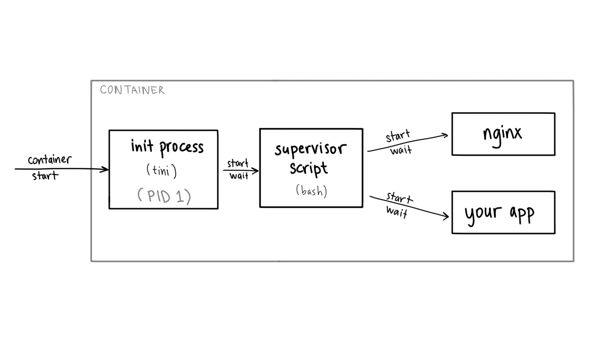

Cloud Run: multiple processes in a container (the lazy way)

# Cloud Run: multiple processes in a container (the lazy way)

   [Ahmet Alp Balkan](https://twitter.com/ahmetb), posted on  23 July 2019

Many [Google Cloud Run](https://cloud.google.com/run) users are starting to develop containers for the first time, but often they are migrating their existing applications. Sometimes, these apps aren’t designed as microservices that fit one-process-per-container model, and require multiple server processes running together in a container.

Often you will hear “running multiple processes in a container is bad”, although nothing is wrong with doing so, as I explained in my [previous article](https://ahmet.im/blog/minimal-init-process-for-containers/) comparing init systems optimized for containers.

In this article, I’ll show a not super production-ready (hence “the lazy way”) but working solution for running multi-process containers on Cloud Run, and will provide [example code](https://github.com/ahmetb/multi-process-container-lazy-solution).

## Example Use Cases

Coming to [Cloud Run](https://cloud.google.com/run) as a new user, **you might need to run multiple processes in a container** for all sorts of reasons like:

- reverse-proxy in front of your app (like nginx/Envoy or Cloud Endpoints [ESP](https://github.com/cloudendpoints/esp/))
- a non-HTTP server exposed via the primary HTTP server (like grpc-web)
- local proxy server for outbound traffic
- instance-local caches (e.g. memcached)
- other examples of cooperating processes

## Designing the container

In this article, I’ll use the nginx example. We want to develop a container image that runs `nginx` server, as well as your server app.

We will run `nginx` on main Cloud Run port (8080), and your server on 8081 as`nginx` will route traffic to your application like:

- `/static/*` paths are served by nginx from local filesystem
- `/*` anything else is forwarded to your main server process

Every container must have a single *entrypoint* process. When entrypoint exits, which the container dies. Therefore, you still need a single “entrypoint script” to start both servers (`nginx` and your app).

If one of these servers terminate (indicating something is bad), your entrypoint script should also terminate quickly instead of trying to revive the server processes (as the container will be restarted easily anyway).

This entrypoint script is not so much of a “nanny process” that supervises the subprocesses and restarts them. It rather waits for one of them to terminate, so we can *fail fast* by exiting the container.

In this example, you write a `bash` script to be the entrypoint of your container that starts and waits for the actual servers you want to run:

#!/usr/bin/env bashset -e
nginx &env PORT=8081 /path/to/your-app &wait -n

- `&` makes the process run in the background (but it still as a child process of this script)
- `wait -n` (introduced in bash 4.3) returns as soon as a background process exits (indicating an issue with server processes) so we can terminate the container.
- `env PORT=...` command overrides the `$PORT` entrypoint for your actual app, as the Cloud Run PORT=8080 will be used by `nginx`.

## bash: A proper init process?

Entrypoint process of a Linux container runs with PID (process id) `1`, which has [special responsibilities](https://vagga.readthedocs.io/en/latest/pid1mode.html), such as (but not limited to):

- forwarding signals to the child processes
- handling what to do with a died indirect child process is parented to it (a.k.a. [zombie child reaping](https://blog.phusion.nl/2015/01/20/docker-and-the-pid-1-zombie-reaping-problem/) problem)

When we make our entrypoint a `bash` script, it can’t do these things. Since Cloud Run apps are meant to be stateless (and are be killed at any time ungracefully), we don’t care as much about signal forwarding behavior.

However, zombie child reaping can be a problem, especially when you run programs (like nginx) that start a lot of short-lived child processes as their children will get parented to the entrypoint.

To handle these situations, you can insert a small [init process](https://en.wikipedia.org/wiki/Init) like[**tini**](https://github.com/krallin/tini) to be the new entrypoint of your container and start the script from there (as `tini` still can’t supervise multiple children that we need):

In this case, `tini` helps you reap the child processes. Refer to the`Dockerfile` in the [repository](https://github.com/ahmetb/multi-process-container-lazy-solution) to see how `tini` integrated as the new ENTRYPOINT.

## Try it out

As promised earlier, [here’s a repository](https://github.com/ahmetb/multi-process-container-lazy-solution) containing the `Dockerfile` and source code of the container with NGINX that serves static assets on `/static/*`and proxies everything else to a Python server.

Once you deploy this container image to Cloud Run, you get a container serving traffic from multiple processes running in a single container.

* * *

You can read my previous article on [comparison of init systems for containers](https://ahmet.im/blog/minimal-init-process-for-containers/) to learn more about other options you have for running multiple processes in containers.

Hope this helps you migrate your existing or legacy applications to Cloud Run and take advantage of serverless containers. In the next blog post, I will explore using an *actual*  `init` process (instead of `bash`) to supervise the sub-processes.

# Ahmet Alp Balkan

I am a software engineer at Google, working on [Kubernetes](https://kubernetes.io/), [GKE](https://g.co/gke) and [Cloud Run](https://cloud.run/). I focus on improving developer experiences and explain complex features in simple words. I’ve created developer tools like [Krew](https://krew.dev/) and [kubectx](https://github.com/ahmetb/kubectx). You can [follow me on Twitter](https://twitter.com/ahmetb).

 [Learn More](https://ahmet.im/blog/about.html)  [Other Articles](https://ahmet.im/blog/)

 