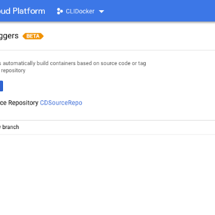

Cloud Source Repositories: more than just a private Git repository

Cloud Source Repositories: more than just a private Git repository

https://cloudplatform.googleblog.com/2018/05/Cloud-Source-Repositories-more-than-just-a-private-Git-repository.html

By Nikhil Kaul, Product Marketing Manager If your goal is to release software continuously at high velocity, you need to be able to automa...