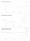
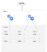
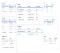
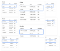

Cloud Spanner — Choosing the right primary keys – Google Cloud Platform — Community – Medium

# Cloud Spanner — Choosing the right primary keys

This post covers how to choose the right primary keys to enable scalable data writes in Cloud Spanner.

Too busy to read? Check out the video above for the summary.

### The scenario

Imagine an online shop built on the back of a traditional database that we need to migrate to Cloud Spanner.

We start with a backup of that imaginary database, where all data is exported to CSV files and uploaded to [Google Cloud Storage](https://cloud.google.com/storage)(GCS). A loader program then reads all the files from GCS, processes them and writes the data to Cloud Spanner. So far so good; having the files in Google Cloud Storage and processing them from a Compute Engine instance close to our Cloud Spanner instance is great. This way we don’t need to worry about network capacity or added latencies being an issue during the data load.

### **Hotspotting and how Cloud Spanner organizes data**

However, after running the first data load tests on a regional instance we are a bit disappointed with the utilization. We see only 35% utilization on a three-node instance. Trying to increase utilization by scaling out the loaders doesn’t help. Based on the math — three nodes, 35% — it looks like the load is hotspotting on only one node. To verify the assumption we scale the instance to five nodes and see that the utilization drops to around 20% while the number of transactions / sec and throughput stayed roughly the same. That is an indicator that only one of the nodes is doing work.

Cloud Spanner monitoring graphs during hotspotting load (from Stackdriver)

At this point we need to dig a little deeper and understand how Cloud Spanner organizes data to scale workloads. The [documentation](https://cloud.google.com/spanner/docs/whitepapers/optimizing-schema-design#table_layout) tells us that Cloud Spanner organizes rows in a table lexicographically(alphabetically) by the PRIMARY KEY. Then driven by the size of the tables and load patterns, the data gets divided into chunks called “splits”. These splits are distinct ranges of rows based on the PRIMARY KEY.

Cloud Spanner splits tables based on size and load patterns

To efficiently scale out all reads and writes, each individual split can move freely between the available compute nodes while making sure there is always, and I mean always, only one node that controls the writes to a split.

— To learn more about how Cloud Spanner ensures strong consistency by having only one node controlling writes to a split, read the [Spanner paper](https://research.google.com/archive/spanner.html). —

Now that’s where it gets tricky. If you write to a table with monotonically increasing or decreasing PRIMARY KEY values, like “1 2 3” or “c b a” all your requests get sent to one split, the first or last in your key space. (*Key space* refers to all possible values for a PRIMARY KEY.) And if you load many such rows at once you eventually exhaust the resources of the responsible compute node for that one split causing a hotspot.

### **Choosing well distributed PRIMARY KEYS to enable scale**

Armed with this newly gained knowledge we take a closer look at the schema and exported data we are loading. It turns out the application uses an auto-incremented integer for some PRIMARY KEYS. Because the data was exported in that order, when it is loaded, all new rows are added to the last split, creating a hotspot.

To resolve this, there are multiple options:

1. We could load the data in a different order than it was exported, preferably a random order, or

2. We could modify the schema, for example, by introducing a distribution key that we prefix our PRIMARY KEY with, by using a well distributed hash function to hash our existing key, or by introducing an entirely new primary key that is well distributed.

The drawback with the first option is that it only addresses hotspotting during data load. If our application creates new records with monotonically increasing or decreasing PRIMARY KEYS during normal operation it will hotspot again.

With future scalability requirements in mind we opt to generate a new [UUID v4](https://en.wikipedia.org/wiki/Universally_unique_identifier#Version_4_%28random%29) based primary key and keep the old ID around for potential legacy purposes.

After these modifications we run the data load again. Now, over time we see a full utilization of the Cloud Spanner instance and the throughput scales with the number of instance nodes.

A little side note here: As you start loading an empty database, it will take some time for the first splits to occur and the load-based rebalancing to kick in. This means it will take some time before you see the full utilization of your instance

### Next steps

Check out the code samples [here](https://goo.gl/Jcq63p). To learn more about Google Cloud Spanner stay tuned for the next article, which will discuss how to maximize throughput during data loads. In the meantime, check out the [docs](https://cloud.google.com/spanner/docs/) and [Getting Started guides](https://cloud.google.com/spanner/docs/tutorials).