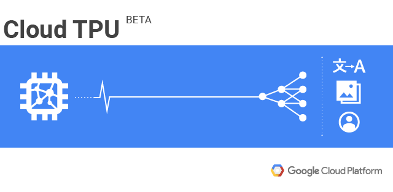

Cloud TPU machine learning accelerators now available in beta

# Cloud TPU machine learning accelerators now available in beta

By John Barrus, Product Manager for Cloud TPUs, Google Cloud and Zak Stone, Product Manager for TensorFlow and Cloud TPUs, Google Brain Team

Starting today, [Cloud TPUs](https://cloud.google.com/tpu/) are available in beta on [Google Cloud Platform](https://cloud.google.com/) (GCP) to help machine learning (ML) experts train and run their ML models more quickly.

Cloud TPUs are a family of Google-designed hardware accelerators that are optimized to speed up and scale up specific ML workloads programmed with TensorFlow. Built with four custom ASICs, each Cloud TPU packs up to 180 teraflops of floating-point performance and 64 GB of high-bandwidth memory onto a single board. These boards can be used alone or connected together via an ultra-fast, dedicated network to form multi-petaflop ML supercomputers that we call “TPU pods.” We will offer these larger supercomputers on GCP later this year.

We designed Cloud TPUs to deliver differentiated performance per dollar for targeted TensorFlow workloads and to enable ML engineers and researchers to iterate more quickly. For example:

- Instead of waiting for a job to schedule on a shared compute cluster, you can have interactive, exclusive access to a network-attached Cloud TPU via a Google Compute Engine VM that you control and can customize.
- Rather than waiting days or weeks to train a business-critical ML model, you can train several variants of the same model overnight on a fleet of Cloud TPUs and deploy the most accurate trained model in production the next day.
- Using a single Cloud TPU and following this [tutorial](https://cloud.google.com/tpu/docs/tutorials/resnet), you can train ResNet-50 to the expected accuracy on the [ImageNet](http://www.image-net.org/) benchmark challenge in less than a day, all for well under $200!

### ML model training, made easy

Traditionally, writing programs for custom ASICs and supercomputers has required deeply specialized expertise. By contrast, you can program Cloud TPUs with high-level TensorFlow APIs, and we have open-sourced a set of reference high-performance Cloud TPU model implementations to help you get started right away:

To save you time and effort, we continuously test these model implementations both for performance and for convergence to the expected accuracy on standard datasets.

Over time, we'll open-source additional model implementations. Adventurous ML experts may be able to optimize other TensorFlow models for Cloud TPUs on their own using the [documentation](https://cloud.google.com/tpu/docs/) and [tools](https://cloud.google.com/tpu/docs/cloud-tpu-tools) we provide.

By getting started with Cloud TPUs now, you’ll be able to benefit from dramatic time-to-accuracy improvements when we introduce TPU pods later this year. As we [announced at NIPS 2017](https://supercomputersfordl2017.github.io/Presentations/ImageNetNewMNIST.pdf), both ResNet-50 and Transformer training times drop from the better part of a day to under 30 minutes on a full TPU pod, no code changes required.

Two Sigma, a leading investment management firm, is impressed with the performance and ease of use of Cloud TPUs.

*> "We made a decision to focus our deep learning research on the cloud for many reasons, but mostly to gain access to the latest machine learning infrastructure. Google Cloud TPUs are an example of innovative, rapidly evolving technology to support deep learning, and we found that moving TensorFlow workloads to TPUs has boosted our productivity by greatly reducing both the complexity of programming new models and the time required to train them. Using Cloud TPUs instead of clusters of other accelerators has allowed us to focus on building our models without being distracted by the need to manage the complexity of cluster communication patterns." *

> — Alfred Spector, Chief Technology Officer, Two Sigma

### A scalable ML platform

Cloud TPUs also simplify planning and managing ML computing resources:

- You can provide your teams with state-of-the-art ML acceleration and adjust your capacity dynamically as their needs change.
- Instead of committing the capital, time and expertise required to design, install and maintain an on-site ML computing cluster with specialized power, cooling, networking and storage requirements, you can benefit from large-scale, tightly-integrated ML infrastructure that has been heavily optimized at Google over many years.
- There’s no more struggling to keep drivers up-to-date across a large collection of workstations and servers. Cloud TPUs are preconfigured—no driver installation required!
- You are protected by the same sophisticated security mechanisms and practices that safeguard all Google Cloud services.

*> “Since working with Google Cloud TPUs, we’ve been extremely impressed with their speed—what could normally take days can now take hours. Deep learning is fast becoming the backbone of the software running self-driving cars. The results get better with more data, and there are major breakthroughs coming in algorithms every week. In this world, Cloud TPUs help us move quickly by incorporating the latest navigation-related data from our fleet of vehicles and the latest algorithmic advances from the research community.*

> — Anantha Kancherla, Head of Software, Self-Driving Level 5, Lyft

Here at Google Cloud, we want to provide customers with the best cloud for every ML workload and will offer a variety of high-performance CPUs (including [Intel Skylake](https://cloud.google.com/intel/)) and GPUs (including NVIDIA’s [Tesla V100](https://nvidianews.nvidia.com/news/nvidia-launches-revolutionary-volta-gpu-platform-fueling-next-era-of-ai-and-high-performance-computing)) alongside Cloud TPUs.

### Getting started with Cloud TPUs

Cloud TPUs are available in limited quantities today and usage is billed by the second at the rate of [$6.50 USD / Cloud TPU / hour](https://cloud.google.com/products/calculator/#id=3ba6da8e-363f-4708-84a9-adef904128b8).

We’re thrilled to see the enthusiasm that customers have expressed for Cloud TPUs. To help us manage demand, please [sign up here](https://services.google.com/fb/forms/cloud-tpu-beta-request/) to request Cloud TPU quota and describe your ML needs. We’ll do our best to give you access to Cloud TPUs as soon as we can.

To learn more about Cloud TPUs, join us for a [Cloud TPU webinar](https://cloudonair.withgoogle.com/events/americas?tab=feb27&expand=segment:cloud-tpus-cloud-tpus) on February 27th, 2018.