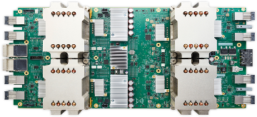
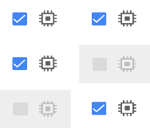

Cloud TPUs - ML accelerators for TensorFlow  |  Google Cloud Platform

# Cloud TPU Alpha

##  Train and run machine learning models faster than ever before

 [SIGN UP TO LEARN MORE](https://services.google.com/fb/forms/tpusignup/)

##  Accelerated Machine Learning

Machine learning (ML) has the power to greatly simplify our lives. Improvements in speech recognition and language understanding help all of us interact more naturally with technology. Businesses rely on ML to strengthen network security and reduce fraud. Advances in medical imaging enabled by ML can increase the accuracy of medical diagnoses and expand access to care, ultimately saving lives.

 

##  Speed Up Machine Learning Workloads

These revolutionary Cloud TPUs were designed from the ground up to accelerate machine learning workloads. Each Cloud TPU provides up to 180 teraflops of performance, providing the computational power to train and run cutting-edge machine learning models. Cloud TPUs can help you transform your business or create the next research breakthrough.

 

## On-Demand ML Supercomputing

Access powerful machine learning accelerators on demand—no up-front capital investment required. Whether your task requires Cloud TPUs for hours or weeks, you can get exactly the machine learning acceleration you need without creating your own datacenter.

 

##  Easy On-Ramp to Cloud

Because TensorFlow is open-source, it’s easy to take ML workloads you’re already running in [TensorFlow](https://www.tensorflow.org/) and try them on Cloud TPUs. Use TensorFlow’s high-level APIs to move models across CPUs, GPUs, and TPUs with minimal code changes.

 

## Access Google’s AI Innovation

Access the same accelerators used by Google to develop world-class machine learning products. Cloud TPUs are purpose-built specifically to accelerate state-of-the-art machine learning workloads, including both training and prediction.

 

   
.

#  Cloud TPU Features

High Performance

Each Cloud TPU will offer up to 180 teraflops of computing performance as well as 64 gigabytes of ultra-high-bandwidth memory.

The Benefits of Google Cloud

Run machine learning workloads on Cloud TPUs and benefit from Google Cloud Platform’s industry-leading [storage](https://cloud.google.com/storage/), networking, and [data analytics](https://cloud.google.com/products/big-data/) technologies.

Integrated

At their core, Cloud TPUs and [Google Cloud’s Data & Analytics services](https://cloud.google.com/products/big-data/) are fully integrated with other GCP offerings, providing unified access across the entire service line.

Connect Cloud TPUs to Custom Machine Types

You can connect to Cloud TPUs from custom VM types, which can help you optimally balance processor speeds, memory, and high performance storage resources for your individual workloads.

.
 [SIGN UP TO LEARN MORE](https://services.google.com/fb/forms/tpusignup/)

 [ ### Cloud TPU Announcement    Read the blog post](https://www.blog.google/topics/google-cloud/google-cloud-offer-tpus-machine-learning/)

 [ ### Cloud Machine Learning    Get started with Cloud MLE](https://cloud.google.com/ml-engine/)

 [ ### TensorFlow    Get started with TensorFlow](https://www.tensorflow.org/)