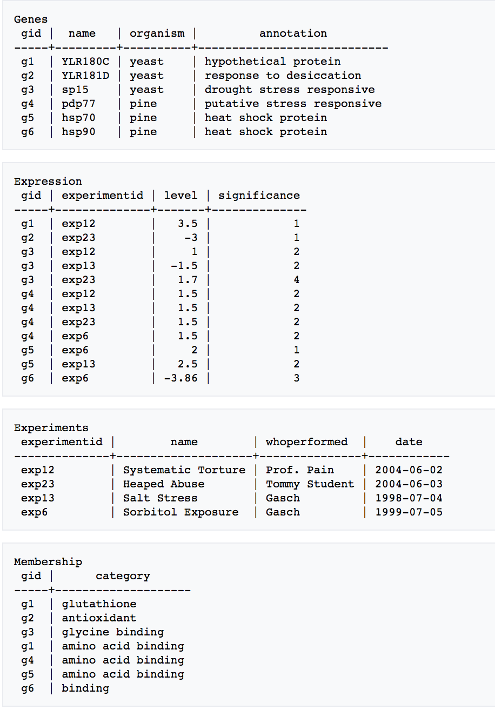
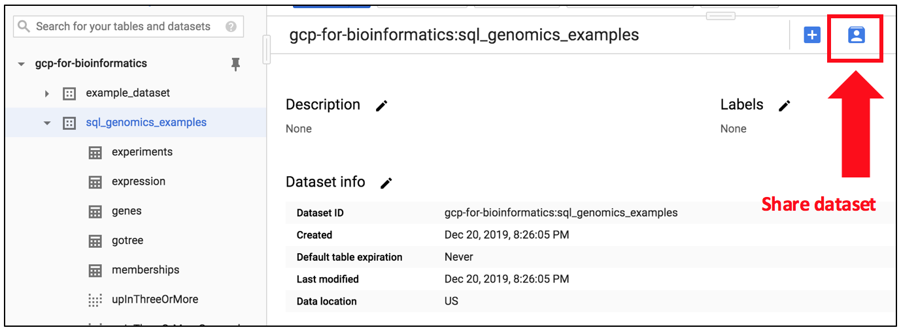
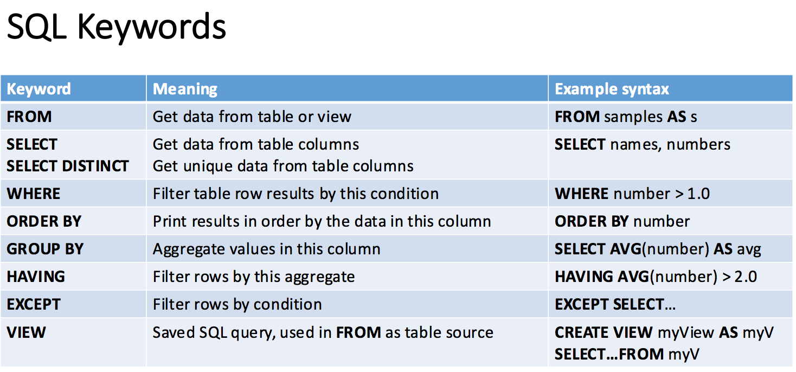
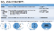
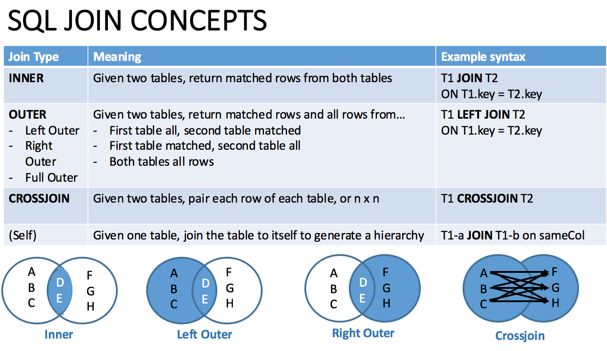
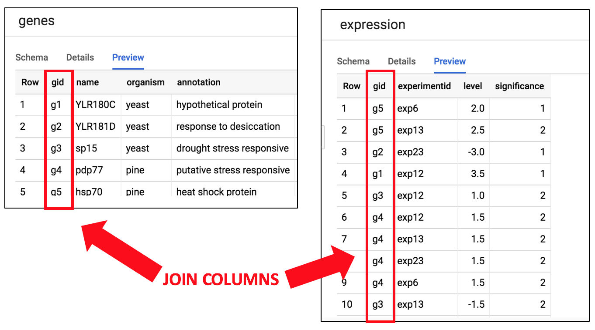
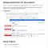
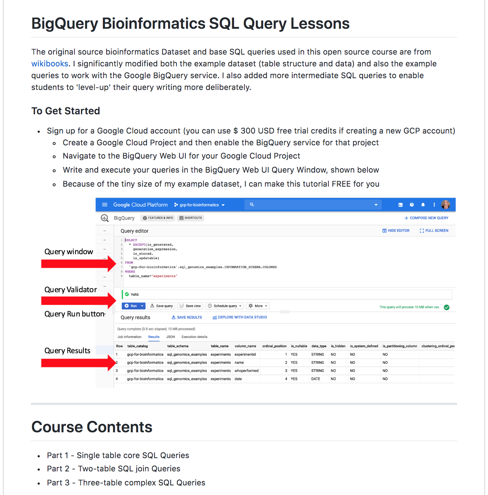

Cloud-native Hello World for Bioinformatics - Lynn Langit - Medium

# Cloud-native Hello World for Bioinformatics

[Lynn Langit](https://medium.com/@lynnlangit?source=post_page-----d21458a0013f----------------------)

[Jan 2](https://medium.com/@lynnlangit/cloud-native-hello-world-for-bioinformatics-d21458a0013f?source=post_page-----d21458a0013f----------------------) · 7 min read

PART FOUR — Toward Serverless Pipelines with GCP

In the series to date, I’ve presented the general rationale for building quick start examples (or ‘Hello World’) for bioinformatics tools in [part one](https://medium.com/@lynnlangit/cloud-native-hello-world-for-bioinformatics-9cfabf2dd389).

In [part two](https://medium.com/@lynnlangit/cloud-native-hello-world-for-bioinformatics-53ecbcb9631b), I reviewed one such example for the VariantSpark library, runnable via smart templates in the AWS Marketplace.

In [part three](https://medium.com/@lynnlangit/cloud-native-hello-world-for-bioinformatics-7831aecc8d1a), I covered how to convert a locally runnable example to a reusable cloud example, by working with Google Cloud Platform custom Virtual Machine images running on Google Compute Engine.

In this part four, I will explore current work I am doing with a research group. In particular, I’ll cover some recent work on preparing researchers to work ‘cloud-natively.’

## What is a Cloud Native Data Pipeline?

In a word — it’s *‘serverless.’* Why? Because using scalable cloud services (via API endpoints) rather than creating, configuring and maintaining docker container or virtual machine images and their orchestration systems is simpler.

So, if this is the case, then why I have not covered serverless Hello World bioinformatics pipeline patterns yet in this series? To date I’ve only written about cloud-based Infrastructure as a Service (GCP GCE Virtual Machines) or Platform as a Service (AWS EMR). Why is that?

Serverless pipelining is indeed seductive, but also elusive…how do we get there from the current world of on-premise HPC clusters? What should the Hello World for cloud-native pipelining look like?

Of note is that despite work I’ve done with researchers to preview serverless pipeline examples — even using bioinformatics data — adoption of those serverless pipelining services remains low. In considering possible reasons for this, I was reminded [via work with my graduate students interns] that recent university Computer Science graduates are not taught the SQL query language (or anything about databases) in their CS courses at university. I assume this lack of familiarity with database concepts extends to bioinformatics researchers as well.

## Google Cloud BigQuery

BigQuery, a serverless SQL cloud service, has been available since 2011. Its scalable, pay-by-data-scanned serverless model seems perfect for variable, bursting genomics analysis pipelines. So why isn’t BigQuery (or other comparable services, such as AWS Athena) being widely used in genomic analysis pipelines?

The answer appears to be the query language — SQL. Although in many (most?) verticals I had previously worked in (i.e. fintech, adtech, gov’t….) relational databases and associated SQL queries have been pervasive for many years, bioinformatics research appears to differ.

Researchers, in my experience, use files (not data tables) and programming languages, such as R, Python or even Java, to build their data pipelines. While patterns such as cloud-based VM images or customized docker container and pipeline languages (such as Nextflow, CWL or WDL) are being used to move on premise (mostly HPC) genomics workloads to the cloud, I wonder…

> Could we move faster with serverless SQL?

Although I don’t have a large number of data points about the effectiveness of the serverless pattern for genomics, I do have some. In work that I’ve done with Dr. Denis Bauer and her team at CSIRO Bioinformatics in Sydney, Australia, they’ve had [multiple successes using serverless](https://bioinformatics.csiro.au/blog/converting-traditional-architecture-to-cloud-native-applications/) design patterns.

However, even they aren’t using BigQuery yet. Why not? I wondered.

## SQL for Bioinformatics

In summer 2019, I created an open source course on GitHub [‘gcp-for-bioinformatics’](https://github.com/lynnlangit/gcp-for-bioinformatics). Subsequently, I’ve received positive feedback from several research groups on this course. This course is based on my popular general introductory GCP course, hosted on Linked In Learning (‘[GCP Essential Training](https://www.linkedin.com/learning/google-cloud-platform-essential-training-3).’)

The difference between my LinkedIn GCP course and my Open Source GCP course is that the open source course uses sample data and example solutions specific to bioinformatics/genomics. For example in the open source course, I use .fasta, .bam, .vcf, etc.. files, rather than .csv, etc..

I looked around for an example course which would explain SQL query concepts using bioinformatics data. I found [this one](https://en.wikibooks.org/wiki/Data_Management_in_Bioinformatics/SQL_Exercises). Although it’s a good start, I felt like there were a number of limitations in this course. The first of which was that the example queries were too complex, lumping too many concepts together. Also there was no implementation (database set up) provided.

As a next step I considered, what would it look like to use this bioinformatics SQL course in a cloud-native way. The natural answer was to modify the course to work with Google Big Query. I thought it would be trivial to ‘covert’ the course for this purpose. Actually doing this though, took a bit longer…

## It’s the Data

The sample includes 5 ‘tables’ populated with a very small amount of data. Shown below is a screen capture of a portion of the example data. It’s a point key that this example data is very domain-specific to genomics.

Bioinformatics source data from wikibooks example at https://en.wikibooks.org/wiki/Data_Management_in_Bioinformatics/SQL_Exercises

I wanted to use the Google BigQuery [**‘auto detect schema’**](https://cloud.google.com/bigquery/docs/schema-detect) feature to quickly convert this information to BigQuery dataset tables. First, I scraped and saved the data as local CSV files. Although I was eventually able to get this feature to work, I had to make a number of changes to the files. Changes included the following:

- remove the second line ‘ — — — ‘
- remove all leading & trailing white space in column names
- remove all leading & trailing white space in columns with string data
- add a numeric data column to table with only string columns

Once I made these changes, I was able to quickly upload the resulting CSV files to create tables in my BigQuery dataset. Next I wanted to make my dataset public so that it could be used in a tutorial. To do this, I clicked the ‘Share Dataset’ button and added `allUsers` and `allAuthenticatedUsers` to the **BigQuery Dataset Viewer** permissions for this dataset. The dataset is shown below in the BigQuery Web UI.

Creating the public dataset example

## Testing the queries

In the next step of the course conversion, I began to test the query “answers” provided in the original sample. The first change I needed to make was to alter queries to fully qualify all references to the example tables (or views) in my public BigQuery dataset. I did this by updating the FROM portion of each SQL statement. To fully qualify an object in BigQuery, use this pattern <projectName>.<datasetName>.<tableOrViewName>.

This update was required due to the need for students who use my tutorial to be able to access my (public) dataset from within *their own GCP project*. The required change to each query looked like this:

OLD: SELECT * FROM experiments

NEW: SELECT * FROM `gcp-for-bioinformatics.sql_genomics_examples.experiments` AS experiments

Next I added more intermediate queries to better level the learning by providing examples that added concepts more gradually than the original example queries. Sometimes I just ‘broke apart’ the original answer queries, other times I re-wrote for clarity. I also changed the source data to make the results more meaningful.

## Adding Visuals

In teaching standard SQL syntax to hundreds of classroom students in the past, I found students benefited from visuals — particularly when they were learning JOIN queries. So I next created two quick reference charts. One for SQL Keywords and one for SQL JOIN queries. I tested the effectiveness of these charts, by posting them on Linked In. I got a quick positive response. For reference, these charts are shown below.

SQL Keywords

SQL JOIN Concepts

Next I added some screenshots of the tables involved in various types of joins — self-joins, two-table joins, etc.. You can see that in my screenshots, I took the time to highlight the table join columns. I’ll include one example below.

Illustrating a two-table SQL Join

As I continued to test all of the original queries, I noticed that some of the potential answers either weren’t supported, weren’t recommended (correlated subqueries) or didn’t work as written (EXCEPT syntax slightly differed) in BigQuery. So I updated those queries.

Additionally, I updated a couple of data points and query questions to make the flow a bit more natural (and pattern-based). Also I removed some redundant (and needlessly complex) content.

## Finishing Up

Then I added a short *‘how-to-get-started-with-BigQuery’ *section at the beginning of my tutorial with the goal of getting students running their first query within minutes of starting the tutorial. I also added some *‘learning more’* links at the end.

Finally, I pulled out all of the potential answers to the SQL Query questions in the document into a separate ‘answers’ file and linked the answers in the tutorial. I also added a *‘what could go wrong?*’ section at the beginning, explaining and showing the function of the query validator in the BigQuery query window.

At this point, I’ll release v1 of my ‘cloud-native-SQL’ tutorial with the name [“BigQuery Bioinformatics SQL Query Lessons”](https://github.com/lynnlangit/gcp-for-bioinformatics/blob/master/1_Files_%26_Data/SQL-queries/SQLQuestions.md) (beginning of course shown below). I am considering creating a Jupyter notebook as well, but want to get more feedback.

Beginning of my revised (cloud-native) Hello World tutorial

Over the years, I’ve had a number of people ask me about the process I use to create ‘Hello World’ content. In writing this short article, I wanted to provide a view into the type of work I do when updating/creating technical content at this level.

Also, and this is a key point — the testing, organization and clarity that I added to the original lessons are aimed to improve the **usability** of the tutorial. The entire point of HelloWorld is this, right?

> If they can’t use it, it’s worthless
How did I do? Feedback welcomed.