Clustering NBA Playstyles Using Machine Learning

# Clustering NBA Playstyles Using Machine Learning

[James](https://towardsdatascience.com/@jameslf?source=post_page-----8c7e8e23c90c----------------------)

[Oct 6](https://towardsdatascience.com/clustering-nba-playstyles-using-machine-learning-8c7e8e23c90c?source=post_page-----8c7e8e23c90c----------------------) · 9 min read

# Intro & Motivation

I love basketball. I love playing it, watching it, or arguing scenarios with friends like who would win one on one, Kobe or Lebron. I had to combine my two passions, basketball and data science, in a machine learning project.

This past summer, two-time NBA Finals MVP Kevin Durant was traded for D’Angelo Russell. Sports analysts started speculating on his fit on the Warriors with headlines like these:

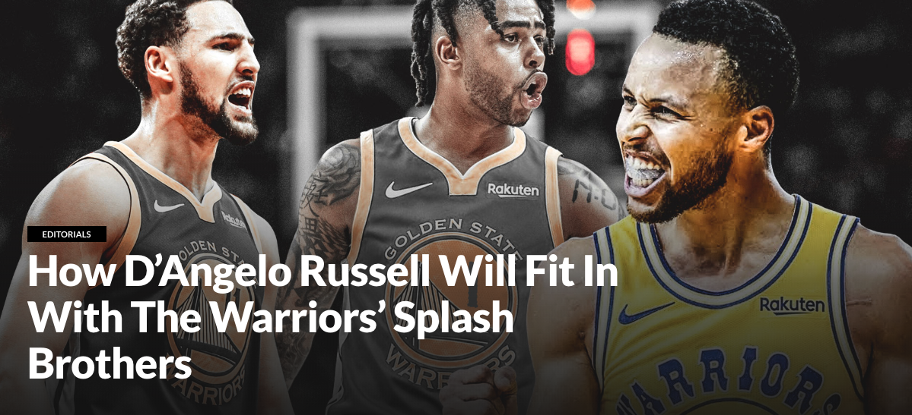

[Image Source](https://clutchpoints.com/how-dangelo-russell-will-fit-in-with-the-warriors-splash-brothers/)

It got me wondering: how well does D’Angelo Russell fit in with the Warriors? Can we use machine learning to place NBA players into categories to predict how a player fits in on a given team?

The goal of the project is to determine the types of players and their roles based on their activity or how the space they use. Stats such as points, rebounds, assists, steals, blocks, etc. were NOT included as features as they are dependent on data like minutes played (also not included) or number of shots. Including stats like points, rebounds and assists allows for the possibility for the results to be largely based on those features, which is not the goal. The full list of features is listed in the Methodology section below.

Let’s take a look at the data.

# Data

The data was extracted from[stats.nba.com](http://stats.nba.com/) with the help of Python and the Selenium package. Majority of the features selected were based on frequency of plays. Many play type features an offense or a defense stat. For example, ‘Offense Post Up Frequency’ is how frequent that player is in post up plays on offense; ‘Defense Post Up Frequency’ is how frequent the player is playing ‘defense’ on the post up plays. For additional explanation of the features, information can be found here.[https://stats.nba.com/help/glossary/

**Data : 272 Players**

Initially there were 531 players. Players that played less than half the season and less than 1000 minutes were removed. The rationale was to remove any players that did not have consistent playing time. Here’s the full list of players:

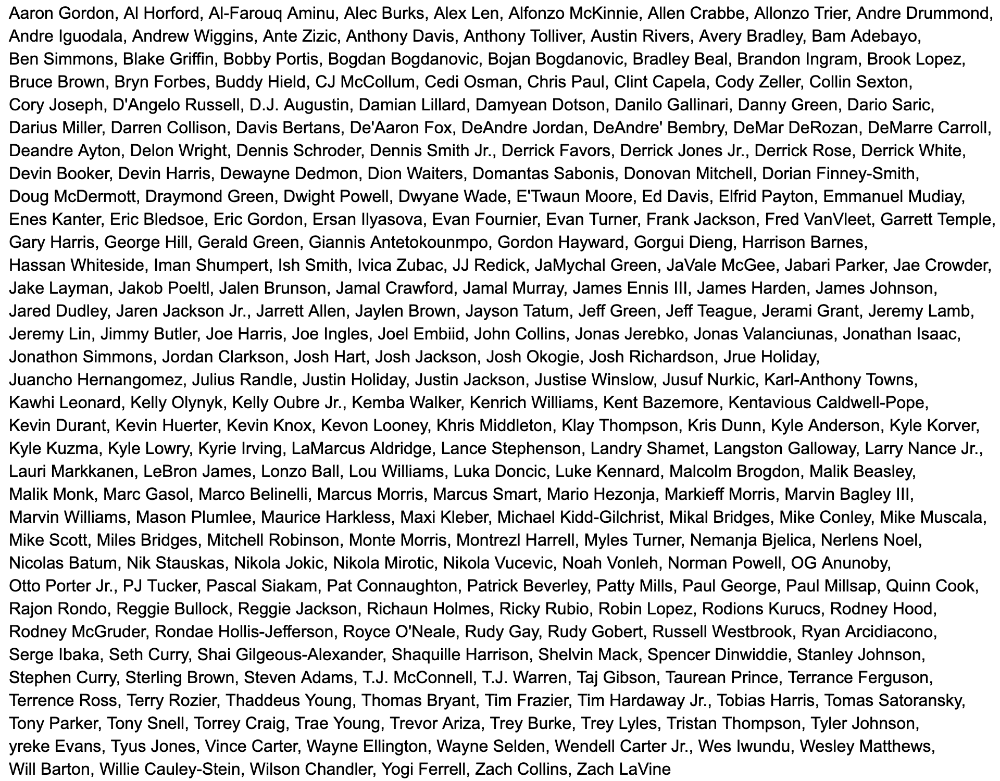
Players
**Features: 41**

600+ features initially. Selected features that only described spacing or actions.

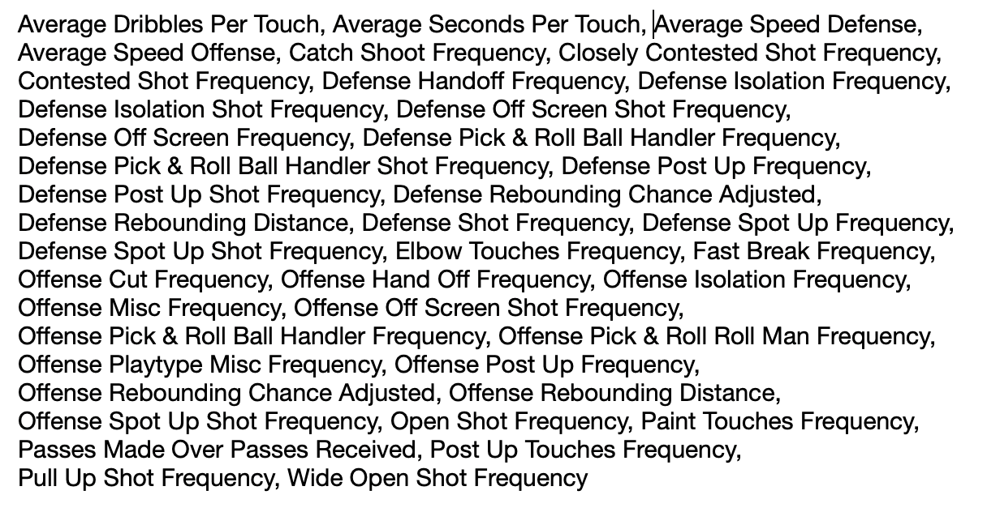
Features

# Methodology & Model Selection

Because this was an unsupervised learning project whose results would need to be interpreted, I had two goals in mind when selecting a model and choosing the number of clusters:

**1. Distinct Differences Among Clusters. **A small number of clusters with many players would not tell us much about the differences between playstyles.

**2. Avoid Too Many Clusters. **If each NBA player was its own cluster, the results would only tell us that each individual is unique, which wouldn’t be very helpful.

**Model Options: **DBSCAN, **K-means**, Mean Shift

K-Means performed the best in achieving the goals above. The results from DBSCAN and Mean Shift had multiple one player clusters.

**Number of Clusters: **10

I decided to go with multiples of five since there are five positions in basketball. Ten was just right with the methodology goals in mind.

# **Results**

With the results, I calculated the mean of all the features within each group and ranked each group on the highest and second highest feature. Here are some defined terms:

**Primary Feature(s)**: The mean of the listed features were the highest for that group.

**Secondary Features(s):** The mean of the listed features were the second highest for that group.

In addition, a primary feature of each group was chosen to show how the feature compares to the rest of the players using a histogram plot.

# **Group 1**

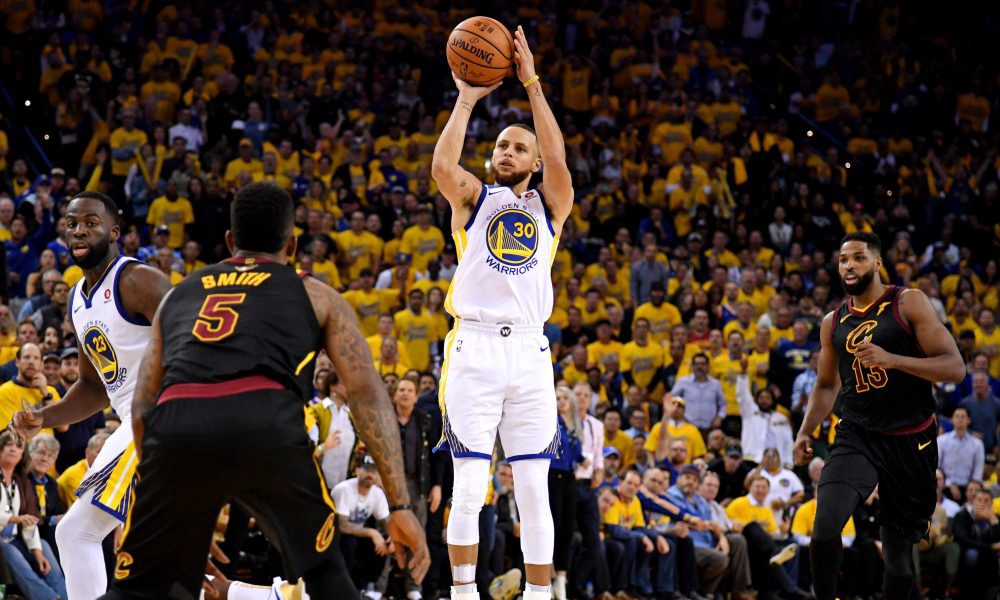
Stephen Curry

Bradley Beal, Buddy Hield, Stephen Curry, Evan Fournier, Trevor Ariza, Kyle Lowry, Joe Ingles, Otto Porter Jr., Bojan Bogdanovic, Avery Bradley, Tim Hardaway Jr., Jayson Tatum, Justise Winslow, Jeremy Lamb, E’Twaun Moore, Kevin Knox, Kevin Huerter, Bogdan Bogdanovic, Gary Harris, Bryn Forbes, Eric Gordon, Tyler Johnson, Damyean Dotson, Taurean Prince, Garrett Temple

**Primary Feature(s):** Defense Isolation Shot Frequency

**Secondary Feature(s):** Defense Handoff Frequency, Defense Off Screen Shot Frequency, Defense Offscreen Frequency, Defense Post Up Shot Frequency, Fast Break Frequency, Offense Hand Off Frequency, Offense Off Screen Shot Frequency

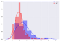
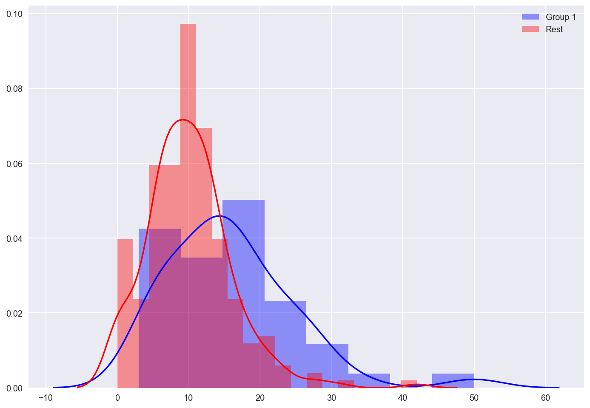
Defense Isolation Shot Frequency

# **Group 2**

Karl-Anthony Towns, LaMarcus Aldridge, Joel Embiid, Thaddeus Young, Blake Griffin, Anthony Davis, Nikola Jokic, Julius Randle, Nikola Vucevic, Deandre Ayton, Myles Turner, Al Horford, Marc Gasol, Marvin Bagley III, Jaren Jackson Jr., Serge Ibaka, Bobby Portis, Enes Kanter, Jonas Valanciunas, Robin Lopez, Markieff Morris, Gorgui Dieng

**Primary Feature(s):** Offense Post Up Frequency, Post Up Touches Frequency
**Secondary Feature(s):** Offense Rebounding Chance Adjusted
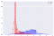
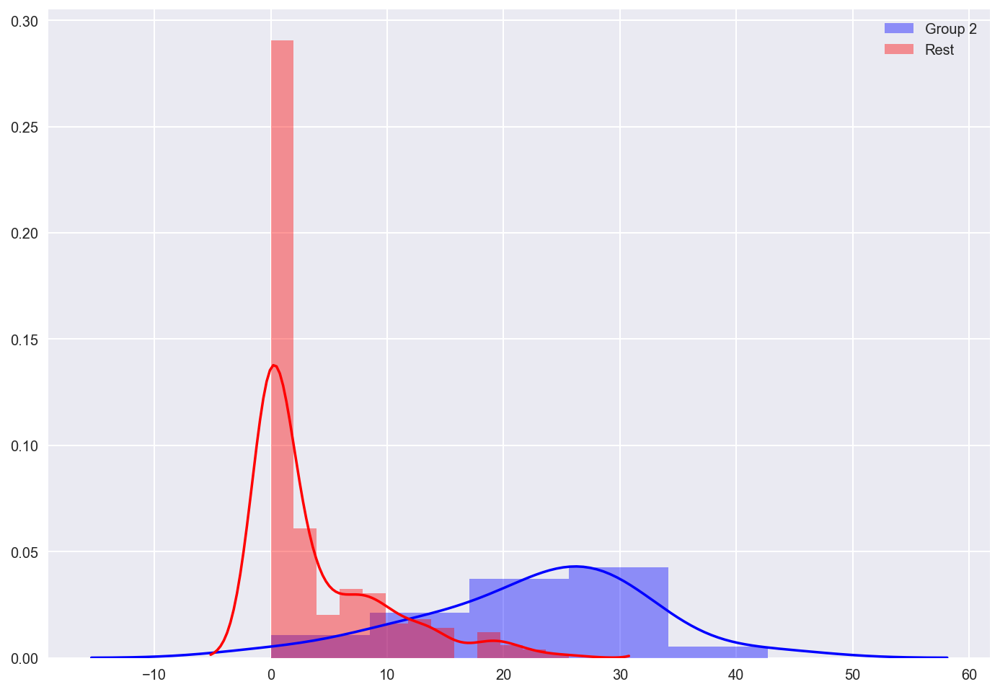
Offense Post Up Frequency

# **Group 3**

PJ Tucker, Draymond Green, Marvin Williams, Jae Crowder, Brook Lopez, Dario Saric, Dewayne Dedmon, Jeff Green, Kelly Olynyk, Davis Bertans, Mike Muscala, Maxi Kleber, Jared Dudley, Mike Scott, Jonas Jerebko, Anthony Tolliver, Vince Carter

**Primary Feature(s):** Catch Shoot Frequency, Offense Spot Up Shot Frequency, Wide Open Shot Frequency, Defense Isolation Frequency, Defense Post Up Frequency

**Secondary Feature(s):** Defense Spot Up Frequency, Passes Made Over Passes Received

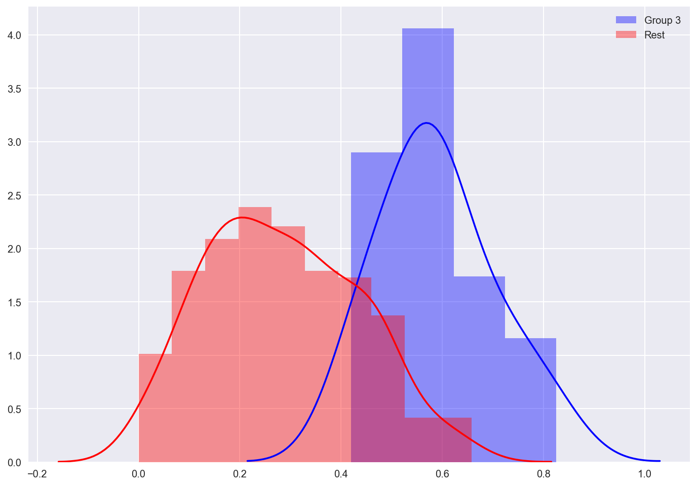
Catch Shoot Frequency

# **Group 4**

Josh Richardson, CJ McCollum, Mike Conley, Jamal Murray, De’Aaron Fox, Trae Young, Cedi Osman, Elfrid Payton, Kris Dunn, Dennis Schroder, Eric Bledsoe, Malcolm Brogdon, Tomas Satoransky, Patrick Beverley, Dennis Smith Jr., Emmanuel Mudiay, Fred VanVleet, Ricky Rubio, Shai Gilgeous-Alexander, Darren Collison, Reggie Jackson, D.J. Augustin, Cory Joseph, Derrick White, Ryan Arcidiacono

**Primary Feature(s):** Defense Rebounding Distance, Defense Pick & Roll Ball Handler Frequency, Average Dribbles Per Touch, Average Speed Offense

**Secondary Feature(s):** Average Seconds Per Touch, Offense Pick & Roll Ball Handler Frequency, Offense Rebounding Distance, Pull Up Shot Frequency

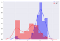
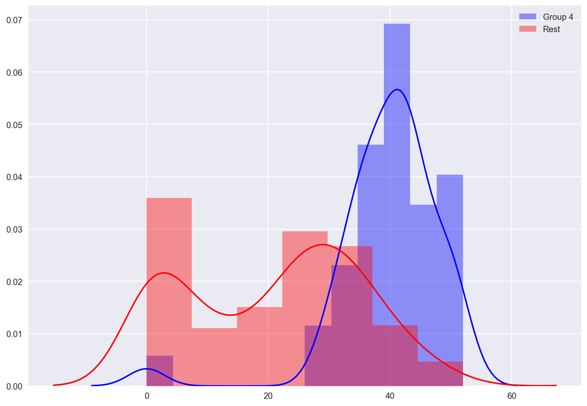
Defense Ball Handler Frequency

# Group 5

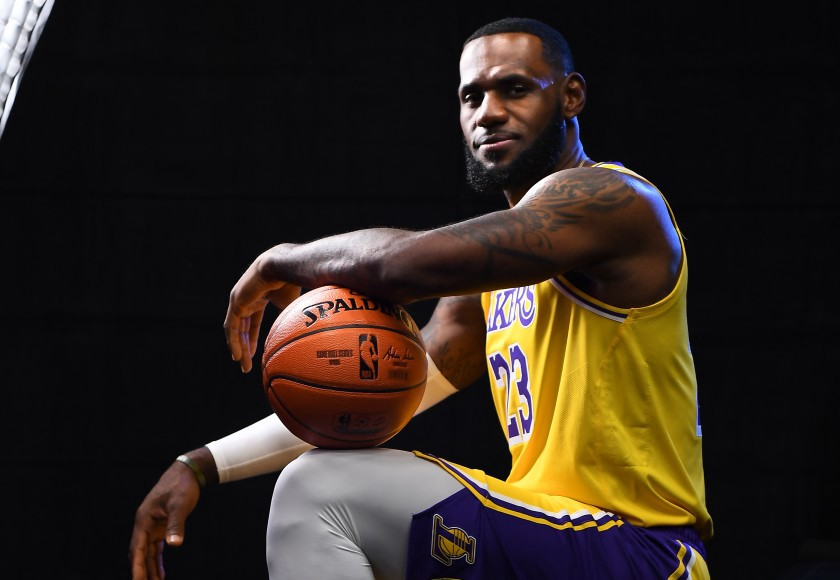
LeBron James

Jrue Holiday, Paul George, Zach LaVine, Tobias Harris, Brandon Ingram, Jimmy Butler, Devin Booker, Kawhi Leonard, DeMar DeRozan, Kemba Walker, Russell Westbrook, Damian Lillard, Andrew Wiggins, Donovan Mitchell, Kyrie Irving, Kevin Durant, LeBron James, James Harden, Khris Middleton, Luka Doncic, Collin Sexton, D’Angelo Russell, Chris Paul, Rajon Rondo, Jordan Clarkson

**Primary Feature(s):** Pull Up Shot Frequency, Offense Isolation Frequency, Offense Pick & Roll Ball Handler Frequency, Average Seconds Per Touch

**Secondary Feature(s):** Average Dribbles Per Touch, Defense Pick & Roll Ball Handler Frequency, Defense Rebounding Chance Adjusted, Open Shot Frequency

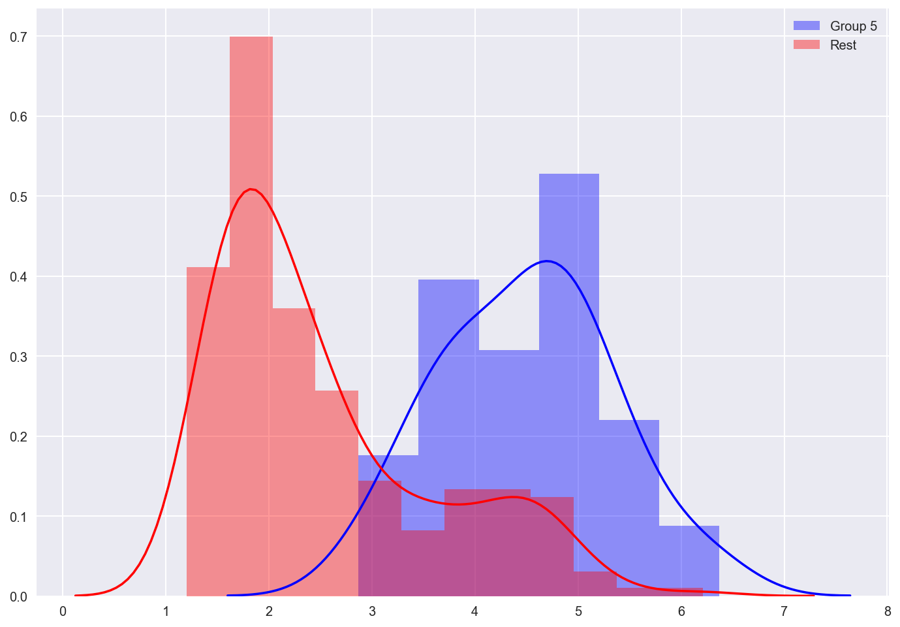
Average Seconds Per Touch

# **Group 6**

Nicolas Batum, Lonzo Ball, Mikal Bridges, Danny Green, Kelly Oubre Jr., Jonathan Isaac, Terrance Ferguson, Jaylen Brown, Dorian Finney-Smith, Kenrich Williams, Josh Okogie, DeMarre Carroll, DeAndre’ Bembry, Maurice Harkless, Andre Iguodala, Rodions Kurucs, James Ennis III, Shaquille Harrison, Pat Connaughton, Royce O’Neale, OG Anunoby, Torrey Craig, Justin Jackson, Bruce Brown, Frank Jackson

**Primary Feature(s):** Fast Break Frequency, Defense Post Up Shot Frequency, Defense Shot Frequency

**Secondary Feature(s):** Defense Isolation Shot Frequency, Offense Spot Up Shot Frequency, Wide Open Shot Frequency

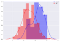
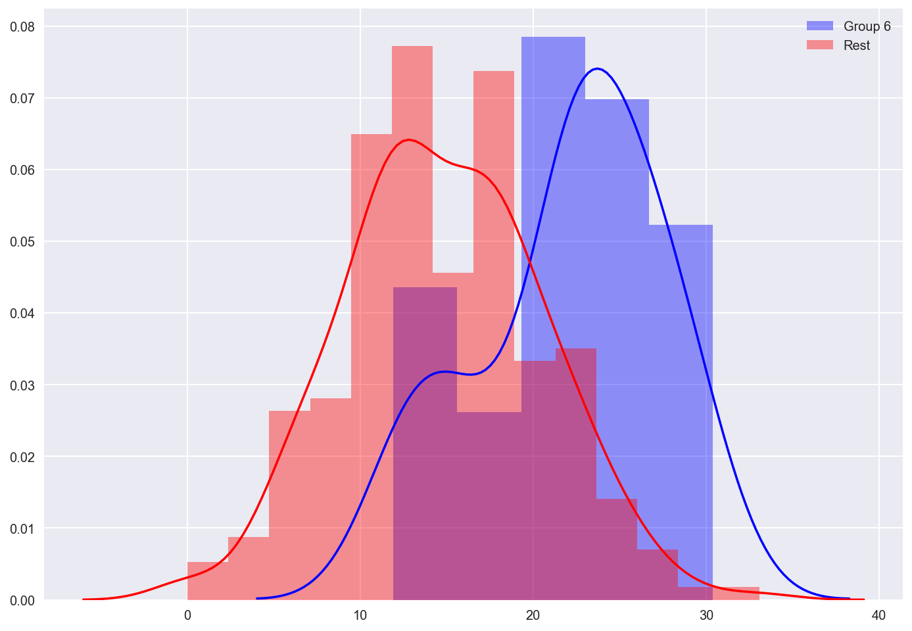
Fast Break Frequency

# **Group 7**

DeAndre Jordan, Montrezl Harrell, Bam Adebayo, JaMychal Green, Mason Plumlee, Mitchell Robinson, Zach Collins

**Primary Feature(s): **Offense Playtype Misc Frequency, Offense Misc Frequency, Closely Contested Shot Frequency, Defense Pick & Roll Ball Handler Shot Frequency, Defense Spot Up Shot Frequency

**Secondary Feature(s):** Contested Shot Frequency, Defense Shot Frequency, Elbow Touches Frequency, Offense Cut Frequency, Offense Pick & Roll Roll Man Frequency, Offense Post Up Frequency, Paint Touches Frequency, Post Up Touches Frequency

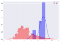
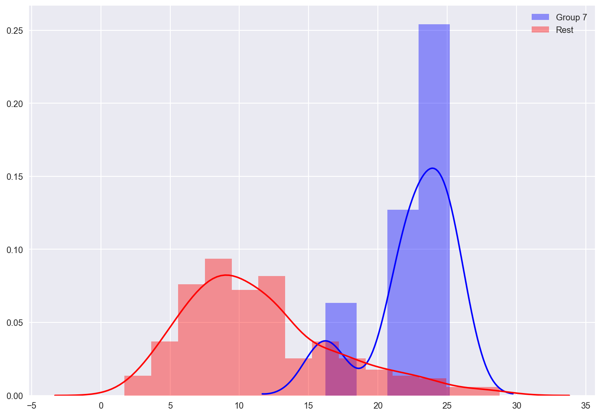
Closely Contested Shot Frequency

# **Group 8**

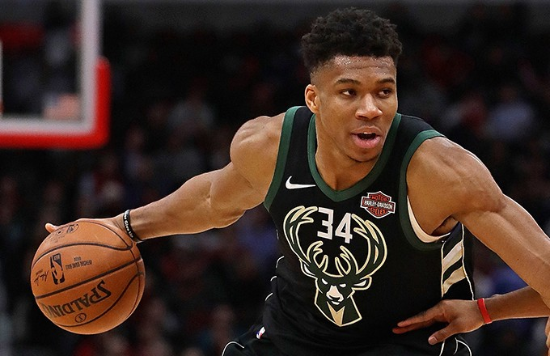
Giannis Antetokounmpo

Kyle Kuzma, Aaron Gordon, Ben Simmons, Harrison Barnes, Jerami Grant, Pascal Siakam, Giannis Antetokounmpo, Lauri Markkanen, T.J. Warren, Kyle Anderson, Danilo Gallinari, Al-Farouq Aminu, Jabari Parker, Nikola Mirotic, Marcus Morris, Rudy Gay, Paul Millsap, Noah Vonleh, Nemanja Bjelica, Wilson Chandler, Miles Bridges, Rondae Hollis-Jefferson, Mario Hezonja, James Johnson, Derrick Jones Jr.

**Primary Feature(s):** Defense Rebounding Chance Adjusted, Defense Spot Up Frequency, Defense Off Screen Shot Frequency

**Secondary Feature(s):** Defense Isolation Frequency, Defense Pick & Roll Ball Handler Shot Frequency, Defense Spot Up Shot Frequency, Offense Isolation Frequency

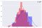
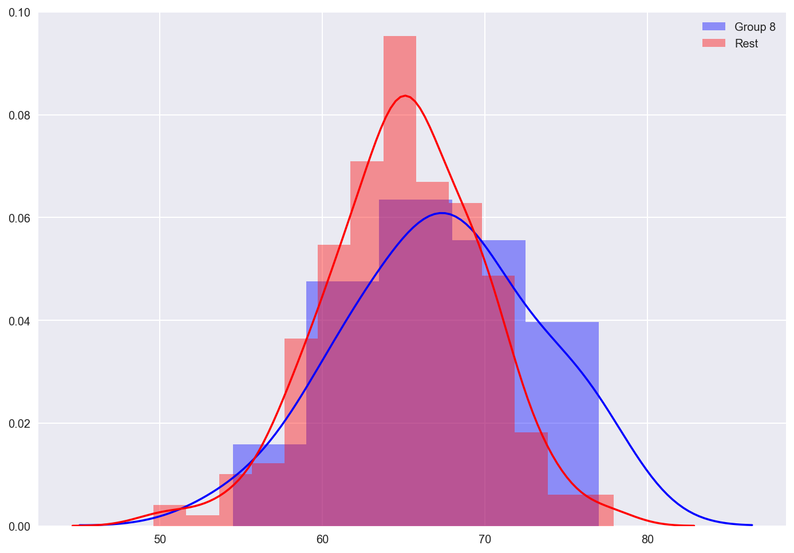
Defense Rebounding Chance Adjusted

# **Group 9**

Klay Thompson, JJ Redick, Justin Holiday, Joe Harris, Reggie Bullock, Wesley Matthews, Terrence Ross, Allen Crabbe, Kentavious Caldwell-Pope, Landry Shamet, Wayne Ellington, Marco Belinelli, Darius Miller, Langston Galloway, Kyle Korver, Doug McDermott, Tony Snell

**Primary Feature(s):** Offense Hand Off Frequency, Offense Off Screen Shot Frequency, Open Shot Frequency, Offense Rebounding Distance, Defense Handoff Frequency, Defense Off Screen Frequency

**Secondary Feature(s):** Average Speed Offense, Catch Shoot Frequency, Defense Rebounding Distance

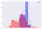
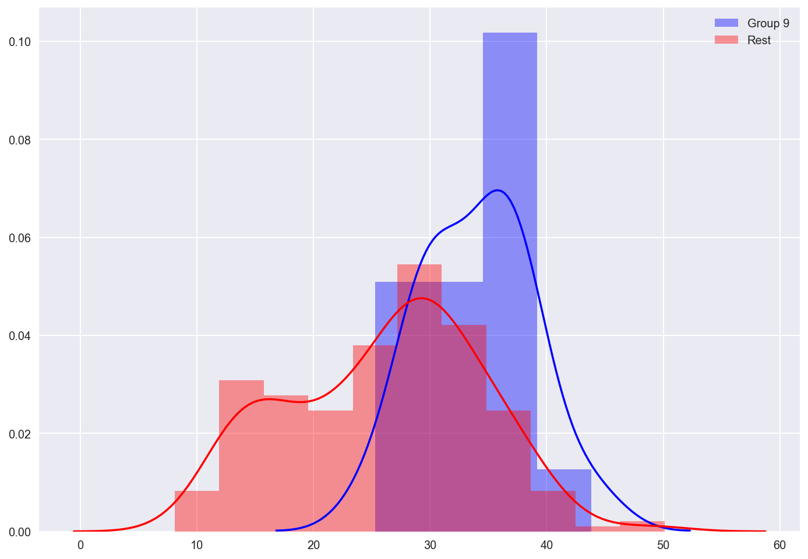
Open Shot Frequency

# **Group 10**

Steven Adams, Clint Capela, Rudy Gobert, Andre Drummond, John Collins, Willie Cauley-Stein, Tristan Thompson, Jusuf Nurkic, Cody Zeller, Jarrett Allen, Larry Nance Jr., Wendell Carter Jr., Domantas Sabonis, Taj Gibson, Derrick Favors, Dwight Powell, JaVale McGee, Hassan Whiteside, Thomas Bryant, Alex Len, Kevon Looney, Ed Davis, Ivica Zubac, Jakob Poeltl, Ante Zizic

**Primary Feature(s): **Offense Pick & Roll Roll Man Frequency, Offense Cut Frequency, Contested Shot Frequency, Offense Rebounding Chance Adjusted, Passes Made Over Passes Received, Elbow Touches Frequency, Paint Touches Frequency

**Secondary Feature(s):** Closely Contested Shot Frequency, Defense Post Up Frequency, Offense Misc Frequency, Offense Playtype Misc Frequency

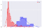
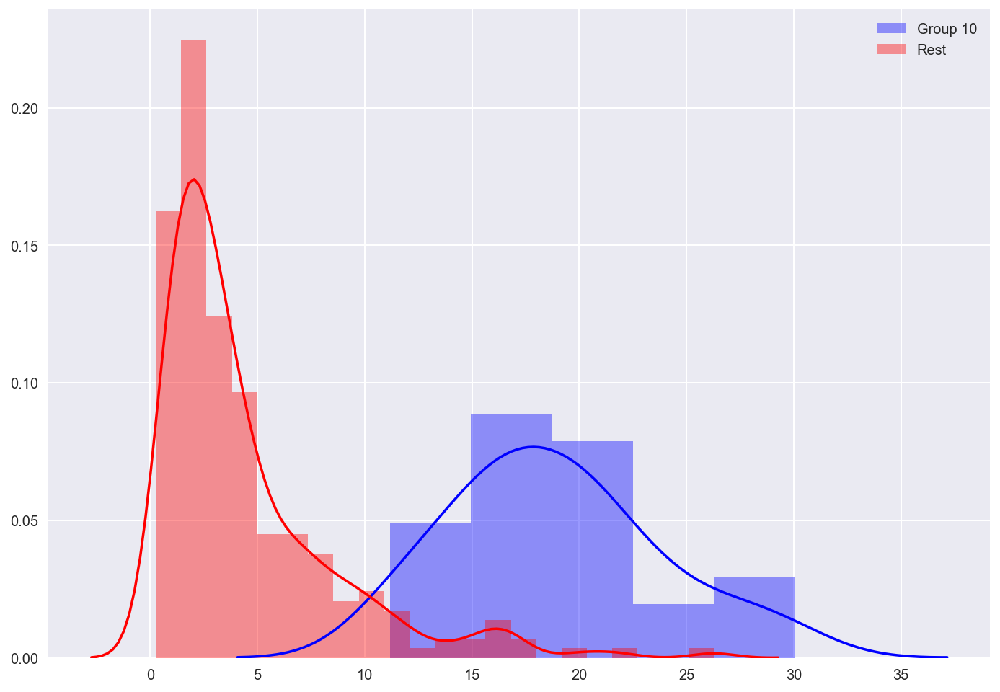
Paint Touches Frequency

I was very surprised by the results. Usually, when we talk about one of the best point guards in the NBA like Steph Curry, we typically put him in the same category as other star players, but the model put him into Group 1 with mostly average players. In contrast, group 5 had many star players. They can be categorized as ball dominant players and had the primary features: Pull Up Shot Frequency, Offense Isolation Frequency, Offense Pick & Roll Ball Handler Frequency, Average Seconds Per Touch.

I’d love to discuss all the groups in detail, but let’s instead move on to visualizations since this is a Data Science project.

# Visualizing the Results

Because it is very difficult to visualize 41 dimensions, principal component analysis (PCA) was applied to reduce the 41 dimensions to 3 dimensions. For those unfamiliar with PCA,

[‘*PCA finds a new set of dimensions (or a set of basis of views) such that all the dimensions are orthogonal (and hence linearly independent) and ranked according to the variance of data along them. It means more important principle*](https://medium.com/@aptrishu/understanding-principle-component-analysis-e32be0253ef0)

Taking the model results from K-means and PCA dimension reduction, here are some screenshots of the 3D clusters created in Plotly:

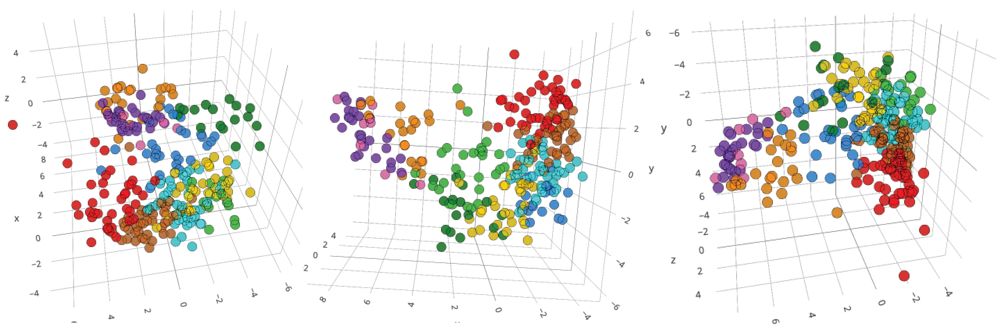
3D Plot

Separation between the clusters can be clearly be seen in 3D space, and the plot gives us an idea of how K-means determined the clusters in 41 dimensions.

# **Conclusion & Last Thoughts**

Back to the original question, how well does D’Angelo Russell fit with Steph Curry? Let’s look back at Group 5.

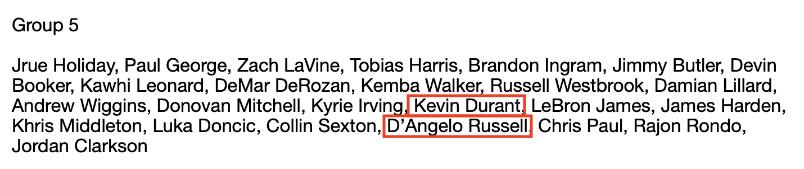

The Warriors traded Kevin Durant away for D’Angelo Russell. Both are members of group 5, the ball dominant players.

Thus, my recommendation to Warriors head coach Steve Kerr is to play Curry and Russell together.[Of course, he already knows this and probably did not need a model to tell him that.](https://sports.yahoo.com/steve-kerr-envisions-starting-stephen-140046295.html) I predict Russell will handle the ball more and Curry will play more of an off ball role.

In the future, I would love to further analyze the players that make up each group and see how successful each player is at performing their primary and secondary features. With more analysis, we could improve player performance by looking at which to improve areas that have limited success or redefine the player’s role on the team.

Hope you enjoyed the read and I would love to know what you think. Thanks for reading!