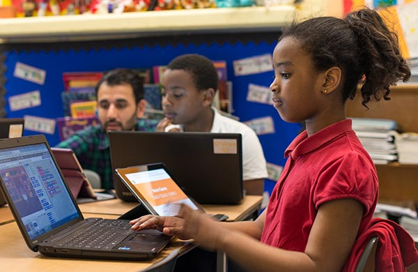
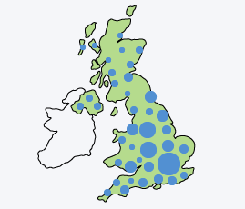
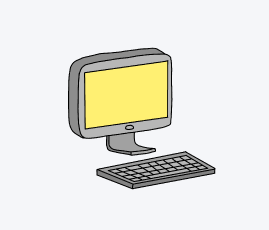
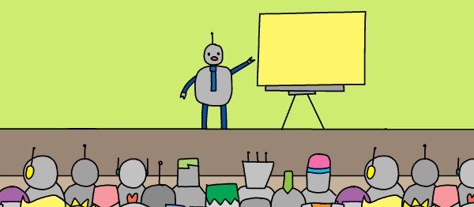
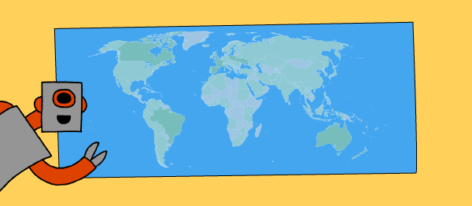
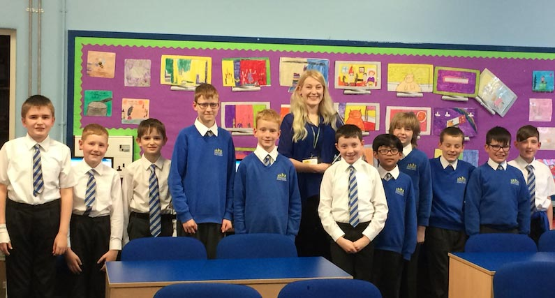

Code Club | Home

# Code Club

Code Club UK is a nationwide network of volunteers and educators who run free coding clubs for young people aged 9-13.

## How Code Club works

 

 

    A volunteer      A venue      Code Club projects      Children

An enthusiastic volunteer teams up with a community venue, such as a school or library, to run an after-school club for young people aged 9-13, using specially created Code Club resources.

 [About Code Club](https://www.codeclub.org.uk/about)

    6,742
Code Clubs

We have a network of 6,742 clubs across the UK. [See clubs on a map](https://www.codeclub.org.uk/about).

    75
projects
We teach four coding languages in over 75 projects.
[Check them out](https://www.codeclubprojects.org/).

    94,000
children
We are currently reaching 94,000 children all over the UK, and
[more around the world](https://www.codeclubworld.org/)!

## Find a Code Club near you

  I want to    near

## Our mission

To put a Code Club in every community in the world.

## Our vision

To give every child the skills, confidence, and opportunity to change their world.

## Our values

- We believe in working and learning together
- We inspire discovery and invention through play
- We believe in the transformational power of programming

 

### Shop

Support us and look amazing in our Code Club T-shirts, hoodies, badges, and bags.

[Buy cool stuff](http://codeclub.spreadshirt.co.uk/)

 

### Events

Come and join us at meetups and volunteer training sessions across the UK.

[Find events near you](https://www.codeclub.org.uk/events)

 

### Worldwide

Code Club is growing! Find out about Code Club around the world and how you can get involved.

[Find out more](https://www.codeclubworld.org/)

 

### Teacher training

We give educators the tools and experience they need to teach computing with confidence.

[Check out our teacher training](https://www.raspberrypi.org/training/online/)

## Email newsletter

For Code Club news and updates, sign up to our newsletter!

- Come and say hello to us on Twitter! We’re [@CodeClub](https://twitter.com/CodeClub).

- [Visit us on Facebook](https://www.facebook.com/codeclubuk) for a nice chat about teaching kids to code!

- We make cool videos about volunteering and coding — [check 'em out](https://www.youtube.com/playlist?list=PLcd1Q0-YkB1diHvyhf2sA9e9IlbFGZjVd)!

 

## From the blog

> ”The kids were one of the best things about Code Club! Their enthusiasm was infectious, and the rate at which they picked up programming in Scratch was incredible.”

Lizzy Atkinson, Code Club volunteer
[Visit the Code Club blog](http://blog.codeclub.org.uk/)

 

 

 

 

 

 