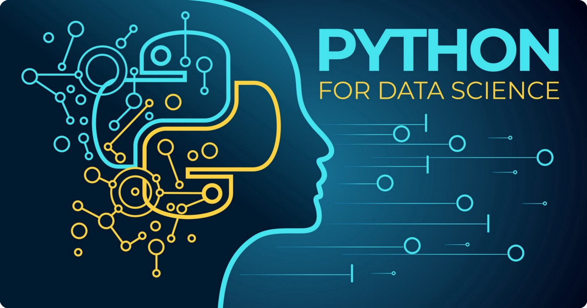
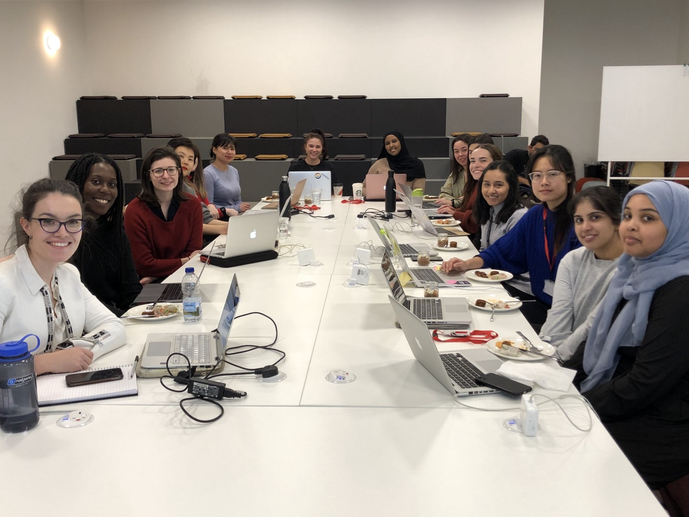

Coding For Data Science — Learning Python With QuantumBlack & Code First: Girls

# **Coding For Data Science — Learning Python With QuantumBlack & Code First: Girls**

[QuantumBlack](https://medium.com/@QuantumBlack?source=post_page-----1221d3028e75----------------------)

[Feb 13](https://medium.com/@QuantumBlack/coding-for-data-science-learning-python-with-quantumblack-code-first-girls-1221d3028e75?source=post_page-----1221d3028e75----------------------) · 4 min read

[*Lorena Bălan*](https://www.linkedin.com/in/lorena-b%C4%83lan-8a766592/)* — Software Engineer, *[*Merel Theisen *](https://www.linkedin.com/in/merel-t-30087b52/)*— Software Engineer, *[*Kiyohito Kunii *](https://www.linkedin.com/in/921kiyo/)*— Software Engineer, QuantumBlack*

On first inspection, the data analytics industry can often appear inaccessible. The abundance of technical language and an ever-increasing wealth of new methodologies, techniques and tools can be overwhelming to any new practitioner. When entering this closed club for the first time it can be easy to feel like an outsider — and with women making up just [22% of UK STEM employees](https://www.stemwomen.co.uk/blog/2019/09/women-in-stem-percentages-of-women-in-stem-statistics), tech needs to do more to attract and engage with women starting out in their careers.

With this in mind, we have partnered with not-for-profit social enterprise [Code First: Girls](https://www.codefirstgirls.org.uk/) to offer a QuantumBlack-curated training course designed to help women access the interesting and well-paid opportunities available in the fast growing data industry. Our London team launched the 12-week course on 11th February, providing an introduction to one of the most prevalent coding languages with a focus on practical application for data science projects.

**A Gateway To A Less-Than-Open World**

QuantumBlack is committed to championing diversity in the tech sector at all levels, and the only way to ensure we can achieve long term parity at the top is to encourage and welcome diversity at entry levels. Whether you’re currently studying at university or considering a career-switch, we want to offer you an introduction to coding for data science, with an emphasis on learning the employable skills needed to take your first steps into the industry.

Our inaugural Python For Data Science cohort at our London office

Our Code First: Girls course is one of the ways we aim to open the door to data analytics for tomorrow’s tech leaders. It begins with an initial four weeks of basics for any data scientist, introducing the participants to Python, terminal and Git. This is followed by eight weeks of practical modelling tasks, featuring data science programming, an introduction to machine learning and a final analytics project. This should give the participants a true taste of life as a data scientist, collaborating on a real world challenge and deploying the skill set they have spent weeks developing.

For those unable to join our London programme, we have included some additional details below on why Python presents a valuable opportunity for beginners and experts alike — alongside some tips for those exploring it for the first time.

**Why Choose Python?**

Python is the world’s second most popular coding language, and for good reason. It is frequently applied in various scenarios, from web development to robotics, thanks to its flexibility and range of available libraries and resources supported by an active developer community.

Whereas other languages such as Java are stricter and so require more time investment to begin with, Python comes with flexible syntax. Both beginners and experts can get started quickly and are encouraged to experiment with the platform to learn.

Python offers a fantastic introduction to data science programming — but it also poses challenges. As Python does not enforce strict rules, it can more easily lead to coding yourself into a corner and getting caught in your own traps. These mistakes are more prevalent and dangerous on larger projects, which require more thinking about the overall architecture of the system

That being said, Python is fairly ubiquitous across QuantumBlack’s data science projects. It remains robust enough to be input into production systems, and as a mathematical language it is suited to deal with algebra-related aspects of data science.

As Python is such a cornerstone of the typical data scientist’s journey, online support and guidance is readily available. However, our team would recommend keeping these below key pieces of advice in mind when taking your initial steps with Python:

1. **Experiment **— The best way to learn is to do**. **Investing much of your Python learning time in tackling small projects — this is the only way you will receive first-hand experience of coding for data science, with all the excitement and challenges that entails.

2. **Debugging Saves Lives** — Debugger tools allow you to easily spot malfunctioning code — which are all too likely in a flexible language. Python comes with its own default debugger (pdb) but the developer community has produced a wave of alternatives.

3. **Beware Your Own Traps **— Python’s lack of stringent rules means you often serve as your own coding gatekeeper — beginners often find they commit errors early in their code and then spend a significant amount of time trying to code their way out of these initial mistakes.

In a society fuelled by data, day-to-day problems and global challenges alike will be tackled by teams of data scientists. Diversity across these teams — in gender and race, as well as cognitive diversity — will be crucial in ensuring they generate a breadth of solutions which consider multiple perspectives.

QuantumBlack is committed to promoting representation across the technology sector, and offering accessible, practical training courses provides us with the opportunity to help nurture the data leaders of tomorrow. We will be developing additional external courses in the future, so [check our website](https://www.quantumblack.com/community/) for new opportunities

We look forward to meeting many of you on our first Code First: Girls course — and across our courses in the future.