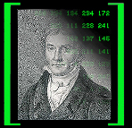
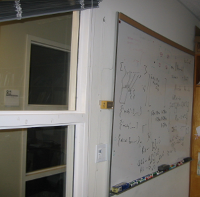
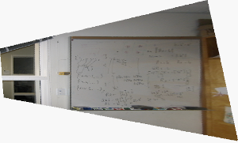
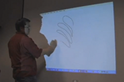
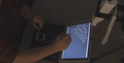
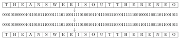
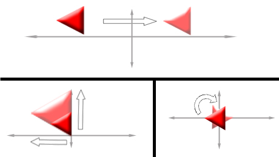
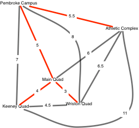
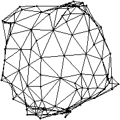

Coding The Matrix

#   

Coding The Matrix: Linear Algebra Through Computer Science Applications

## About The Course

The course has been taught at Brown University since 2008, and is being taught [in Fall 2017](http://csmatrix.org/).  Slides from past editions of the Brown University course are available [here](http://codingthematrix.com/#slides).

A shortened version has been taught through [Coursera](http://www.coursera.org/course/matrix/).

The aim of this course is to provide students interested in computer science an introduction to vectors and matrices and their use in CS applications.

The course is driven by applications from areas chosen from among: computer vision, cryptography, game theory, graphics, information retrieval and web search, and machine learning.

## Course Resources

Data and support code required for carrying out the assignments are provided [here](http://resources.codingthematrix.com/).

 [Auto-grading](http://grading.codingthematrix.com/) is made available for some of the tasks.

 [Here](http://codingthematrix.com/python_and_inverse_index_labs.pdf) are the first and second labs from Edition One. These have nothing to do with linear algebra. They are provided to bring the reader up to speed in the part of Python we use in the book. [Here](http://codingthematrix.com/from-loop-to-comprehension.pdf) is a document intended to assist people with making the transition from loops to comprehensions.

Join the mailing list for updates about addition of resources.

## Slides

Slides from the course taught at Brown University in Fall 2013:

- [The Function](http://codingthematrix.com/slides/The_Function.pdf)

- [The Field](http://codingthematrix.com/slides/The_Field.pdf)

- [The Vector](http://codingthematrix.com/slides/The_Vector.pdf)

- [The Vector Space](http://codingthematrix.com/slides/The_Vector_Space.pdf)

- [The Matrix](http://codingthematrix.com/slides/The_Matrix.pdf)

- [The Basis](http://codingthematrix.com/slides/The_Basis.pdf)

- [Dimension](http://codingthematrix.com/slides/Dimension.pdf)

- [Gaussian Elimination](http://codingthematrix.com/slides/Gaussian_Elimination.pdf)

- [The Inner Product](http://codingthematrix.com/slides/The_Inner_Product.pdf)

- [Orthogonalization](http://codingthematrix.com/slides/Orthogonalization.pdf)

- Special Bases

- [The Singular Value Decomposition](http://codingthematrix.com/slides/The_SVD.pdf)

- [The Eigenvector](http://codingthematrix.com/slides/The_Eigenvector.pdf)

- The Linear Program

## Sign up for updates

- To receive messages when new material is available, e.g. blog posts about applications of linear algebra to CS, news of a follow-on course, or corrections to the book, join the mailing list. I promise that mailings will be rare and that I will not share your email address with anybody, ever.      Email Address:      Subscribe   Unsubscribe

## About The Book

-

|     |     |
| --- | --- |
|  [Edition 1](http://www.amazon.com/dp/0615880991/) of the textbook is available for [purchase](http://www.amazon.com/gp/product/0615880991/ref=as_li_qf_sp_asin_il_tl?ie=UTF8&camp=1789&creative=9325&creativeASIN=0615880991&linkCode=as2&tag=codithematr-20). It incorporates corrections and a revised and expanded index.  *List Price: $35.00 *  *Publisher: [Newtonian Press](http://newtonianpress.com/)*  [Purchase in UK](http://www.amazon.co.uk/Coding-Matrix-Algebra-Applications-Computer/dp/0615880991/)  [Purchase in Germany](http://www.amazon.de/Coding-Matrix-Algebra-Applications-Computer/dp/0615880991/)  [Errata for Edition 1](http://codingthematrix.com/Errata1.pdf) Here is  a [revised and expanded index](http://codingthematrix.com/CodingTheMatrixIndexVersion0.pdf) for Edition 0. Send [mail](http://codingthematrix.com/mailto:info@codingthematrix.com?Subject=book) if you have questions about using the book for a university course. |      [Coding the Matrix: Linear...](https://www.amazon.com/Coding-Matrix-Algebra-Applications-Computer/dp/0615880991/ref=as_sl_pc_tf_til?tag=codithematr-20&linkCode=w00&linkId=&creativeASIN=0615880991)  [$33.25](https://www.amazon.com/Coding-Matrix-Algebra-Applications-Computer/dp/0615880991/ref=as_sl_pc_tf_til?tag=codithematr-20&linkCode=w00&linkId=&creativeASIN=0615880991)    [Shop now](https://www.amazon.com/Coding-Matrix-Algebra-Applications-Computer/dp/0615880991/ref=as_sl_pc_tf_til?tag=codithematr-20&linkCode=w00&linkId=&creativeASIN=0615880991)   |

## Example Applications

Here are examples of applications addressed in *Coding the Matrix*.

-

- **crossfade**

                   

A line segment between points is given by the convex combinations of those points; if the "points" are images, the line segment is a simple morph between the images.

- **Perspective rectification**

   

Given a photo of a whiteboard taken at an angle, synthesize a perspective-free view of the whiteboard.

   

The same transformation can be used in using a Wiimote to make a low-cost interactive whiteboard or light pen (due to Johnny Chung Lee).

- **Error-correcting codes**

 

Error-correcting codes are used, e.g., by cellphones to preserve data transmitted over a noisy channel while maintaining high throughput.

- **Integer factorization**

 522253825433285668885771662040104167 = 891428822186035241∙585861498344390287

Factoring an integer is a hard computational problem (and the RSA cryptosystem depends on it being hard).  At the core of the most sophisticated integer-factoring algorithms is a simple problem in linear algebra.

- **Image blurring**

 

Blurring an image is a simple linear transformation.

- **Searching within an audio clip**

 

Searching for one audio clip within another can be formulated as a convolution.  A convolution can be computed very quickly using the Fast Fourier Transform.

- **Searching within an image**

   

Convolution can also be done in two dimensions, enabling one to quickly search for a subimage within an image.

- **Audio and image compression**

Compression of audio and images aids efficient storage and transmission.  Lossy compression techniques such as those used in MP3 (audio) and JPEG (images) are based in part on linear algebra,

e.g. wavelet transform and Fourier transform.

  100% original size

  40% original size

  10% original size

- **Face detection**

 

A "classical" approach to face detection is eigenfaces, a technique related to principal component analysis.

- **2d graphics transformations**

 

Simple transformations that arise in graphics such as rotation, translation, and scaling can be expressed using matrices.

- *Lights Out*

 

 *Lights Out* is a puzzle in which you must select the correct buttons to push in order for all the lights to go out.  Finding a solution can be expressed as a problem in linear algebra.

- **Minimum-weight spanning forest**

 

Finding the minimum-weight spanning tree of a graph can be interpreted as the problem of finding a minimum-weight basis for a vector space

derived from the graph.

- **Graph layout**

 

A nice drawing of a graph can be obtained from eigenvectors of a related matrix.

All material © 2012 Philip N. Klein.