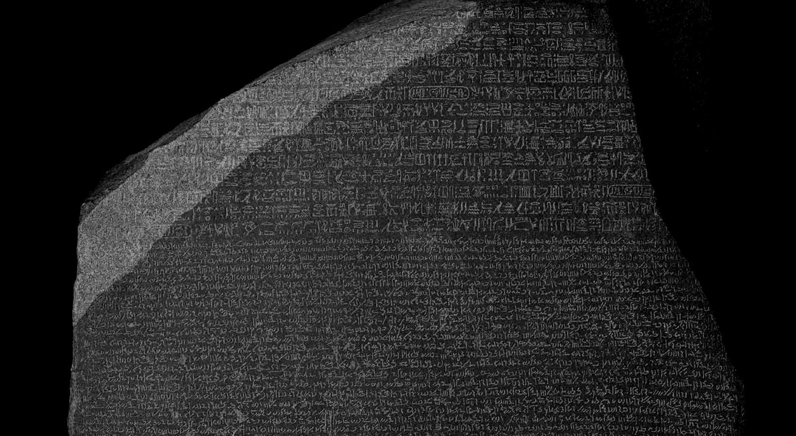
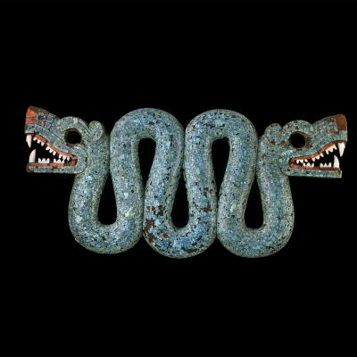
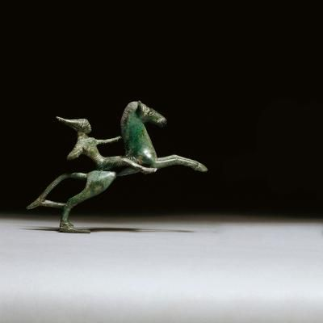
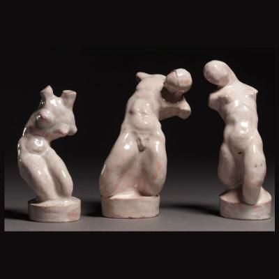
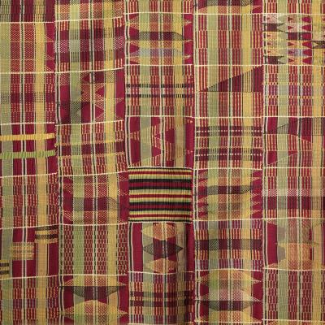
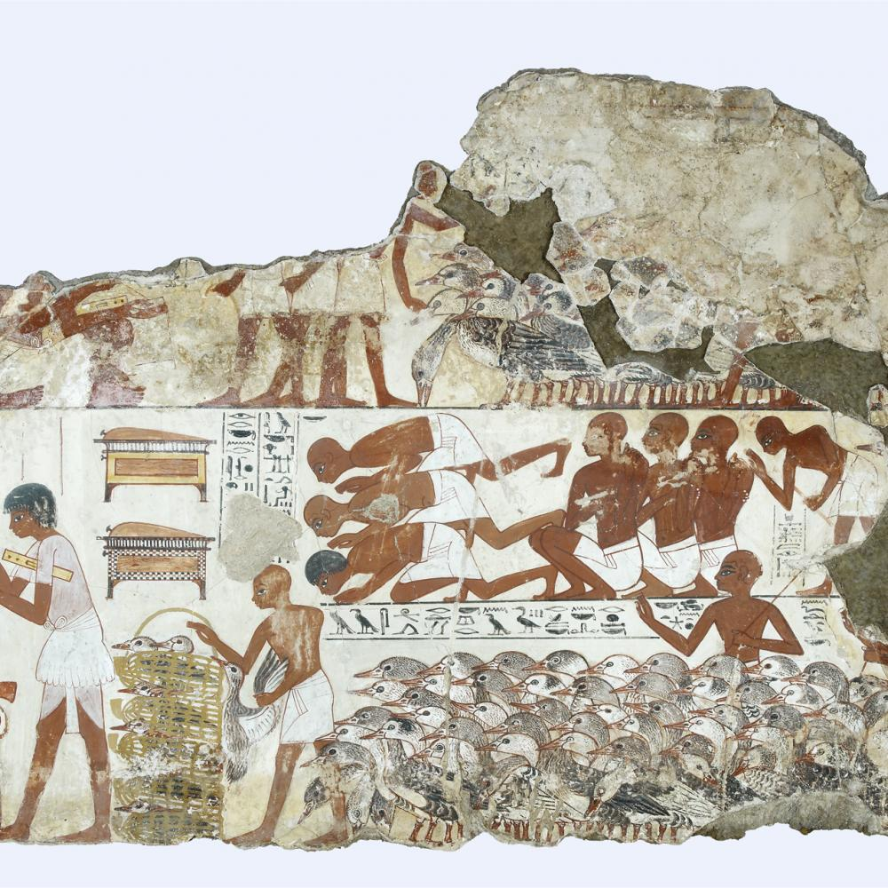
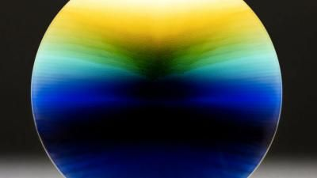
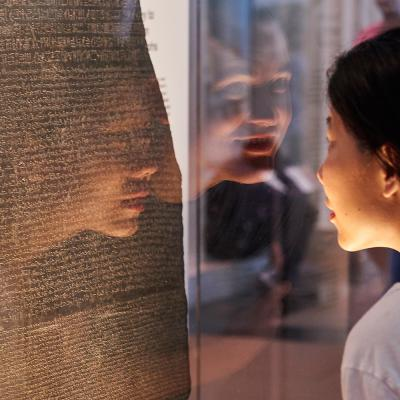

Collection | British Museum

 

# Explore the collection

Welcome to the new version of Collection online. Find out more about [ongoing improvements](https://www.britishmuseum.org/collection/collection-online/development). For help and further information read our [online guide](https://www.britishmuseum.org/collection/collection-online/guide).

Search:
All fields

 

Enter a **keyword**, **person**, **place** or **museum number**

## You are here:

-   [Home](https://www.britishmuseum.org/)

-   [Collection](https://www.britishmuseum.org/collection)

### Share the page

- [Share on Facebook (Opens in new window)](http://www.facebook.com/share.php?u=https://www.britishmuseum.org/collection)

- [Share on Twitter (Opens in new window)](https://twitter.com/intent/tweet?text=Collection&url=https://www.britishmuseum.org/collection)

- [Themes](https://www.britishmuseum.org/collection#themes)

- [Blog](https://www.britishmuseum.org/collection#blog)

 [Explore the galleries](https://www.britishmuseum.org/collection/galleries)

 [How objects come into the collection](https://www.britishmuseum.org/about-us/british-museum-story/collecting-histories)

 [The British Museum story](https://www.britishmuseum.org/about-us/british-museum-story)

Get closer to the British Museum's collection and immerse yourself in two million years of history, across six continents.

Collection online has been completely redeveloped, making it much easier to find what you want. It allows access to almost four and a half million objects in more than two million records. The search is more intuitive and now offers suggestions as you type.

High definition images can be enlarged and examined in detail which will enable you to view the incredible workmanship on the [Royal Game of Ur](https://www.britishmuseum.org/collection/object/W_1928-1009-378), the intricate carving on this [African hunting horn](https://www.britishmuseum.org/collection/object/E_Af1979-01-3156), the amazingly preserved [deerskin map](https://www.britishmuseum.org/collection/object/E_Am2003-19-3) from North America, or this delightful drawing by Raphael of [an old man's head](https://www.britishmuseum.org/collection/object/P_1895-0915-634) – just a few of the thousands of highlights to discover.

Enjoy exploring the collection – from some of the earliest objects created by humankind to works by contemporary artists. Or choose from the curated collections below, which reveal the fascinating stories that transcend time.

- [Desire, love and identity](https://www.britishmuseum.org/collection/desire-love-and-identity)
- [Death and memory](https://www.britishmuseum.org/collection/death-and-memory)
- [Americas](https://www.britishmuseum.org/node/1174/)
- [China](https://www.britishmuseum.org/collection/china)

##  Collection highlights

1 / 8

-

-

-

-

-

-

-

-

##  Collection themes

- [                 ### Americas     The Americas encapsulate the remarkable narratives of cultural achievement and human experience across two continents.](https://www.britishmuseum.org/collection/americas)

- [                 ### Animals     Explore the many wild and wonderful depictions of animals found in the Museum's collection.](https://www.britishmuseum.org/collection/animals)

- [                 ### China     China is one of the world's oldest civilisations and home to a quarter of the world's population.](https://www.britishmuseum.org/collection/china)

##  BLANK

- [                 ### Death and memory      Discover the many tales of death and memory from the Museum.](https://www.britishmuseum.org/collection/death-and-memory)

- [                 ### Desire, love and identity     Love and desire is a theme found across the Museum's collection.](https://www.britishmuseum.org/collection/desire-love-and-identity)

- [                 ### Africa     Delve into the Museum's stories from Africa.](https://www.britishmuseum.org/collection/africa)

##  blank

- [                 ### Egypt     Some of the British Museum's best-known Collection items come from Egypt each with their own unique story. ](https://www.britishmuseum.org/collection/egypt)

##  Sign up to our newsletters

Stay connected and receive all our latest news, stories and ways to explore the British Museum from home.

 [Sign up (Opens in new window)](http://emails.britishmuseum.org/k/British-Museum/sign_up_form_from_website_box)

##  You may also be interested in

- [                 ### Read the blog     Thought-provoking posts from conservators, curators and scientists that give you the inside knowledge on our collection.           (Opens in new window)](https://blog.britishmuseum.org/)

- [                 ### Galleries     There are more than 60 free galleries at the British Museum ready to be explored.](https://www.britishmuseum.org/collection/galleries)

- [                 ### People behind the collection     Read the fascinating histories behind the Museum's most prolific collectors](https://www.britishmuseum.org/about-us/british-museum-story/people-behind-collection)

## In collection

- [ Collection   ](https://www.britishmuseum.org/collection)

- [ Collection online   ](https://www.britishmuseum.org/collection)

- [ Galleries   ](https://www.britishmuseum.org/collection/galleries)

- [ Blog      (Opens in new window)](https://blog.britishmuseum.org/)