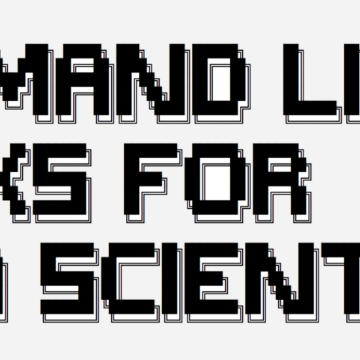

Command Line Tricks For Data Scientists – Kade Killary – Medium

Command Line Tricks For Data Scientists – Kade Killary – Medium

https://medium.com/@kadek/command-line-tricks-for-data-scientists-c98e0abe5da

For many data scientists, data manipulation begins and ends with Pandas or the Tidyverse. In theory, there is nothing wrong with this…