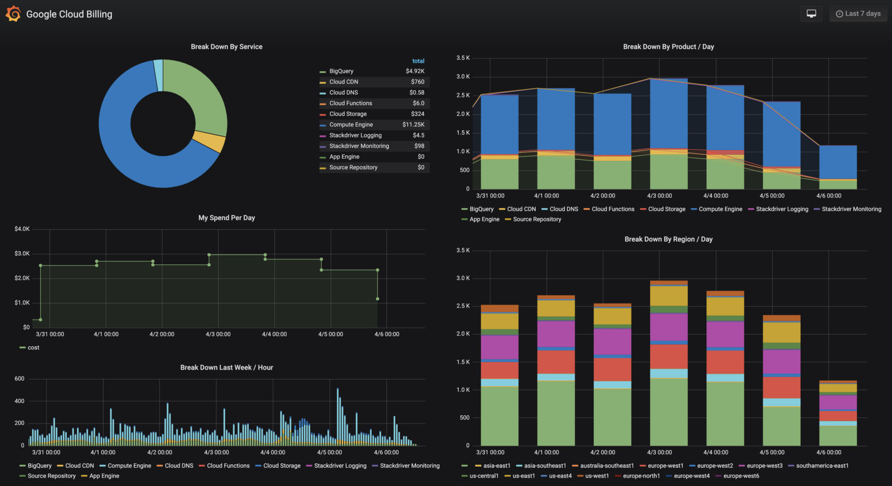

Community Spotlight: BigQuery Plugin

# Community Spotlight: BigQuery Plugin

## Published: 25 Jun 2019 by Julie Dam [RSS **](https://grafana.com/blog/index.xml)

[**Tweet](https://twitter.com/intent/tweet?original_referer=https%3A%2F%2Fgrafana.com%2Fblog%2F2019%2F06%2F25%2Fcommunity-spotlight-bigquery-plugin%2F&ref_src=twsrc%5Etfw&text=Community%20Spotlight%3A%20BigQuery%20Plugin%C2%A0%7C%20Grafana%20Labs%20Blog&tw_p=tweetbutton&url=https%3A%2F%2Fgrafana.com%2Fblog%2F2019%2F06%2F25%2Fcommunity-spotlight-bigquery-plugin%2F&via=grafana)

The Grafana community comes up with some pretty cool stuff, and we’re hoping to spotlight some of it from time to time. Today, we’re starting with the [BigQuery datasource plugin](https://github.com/doitintl/bigquery-grafana) developed by the team at [DoiT International](https://www.doit-intl.com/labs/).

DoiT is a reseller of Google Cloud and AWS that helps companies either move from on premise to cloud or move from one cloud provider to another. “We mostly do architecture review for companies and help them solve problems,” says [Aviv Laufer](https://github.com/avivl), a Principal Reliability Engineer at DoiT. “When there is a problem that’s common to a few customers, I try to solve it in a general manner and provide it as an open source solution.”

And that’s what led to the plugin for BigQuery, which many of DoiT’s customers use. “We’re pretty involved in the Grafana community, and we saw that one of the most voted features of Grafana was the connector to BigQuery database,” he says. “BigQuery comes with the data visualization by Google, which is not as good as Grafana, at least in my experience. Some of our customers were using Google Sheets in order to do graphs in BigQuery! And a lot of our customers were already using Grafana for other purposes. I like the fact that they can use one visualization tool across multiple sources.”

So Laufer decided to tackle the issue, and after about six weeks of work off and on, the plugin was released. It was the first time he had coded in TypeScript, and the first time he had built a plugin for Grafana. He says there’s “room for improvement” in the Grafana documentation about how to write plugins, so he set out to “reverse engineer some of the other plugins and go through the Grafana code, figure out what I can do, and how I can do it. At the end of the day, it worked.”

Since the plugin’s release, “more than a handful” of DoiT’s customers – including some large companies in Israel – are using it, and many other people around the world are downloading it, opening issues on GitHub, and asking for features. (One common request: alerts.)

“We are looking for more suggestions, more functionality,” Laufer says. “We want to hear feedback from the community. We are looking to make this a better product.”

And it might not be the last Grafana plugin you’ll see from the DoiT team. “If there’s something that will benefit our customers and the community, we probably will do it,” he says. “We first look for the problem and then find out whether or not we can provide a solution. There are lots of other solutions that we have, and all of them are open source.”

##### Recent Posts

###### [Blog](https://grafana.com/blog/)

###### [Inside Grafana Labs: Our Workspaces Revealed](https://grafana.com/blog/2019/07/03/inside-grafana-labs-our-workspaces-revealed/)

* * *

##### Categories

##### [Cloud](https://grafana.com/categories/cloud/)

##### [Company](https://grafana.com/categories/company/)

##### [Cortex](https://grafana.com/categories/cortex/)

##### [Data-Visualization](https://grafana.com/categories/data-visualization/)

##### [Design](https://grafana.com/categories/design/)

##### [Devops](https://grafana.com/categories/devops/)

##### [Elasticsearch](https://grafana.com/categories/elasticsearch/)

##### [Engineering](https://grafana.com/categories/engineering/)

##### [Events](https://grafana.com/categories/events/)

##### [Grafana](https://grafana.com/categories/grafana/)

##### [Grafana-Buzz](https://grafana.com/categories/grafana-buzz/)

##### [Grafanacon](https://grafana.com/categories/grafanacon/)

##### [Graphite](https://grafana.com/categories/graphite/)

##### [Guest](https://grafana.com/categories/guest/)

##### [Kubernetes](https://grafana.com/categories/kubernetes/)

##### [Loki](https://grafana.com/categories/loki/)

##### [Metrictank](https://grafana.com/categories/metrictank/)

##### [Monitoring](https://grafana.com/categories/monitoring/)

##### [Mysql](https://grafana.com/categories/mysql/)

##### [Open-Source](https://grafana.com/categories/open-source/)

##### [Opensource](https://grafana.com/categories/opensource/)

##### [Plugins](https://grafana.com/categories/plugins/)

##### [Prometheus](https://grafana.com/categories/prometheus/)

##### [Release](https://grafana.com/categories/release/)

##### [Security](https://grafana.com/categories/security/)

##### [Snap-Telemetry](https://grafana.com/categories/snap-telemetry/)

##### [Talks](https://grafana.com/categories/talks/)

##### [Team](https://grafana.com/categories/team/)

##### [Time-Series-Databases](https://grafana.com/categories/time-series-databases/)

##### [Timeshift](https://grafana.com/categories/timeshift/)

##### [Tutorials](https://grafana.com/categories/tutorials/)

##### [Ux](https://grafana.com/categories/ux/)

##### [Video](https://grafana.com/categories/video/)

##### [Worldping](https://grafana.com/categories/worldping/)