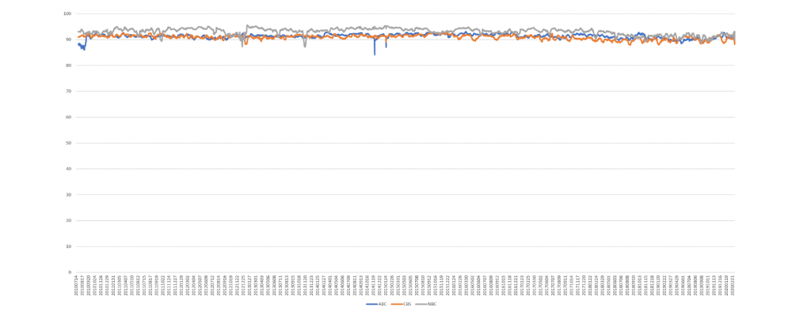
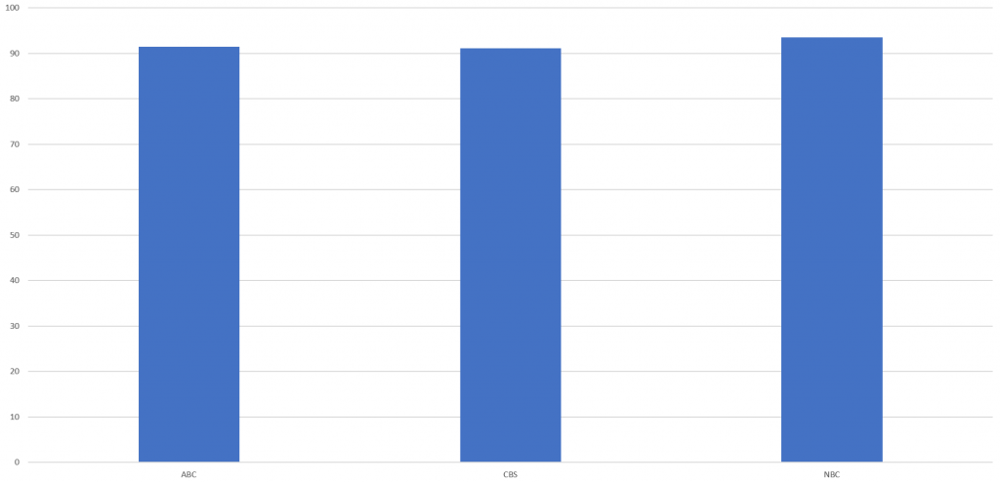
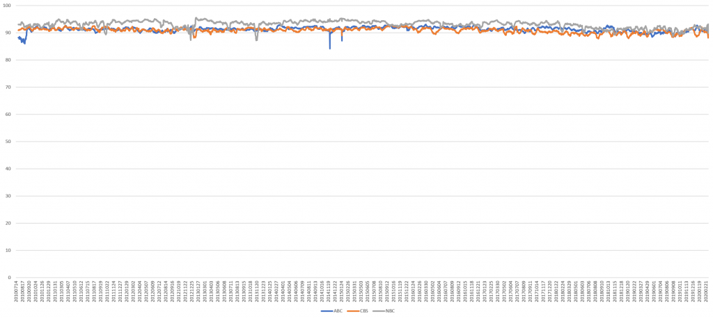

Comparing Google Cloud Video API’s Speech Recognition To Human Captioning Over A Decade Of Television News – The GDELT Project

# [Comparing Google Cloud Video API's Speech Recognition To Human Captioning Over A Decade Of Television News](https://blog.gdeltproject.org/comparing-google-cloud-video-apis-speech-recognition-to-human-captioning-over-a-decade-of-television-news/)

 ** March 9, 2020

   

Just how accurate is modern automatic speech recognition? Last year we [compared](https://www.forbes.com/sites/kalevleetaru/2019/06/09/comparing-googles-ai-speech-recognition-to-human-captioning-for-television-news/) a small week-long sample of machine and human-generated television news transcripts and found [greater than 90% agreement](https://www.forbes.com/sites/kalevleetaru/2019/06/09/comparing-googles-ai-speech-recognition-to-human-captioning-for-television-news/). Do these numbers hold up over a larger sample and over a longer period of time? As part of our [analysis](https://blog.gdeltproject.org/what-googles-cloud-video-ai-sees-watching-decade-of-television-news-the-visual-global-entity-graph-2-0/) of a decade of ABC, CBS and NBC evening news broadcasts using Google's [Cloud Video API](https://cloud.google.com/video-intelligence/), we used its "video" speech recognition model to generate an automated transcript of each video and compared it to the human-produced closed captioning transcript of each broadcast, spanning more than 9,000 broadcasts and over a quarter-million minutes of airtime. Since many commercials are not closed captioned, words that appeared only in the machine transcript were excluded from consideration.

The final results can be seen below, with NBC average 93.6% agreement between machine and human transcripts, followed by ABC at 91.5% and CBS at 91%, showing little difference by station.

How much have these numbers changed over time? The timeline below plots these percentages over the past ten years, showing very little change over the last decade.

In reality, the accuracy of Google's speech recognition is far higher than 90%. A manual spot review of the differences between the machine and human transcripts showed that the [overwhelming majority](https://blog.gdeltproject.org/comparing-human-and-machine-transcripts-a-list-of-common-differences/) of differences either represented transcription or spelling differences or erred in favor of the machine. For example, human transcripts typically write prices using numbers like '$5" while the machine transcript typically spells them out as "five dollars." Compound words are a particularly common source of difference, with "counterattack" versus "counter-attack," "firepower" versus "fire-power" and "airpower" versus "air-power". Transliterated names often differ in their spellings as in "Gaddafi" versus "Gadhafi."

However, the majority of differences come from the machine's much higher fidelity in transcribing the totality of what was actually said. Much of the difference comes from places where the human transcriptionist omitted words such as "taxi riders are being hit" versus the machine's correct transcription of "taxi riders in this city are now being hit."

A more detailed summary of the systematic differences can be seen in this [writeup](https://blog.gdeltproject.org/comparing-human-and-machine-transcripts-a-list-of-common-differences/) from last month.

In conclusion, Google's Cloud Video API's accuracy shows us that automated speech recognition now exceeds the accuracy of realtime human transcriptioning.

## TECHNICAL DETAILS

How did we compute the numbers above? For each broadcast, we took both the ASR and human transcripts and lowercased and stripped all leading and following punctuation from them (internal punctuation like hyphens and possessives were retained). The common speaker notation "Reporter:" was also removed from the human transcripts. The two cleaned transcripts were then split into words on space boundaries and converted into a text file with one word per line. The two one-word-per-line files were then run through "diff" and the differences tallied, with each differing word being counted as a difference.

Since many commercials are not closed captioned, the overwhelming majority of differences are insertions in the ASR representing the transcripts of those uncaptioned commercials. Thus, words that appear only in the ASR transcript are excluded from consideration. This means that insertions to the human transcript and words that differ are counted.