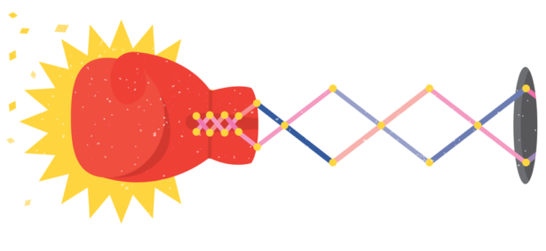

Complexity Theory Problem Strikes Back |  Quanta Magazine

# Complexity Theory Problem Strikes Back

The legendary graph isomorphism problem may be harder than a 2015 result seemed to suggest.

*[Lucy Reading-Ikkanda](http://www.lucyreading.com/) for Quanta Magazine*

By**[Erica Klarreich](https://www.quantamagazine.org/authors/erica-klarreich/)**

January 5, 2017

[(L)](https://www.quantamagazine.org/20170105-graph-isomorphism-retraction/#comments-wrapper)

- [facebook](https://www.facebook.com/sharer.php?t=Complexity%20Theory%20Problem%20Strikes%20Back&u=https://www.quantamagazine.org/20170105-graph-isomorphism-retraction/)
- [twitter](https://twitter.com/intent/tweet?text=Complexity+Theory+Problem+Strikes+Back+https%3A%2F%2Fwww.quantamagazine.org%2F20170105-graph-isomorphism-retraction%2F+via+%40QuantaMagazine)
- [reddit](https://www.reddit.com/submit?url=https://www.quantamagazine.org/20170105-graph-isomorphism-retraction/&title=Complexity%20Theory%20Problem%20Strikes%20Back)
- [mail](https://www.quantamagazine.org/20170105-graph-isomorphism-retraction/mailto:?subject=Complexity%20Theory%20Problem%20Strikes%20Back&body=https%3A%2F%2Fwww.quantamagazine.org%2F20170105-graph-isomorphism-retraction%2F)
- [sharethis](http://wd.sharethis.com/share5x/partner_page.html?url=https://www.quantamagazine.org/20170105-graph-isomorphism-retraction/&title=Complexity%20Theory%20Problem%20Strikes%20Back&img=https://www.quantamagazine.org/wp-content/uploads/2017/01/Punch_featured-300x300.png&summary=The+legendary+graph+isomorphism+problem+may+be+harder+than+a+2015+result+seemed+to+suggest.)

[PDF](https://www.quantamagazine.org/read-offline/34574/20170105-graph-isomorphism-retraction.pdf)

[Print](https://www.quantamagazine.org/read-offline/34574/20170105-graph-isomorphism-retraction.print)

# Complexity Theory Problem Strikes Back

The legendary graph isomorphism problem may be harder than a 2015 result seemed to suggest.

*[Lucy Reading-Ikkanda](http://www.lucyreading.com/) for Quanta Magazine*

*By Erica Klarreich*

The theoretical computer scientist [László Babai](http://people.cs.uchicago.edu/~laci/)  [has retracted](http://people.cs.uchicago.edu/~laci/update.html) a claim that amazed the computer science community when he made it just over a year ago. In November 2015, he announced that he had come up with a [“quasi-polynomial” algorithm for graph isomorphism](https://www.quantamagazine.org/20151214-graph-isomorphism-algorithm/), one of the most famous problems in theoretical computer science. While Babai’s result has not collapsed completely — computer scientists still consider it a breakthrough — its central claim has been found, after a year of close scrutiny, to contain a subtle error. (*January 9, 2017, update:* Babai [announced](http://people.cs.uchicago.edu/~laci/update.html) that he has fixed the error and renewed his claim that his algorithm runs in quasi-polynomial time, adding that he is “working on an updated arXiv posting.”)

“In Laci Babai, you have one of the most legendary and fearsome theoretical computer scientists there ever was, and in graph isomorphism, one of the most legendary and fearsome problems,” wrote [Scott Aaronson](http://scottaaronson.com/), a theoretical computer scientist at the University of Texas, Austin, in an email. “A year ago, Laci threw an unbelievable knockout punch at [graph isomorphism], and now the problem itself seems to have gotten off the mat and thrown a counterpunch.”

The graph isomorphism problem asks for an algorithm that can spot whether two graphs — networks of nodes and edges — are the same graph in disguise. For decades, this problem has occupied a special status in computer science as one of just a few naturally occurring problems whose difficulty level is hard to pin down.

Roughly speaking, most computer science problems fall into one of two broad categories. There are “easy” problems, the ones that can be solved in a polynomial number of steps — if the size of the problem is denoted by *n*, the number of steps grows as, for example, *n*2 or *n*3. These problems can (generally) be solved efficiently on a computer. And there are “hard” problems, for which the best known algorithm takes an exponential (such as 2*n* ) number of steps — far too many for a computer to carry out efficiently. Only a handful of natural problems, including graph isomorphism, seem to defy this dichotomy; computer scientists have struggled for decades to figure out just where graph isomorphism belongs.

Babai, a professor at the University of Chicago, had presented in late 2015 what he said was a “quasi-polynomial” algorithm for graph isomorphism. His work appeared to place the problem, if not firmly in the easy zone, then at least in its suburbs. But on January 4 he announced that while his algorithm still works (with some small tweaks) and has now been carefully checked by other computer scientists, it doesn’t run as fast as he had thought. It is “sub-exponential,” which moves the problem back into the suburbs of the hard zone.

Babai’s algorithm is, nevertheless, significantly faster than the previous best algorithm for graph isomorphism, which had held its title unchallenged for more than 30 years. “It’s still a massive improvement over the previous state of the art,” said Aaronson by email. Computer scientists conversant in Babai’s approach will presumably try to figure out whether further improvements can be milked from it, Aaronson predicted.

In a statement on his University of Chicago web page, Babai thanked [Harald Helfgott](https://webusers.imj-prg.fr/~harald.helfgott/anglais/), a mathematician at the University of Göttingen and France’s National Center for Scientific Research, for “spotting this error and for spending months studying the paper in full detail.” Helfgott, in a [blog post](https://valuevar.wordpress.com/2017/01/04/graph-isomorphism-in-subexponential-time/), wrote that despite the error in Babai’s work, the remainder of his paper is “rich in innovative ideas.”

*To learn more about the graph isomorphism problem, read Erica Klarreich’s 2015 article “*[*Landmark Algorithm Breaks 30-Year Impasse*](https://www.quantamagazine.org/20151214-graph-isomorphism-algorithm/)***.”***

The theoretical computer scientist [László Babai](http://people.cs.uchicago.edu/~laci/)  [has retracted](http://people.cs.uchicago.edu/~laci/update.html) a claim that amazed the computer science community when he made it just over a year ago. In November 2015, he announced that he had come up with a [“quasi-polynomial” algorithm for graph isomorphism](https://www.quantamagazine.org/20151214-graph-isomorphism-algorithm/), one of the most famous problems in theoretical computer science. While Babai’s result has not collapsed completely — computer scientists still consider it a breakthrough — its central claim has been found, after a year of close scrutiny, to contain a subtle error. (*January 9, 2017, update:* Babai [announced](http://people.cs.uchicago.edu/~laci/update.html) that he has fixed the error and renewed his claim that his algorithm runs in quasi-polynomial time, adding that he is “working on an updated arXiv posting.”)

“In Laci Babai, you have one of the most legendary and fearsome theoretical computer scientists there ever was, and in graph isomorphism, one of the most legendary and fearsome problems,” wrote [Scott Aaronson](http://scottaaronson.com/), a theoretical computer scientist at the University of Texas, Austin, in an email. “A year ago, Laci threw an unbelievable knockout punch at [graph isomorphism], and now the problem itself seems to have gotten off the mat and thrown a counterpunch.”

The graph isomorphism problem asks for an algorithm that can spot whether two graphs — networks of nodes and edges — are the same graph in disguise. For decades, this problem has occupied a special status in computer science as one of just a few naturally occurring problems whose difficulty level is hard to pin down.

Roughly speaking, most computer science problems fall into one of two broad categories. There are “easy” problems, the ones that can be solved in a polynomial number of steps — if the size of the problem is denoted by *n*, the number of steps grows as, for example, *n*2 or *n*3. These problems can (generally) be solved efficiently on a computer. And there are “hard” problems, for which the best known algorithm takes an exponential (such as 2*n* ) number of steps — far too many for a computer to carry out efficiently. Only a handful of natural problems, including graph isomorphism, seem to defy this dichotomy; computer scientists have struggled for decades to figure out just where graph isomorphism belongs.

Babai, a professor at the University of Chicago, had presented in late 2015 what he said was a “quasi-polynomial” algorithm for graph isomorphism. His work appeared to place the problem, if not firmly in the easy zone, then at least in its suburbs. But on January 4 he announced that while his algorithm still works (with some small tweaks) and has now been carefully checked by other computer scientists, it doesn’t run as fast as he had thought. It is “sub-exponential,” which moves the problem back into the suburbs of the hard zone.

Babai’s algorithm is, nevertheless, significantly faster than the previous best algorithm for graph isomorphism, which had held its title unchallenged for more than 30 years. “It’s still a massive improvement over the previous state of the art,” said Aaronson by email. Computer scientists conversant in Babai’s approach will presumably try to figure out whether further improvements can be milked from it, Aaronson predicted.

In a statement on his University of Chicago web page, Babai thanked [Harald Helfgott](https://webusers.imj-prg.fr/~harald.helfgott/anglais/), a mathematician at the University of Göttingen and France’s National Center for Scientific Research, for “spotting this error and for spending months studying the paper in full detail.” Helfgott, in a [blog post](https://valuevar.wordpress.com/2017/01/04/graph-isomorphism-in-subexponential-time/), wrote that despite the error in Babai’s work, the remainder of his paper is “rich in innovative ideas.”

*To learn more about the graph isomorphism problem, read Erica Klarreich’s 2015 article “*[*Landmark Algorithm Breaks 30-Year Impasse*](https://www.quantamagazine.org/20151214-graph-isomorphism-algorithm/)***.”***

- [facebook](https://www.facebook.com/sharer.php?t=Complexity%20Theory%20Problem%20Strikes%20Back&u=https://www.quantamagazine.org/20170105-graph-isomorphism-retraction/)
- [twitter](https://twitter.com/intent/tweet?text=Complexity+Theory+Problem+Strikes+Back+https%3A%2F%2Fwww.quantamagazine.org%2F20170105-graph-isomorphism-retraction%2F+via+%40QuantaMagazine)
- [googleplus](https://plus.google.com/share?url=https://www.quantamagazine.org/20170105-graph-isomorphism-retraction/)
- [reddit](https://www.reddit.com/submit?url=https://www.quantamagazine.org/20170105-graph-isomorphism-retraction/&title=Complexity%20Theory%20Problem%20Strikes%20Back)
- [sharethis](http://wd.sharethis.com/share5x/partner_page.html?url=https://www.quantamagazine.org/20170105-graph-isomorphism-retraction/&title=Complexity%20Theory%20Problem%20Strikes%20Back&img=https://www.quantamagazine.org/wp-content/uploads/2017/01/Punch_featured-300x300.png&summary=The+legendary+graph+isomorphism+problem+may+be+harder+than+a+2015+result+seemed+to+suggest.)
- [rss](https://www.quantamagazine.org/feed/)
- [mail](https://www.quantamagazine.org/20170105-graph-isomorphism-retraction/mailto:?subject=Complexity%20Theory%20Problem%20Strikes%20Back&body=https%3A%2F%2Fwww.quantamagazine.org%2F20170105-graph-isomorphism-retraction%2F)

[PDF](https://www.quantamagazine.org/read-offline/34574/20170105-graph-isomorphism-retraction.pdf)

[Print](https://www.quantamagazine.org/read-offline/34574/20170105-graph-isomorphism-retraction.print)

# Complexity Theory Problem Strikes Back

The legendary graph isomorphism problem may be harder than a 2015 result seemed to suggest.

*[Lucy Reading-Ikkanda](http://www.lucyreading.com/) for Quanta Magazine*

*By Erica Klarreich*

The theoretical computer scientist [László Babai](http://people.cs.uchicago.edu/~laci/)  [has retracted](http://people.cs.uchicago.edu/~laci/update.html) a claim that amazed the computer science community when he made it just over a year ago. In November 2015, he announced that he had come up with a [“quasi-polynomial” algorithm for graph isomorphism](https://www.quantamagazine.org/20151214-graph-isomorphism-algorithm/), one of the most famous problems in theoretical computer science. While Babai’s result has not collapsed completely — computer scientists still consider it a breakthrough — its central claim has been found, after a year of close scrutiny, to contain a subtle error. (*January 9, 2017, update:* Babai [announced](http://people.cs.uchicago.edu/~laci/update.html) that he has fixed the error and renewed his claim that his algorithm runs in quasi-polynomial time, adding that he is “working on an updated arXiv posting.”)

“In Laci Babai, you have one of the most legendary and fearsome theoretical computer scientists there ever was, and in graph isomorphism, one of the most legendary and fearsome problems,” wrote [Scott Aaronson](http://scottaaronson.com/), a theoretical computer scientist at the University of Texas, Austin, in an email. “A year ago, Laci threw an unbelievable knockout punch at [graph isomorphism], and now the problem itself seems to have gotten off the mat and thrown a counterpunch.”

The graph isomorphism problem asks for an algorithm that can spot whether two graphs — networks of nodes and edges — are the same graph in disguise. For decades, this problem has occupied a special status in computer science as one of just a few naturally occurring problems whose difficulty level is hard to pin down.

Roughly speaking, most computer science problems fall into one of two broad categories. There are “easy” problems, the ones that can be solved in a polynomial number of steps — if the size of the problem is denoted by *n*, the number of steps grows as, for example, *n*2 or *n*3. These problems can (generally) be solved efficiently on a computer. And there are “hard” problems, for which the best known algorithm takes an exponential (such as 2*n* ) number of steps — far too many for a computer to carry out efficiently. Only a handful of natural problems, including graph isomorphism, seem to defy this dichotomy; computer scientists have struggled for decades to figure out just where graph isomorphism belongs.

Babai, a professor at the University of Chicago, had presented in late 2015 what he said was a “quasi-polynomial” algorithm for graph isomorphism. His work appeared to place the problem, if not firmly in the easy zone, then at least in its suburbs. But on January 4 he announced that while his algorithm still works (with some small tweaks) and has now been carefully checked by other computer scientists, it doesn’t run as fast as he had thought. It is “sub-exponential,” which moves the problem back into the suburbs of the hard zone.

Babai’s algorithm is, nevertheless, significantly faster than the previous best algorithm for graph isomorphism, which had held its title unchallenged for more than 30 years. “It’s still a massive improvement over the previous state of the art,” said Aaronson by email. Computer scientists conversant in Babai’s approach will presumably try to figure out whether further improvements can be milked from it, Aaronson predicted.

In a statement on his University of Chicago web page, Babai thanked [Harald Helfgott](https://webusers.imj-prg.fr/~harald.helfgott/anglais/), a mathematician at the University of Göttingen and France’s National Center for Scientific Research, for “spotting this error and for spending months studying the paper in full detail.” Helfgott, in a [blog post](https://valuevar.wordpress.com/2017/01/04/graph-isomorphism-in-subexponential-time/), wrote that despite the error in Babai’s work, the remainder of his paper is “rich in innovative ideas.”

*To learn more about the graph isomorphism problem, read Erica Klarreich’s 2015 article “*[*Landmark Algorithm Breaks 30-Year Impasse*](https://www.quantamagazine.org/20151214-graph-isomorphism-algorithm/)***.”***